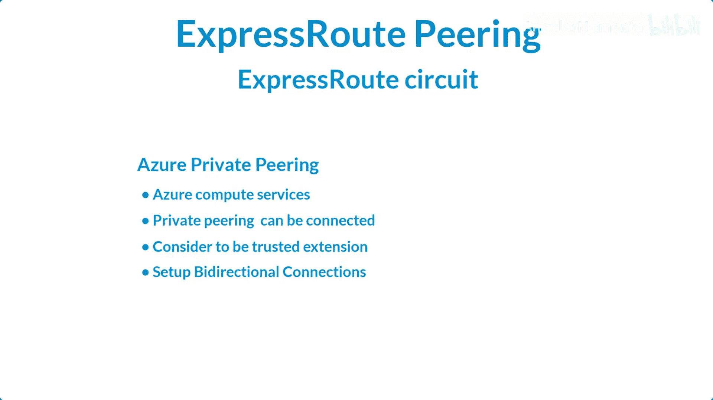
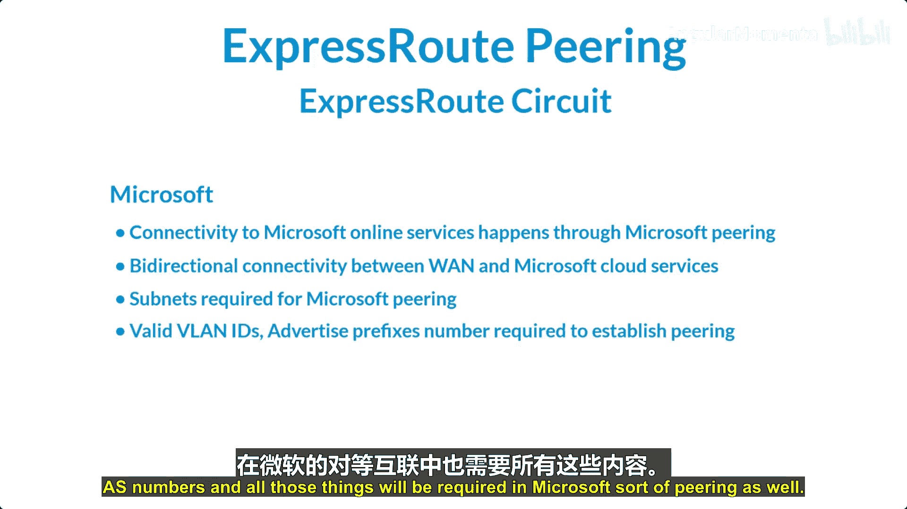
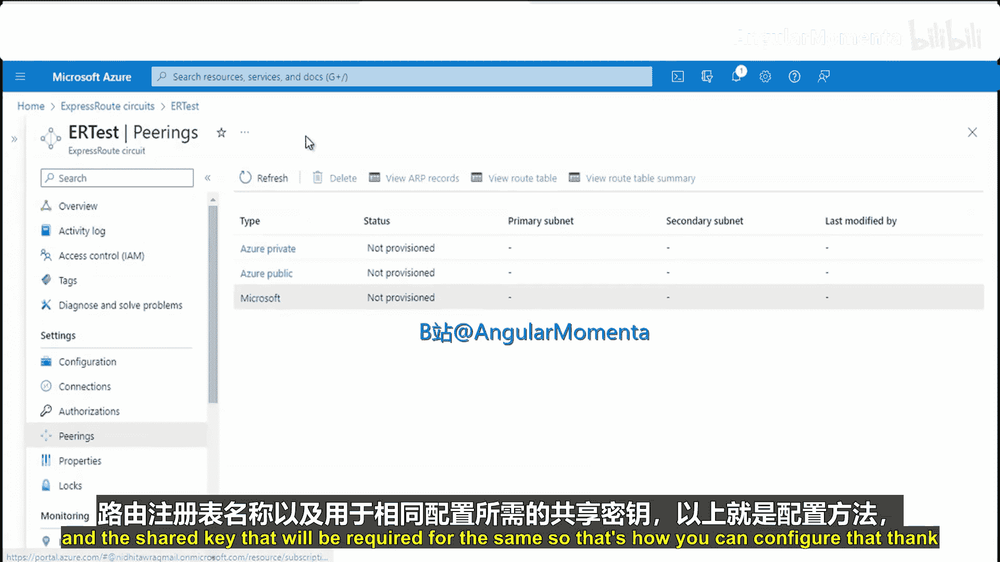

# 007：快速路由对等互联 第一部分

## 概述

在本节课中，我们将要学习Azure快速路由（ExpressRoute）中的对等互联（Peering）概念。我们将了解对等互联的类型、配置要求以及基本操作步骤。

---

## 快速路由对等互联简介

一个快速路由线路可以关联多个对等互联。这意味着可以有多个对等互联连接到一个快速路由线路上。

基本上，我们有以下三种类型的对等互联：**Azure公共对等互联**、**Azure私有对等互联**和**Microsoft对等互联**。Azure服务根据IP寻址方案被分类为Azure公共和Azure私有，每种对等互联都在一对路由器上以相同的方式配置，通常采用主动-主动或负载共享配置。

---

## Azure私有对等互联

上一节我们介绍了对等互联的基本类型，本节中我们来看看Azure私有对等互联。

Azure私有对等互联通常用于连接Azure计算服务，例如虚拟机、云服务，以及部署在虚拟网络内的平台即服务（PaaS）服务。

私有对等互联域被视为您核心网络到Microsoft Azure的可信扩展。您可以在您的核心网络和Azure虚拟网络之间建立双向连接。

在配置Azure私有对等互联时，您需要检查以下几项内容。

以下是配置私有对等互联时需要考虑的事项：
*   需要一对不属于任何虚拟网络地址空间保留的子网。
*   一个子网将用于主链路，另一个用于辅助链路。
*   您需要将每个子网的第一个可用IP地址分配给您的路由器，因为Microsoft会使用第二个可用IP地址给其路由器。
*   需要有效的VLAN ID。
*   需要建立对等互联的AS编号。
*   必须通过BGP从您本地的边缘路由器向Azure通告路由。

---

## Microsoft对等互联

了解了私有对等互联后，我们接下来看看Microsoft对等互联。

通常，Microsoft 365被设计为通过互联网安全可靠地访问。因此，对于特定场景，推荐使用快速路由。

连接到Microsoft在线服务（例如Microsoft 365、Azure PaaS服务和Microsoft PSTN服务）是通过Microsoft对等互联实现的。通过Microsoft对等互联路由域，您的广域网（WAN）与Microsoft云服务之间同样具有双向连接。

在配置此类对等互联时，也需要满足一些要求。

以下是配置Microsoft对等互联时需要考虑的事项：
*   需要一对由您拥有并在RIR或IRR中注册的子网。
*   一个子网将用作主链路，另一个用作辅助链路。
*   同样需要有效的VLAN ID。
*   需要通告前缀和AS编号。

---

## 对等互联配置步骤

前面我们介绍了不同类型的对等互联及其要求，本节中我们来看看如何在Azure门户中实际配置对等互联步骤。

首先，您需要创建一个Azure快速路由线路。虽然之前已经介绍过，但让我们再次回顾步骤。

以下是创建快速路由线路的基本步骤：
1.  在Azure门户中选择资源组（例如，我选择了“temp”）。
2.  为线路指定一个名称。
3.  选择端口类型（提供商或直接）以及是否创建新线路。
4.  选择提供商（例如，我选择了Equinix）。
5.  选择位置（例如，我选择了西雅图）。
6.  选择带宽（例如，50 Mbps）。
7.  选择SKU套餐（例如，我选择了高级版）。
8.  选择计费模型（例如，我选择了无限制）。
9.  点击“下一步”并创建线路。

创建线路后，其状态应为“已启用”，提供商状态应为“已预配”。然后，您可以转到“对等互联”部分进行配置。

正如之前所述，有三种对等互联类型：Azure私有、Azure公共和Microsoft。

以下是配置私有对等互联的步骤：
1.  当线路状态正常后，选择“Azure私有”对等互联。
2.  输入对等ASN。
3.  选择子网类型（IPv4或IPv6）。
4.  输入用于两条链路的主子网和辅助子网。
5.  添加VLAN ID和共享密钥。
6.  保存配置。

公共和Microsoft对等互联的配置选项类似。对于Microsoft对等互联，还需要配置“公共前缀地址”，这是通过BGP会话通告的所有前缀的列表。只接受公共IPv4地址前缀，且前缀必须在RIR或IRR注册。最大前缀数为200。此外，还需要路由注册名称和共享密钥。

---

## 总结

本节课中我们一起学习了Azure快速路由对等互联的核心概念。我们了解了三种主要的对等互联类型：Azure私有、Azure公共和Microsoft对等互联，并探讨了它们各自的用途和配置要求。最后，我们逐步演示了在Azure门户中创建快速路由线路和配置对等互联的基本操作。掌握这些知识是建立稳定、高性能的混合云网络连接的基础。