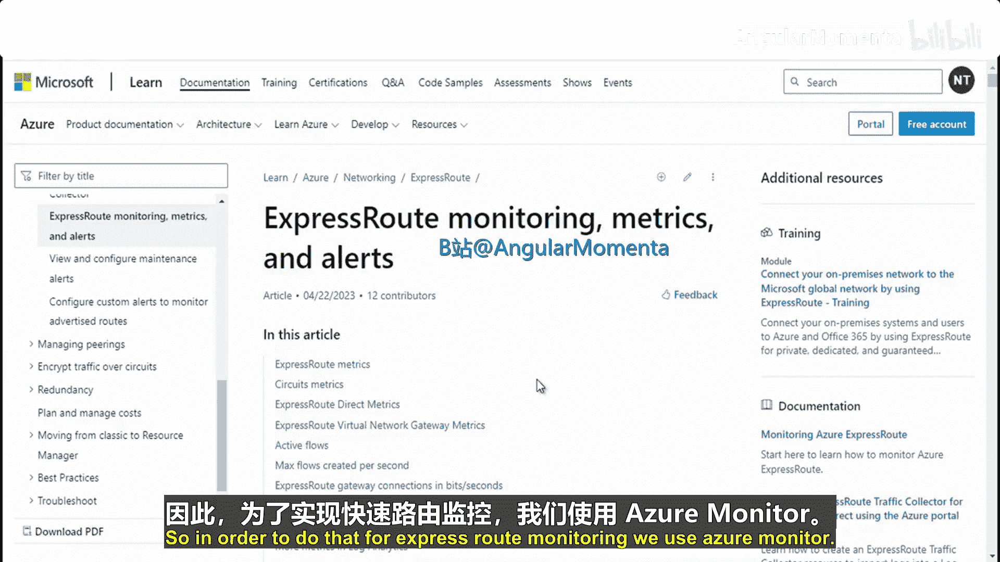
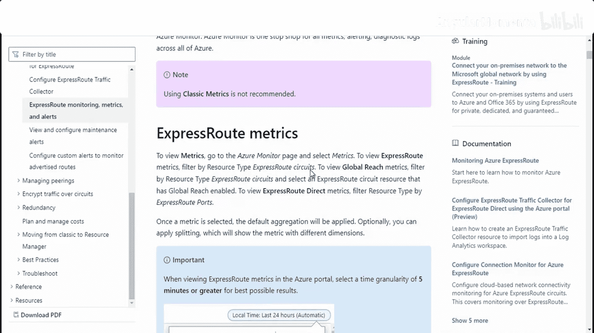
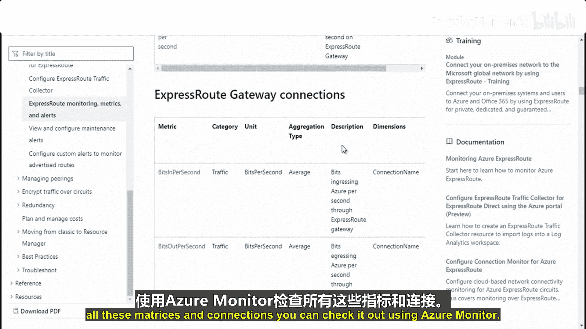

# 008：排查与监控ExpressRoute连接 🔍


在本节课中，我们将学习如何排查Azure ExpressRoute的连接问题，以及如何使用Azure Monitor来监控ExpressRoute线路的性能和健康状况。

---

## 排查ExpressRoute连接问题

上一节我们介绍了ExpressRoute的配置，本节中我们来看看当连接出现问题时，如何进行排查。

首先，需要验证线路的预配状态。线路必须处于“已预配”状态。您可以在Azure门户中ExpressRoute线路的“概述”页面查看此状态。

您也可以使用Azure PowerShell运行以下命令来检查状态：

```powershell
Get-AzExpressRouteCircuit -ResourceGroupName "<资源组名称>" -Name "<线路名称>"
```

命令输出会显示线路的`ProvisioningState`，应为`Provisioned`。

如果需要重置一个失败的线路，可以按照以下步骤操作。首先，连接到您的Azure账户并选择正确的订阅。

以下是重置线路的PowerShell命令示例：

```powershell
# 连接到Azure账户
Connect-AzAccount

# 获取订阅列表
Get-AzSubscription

# 选择特定订阅
Select-AzSubscription -SubscriptionName "<您的订阅名称>"

# 将线路信息存入变量
$ckt = Get-AzExpressRouteCircuit -ResourceGroupName "<资源组名称>" -Name "<线路名称>"

# 重置线路
Set-AzExpressRouteCircuit -ExpressRouteCircuit $ckt
```

接下来，需要验证对等互连配置。ExpressRoute支持三种对等互连：私有、Microsoft和公共（已弃用）。您需要确认所需的对等互连已配置并处于“已建立”状态。

此外，验证ARP表对于排查第2层连接问题至关重要。ARP是地址解析协议，用于将IP地址映射到MAC地址。


以下是需要检查的ARP表项：
*   **本地ARP表项**：应包含本地路由器接口IP地址到其MAC地址的映射。
*   **Microsoft ARP表项**：应包含ExpressRoute路由器接口IP地址到其MAC地址的映射。
*   检查映射的“年龄”，过期的条目可能导致连接问题。ARP表有助于验证第2层配置并排查基本的连接问题。

对于网络性能排查，Azure提供了多种工具。


以下是可用的网络排查工具和方法：
*   **Azure网络观察程序**：提供连接性检查、数据包捕获等高级诊断工具。
*   **PowerShell**：使用`Test-AzNetworkWatcherConnectivity`等cmdlet进行测试。
*   **Azure CLI**：使用`az network watcher`命令组进行测试。
*   **Azure Connectivity Toolkit (AzureCT)**：一个专门用于测试混合网络连接性的工具。

这些工具和方法也被封装在名为`Az.Network`的PowerShell模块中，您可以安装并使用它。



---

## 监控ExpressRoute



上一节我们介绍了连接问题的排查，本节中我们来看看如何持续监控ExpressRoute的运行状态。

要监控ExpressRoute，请使用**Azure Monitor**。这是Azure官方的监控服务。

要查看ExpressRoute的指标，请导航到Azure Monitor页面，选择“指标”。然后，通过资源类型进行筛选，并选择您的ExpressRoute线路。

为了查看历史数据，建议将时间粒度设置为5分钟或更长。




ExpressRoute提供了多种关键指标供您监控。

以下是ExpressRoute的主要监控指标：
*   **ARP 可用性**：显示ARP协议的可用性百分比。
*   **BGP 可用性**：显示BGP会话的可用性百分比。
*   **线路入口比特率**：每秒进入Azure的数据量（比特/秒）。
*   **线路出口比特率**：每秒从Azure出去的数据量（比特/秒）。
*   **播发的公共前缀数**：通过BGP向Microsoft播发的路由数量。
*   **网关CPU利用率**：ExpressRoute网关的CPU使用率。
*   **网关每秒数据包数**：网关处理数据包的速率。

您可以使用Azure Monitor来查看这些指标并设置警报，以确保连接的健康和性能。

---

## 总结 🎯

本节课中我们一起学习了Azure ExpressRoute的运维管理。我们讨论了如何排查连接问题，包括验证线路状态、重置失败线路、检查对等互连和ARP表，以及使用Azure网络观察程序等工具进行性能诊断。随后，我们介绍了如何使用Azure Monitor来监控ExpressRoute线路的各项关键指标，如可用性、带宽利用率和网关性能。


总而言之，ExpressRoute允许您通过连接提供商提供的私有连接，将本地网络扩展到Microsoft云。它能连接到Microsoft Azure、Microsoft 365等多种云服务，支持从任何网络（点到点以太网、任意到任意连接或虚拟交叉连接）进行连接。由于ExpressRoute不经过公共互联网，因此能提供更高的可靠性、更快的速度、更一致的延迟和更强的安全性。在本模块中，我们还学习了如何创建ExpressRoute线路、配置对等互连，以及如何进行故障排查和监控。