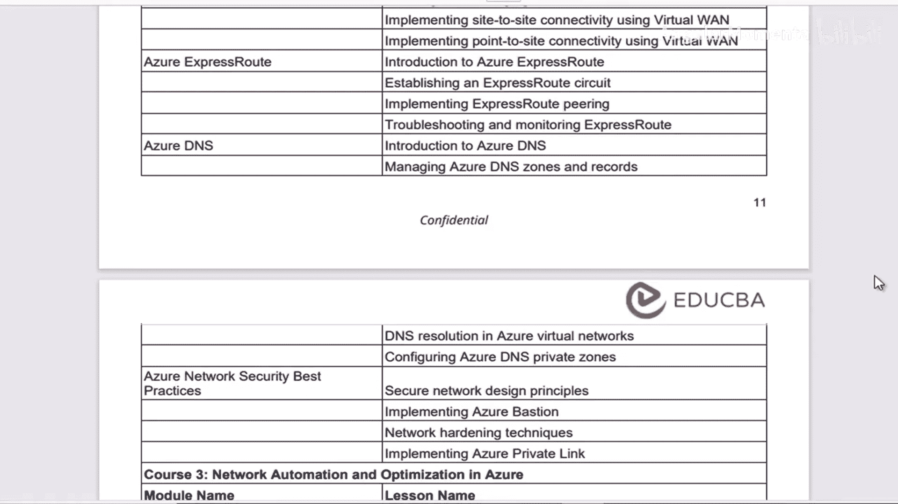
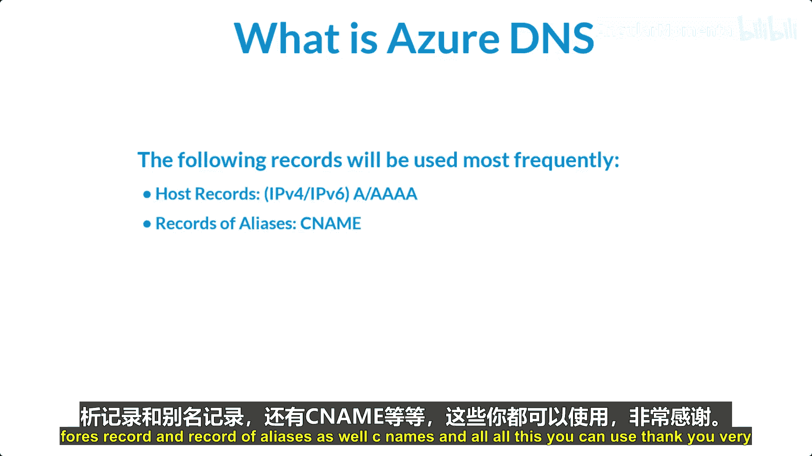

# 009：Azure DNS简介

在本节课中，我们将要学习Azure DNS服务。我们将了解其基本概念、核心功能以及它在Azure网络架构中的作用。

## 概述

Azure DNS是微软提供的一项域名托管服务，它利用微软的Azure基础设施来提供域名解析。简单来说，它的作用是将人们容易记住的域名（例如 `www.example.com`）转换为计算机用于互相通信的IP地址（例如 `192.0.2.1`）。

## 什么是Azure DNS？

上一节我们介绍了课程概述，本节中我们来看看Azure DNS的具体定义。

与传统的DNS系统一样，Azure DNS的核心职责是进行名称解析。它负责将域名解析为IP地址，反之亦然。这项服务专门用于解析可通过互联网访问的Azure资源和服务（例如您的Web服务器）的名称和IP地址。

Azure DNS的名称解析能力完全基于微软的Azure基础设施。为了管理这些域名记录，您可以在Azure DNS中手动创建与域名相关的记录。

## 常用的DNS记录类型

在Azure DNS中，您可以配置多种类型的记录来管理域名解析。以下是几种最常用的DNS记录类型：

*   **A记录**：将主机名映射到IPv4地址。
    *   **示例**：`www.example.com A 192.0.2.1`
*   **AAAA记录**：将主机名映射到IPv6地址。
*   **CNAME记录**：将一个域名（别名）指向另一个域名（规范名称）。
    *   **示例**：`blog.example.com CNAME www.example.com`
*   **MX记录**：指定用于接收该域电子邮件的邮件服务器。
*   **NS记录**：指定负责该域名的权威DNS服务器。
*   **TXT记录**：通常用于域所有权验证或电子邮件安全策略（如SPF、DKIM）。

## 总结

本节课中我们一起学习了Azure DNS的基础知识。我们了解到Azure DNS是一项基于Azure基础设施的托管服务，用于管理域名并将其解析为IP地址。我们还介绍了在Azure DNS中配置域名记录的基本方法，以及A记录、CNAME记录等几种核心的DNS记录类型及其作用。