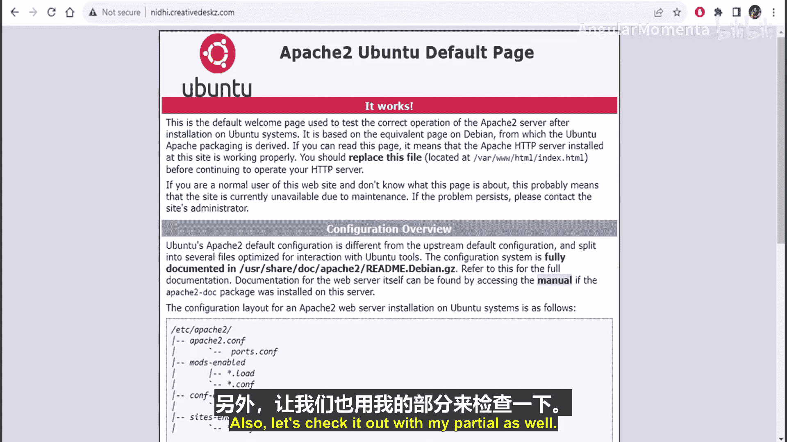
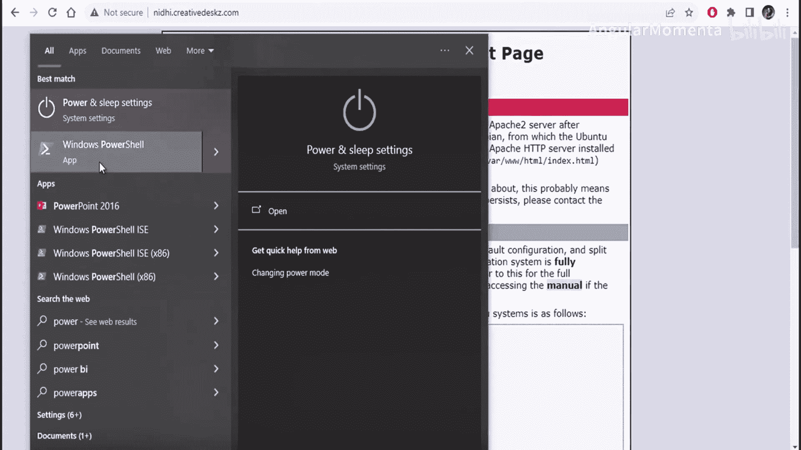
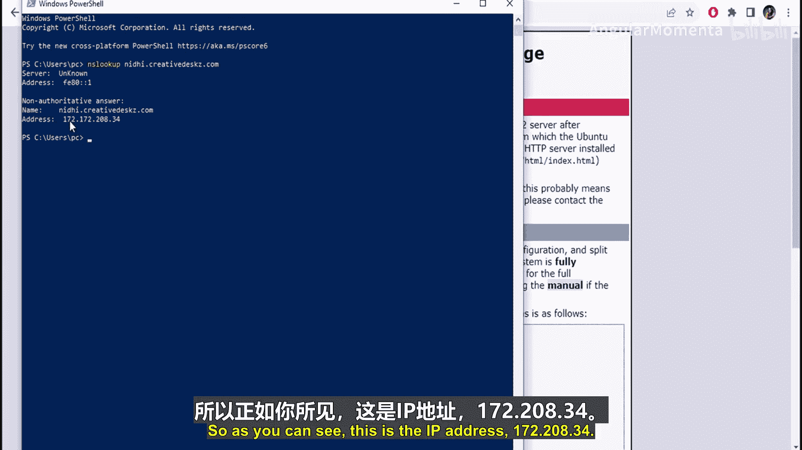
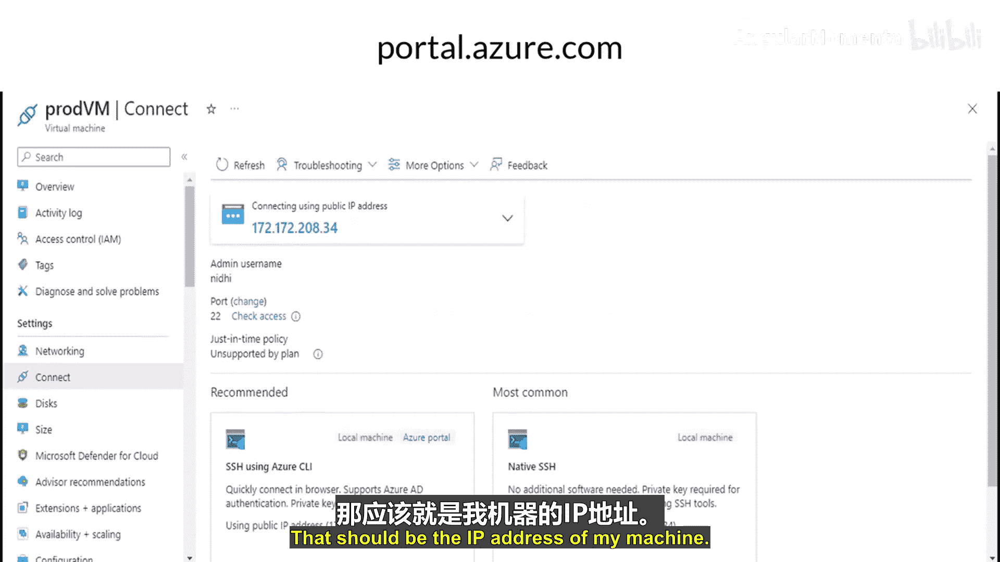
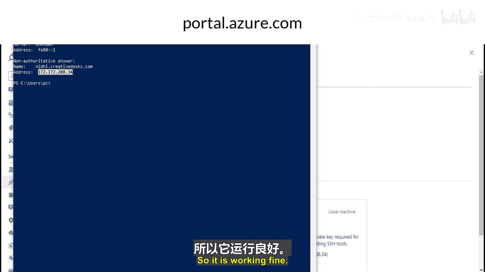
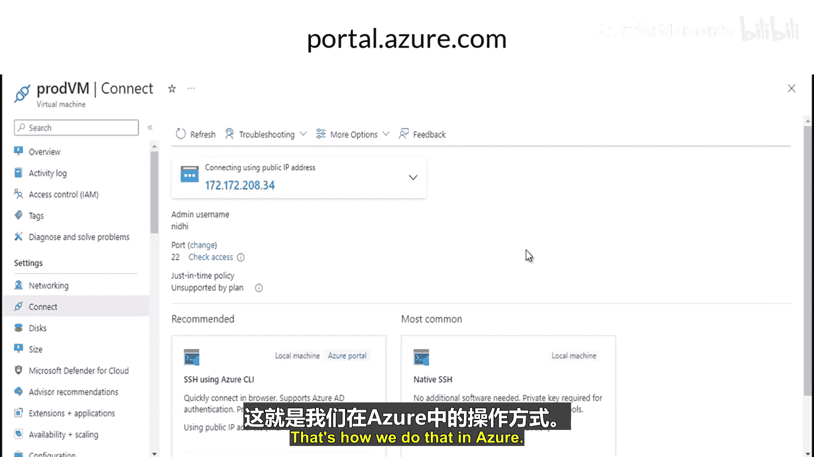

# 010：DNS区域与记录管理

在本节课中，我们将学习Azure DNS的核心概念，包括DNS区域、DNS委派、记录集，并通过一个实际演示了解如何配置DNS以实现域名解析。

## 概述：什么是DNS区域？🌐

上一节我们介绍了Azure网络的基础知识，本节中我们来看看DNS区域。

DNS区域用于托管特定域名的DNS记录。要使用Azure DNS托管记录，首先需要创建一个DNS区域。

以下是关于DNS区域的几个关键点：
*   同一区域名称可以在不同的资源组或订阅中重复使用。它只需在同一个资源组和订阅内保持唯一。
*   当你的根域名或父域名在域名注册商处注册后，若想使用Azure DNS进行解析，你需要将域名注册商的名称服务器指向Azure提供的名称服务器。Azure本身不是域名注册商。
*   在Azure DNS中使用域名创建DNS区域时，你不需要是该域名的所有者。但是，如果你想配置该域名（例如将其解析到你的资源），则必须拥有该域名。

## DNS委派🔗

上一节我们介绍了DNS区域，本节中我们来看看DNS委派。

DNS委派是指将域名的解析权分配给一组名称服务器。将域名委派给Azure DNS时，你必须使用Azure DNS提供的全部四个名称服务器。

以下是关于DNS委派的重要说明：
*   Azure DNS提供四个名称服务器，委派时必须全部使用。
*   创建DNS区域后，你需要在父级域名注册商处更新名称服务器设置。
*   Azure DNS不提供域名注册服务。你可以通过Azure应用服务域或第三方注册商购买域名，然后将这些域名的记录托管在Azure DNS中进行管理。

## 记录集📝

上一节我们介绍了DNS委派，本节中我们来看看记录集。

记录集是DNS区域中具有相同名称和类型的一组记录的集合。

以下是关于记录集的要点：
*   Azure DNS支持所有标准DNS记录类型，包括 **A**、**AAAA**、**CNAME**、**MX**、**NS**、**PTR**、**SOA**、**SRV** 和 **TXT**。
*   同一个记录集内不能存在两条完全相同的记录。
*   一个记录集最多可包含20条记录。

## 实战演示：创建DNS区域与记录🎬

前面我们介绍了DNS区域、委派和记录集的理论知识，现在通过一个演示来看看如何实际操作。

演示目标：创建一个DNS区域，添加一条A记录，并验证域名解析是否生效。

准备工作：
1.  已创建一台虚拟机并安装了Apache Web服务器，其IP地址为 `172.208.34.20`。
2.  已从第三方注册商（如GoDaddy）获取了一个域名 `creativedesk.co`。

操作步骤：

1.  **创建DNS区域**
    在Azure门户中，创建DNS区域，名称填写为所拥有的域名 `creativedesk.co`。创建成功后，Azure会分配四个名称服务器地址。

2.  **配置域名委派**
    登录域名注册商（GoDaddy）的管理面板，找到域名服务器设置，将原有的名称服务器替换为Azure DNS提供的四个名称服务器地址。此后，该域名的解析权便委派给了Azure DNS。

3.  **添加A记录**
    在刚创建的DNS区域中，添加一个新的记录集。
    *   **名称**：输入 `niy`。这将创建记录 `niy.creativedesk.co`。
    *   **类型**：选择 **A**。
    *   **IP地址**：填写虚拟机的IP地址 `172.208.34.20`。
    *   **TTL**：保持默认或根据需要调整。

4.  **验证解析**
    记录创建并传播后（通常很快），即可进行验证。
    *   在浏览器中访问 `http://niy.creativedesk.co`，应能显示Apache的默认页面。
    *   在命令提示符中使用 `nslookup` 命令进行查询：
        ```bash
        nslookup niy.creativedesk.co
        ```
        命令应返回IP地址 `172.208.34.20`，证明DNS解析已成功配置。















## 总结📚


本节课中我们一起学习了Azure DNS的核心组件。我们了解了**DNS区域**是托管域名记录的基础容器，知道了通过**DNS委派**将域名的解析权交给Azure DNS的步骤，明确了**记录集**是组织DNS记录的方式。最后，通过一个完整的演示，我们实践了从创建DNS区域、配置委派到添加A记录并验证解析的整个流程，掌握了在Azure中管理DNS服务的基本操作。