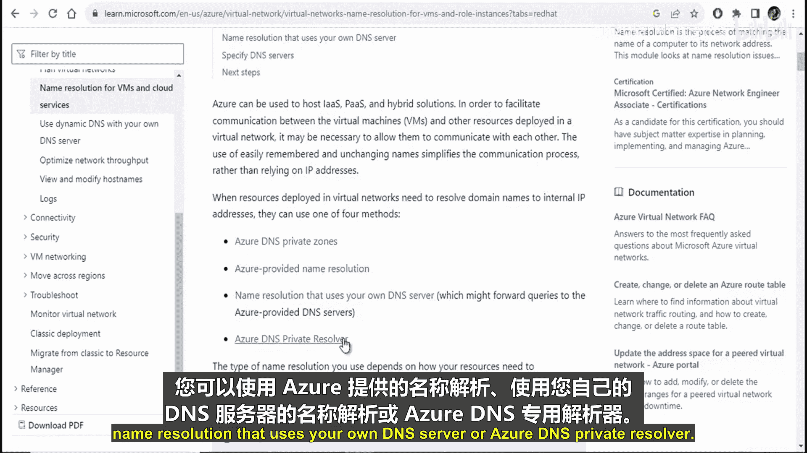
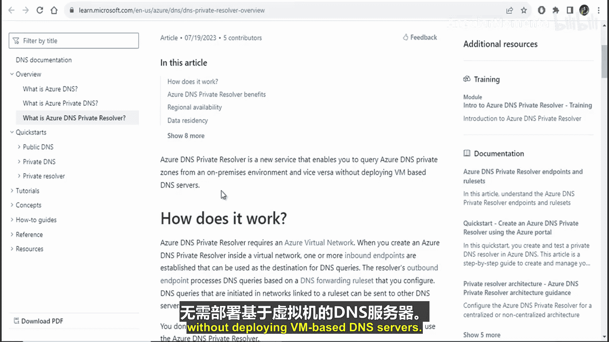
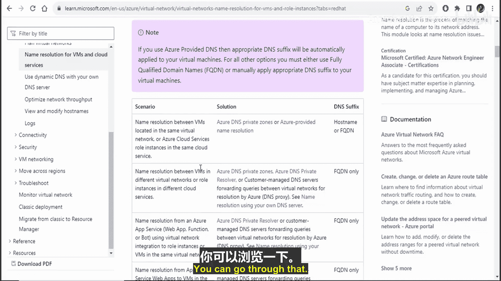

# 011：Azure虚拟网络中的DNS解析

在本节课中，我们将学习如何在Azure虚拟网络内部进行域名解析。我们将探讨几种不同的方法，并了解在不同场景下应如何选择合适的方法。

## 概述

在Azure虚拟网络中，若要将域名解析为内部IP地址，您无需像处理公共域名那样配置DNS区域。Azure提供了多种内置的解决方案来实现内部名称解析。

上一节我们介绍了虚拟网络的基本概念，本节中我们来看看如何为其中的资源配置DNS解析。

## DNS解析方法

Azure主要提供了四种方法来实现虚拟网络内部的名称解析。

以下是四种核心的DNS解析方法：

1.  **Azure DNS私有区域**：一种托管服务，用于管理虚拟网络中的私有DNS记录。
2.  **Azure提供的名称解析**：Azure平台为每个虚拟网络自动提供的默认DNS解析服务。
3.  **客户管理的DNS服务器**：使用您自己部署的DNS服务器（例如Windows Server DNS或BIND）进行解析。
4.  **Azure DNS私有解析器**：一项较新的服务，它允许您从本地环境查询Azure DNS私有区域，而无需部署基于虚拟机的DNS服务器。

## 不同场景下的方法选择

根据您的具体网络架构和需求，可以选择不同的DNS解析方案。

以下是针对不同场景的推荐方法：

*   **场景一：同一虚拟网络内的解析**
    *   **需求**：解析位于**同一虚拟网络**内的虚拟机，或同一云服务中的角色实例。
    *   **可用方法**：Azure DNS私有区域 或 Azure提供的名称解析。

*   **场景二：不同虚拟网络间的解析**
    *   **需求**：解析位于**不同虚拟网络**的虚拟机，或不同云服务中的角色实例。
    *   **可用方法**：Azure DNS私有区域、Azure DNS私有解析器 或 客户管理的DNS服务器（通过转发查询实现跨网络解析）。

*   **场景三：从Azure应用服务解析**
    *   **需求**：从启用了虚拟网络集成的**Azure应用服务**、函数应用解析同一虚拟网络中的虚拟机或角色实例。
    *   **可用方法**：Azure DNS私有解析器 或 客户管理的DNS服务器。

## 总结

本节课中我们一起学习了Azure虚拟网络中DNS解析的几种核心方法。我们了解到，Azure DNS私有区域、平台提供的默认解析、客户自建DNS服务器以及新的Azure DNS私有解析器，分别适用于同一网络内、跨网络以及从PaaS服务发起解析等不同场景。您可以根据实际架构选择最合适的方案。

> 有关这些场景和方法的更详细信息，建议参考官方文档链接。