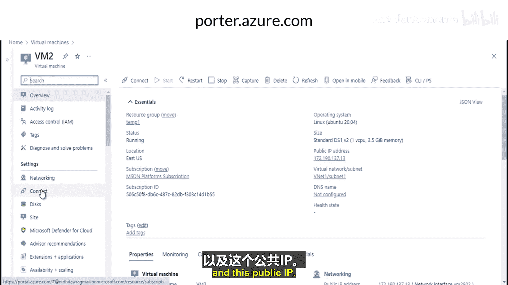
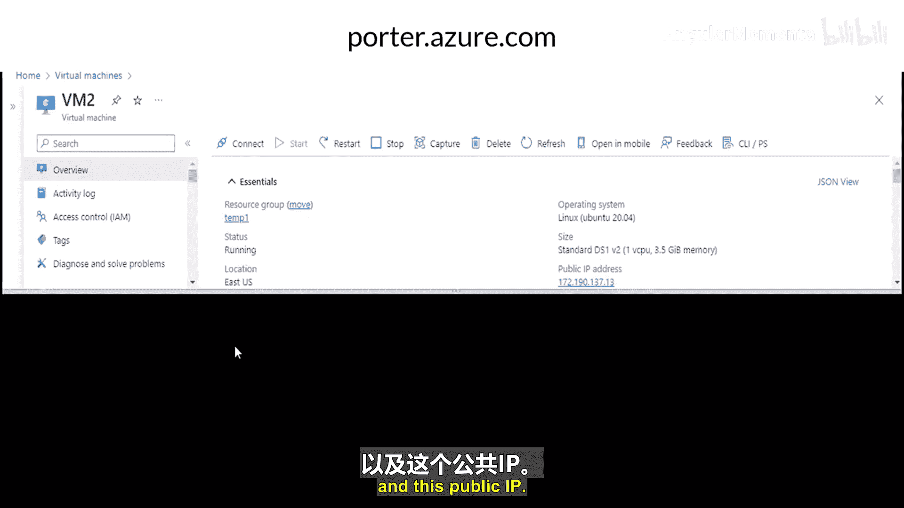
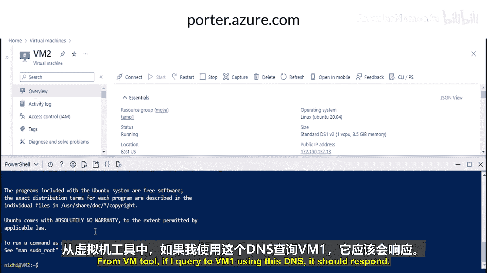
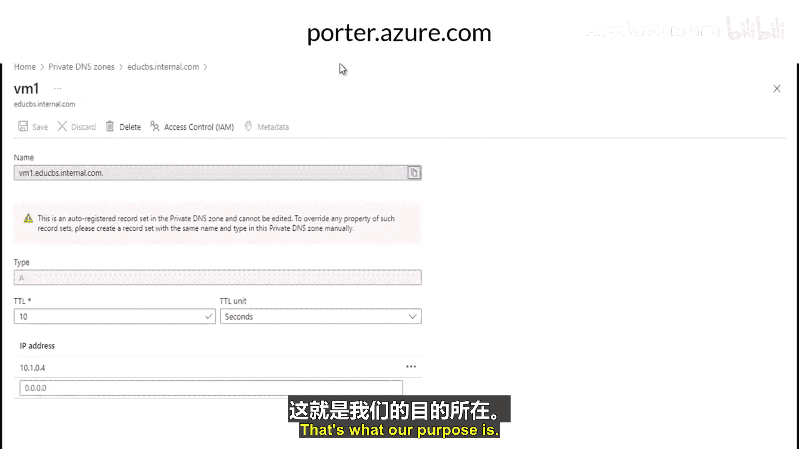
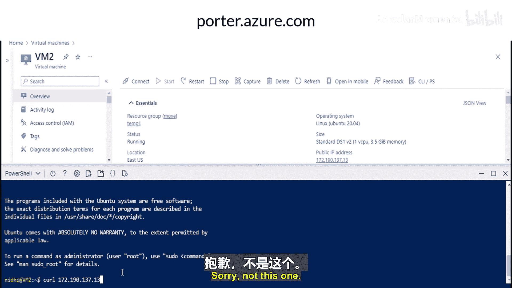
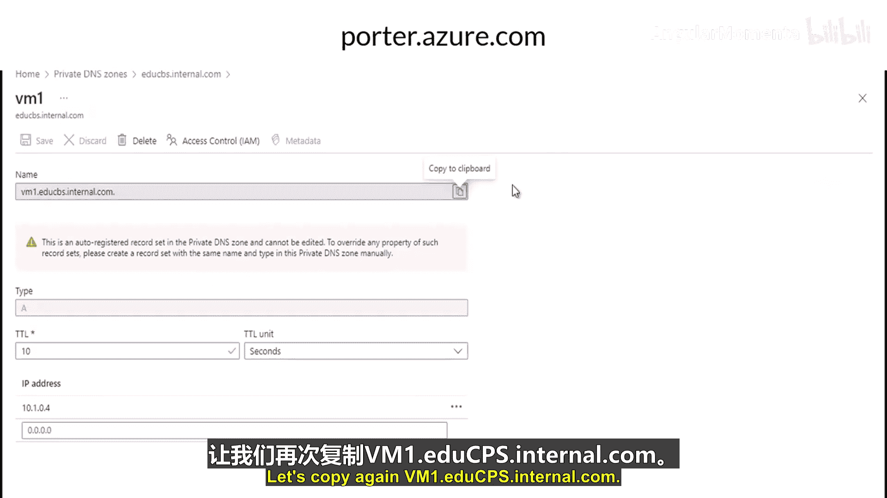
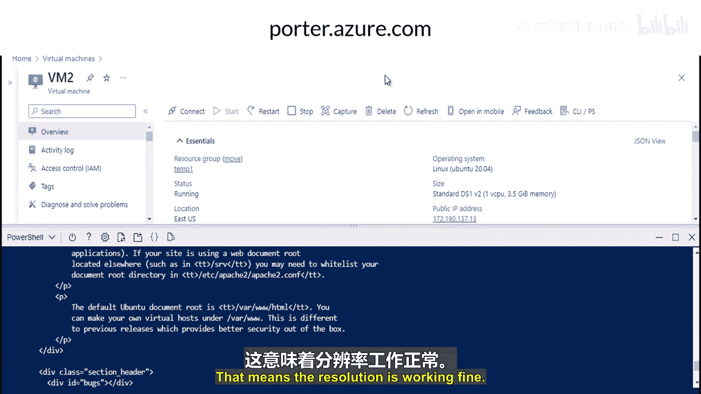
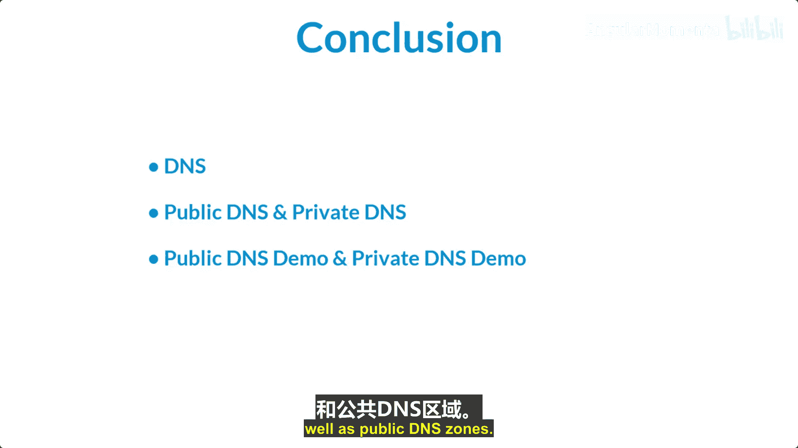

# 012：私有DNS区域 🛡️

在本节课中，我们将学习Azure私有DNS区域。这是一种用于在虚拟网络内部管理和解析域名，而无需自定义DNS解决方案的服务。

## 概述

私有DNS区域允许你在Azure虚拟网络内使用自定义域名进行名称解析。与公共DNS不同，私有DNS区域的记录无法从互联网解析，其解析功能仅限于链接到该区域的虚拟网络。

## 什么是私有DNS区域？

私有DNS区域是一项服务，用于在虚拟网络内管理和解析域名，无需你添加自定义的DNS解决方案。

例如，在一个虚拟网络内，如果两台机器需要相互通信，它们可以通过私有IP地址进行。若想为此类通信启用DNS功能，你可以使用私有DNS区域。

通过使用私有DNS区域，你可以使用自己的自定义域名，而不仅限于Azure提供的默认名称。此外，私有DNS区域中包含的记录无法从互联网解析。针对私有DNS区域的DNS解析仅对链接到该区域的虚拟网络有效。

你还可以通过创建虚拟网络链接，将一个私有DNS区域链接到一个或多个虚拟网络。你还可以启用自动注册功能，以自动管理部署在虚拟网络中的虚拟机的DNS记录生命周期。你可以使用所有常见的DNS记录类型。

## 工作原理示例


让我们通过一个例子来理解其工作原理。


假设这是你的虚拟网络（VNet）。在VNet内部，假设有两台虚拟机：VM1和VM2。
*   VM1的IP地址是：`192.168.0.4`
*   VM2的IP地址是：`192.168.0.5`

如果VM1想与VM2通信，它们可以直接使用私有IP地址。但如果你想使用域名进行通信，就需要创建私有DNS区域。

你创建一个私有DNS区域，例如 `abc.com`。然后在该区域中创建A记录：
*   为VM1创建记录：`vm1.abc.com` -> `192.168.0.4`
*   为VM2创建记录：`vm2.abc.com` -> `192.168.0.5`

现在，当VM2需要与VM1通信时，它可以使用域名 `vm1.abc.com`，解析工作将由你的私有DNS区域处理。同样，VM1也可以通过 `vm2.abc.com` 访问VM2。

## 演示：创建和配置私有DNS区域

上一节我们介绍了私有DNS区域的概念，本节中我们来看看如何在Azure门户中实际操作。

我已经预先创建了一个名为 `Vnet1` 的虚拟网络，并在其中部署了两台虚拟机：`VM1` 和 `VM2`。在VM1上，我已经安装了Apache2服务器。

以下是创建和配置私有DNS区域的步骤：

1.  **创建私有DNS区域**
    *   在Azure门户中，搜索并选择“私有DNS区域”。
    *   点击“+ 创建”。
    *   选择资源组（例如 `step1`）。
    *   为区域命名，例如 `hucp.internal.com`。此名称专为内部网络使用。
    *   点击“查看 + 创建”，然后点击“创建”。部署需要一些时间。

2.  **创建虚拟网络链接**
    *   私有DNS区域创建完成后，进入该资源。
    *   在左侧菜单中，点击“虚拟网络链接”。
    *   点击“+ 添加”。
    *   为链接命名，例如 `educba`。
    *   选择你的虚拟网络 `Vnet1`。
    *   **关键步骤**：启用“启用自动注册”。此设置允许自动为连接到该虚拟网络的所有虚拟机在私有DNS区域中创建DNS记录。否则，你需要像在公共DNS中那样手动创建A记录。
    *   点击“确定”创建链接。





创建链接后，由于启用了自动注册，你可以在私有DNS区域的“概述”页面看到自动为VM1和VM2创建的A记录。

## 验证解析







现在我们来验证DNS解析是否正常工作。



1.  连接到第二台虚拟机 `VM2`。
2.  在VM2的命令行中，使用 `curl` 命令尝试访问VM1的域名。命令格式如下：
    ```bash
    curl vm1.hucp.internal.com
    ```
3.  如果配置正确，`curl` 命令将成功访问到VM1上运行的Apache2服务器，并返回默认页面内容。这证明通过私有DNS区域进行的域名解析是成功的。



## 总结

本节课中我们一起学习了Azure DNS服务，特别是私有DNS区域。

根据你使用Azure托管基础架构即服务、平台即服务或混合解决方案的方式，你可能需要允许部署在虚拟网络中的虚拟机和其他资源相互通信。虽然可以使用IP地址启用通信，但使用DNS提供的名称则更为简便。



我们讨论了公共DNS和私有DNS。通过演示，我们学习了如何使用公共DNS，以及如何配置私有DNS区域。我们还了解了如何在虚拟网络中进行设置，以利用私有DNS区域和公共DNS区域进行名称解析。