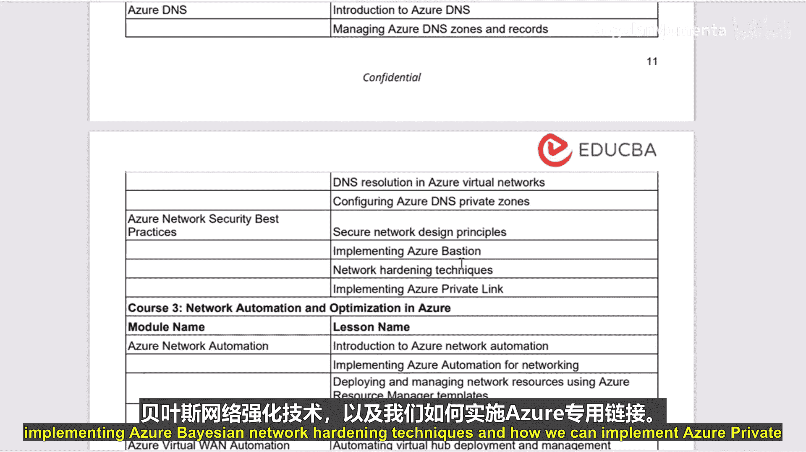
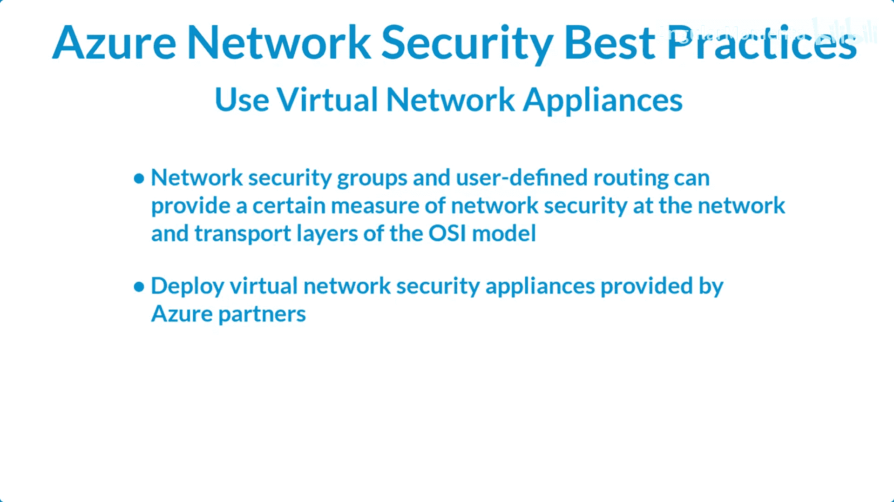
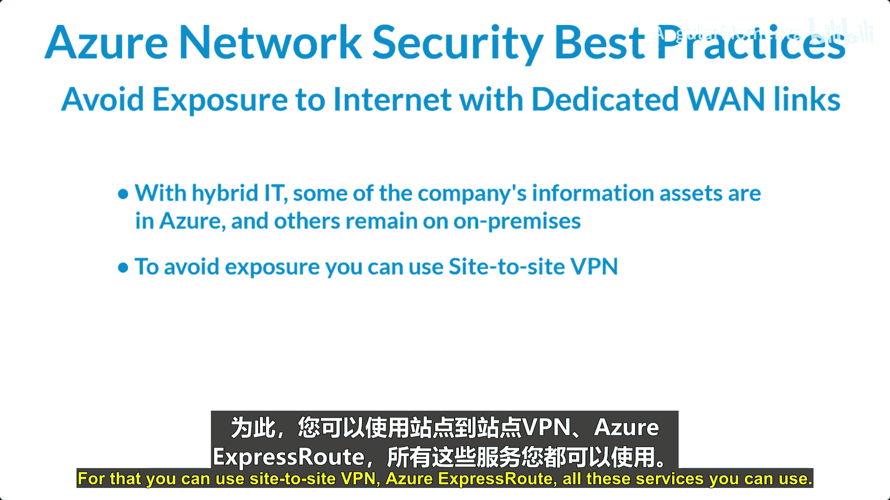
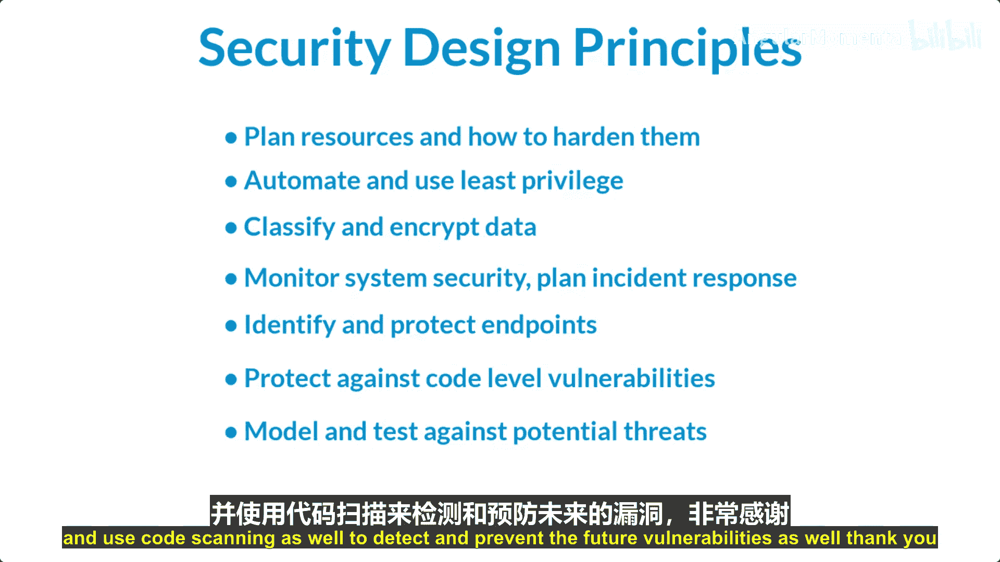

# 013：Azure网络安全最佳实践导论 🛡️

在本节课中，我们将学习Azure网络安全的最佳实践。我们将探讨如何通过实施网络控制来保护资产，了解安全设计原则，并介绍一些关键的防护技术。

## 概述

保护云环境中的资产至关重要。本模块将讨论如何通过控制进出Azure、以及在本地与Azure托管资源之间的网络流量来实施安全措施。如果没有适当的安全措施，攻击者可能通过扫描公共IP范围等方式获得访问权限。因此，正确的网络安全控制可以提供深度防御，帮助检测、遏制和阻止已侵入云部署的攻击者。

## 网络安全最佳实践

以下是构建安全Azure网络时应遵循的一些核心最佳实践。

### 使用强健的虚拟网络

首先，应使用强健的虚拟网络。您可以将虚拟机和其他设备放置在虚拟网络上，以连接它们。将虚拟网络接口卡连接到虚拟网络，以便仅允许启用网络的设备之间进行基于TCP/IP的通信。虚拟机可以连接到同一虚拟网络、不同虚拟网络、互联网或本地网络上的设备。

以下是核心网络功能的管理建议：
*   管理核心网络功能，例如ExpressRoute、虚拟网络子网配置和IP地址分配。
*   治理网络安全元素，例如虚拟设备功能。

### 逻辑划分子网

其次，应逻辑划分子网。Azure虚拟网络类似于本地网络中的局域网（LAN）。其核心思想是基于单个私有IP地址空间创建网络，以便将所有Azure虚拟机放置在一起。可用的私有IP地址范围包括A类（10.0.0.0/8）、B类（172.16.0.0/12）和C类（192.168.0.0/16）。

关于子网划分的最佳实践如下：
*   不要分配具有广泛范围的允许规则（例如，全零或全255）。
*   将较大的地址空间分段为子网。
*   在子网之间创建网络访问控制。子网之间的路由会自动发生。

### 采用零信任方法

第三点是采用零信任方法。传统的基于边界的安全模型假设网络内的所有系统都是可信的。然而，如今员工可能从任何地点、任何设备访问组织资源，这使得边界安全控制变得不那么有效。因此，仅关注“谁”可以访问资源的访问控制策略已不足够。为了在安全与生产力之间取得平衡，安全策略还需要考虑“如何”访问资源等因素。零信任的核心原则是：不信任任何人，只允许必要的访问。

### 控制路由行为

第四点是控制路由行为。当您将虚拟机放置在Azure虚拟网络上时，它可以连接到同一网络上的任何其他虚拟机，即使其他虚拟机位于不同的子网。这是因为默认启用的一组系统路由允许此类通信。因此，在必要时控制路由行为非常重要。

### 使用虚拟网络设备

第五点是使用虚拟网络设备。虽然网络安全组和用户定义的路由可以在网络层和传输层提供一定的安全措施，但在某些情况下，您可能需要在更高层级启用安全功能。为此，可以使用虚拟网络设备，这些设备通常由Azure合作伙伴提供。

上一节我们介绍了几项基础的网络架构安全实践，本节中我们来看看关于网络边界和连接安全的最佳实践。

### 部署外围网络安全区域

我们应该部署外围网络（也称为安全区域）。外围网络（或DMZ）是一个物理或逻辑网络段，它在您的资产与互联网之间提供了一个额外的安全层。外围网络非常有用，因为您可以将网络访问控制、管理、监控、日志记录和报告的重点放在虚拟网络边缘的设备上。

### 避免通过专用WAN链路暴露于互联网

许多组织选择了混合IT路线。在混合IT场景下，公司的部分信息资产位于Azure，其他则保留在本地。通常，这需要某种类型的跨本地连接。跨本地连接允许公司将本地网络连接到Azure虚拟网络。为了避免直接暴露于互联网，可以使用站点到站点VPN或Azure ExpressRoute等服务。

### 优化正常运行时间和性能

如果服务宕机，信息将无法访问；如果性能极差，数据将无法使用。从安全角度来看，您需要尽一切努力确保服务具有最佳的运行时间和性能。为了提高性能和进行优化，可以使用负载均衡等方法。Azure提供了不同的负载均衡方法。

### 禁用虚拟机的直接RDP和SSH访问

可以通过RDP和SSH协议访问Azure虚拟机。这些协议支持从远程位置管理虚拟机，是数据中心计算的标准做法。建议禁用从互联网直接访问虚拟机的RDP和SSH。相反，可以使用点到站点VPN或站点到站点VPN等方式进行访问。

### 将关键Azure服务保护在虚拟网络内

最好将关键资源保持在虚拟网络内部。为此，可以使用Azure Private Link通过虚拟网络内的私有端点访问Azure服务，例如Azure存储、SQL数据库等。

## 安全设计原则

现在，让我们探讨一些安全设计原则。

### 规划资源及其强化方式

首先，在规划工作负载资源时就要考虑安全性。您应该了解各个云服务的工作原理。使用服务启用框架进行评估，同时实现自动化并应用最小权限原则。在整个应用程序和控制平面实施最小权限，以防止数据泄露和恶意行为者攻击。最小权限意味着只授予必要的访问权限。此外，应通过DevOps驱动自动化，以最大限度地减少人为交互的需要。

### 分类和加密数据

根据风险对数据进行分类。对静态和传输中的数据应用行业标准加密，确保密钥和证书安全存储和妥善管理。

### 监控系统安全并规划事件响应

将安全和审计事件与应用程序运行状况模型相关联。关联安全和审计事件以识别主动威胁。同时，建立自动和手动程序来响应事件。应使用安全信息和事件管理（SIEM）工具。

### 识别和保护端点

监控和保护内部及外部端点的网络完整性。可以使用防火墙、Web应用程序防火墙（WAF）等服务。使用标准方法来防御分布式拒绝服务（DDoS）攻击或慢速攻击等。

### 防范代码级漏洞

识别并缓解代码级漏洞，例如跨站脚本（XSS）、SQL注入等。建立程序来识别和缓解已知威胁。使用渗透测试来验证威胁缓解措施。应进行静态代码分析，并使用代码扫描来检测和预防未来的漏洞。

## 总结

本节课中，我们一起学习了Azure网络安全的核心最佳实践。我们从使用强健虚拟网络和逻辑划分子网的基础架构开始，探讨了采用零信任模型的重要性。接着，我们了解了控制路由、使用虚拟网络设备、部署外围网络以及优化连接安全（如避免直接互联网暴露和使用专用连接）的方法。最后，我们回顾了关键的安全设计原则，包括规划与强化、数据加密、持续监控与事件响应、端点保护以及代码安全。遵循这些实践和原则，可以帮助您在Azure上构建一个更安全、更具韧性的网络环境。