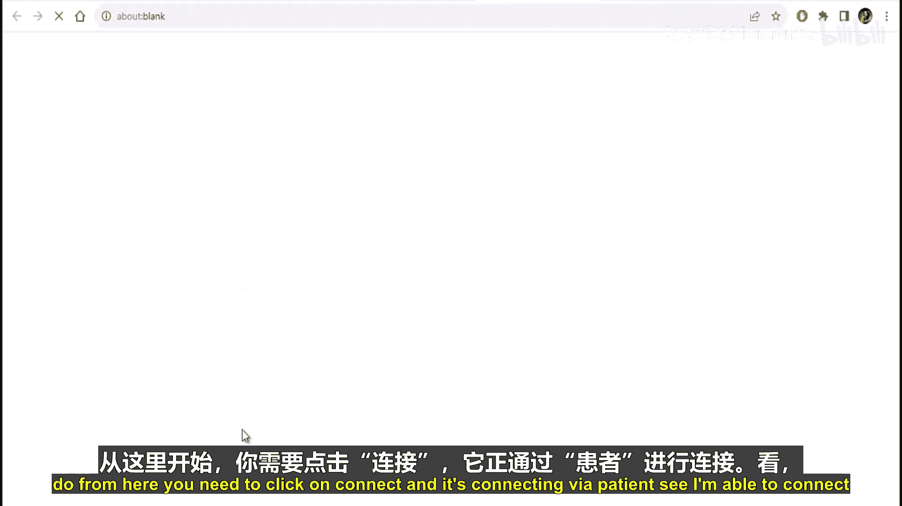
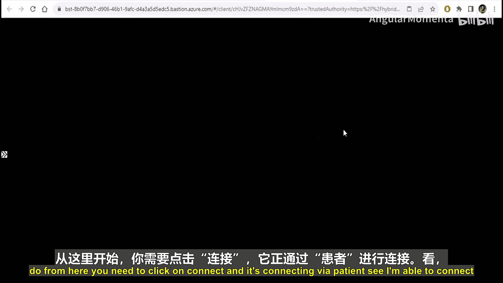
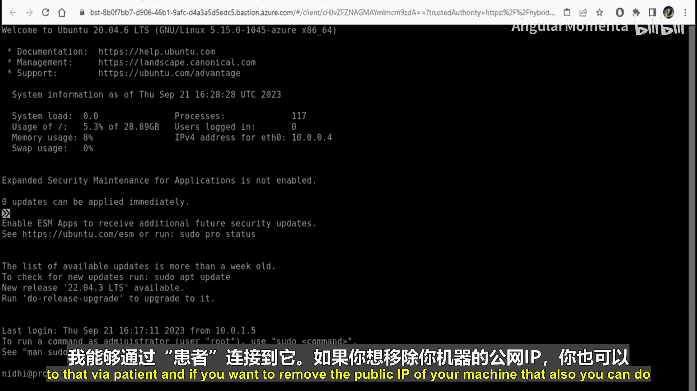
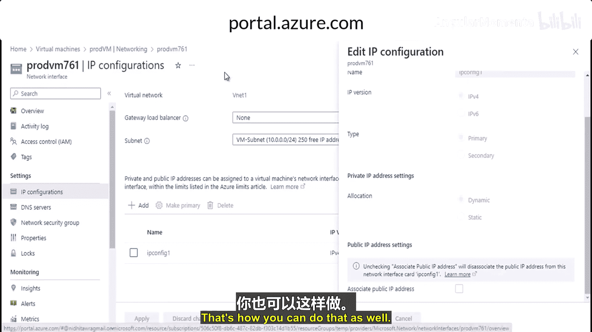

# 014：什么是 Azure Bastion

## 概述
在本节课中，我们将要学习 Azure Bastion 服务。我们将了解它的定义、核心功能、不同服务层级（SKU）的对比，以及如何创建和使用它来安全地连接到虚拟机。

## 什么是 Azure Bastion？
Azure Bastion 是一项平台即服务（PaaS）。它允许你通过浏览器和 Azure 门户，或者本地计算机上已安装的原生 SSH 或 RDP 客户端，连接到你的虚拟机。

它通过 TLS 直接从 Azure 门户提供安全、无缝的 RDP 或 SSH 连接。当你使用 Azure Bastion 连接时，你的虚拟机不需要公共 IP 地址、代理或任何特殊的客户端软件。

Azure Bastion 为你提供到其所在虚拟网络内所有虚拟机的安全 RDP 和 SSH 连接。这样，你可以保护虚拟机，避免将 RDP 和 SSH 端口暴露给外部世界，同时仍能使用 RDP 和 SSH 进行安全访问。

为了更清晰地说明，我们来看一个示意图。

假设这是你的虚拟网络（Virtual Network）。其中有三台虚拟机（VM1, VM2, VM3）。你可以通过 Azure 门户或原生客户端进行连接。虚拟机上可能配置有网络安全组（NSG）。你在虚拟网络中部署了 Azure Bastion 服务。

连接通过端口 443 进行 TLS 加密通信。首先，流量会经过 Azure Bastion，然后你可以连接到目标虚拟机，而无需将虚拟机的公共 IP 或其他信息暴露在互联网上。

## Azure Bastion 的 SKU
上一节我们介绍了 Azure Bastion 的基本概念，本节中我们来看看它的服务层级（SKU）。

Azure Bastion 提供两种 SKU：**基本版** 和 **标准版**。以下是两者的功能对比：

*   **连接到对等虚拟网络中的目标虚拟机**：两种 SKU 均支持。
*   **复制-粘贴（音频输出）**：两种 SKU 均支持。

以下是**基本版不支持**但**标准版支持**的功能：

*   **可共享链接**：基本版不支持。
*   **使用原生客户端通过 IP 地址连接**：基本版不支持。
*   **会话缩放**：基本版不支持。
*   **指定自定义入站端口**：基本版不支持。
*   **文件上传/下载**：基本版不支持。

## 如何创建和使用 Azure Bastion
前面我们了解了 Azure Bastion 的功能和 SKU 差异，现在我们来实际操作，学习如何创建和使用它。

首先，我已经创建了一个虚拟网络 `Vnet1`，其地址空间为 `10.0.0.0/16`。该虚拟网络包含两个子网：
*   `VmSubnet` (`10.0.0.0/24`)：用于存放虚拟机。
*   `AzureBastionSubnet` (`10.0.1.0/26`)：**这是部署 Azure Bastion 必须使用的专用子网，名称必须为 `AzureBastionSubnet`，且前缀至少为 `/26`。**

此外，我还创建了一台 Linux 虚拟机 `LinuxVM`，它目前拥有一个公共 IP 地址。我们的目标是通过 Azure Bastion 连接它。

### 创建 Azure Bastion 的步骤
1.  进入你的虚拟网络（例如 `Vnet1`）。
2.  在左侧菜单中选择“Bastion”。
3.  点击“手动配置”。
4.  在配置页面中：
    *   **资源组**：选择你的资源组。
    *   **名称**：为 Bastion 实例命名，例如 `myBastion`。
    *   **区域**：选择部署区域。
    *   **层级**：选择“标准”（以获得全部功能）。
    *   **虚拟网络**：选择你准备好的虚拟网络（例如 `Vnet1`）。系统会自动识别 `AzureBastionSubnet`。
    *   **子网**：确认或创建 `AzureBastionSubnet`（地址范围至少 `/26`，例如 `10.0.1.0/26`）。
    *   **公共 IP 地址**：创建一个新的或使用现有的标准公共 IP。
5.  点击“查看 + 创建”，然后确认部署。

部署过程大约需要 5 到 10 分钟。

### 使用 Azure Bastion 连接虚拟机
部署完成后，有两种方式连接：
*   **方式一**：在 Bastion 资源页面，点击“连接”，然后选择目标虚拟机。
*   **方式二**：直接进入目标虚拟机（如 `LinuxVM`）的概览页面，点击“连接”按钮，选择“Bastion”选项卡。

在连接配置中：
*   **协议**：根据虚拟机类型选择（例如 Linux 选 SSH）。
*   **用户名**：输入虚拟机用户名。
*   **身份验证类型**：可选择密码、SSH 私钥等。
*   **密码/密钥**：输入对应的凭据。
*   点击“连接”。

连接成功后，你将在浏览器中看到一个安全的终端或远程桌面会话。

### 移除虚拟机的公共 IP 地址（可选）
使用 Azure Bastion 后，虚拟机不再需要公共 IP。你可以将其移除以增强安全性：
1.  进入虚拟机的“网络”设置。
2.  点击关联的网络接口。
3.  进入“IP 配置”。
4.  选择主 IP 配置（如 `ipconfig1`）。
5.  在“公共 IP 地址”设置中，点击“解除关联”。
6.  保存更改。虚拟机的公共 IP 将被移除。

## 总结
本节课中我们一起学习了 Azure Bastion 服务。我们了解到它是一个安全的 PaaS 解决方案，允许通过浏览器或原生客户端连接到虚拟机，而无需暴露公共 IP 或管理端口。我们比较了基本版和标准版 SKU 的功能差异。最后，我们逐步演示了如何创建 Azure Bastion 子网、部署 Bastion 服务、通过它连接虚拟机，以及如何移除虚拟机不必要的公共 IP 地址以提升安全性。