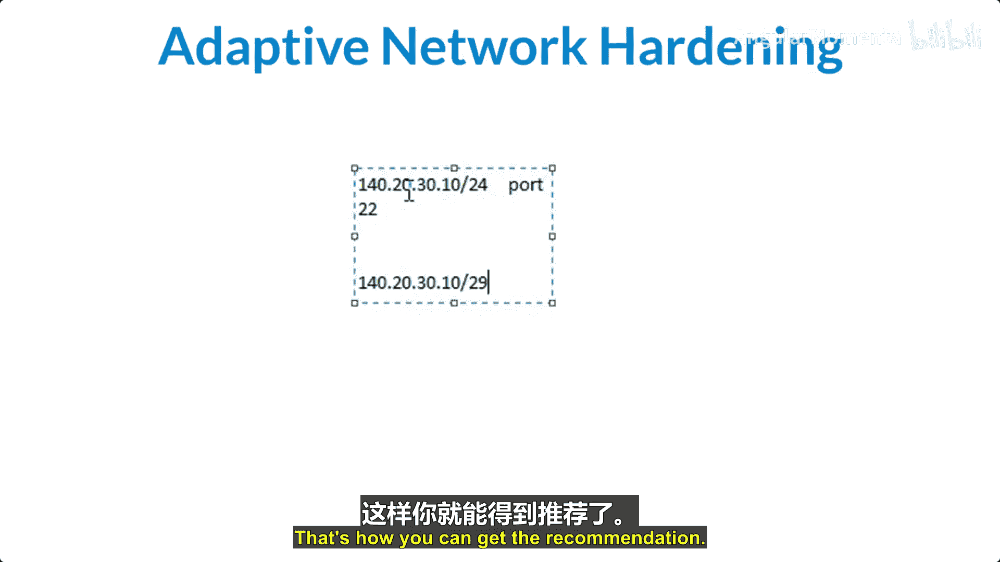
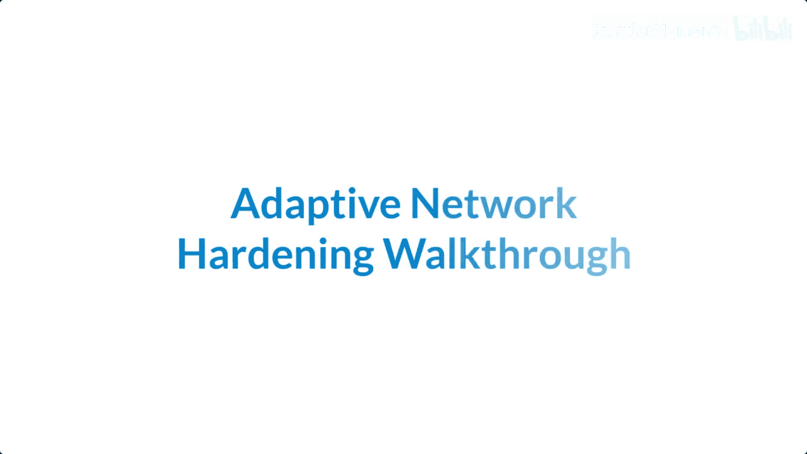
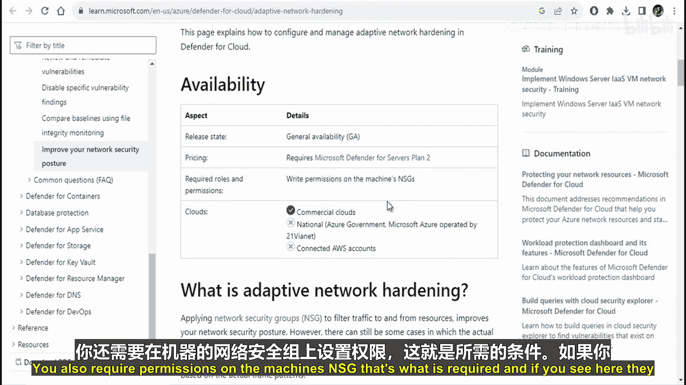
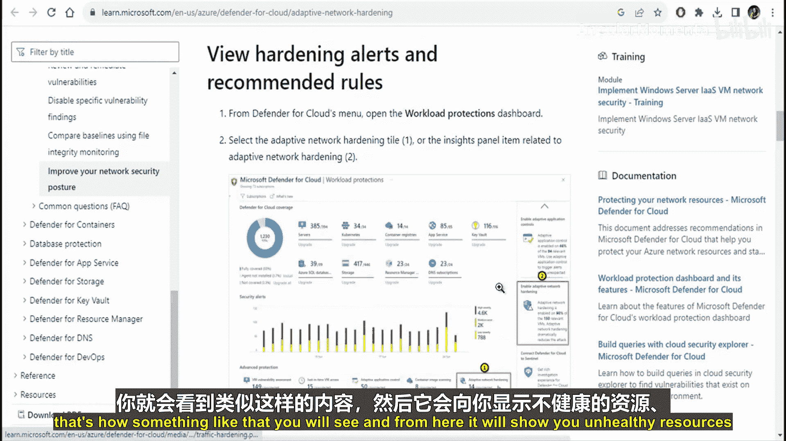
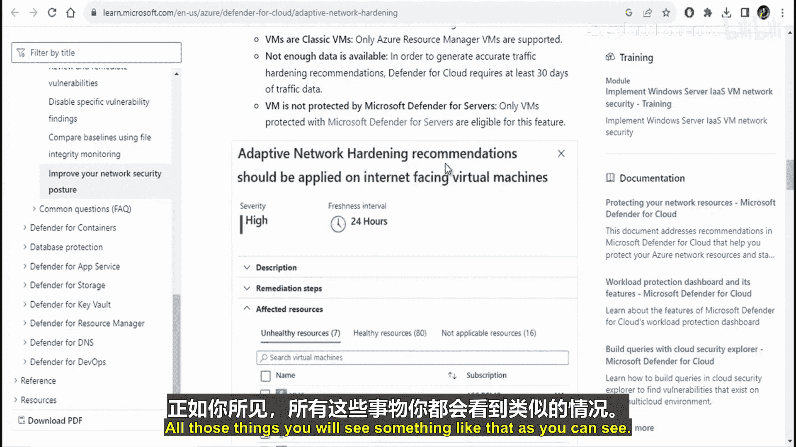
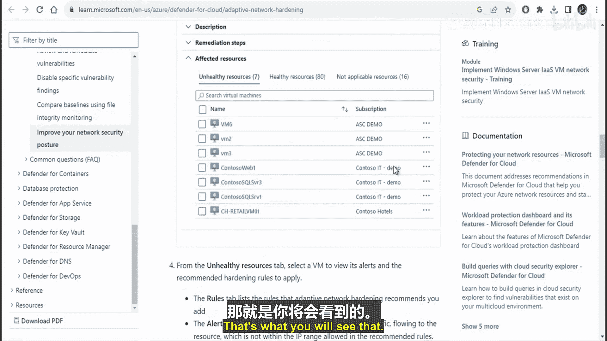
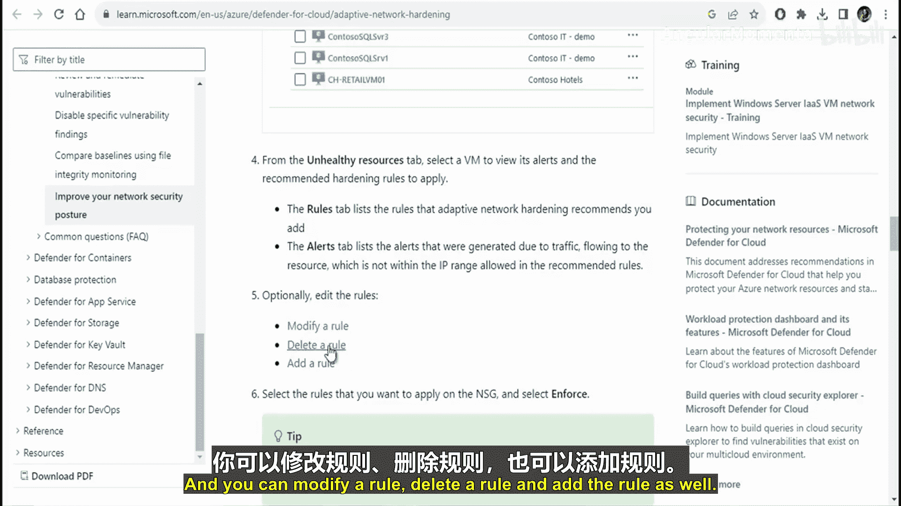
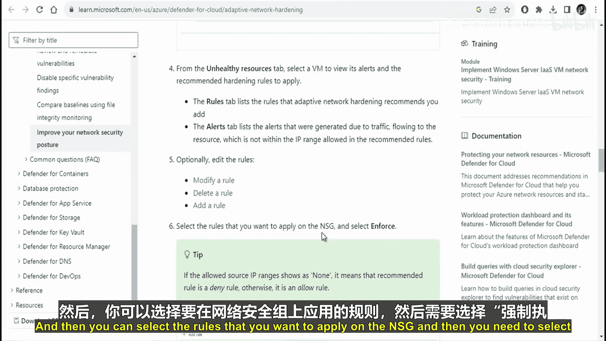
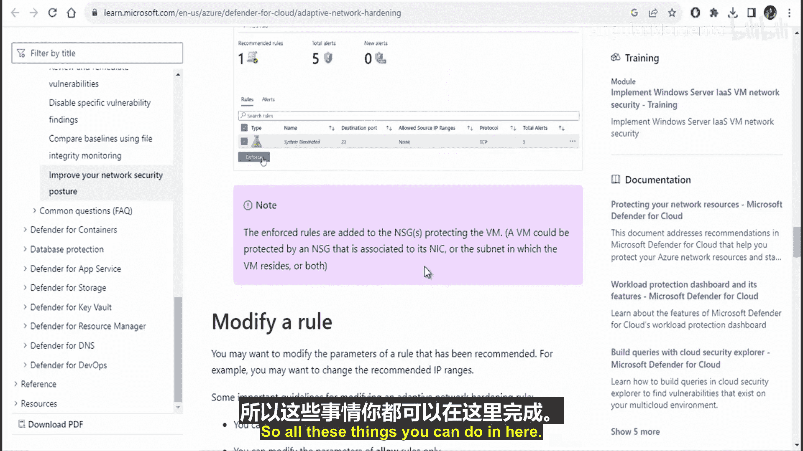

# 015：自适应网络加固 🔒


在本节课中，我们将学习自适应网络加固。这是一种通过分析实际流量模式来优化网络安全组规则，从而提升网络安全性态的方法。

## 概述

上一节我们介绍了网络安全组的基本规则。本节中，我们来看看如何利用自适应网络加固功能，基于实际流量数据进一步收紧安全策略，实现更精细化的访问控制。

## 什么是自适应网络加固？

应用网络安全组来筛选进出资源的流量，可以改善我们的网络安全态势。然而，在某些情况下，流经NSG的实际流量可能只是已定义规则的一个子集。此时，基于实际流量模式来强化NSG规则，可以进一步提升安全态势。

自适应网络加固功能正是为此提供建议。它采用一种机器学习算法，综合考虑**实际流量**、已知可信配置、威胁情报以及其他入侵指标，然后给出建议，以允许仅来自特定IP或端口的流量。

## 工作原理示例

假设你有一条现有的NSG规则，允许来自IP范围 `140.20.30.0/24` 的流量访问端口 `22`。

```bash
# 示例原有规则：允许来自 140.20.30.0/24 的流量访问 22 端口
Allow traffic from 140.20.30.0/24 on port 22
```

基于流量分析，自适应网络加固可能会建议你将范围缩小。例如，它可能建议只允许来自 `140.20.30.0/29` 这个更小子网的流量访问端口22，并拒绝该端口的所有其他流量。

```bash
# 示例加固后规则：将允许范围缩小到 140.20.30.0/29
Allow traffic from 140.20.30.0/29 on port 22
Deny all other traffic to port 22
```






## 功能演练与要求

接下来，我们演练一下网络加固工具。这是Microsoft Defender for Cloud的一项功能，无需在本地机器安装任何组件。

要使用此功能，需要满足以下条件：
*   启用 **Microsoft Defender for servers** 计划。
*   拥有对虚拟机及其关联NSG的相应权限。



## 操作界面导览

在Microsoft Defender for Cloud中，你可以按以下路径访问此功能：
1.  打开 **Defender for Cloud** 菜单。
2.  选择 **工作负载保护**。
3.  点击 **自适应网络加固** 选项。

进入后，界面会展示资源的状态概览，例如：
*   **不健康的资源**
*   **健康的资源**
*   **未扫描的资源**
*   **经典虚拟机**
*   **数据不足的虚拟机**
*   **未受Microsoft Defender for servers保护的虚拟机**

## 规则与警报管理

该界面还提供以下选项卡进行管理：





以下是规则管理相关功能：
*   **规则选项卡**：提供具体的规则修改建议。
*   **警报选项卡**：显示因资源流量触发的安全警报。



在规则选项卡中，你可以执行以下操作：
*   **修改规则**
*   **删除规则**
*   **添加规则**

你可以选择想要应用到NSG上的规则，然后执行**强制执行**等操作。



## 总结





本节课中，我们一起学习了自适应网络加固。我们了解了它如何通过分析实际流量，利用机器学习提供建议，帮助我们将宽泛的NSG规则收紧为更精确的规则，从而显著提升Azure网络资源的安全性。我们还了解了启用该功能的要求，并浏览了其管理界面的主要部分。