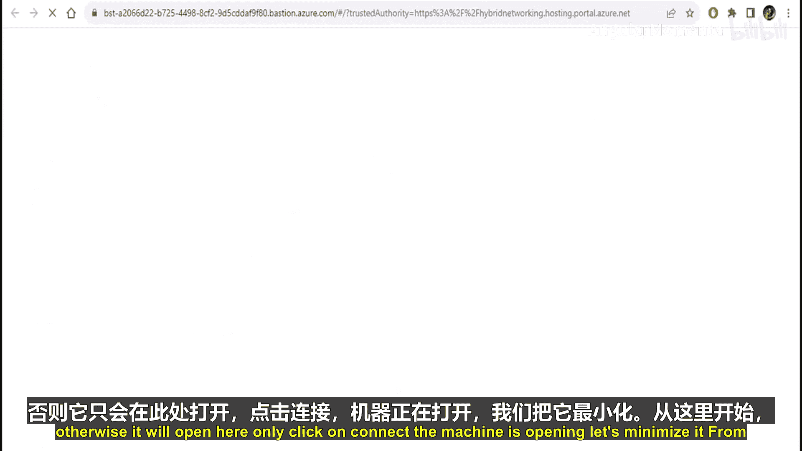
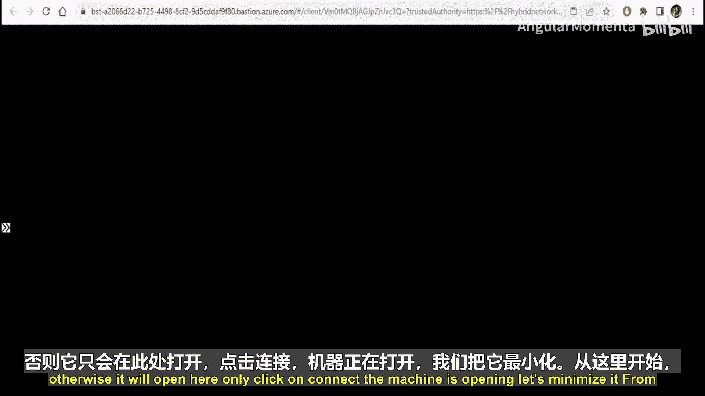
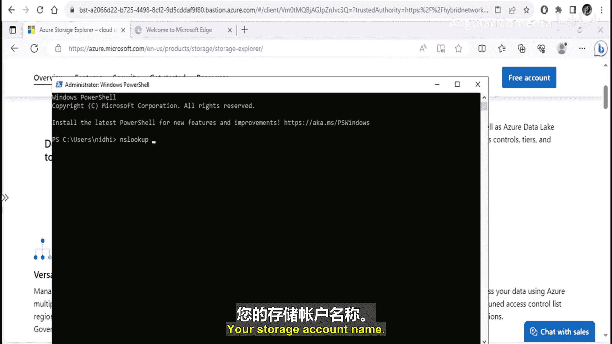
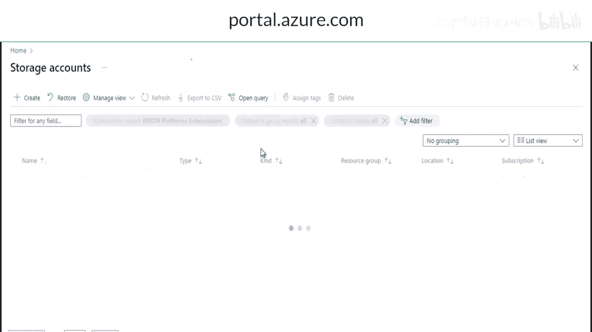
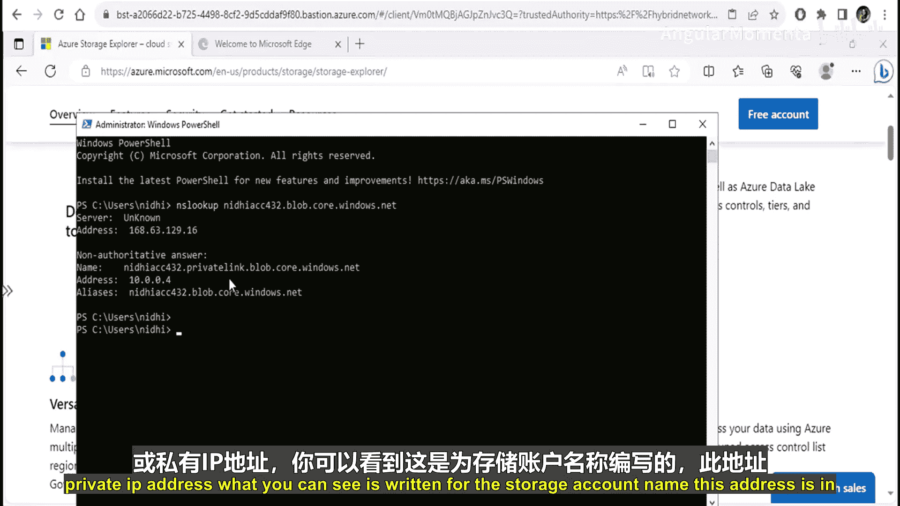
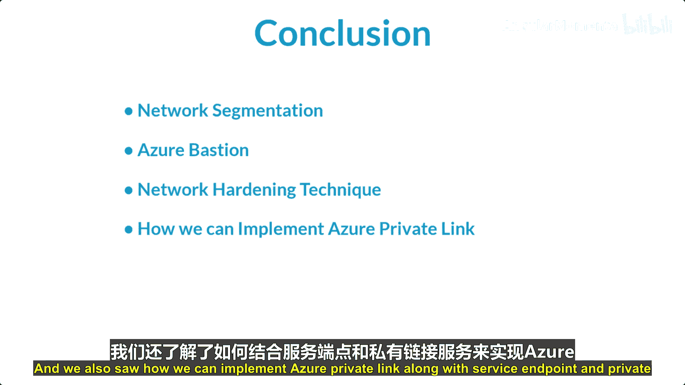

# 016：什么是 Azure 私有链接 🔗

在本节课中，我们将学习 Azure 私有链接。这是一种服务，允许你通过虚拟网络中的专用终结点，安全地访问 Azure 平台即服务（PaaS）资源。

## 概述

Azure 私有链接使你能够通过虚拟网络内的专用终结点，访问如 Azure 存储、SQL 数据库等 PaaS 服务，甚至是客户或合作伙伴的服务。这消除了通过公共互联网访问这些服务的需要，从而提升了安全性。

## Azure 私有链接的优势

上一节我们介绍了私有链接的基本概念，本节中我们来看看它的主要优势。设想一个场景：你有一个 Azure 虚拟网络，其中运行着虚拟机，同时还有一个 Azure SQL 数据库。通常，数据库会配置一个公共终结点以供连接。

以下是使用公共终结点连接的问题：
*   **连接路径**：即使虚拟机和数据库都在 Azure 云内，连接也通过公共互联网进行。
*   **安全风险**：数据库通过其公共 IP 地址暴露在互联网上，这带来了潜在的攻击风险。
*   **暴露范围**：风险不仅存在于你的虚拟网络，也可能影响通过 ExpressRoute 连接到 Azure 的本地网络，或连接到你的公司服务的客户虚拟网络。

Azure 私有链接通过移除连接的公共部分来消除这些安全风险。它通过将资源的公共终结点替换为专用网络接口，为你提供对服务的**安全访问**。

## 什么是专用终结点？

上一节我们了解了私有链接的优势，本节中我们来看看实现它的核心技术：专用终结点。

专用终结点是一种网络接口，它能在你的虚拟网络和 Azure 服务之间实现**私密且安全的连接**。它是 Azure 私有链接背后的关键技术。

专用终结点使用虚拟网络地址空间中的**私有 IP 地址**，将服务“引入”到虚拟网络中。这意味着服务资源看起来就像是虚拟网络的一部分。

## 专用终结点与服务终结点

理解了专用终结点，我们再来区分一下它和另一个类似概念——服务终结点。

以下是两者的核心区别：
*   **专用终结点**：授予对**特定服务背后某个具体资源**的网络访问权限，实现精细的流量分段。流量可以从本地网络到达服务资源，而无需使用公共终结点。专用终结点是虚拟网络地址空间中的一个**私有 IP**。
*   **服务终结点**：服务终结点保持**公共可路由的 IP 地址**。它通过扩展虚拟网络的身份到 Azure 服务，来保护服务资源，但访问仍通过 Azure 主干网，且是针对整个服务的。

## 什么是私有链接服务？

之前我们讨论了如何从你的虚拟网络私有访问 Azure 的 PaaS 服务。现在，假设你的公司在 Azure 中创建了自己的服务，并且只供你公司的客户使用。

私有链接服务就是为你**自己的服务**提供私有连接能力的组件。你的服务在标准负载均衡器后运行，可以启用私有链接访问。这样，你的服务的消费者就可以从他们自己的虚拟网络中进行私有访问。

你的客户可以在其虚拟网络中创建一个专用终结点，并将其映射到你的这个私有链接服务。一个私有链接服务可以接收来自多个专用终结点的连接，而一个专用终结点则连接到一个私有链接服务。

## 实践：使用私有链接连接存储账户

理论部分已经介绍完毕，现在让我们通过一个实际操作来巩固理解。我们将创建一个虚拟网络和一个存储账户，然后使用 Azure 私有终结点安全地连接它们。

以下是实现步骤：
1.  **创建虚拟网络**：在 Azure 门户中，创建一个虚拟网络（例如 `VNet1`）并配置子网。
2.  **创建存储账户**：创建一个新的存储账户（例如 `myaccount567`）。
3.  **禁用公共访问**：在存储账户的“网络”设置中，将访问方式从“所有网络”更改为“禁用”，以关闭公共终结点。
4.  **创建专用终结点**：
    *   在门户中搜索并创建“专用终结点”。
    *   在配置中，资源类型选择 `Microsoft.Storage/storageAccounts`，并选择你刚创建的存储账户。
    *   将其部署到之前创建的虚拟网络的特定子网中。
    *   创建完成后，专用终结点会获得该子网内的一个私有 IP 地址。
5.  **创建虚拟机（用于测试）**：在同一个虚拟网络中创建一台 Windows 虚拟机。在创建时，将其公共 IP 地址选项设置为“无”，因为它将通过私有网络进行测试。
6.  **在存储账户中创建容器**：在存储账户中创建一个 Blob 容器（例如 `mycontainer`）。

## 测试连接

所有资源部署完成后，现在我们来验证私有连接是否正常工作。

1.  **连接到虚拟机**：通过 Azure 门户的“连接”功能，使用 RDP 或 SSH 连接到刚创建的虚拟机。
2.  **解析存储账户域名**：在虚拟机的命令行中，使用 `nslookup` 命令解析你的存储账户名称（例如 `nslookup myaccount567.blob.core.windows.net`）。你应该会看到解析到的是专用终结点在虚拟网络子网中的**私有 IP 地址**（例如 `10.0.0.4`），而不是公共 IP。这证明 DNS 查询被正确重定向到了私有终结点。
3.  **使用存储资源管理器访问**：
    *   在虚拟机上下载并安装 [Microsoft Azure 存储资源管理器](https://azure.microsoft.com/features/storage-explorer/)。
    *   打开存储资源管理器，选择“添加账户” -> “存储账户” -> “账户名称和密钥”。
    *   输入你的存储账户名称，并从 Azure 门户的存储账户“访问密钥”设置中获取密钥。
    *   连接成功后，你应该能够浏览存储账户中的容器和文件，所有流量都通过 Azure 私有网络进行，而无需经过公共互联网。

## 总结

本节课中我们一起学习了 Azure 私有链接的核心概念与实践。我们首先了解了私有链接如何通过专用终结点提供对 PaaS 服务的安全访问。接着，我们深入探讨了专用终结点这项关键技术，并将其与服务终结点进行了对比。我们还介绍了私有链接服务，它允许你为自己在 Azure 中托管的服务提供私有连接。最后，通过一个完整的动手实验，我们演示了如何为存储账户配置私有终结点，并从虚拟机安全地访问它，验证了整个私有连接流程。

总而言之，Azure 私有链接是构建安全、隔离的云网络架构的关键服务，它能有效减少网络攻击面，满足合规性要求，是实现云上“零信任”网络模型的重要工具。