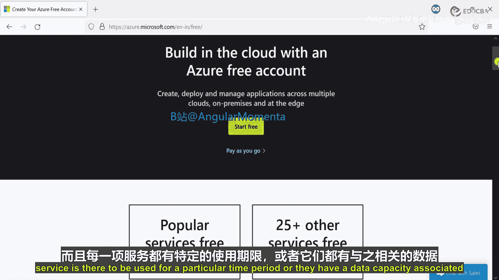
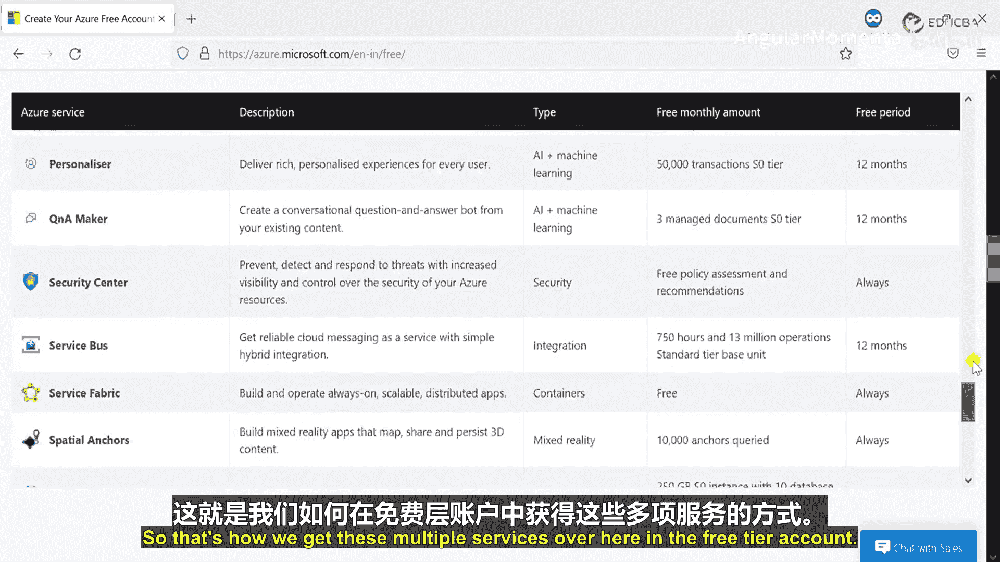
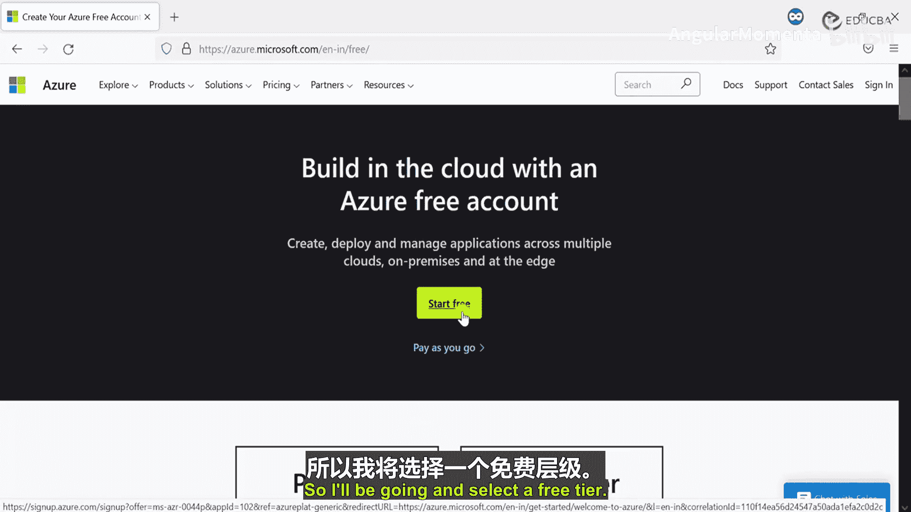
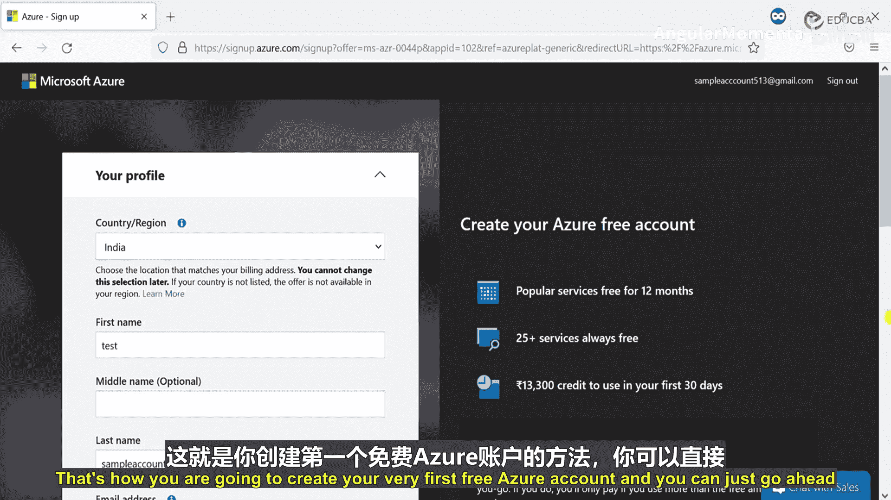

# 001：概述与账户创建

在本课程中，我们将学习Azure认知服务。这是一系列由微软Azure提供的服务，旨在帮助开发者和架构师轻松创建智能应用程序。

## 什么是Azure认知服务？

Azure认知服务是一系列由Azure提供的服务集合。借助这些服务，我们可以创建智能应用程序。如今，创建智能应用已非新鲜事，但在过去，若想构建使用机器学习或AI模型的应用程序，需要聘请精通机器学习或AI的专业人士。而借助Azure认知服务，我们可以轻松实现这些功能，无需直接的机器学习、AI或数据科学知识。这些服务易于配置和部署，能帮助开发者构建智能应用。

例如，在日常生活中，我们可能会遇到需要从一组图片中找出“异类”的情况。人类很容易识别，但若想让机器完成此任务，通常需要创建并训练一套机器学习模型，经过大量测试后才能投入生产环境。然而，借助Azure，我们可以创建和部署基于视觉的服务，它能帮助我们在此类场景中找出不同的图片。

## 传统机器学习流程

上一节我们介绍了认知服务的概念，本节中我们来看看传统的机器学习在行业中是如何工作的。

以下是典型的机器学习流程步骤：

1.  **收集训练集**：首先需要收集大量的训练数据集。例如，若要创建处理日志的模型，就需要成千上万条日志；若要创建图像识别模型，则需要成千上万张图片。我们将这些数据输入模型，使其从中学习。

2.  **清理数据**：收集训练集后，需要从现有机器中清理这些数据，因为它们会占用存储空间。我们通常不希望机器保留这些未来不再使用的“废”数据，因为模型已经学习过了。

3.  **选择模型**：在使用多个机器学习模型后，我们会得到不同的结果。有些模型准确率约为90%，有些是98%，有些是95%。我们当然会选择准确率最高（例如98%）的模型作为最终方案。

4.  **训练与验证**：选定模型后，我们会用更多数据集对其进行进一步训练和结果验证。

5.  **部署**：经过测试和训练后，我们将机器学习模型部署到生产环境。

这个过程通常耗时很长。但Azure认知服务为我们提供了现成的模型，我们可以直接部署使用，无需关心如何每日训练这些模型，因为这些模型已经由工程师们进行了充分的尝试和测试。

## Azure认知服务的使用流程

了解了传统流程的复杂性后，我们来看看使用Azure认知服务的简化流程。

以下是使用Azure认知服务的基本步骤：

1.  **配置服务**：首先需要配置（Provision）Azure认知服务。正如之前提到的，这些服务易于部署，我们将在动手实践环节展示如何操作。

2.  **使用服务**：配置完成后，即可开始为应用程序使用这些服务。有多种方式可以访问这些服务：最简单的是通过控制台；另一种方式是通过API调用。如果希望通过应用程序集成，则使用API调用；若想不通过任何应用程序或中间件直接使用，则可以前往控制台操作。

## 认知服务分类

在开始动手之前，我们先系统了解Azure认知服务提供的主要类别。Azure认知服务主要分为五类：

*   **视觉**：此类服务用于识别物体、场景和活动，进行活动检测、人脸识别等。借助人脸识别，还可以进行身份验证。例如，可以识别图像中的人物是否为名人，或者某个地标是否为已知景点。它还能帮助进行情绪识别（判断人物是开心还是悲伤），以及文本和手写体识别。对于视频，可以提取元数据、关键帧并进行内容分析。此外，它还用于检测平台（如Facebook、Instagram）上的露骨或攻击性内容，以及支持自定义图像识别。

*   **语音**：此类服务与日常语音处理相关。基础功能包括语音转录（如视频自动生成字幕）和语音合成（将文本转换为语音，并可选择语音调制方式）。此外，还有实时语音翻译、说话人识别与验证服务，以及用于转录和语音合成的自定义语音模型。

*   **搜索**：此类服务主要用于增强搜索功能。它提供无广告的网页、新闻、图片和视频搜索结果，显示视频和新闻的趋势，识别相似图片和产品。搜索认知服务可以帮助我们精确查找所需内容。

*   **语言**：此类服务用于处理文本语言。功能包括语言检测（如Google翻译自动检测输入语言）、文本情感分析、关键短语提取（例如从“我们将学习认知服务”中提取“学习”、“认知服务”）、拼写检查、语法检查、攻击性文本内容审核以及文本翻译。

*   **知识**：此类服务借助知识认知搜索，可帮助进行决策制定，并能创建问答服务以提供帮助。

本课程将逐一深入介绍这些服务及其不同的应用场景。

## 创建Azure免费账户

在开始动手实践之前，我们需要先创建一个Azure账户。我们将创建一个免费层级的账户。

以下是Azure免费账户提供的主要服务示例（具体配额可能随时间变化，请以官网为准）：

*   **12个月免费服务**：例如，750小时的Azure虚拟机（Windows/Linux）、5GB的Blob存储、250GB的SQL数据库等。
*   **始终免费的服务**：包括一定配额的认知服务，例如“异常检测器”和“自定义视觉”服务。以“自定义视觉”为例，免费层通常每月提供一定数量的训练图像调用次数（例如5000次）。

现在，让我们一步步创建账户。

以下是创建Azure免费账户的步骤：

1.  访问Azure官网注册页面。
2.  选择创建免费账户。
3.  输入电子邮件地址（任何邮箱均可，不限于微软账户）。
4.  设置密码。
5.  通过电子邮件或手机验证身份。
6.  填写个人信息，包括姓名、国家/地区、电话号码等，并完成手机号验证。
7.  同意订阅协议。
8.  **提供信用卡信息进行验证**。此步骤主要用于身份验证和防止滥用。如果仅在免费额度内使用服务并及时清理资源，通常不会产生费用。Azure会在扣费前明确提示。
9.  完成验证后，账户即创建成功，可以开始使用。

**注意**：务必妥善管理资源，使用完毕后及时删除，以避免在超出免费额度后产生意外费用。

---

本节课中，我们一起学习了Azure认知服务的核心概念、其相对于传统机器学习的优势、主要服务分类（视觉、语音、搜索、语言、知识）以及如何创建Azure免费账户来开始使用这些服务。从下一节开始，我们将进入具体的动手实践环节。