# 002：视觉API与计算机视觉概述 🧠

在本节课中，我们将要学习Azure认知服务中的视觉API，特别是计算机视觉服务。我们将了解它的基本功能、工作原理，并通过实际操作演示如何使用它来分析图像。

## 什么是视觉API？

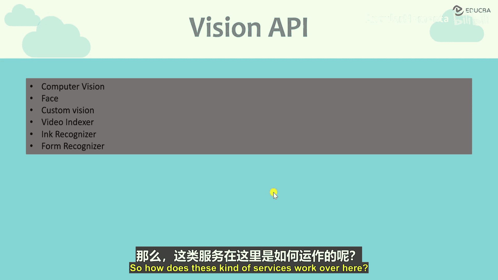

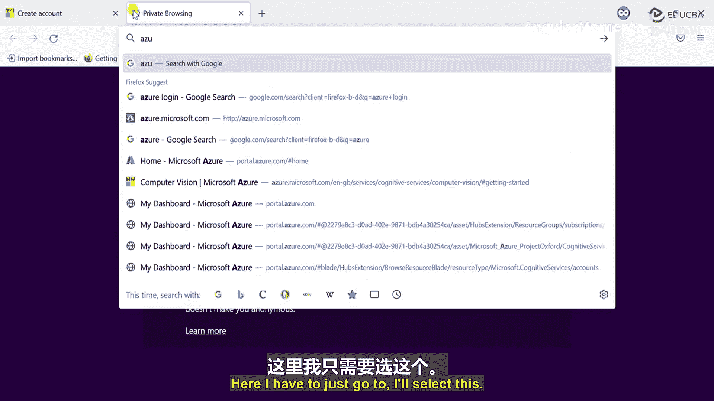

当我们听到“视觉”这个词时，首先想到的通常是图像或视频。视觉API正是处理这类内容的服务。它能够帮助我们分析和识别传入图像或视频中的内容。

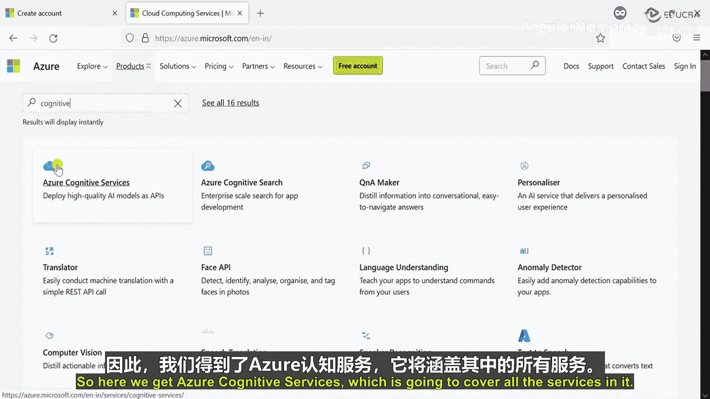

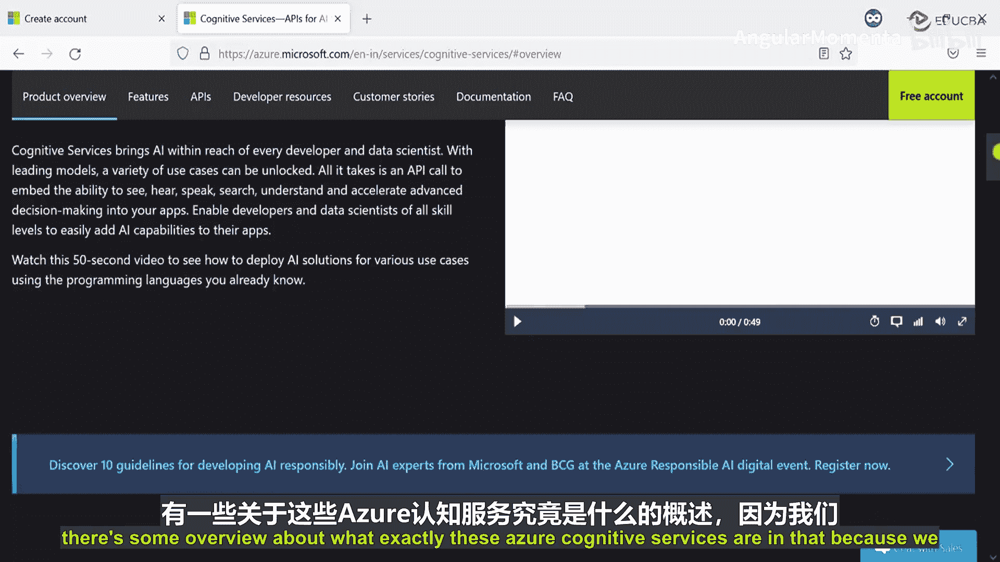

例如，我们看到一棵树的图片，人类可以轻易识别。但如果要创建一个智能应用，传统方法需要构建和训练复杂的模型。而使用Azure认知服务，我们只需部署一个服务即可开始使用。

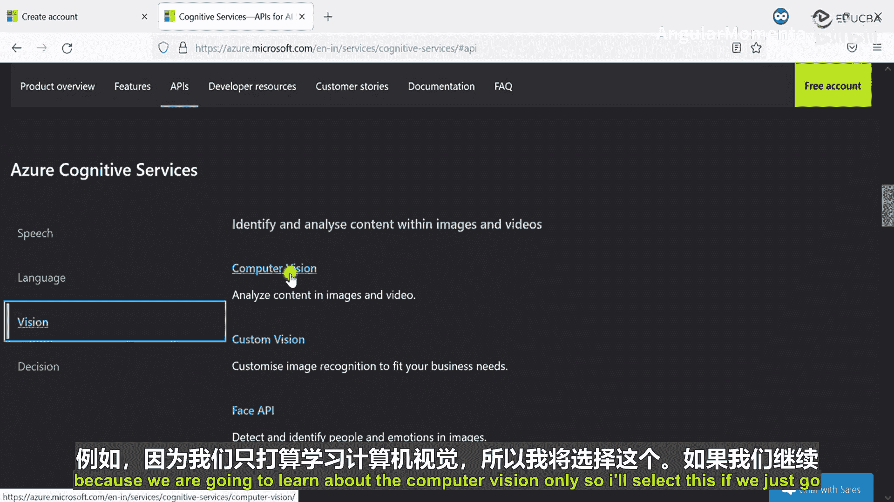

如果我们将一张树的图片传递给该服务，会得到类似以下的结果：
*   **标签**： 树 (得分: 0.96)
*   **描述**： 一棵树

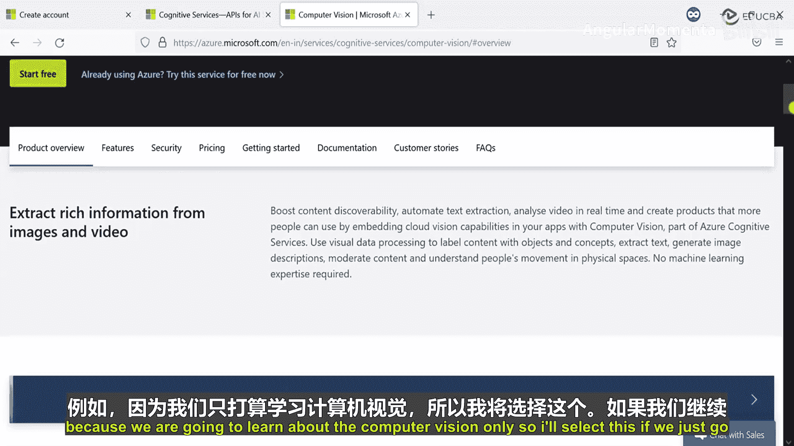

服务不仅识别出物体，还会返回一个置信度分数，例如96%确定这是一棵树。这就是视觉API的基本工作方式。

## 视觉API包含哪些服务？

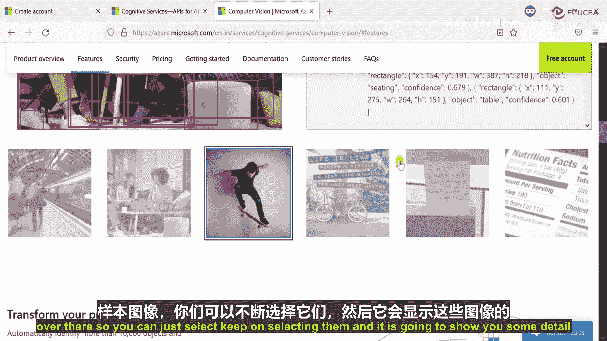

视觉API下包含多个具体的服务，以下是主要组成部分：
*   **计算机视觉**
*   **人脸**
*   **自定义视觉**
*   **视频索引器**
*   **识别器**与**表单识别器**

本教程将逐一介绍这些服务。首先，我们从计算机视觉开始。

## 计算机视觉服务如何工作？

上一节我们介绍了视觉API的概览，本节中我们来看看核心服务——计算机视觉的具体功能。

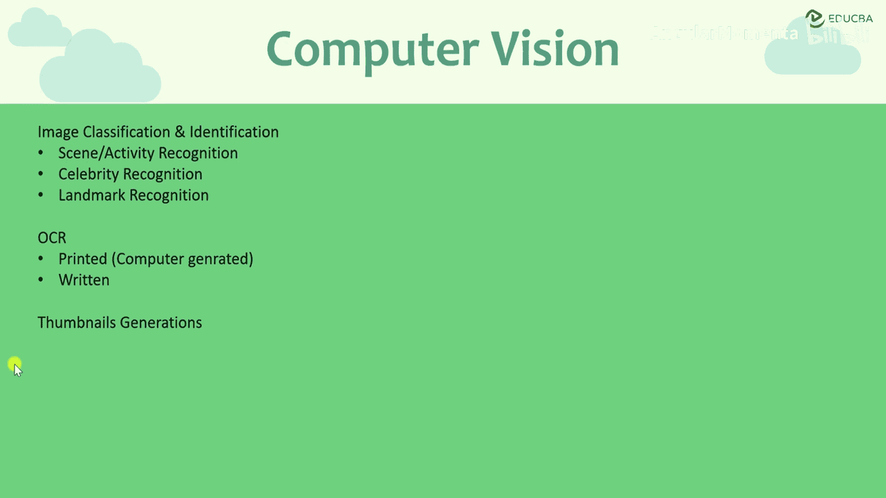

计算机视觉服务能够从图像中提取丰富的细节。例如，分析一张地铁站图片后，服务可能返回以下信息：
*   **描述**： 地铁、火车、站台、车站、室内、轨道、行走的人群、等候的人群。
*   **图像类型**： JPG
*   **图像尺寸**
*   **标签**： 交通、建筑、人群
*   **检测到的物体及其位置**

此外，它还能识别图像中的主导颜色。如果我们选择分析颜色特征，服务会返回图像中占主导地位的色彩信息。

### 计算机视觉的核心功能

以下是计算机视觉服务提供的一些关键能力：

1.  **图像分类与场景识别**
    *   识别图像中的场景或活动。例如，识别出图片中的人物正在进行“滑板运动”。

2.  **名人识别**
    *   识别图像中出现的知名人物。例如，传入一张名人照片，服务会返回该名人的姓名。

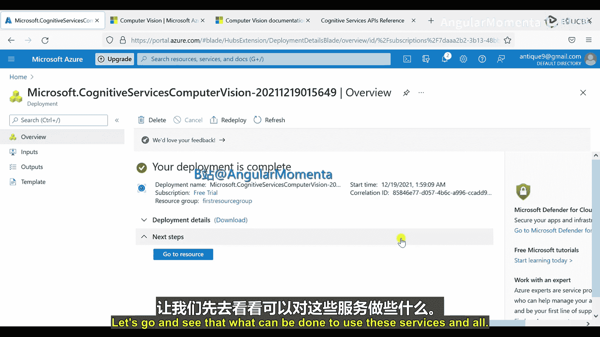

3.  **地标识别**
    *   识别著名的地标性建筑。例如，识别出图片中是埃菲尔铁塔。

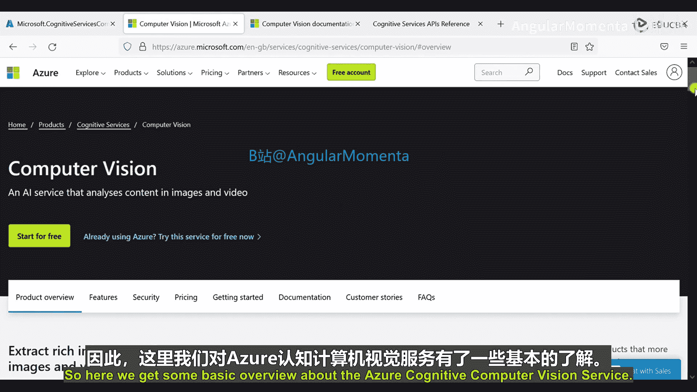

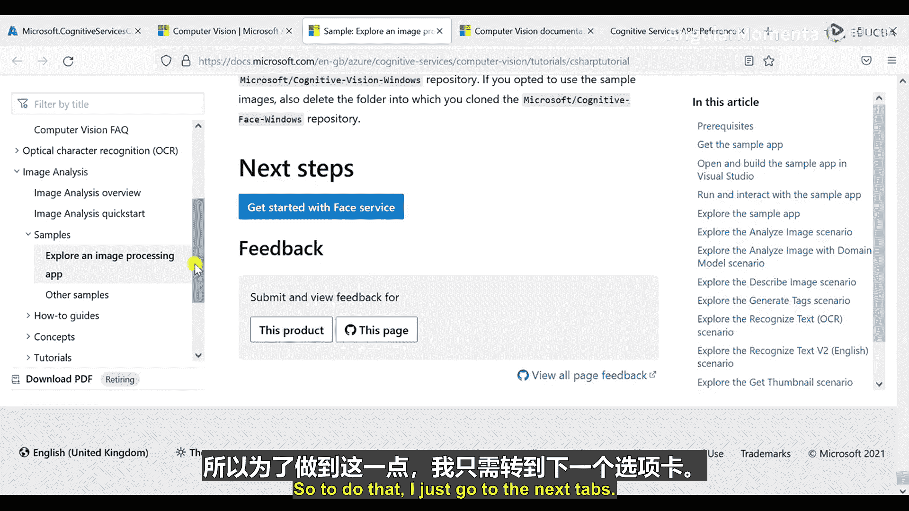

4.  **光学字符识别**
    *   从图像中提取印刷体或手写体文字。
    *   **印刷体示例**： 扫描银行对账单，直接提取文字信息，无需手动录入。
    *   **手写体示例**： 提取手写笔记中的文字内容。

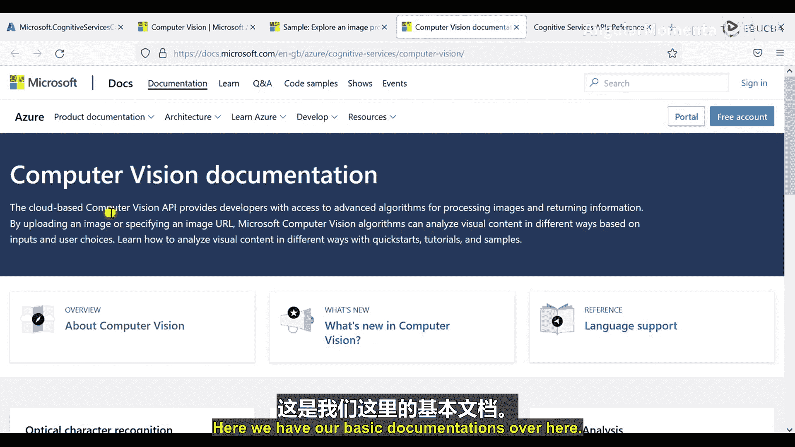

5.  **缩略图生成**
    *   自动为图像生成合适尺寸的缩略图。

## 实践：创建并使用计算机视觉服务

了解了理论之后，现在让我们动手创建第一个认知服务并实际使用它。我们将使用Postman工具来调用API。

### 第一步：创建计算机视觉服务

1.  登录Azure门户。
2.  点击“创建资源”。
3.  在搜索框中输入“认知服务”，选择“认知服务”。
4.  点击“添加”以创建新服务。
5.  在服务类型中，选择“计算机视觉”。
6.  选择你的订阅（例如免费试用）。
7.  创建或选择一个资源组（可将其视为一个文件夹）。
8.  选择区域（例如“美国东部”）。
9.  为服务命名（名称需全局唯一）。
10. 选择定价层（例如“免费F0”）。
11. 点击“查看 + 创建”，然后点击“创建”。部署过程需要几秒钟。

### 第二步：获取访问密钥和终结点

服务创建成功后，需要获取访问凭证：
1.  在资源列表中进入你创建的计算机视觉服务。
2.  在左侧菜单中选择“密钥和终结点”。
3.  复制 `KEY 1` 或 `KEY 2` 以及 `终结点` 地址。调用API时会用到它们。

### 第三步：使用Postman调用API

我们将参照官方文档，使用Postman发送请求来分析图像。

1.  **准备请求URL**：
    *   从计算机视觉的API文档中，找到“分析图像”的POST请求示例URL。
    *   将文档中的示例终结点替换为你自己的终结点地址。
    *   URL格式大致如下：
        ```
        {你的终结点}/vision/v3.2/analyze[?visualFeatures][&details][&language]
        ```
    *   在URL后添加查询参数，指定需要返回的信息，例如：
        ```
        ?visualFeatures=Categories,Color,Description,Objects,Tags&details=Landmarks
        ```

2.  **配置Postman请求**：
    *   **方法**： 选择 `POST`。
    *   **Headers（请求头）**：
        *   `Content-Type`: `application/octet-stream`
        *   `Ocp-Apim-Subscription-Key`: 填入你复制的密钥
    *   **Body（请求体）**：
        *   选择 `binary` 类型。
        *   点击“Select File”并选择一张本地图片（支持JPG、PNG等格式，大小需小于4MB）。

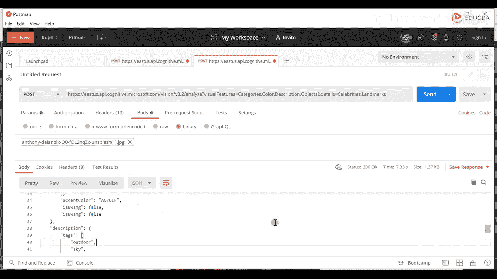

3.  **发送请求并查看结果**：
    *   点击“Send”。
    *   成功后，会在下方看到状态码 `200 OK` 和JSON格式的响应结果。
    *   结果中可能包含图像分类、描述、标签、检测到的物体、主导颜色以及地标识别信息等。

**示例响应片段**：
```json
{
  "categories": [{"name": "outdoor_", "score": 0.99609375}],
  "description": {"captions": [{"text": "a wave crashing on a beach", "confidence": 0.895}]},
  "color": {"dominantColors": ["White"]},
  "tags": [{"name": "ocean", "confidence": 0.999}, {"name": "wave", "confidence": 0.995}]
}
```

通过更换不同的图片（如名人照片、地标建筑），可以测试服务的名人识别和地标识别功能。

## 人脸API概述

在上一节，我们通过实际操作学习了计算机视觉服务。它主要提供图像的整体分析。本节我们将深入另一个专门领域——人脸API，它能提供关于图像中人脸的更细致信息。

人脸API的核心功能包括：

1.  **人脸检测**
    *   检测图像或视频中是否存在一张或多张人脸。
    *   提供每张人脸的详细信息，如**年龄**、**性别**、**情绪**（快乐、悲伤等）、**面部特征点**（眼睛、鼻子、嘴的位置）以及姿势。

2.  **人脸验证**
    *   比较两张人脸，判断它们是否属于同一个人。
    *   **公式**： `verify(faceId1, faceId2) -> {isIdentical: true/false, confidence: 0.xx}`
    *   日常应用：手机面部解锁（如Apple Face ID）。

3.  **人脸分组**
    *   将一组人脸照片根据视觉相似性自动分成不同的组。
    *   适用于整理大量未标记的人像照片。

4.  **人脸识别**
    *   在已建立的人脸数据库（如员工库）中，识别一张新人脸对应的身份。
    *   **流程**： `identify(faceId, personGroupId) -> [ {personId: xxx, confidence: 0.xx} ]`

5.  **相似人脸查找**
    *   在数据库中查找与给定人脸视觉上相似的人脸。
    *   **注意**： 长相相似不一定代表是同一个人。此API可用于开发趣味应用，例如“寻找与你相似的明星”。

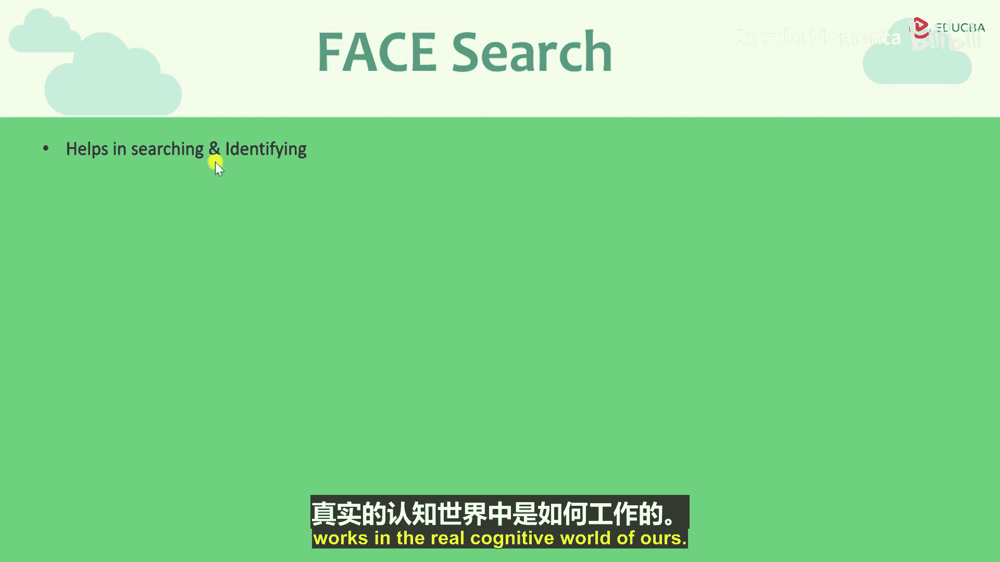

## 实践：使用人脸检测API

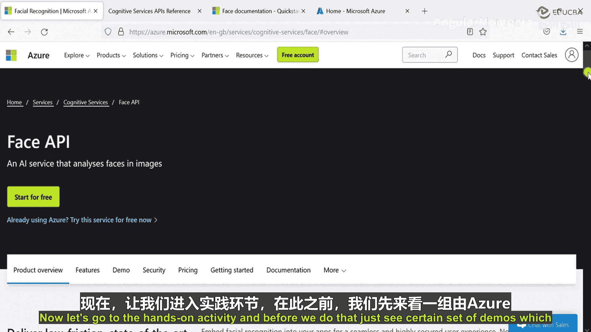

让我们通过Postman体验人脸API中最基础的功能——人脸检测。

### 第一步：准备请求

1.  参照人脸API文档，找到“Detect”接口的POST请求URL。
2.  将终结点替换为你自己的（如果使用独立的人脸服务，需创建对应的资源并获取其密钥和终结点；计算机视觉服务也包含基础人脸功能，但功能可能不同）。
3.  在URL中添加查询参数，指定需要返回的面部属性，例如：
    ```
    ?returnFaceId=true&returnFaceLandmarks=true&returnFaceAttributes=age,gender,emotion,glasses
    ```

### 第二步：配置并发送Postman请求

1.  **方法**： `POST`
2.  **Headers**：
    *   `Content-Type`: `application/octet-stream`
    *   `Ocp-Apim-Subscription-Key`: 你的密钥
3.  **Body**： 选择 `binary`，上传一张含有人脸的图片。
4.  点击“Send”。

### 第三步：解析结果

响应将是一个JSON数组，为图片中检测到的每张人脸返回一个对象。

**示例响应片段**：
```json
[
  {
    "faceId": "xxxxxxxx-xxxx-xxxx-xxxx-xxxxxxxxxxxx",
    "faceRectangle": {"top": 100, "left": 150, "width": 80, "height": 80},
    "faceAttributes": {
      "age": 35.5,
      "gender": "male",
      "emotion": {"happiness": 0.99, ...},
      "glasses": "No"
    }
  }
]
```

如果图片中有多个人，数组会包含多个对象，分别描述每个人脸的信息。通过这个API，我们可以快速获取人脸的详细分析数据。

## 总结

本节课中我们一起学习了Azure认知服务的视觉API。
*   我们首先了解了**计算机视觉服务**，它能够对图像进行整体分析，包括分类、描述、OCR、识别名人和地标等。
*   随后，我们通过Postman实际操作，创建了服务并调用API分析了不同图片，看到了返回的JSON结果。
*   接着，我们深入探讨了**人脸API**，它专注于人脸相关的分析，如检测、验证、分组和识别。
*   最后，我们实践了人脸检测API，成功获取了图片中人脸的年龄、性别、情绪等属性。

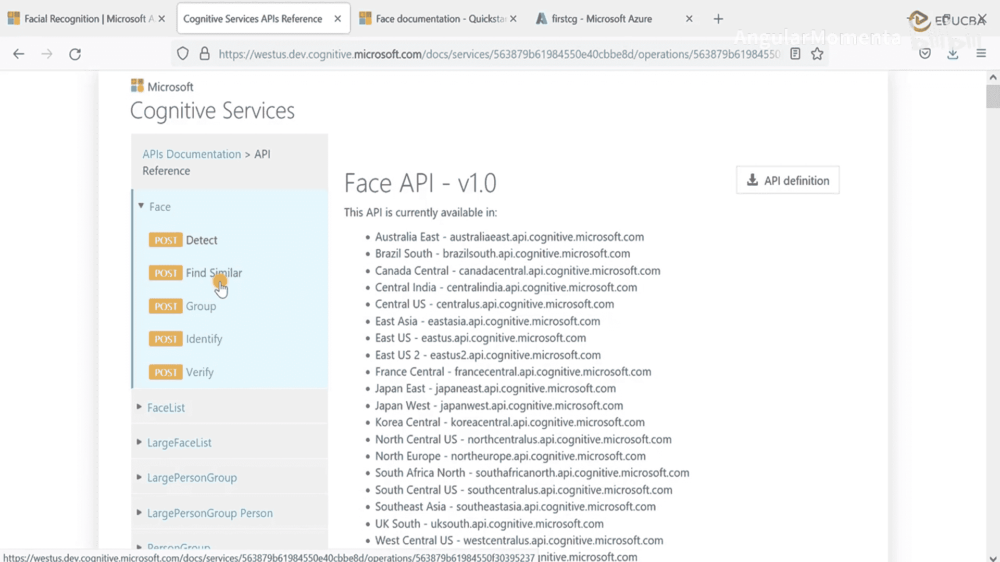

这些强大的API使得复杂的图像分析任务变得简单，开发者无需深厚的机器学习背景即可将其集成到应用程序中。