# 003：自定义视觉服务 🧠

在本节课中，我们将学习Azure认知服务中的自定义视觉服务。我们将了解它的核心概念、适用场景，并通过一个手把手的实践项目——创建一个树叶分类器，来掌握其完整的工作流程。

## 概述

自定义视觉服务是Azure视觉API下的一个类别。顾名思义，它允许我们为特定、独特的用例创建定制化的图像分类模型。与通用的计算机视觉API不同，自定义视觉服务专注于解决那些标准模型无法满足的个性化需求。

## 核心概念与适用场景

上一节我们介绍了自定义视觉服务的定位，本节中我们来看看它的核心功能和适用场景。

自定义视觉服务主要用于**图像分类**。这意味着，你可以训练一个模型，让它判断一张新图片是否属于你预先定义的某个类别（例如，类别A或类别B）。

**关键点**：
*   该服务仅用于图像分类任务。
*   它专为满足你的**独特用例**而设计。

我们已经讨论过计算机视觉API和人脸API。对于识别三位名人或地标这类通用场景，你可能不需要自定义视觉服务。但是，如果你有一个全新的分类需求，例如区分不同种类的树叶，那么自定义视觉服务就派上用场了。

你可以使用属于不同类别的图片来训练你的自定义视觉模型。例如，一个基础应用可以是根据材质（塑料或玻璃）对物品进行分类。更具体的例子是，如果你有不同树木的树叶图片，通用模型可能只能识别出“这是树叶”，而无法告诉你具体是哪种树的叶子。通过自定义视觉服务，我们可以训练一个模型，使其能精确识别出“这是芒果树叶子”或“这是尼姆树叶子”。

## 服务优势与工作原理

了解了适用场景后，我们来看看使用自定义视觉服务的优势及其背后的简化流程。

使用自定义视觉服务的最大优势在于，你**无需**处理底层的机器学习细节。你不需要收集成千上万的训练图片，也不需要自己选择算法或清洗数据。微软Azure已经为这类场景选择了合适的预训练模型。

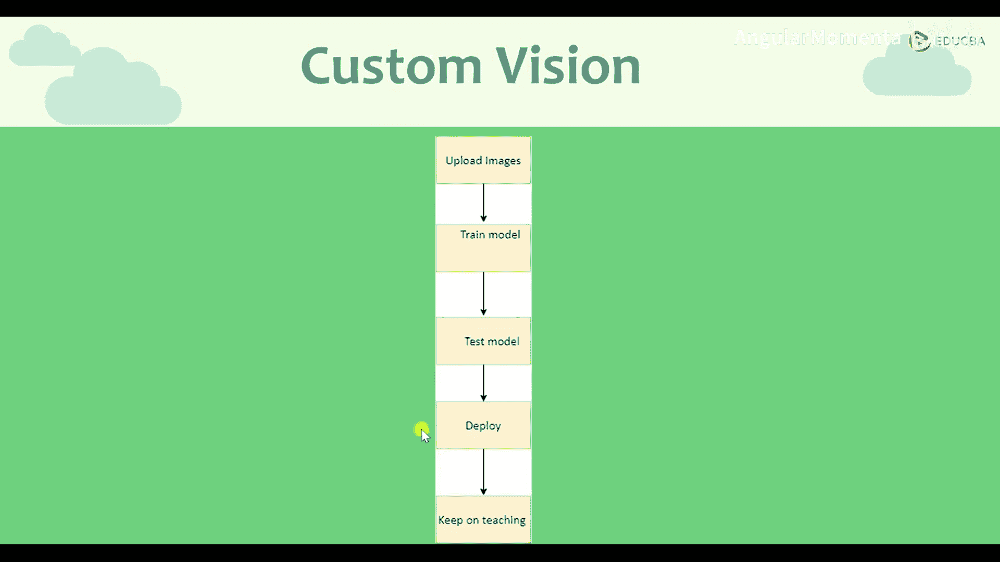

你需要做的只是为每个你想分类的类别提供一些图片。例如，在我们的实践项目中，我们会为“芒果叶”和“尼姆叶”这两个类别分别上传一些图片。

以下是创建和使用自定义视觉模型的基本步骤：

1.  **准备图片集**：微软建议每个类别至少准备30张图片。图片越多，训练效果通常越好。
2.  **上传图片**：将准备好的图片上传到自定义视觉服务项目中。
3.  **训练模型**：使用上传的图片集开始训练模型。
4.  **测试模型**：模型训练完成后，使用新的测试图片来验证模型的预测结果是否符合预期。如果不符合，需要重新训练或添加更多图片。
5.  **部署模型**：当模型达到满意的准确度后，将其部署为可调用的服务。
6.  **集成使用**：在你的应用程序中，通过调用Azure提供的REST API来使用这个已部署的模型。

你可以通过上传更多图片并重新训练模型，来持续优化模型的性能。

## 动手实践：创建树叶分类器 🌿

理论部分已经介绍完毕，现在让我们进入动手实践环节。在接下来的部分，我们将一步步创建一个自定义视觉服务，用于区分芒果叶和尼姆叶。

### 第一步：创建自定义视觉资源

首先，我们需要在Azure门户中创建一个自定义视觉资源。

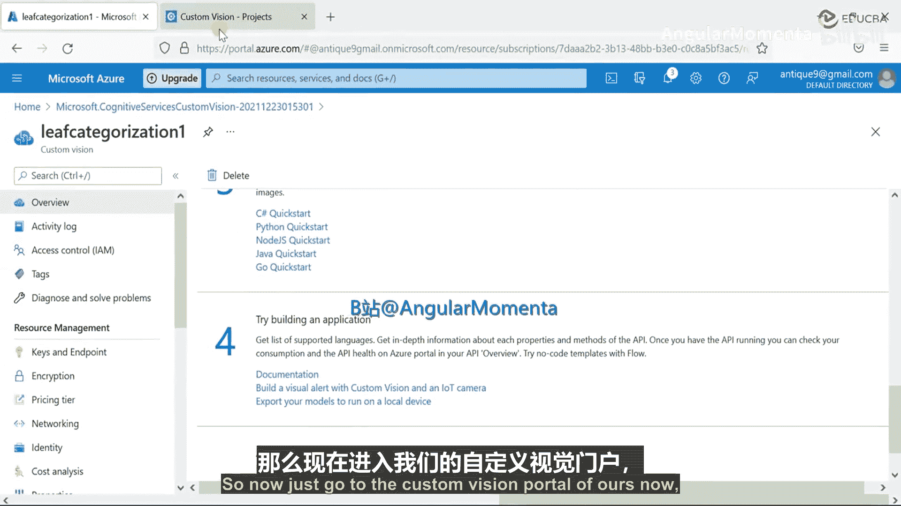

1.  在Azure门户顶部的搜索栏中，搜索“自定义视觉”并选择该服务。
2.  点击“+ 创建”按钮。
3.  在创建页面中，进行如下配置：
    *   **预测资源**：选择“是”。
    *   **订阅**：选择你的订阅（例如“免费试用”）。
    *   **资源组**：选择一个已有的资源组，或新建一个。
    *   **区域**：选择“美国东部”或其他可用区域。
    *   **名称**：为你的服务起一个唯一的名字（例如“LeafCategorizationService”）。
    *   **定价层**：选择“F0”（免费层）。
4.  在“网络”和“标签”部分保持默认设置，然后点击“查看 + 创建”。
5.  验证信息无误后，点击“创建”。部署过程可能需要几分钟。

### 第二步：在自定义视觉门户中创建项目

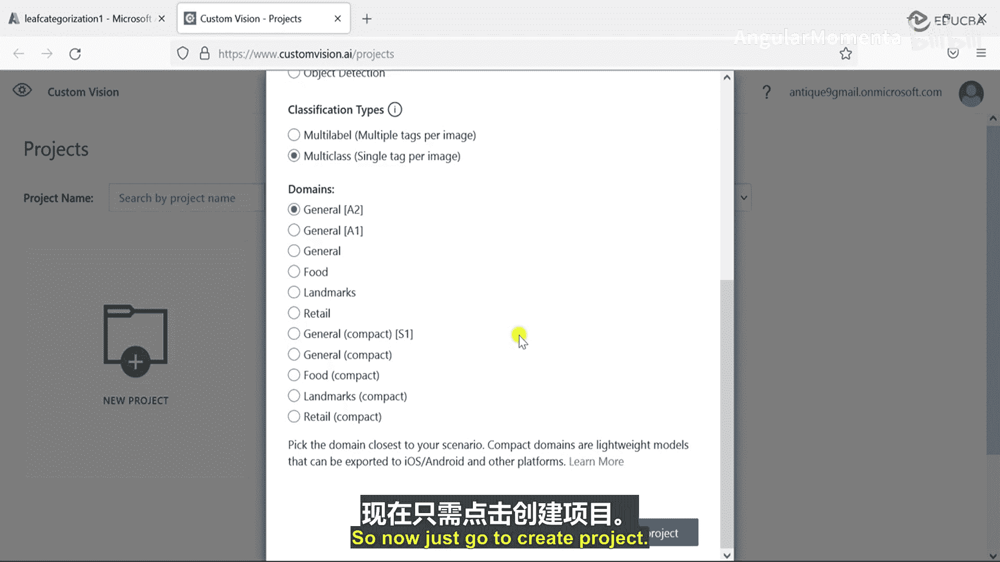

资源创建完成后，我们可以通过多种方式使用它：获取API密钥、使用门户或调用SDK。这里我们使用门户进行操作。

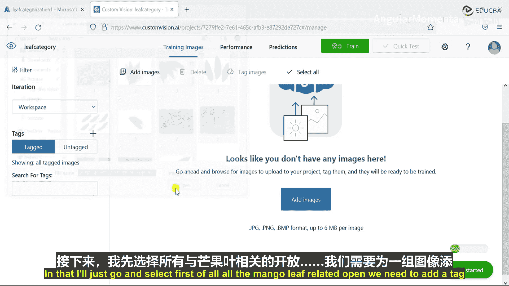

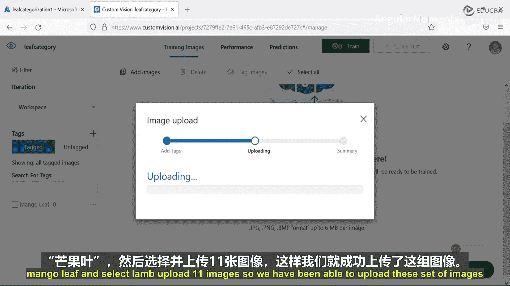

1.  在资源创建成功后，点击“转到资源”。
2.  在资源概览页面，找到并点击“自定义视觉门户”的链接，这将打开一个新的浏览器标签页。
3.  在自定义视觉门户中，点击“新建项目”。
4.  配置新项目：
    *   **名称**：`LeafCategorization`
    *   **描述**：`Categorize the type of leaves.`
    *   **资源**：选择你刚创建的自定义视觉资源。
    *   **项目类型**：`分类`
    *   **分类类型**：`多标签（单个标签）`（因为我们每张图只属于一个类别：芒果叶 *或* 尼姆叶）。
    *   **域**：选择`常规（常规[A2]）`。
5.  点击“创建项目”。

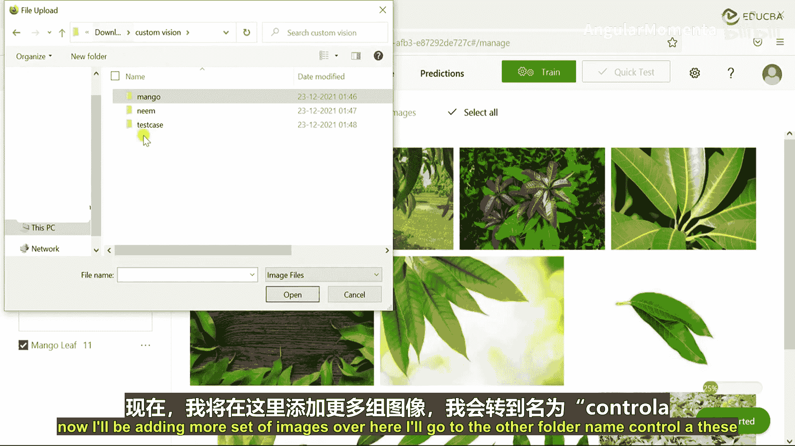

### 第三步：上传并标记训练图像

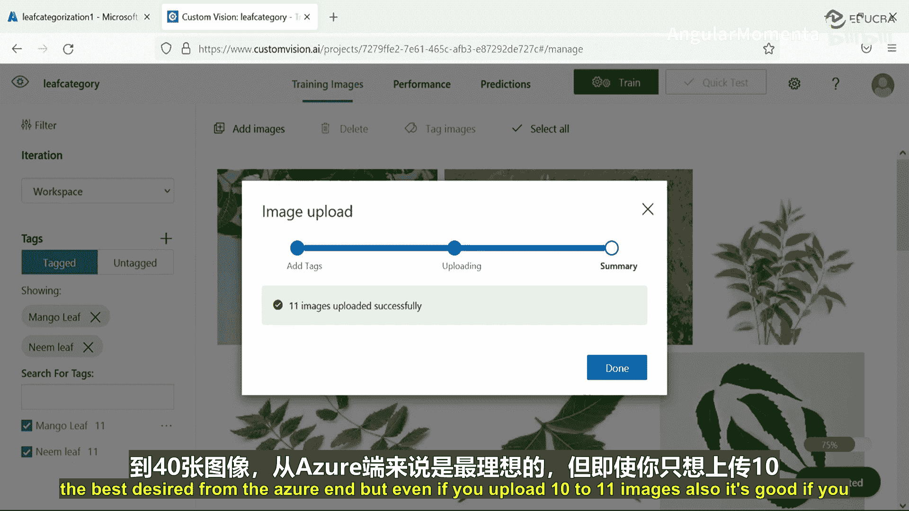

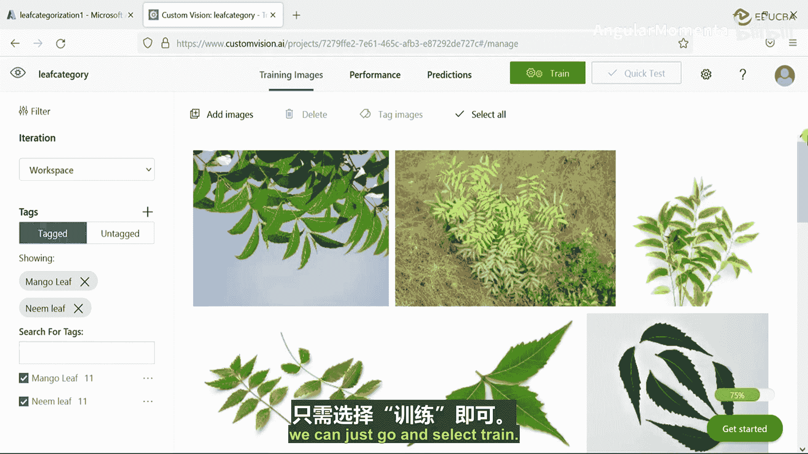

项目创建后，我们需要为每个类别上传并标记图片。

1.  点击“添加图像”。
2.  首先上传“芒果叶”类别的图片。选择所有芒果叶图片，点击“打开”。
3.  在弹出窗口中，为这批图片创建新标签`mango leaf`，然后点击“上传”。
4.  重复上述过程，为“尼姆叶”类别上传图片，并创建标签`neem leaf`。
5.  上传完成后，你将在“训练图像”选项卡中看到所有已标记的图片。

### 第四步：训练模型

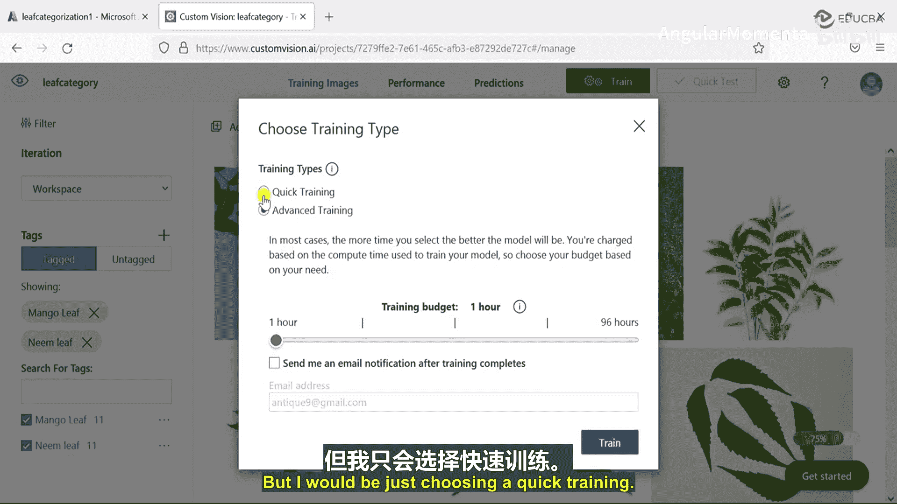

有了标记好的数据，我们就可以开始训练模型了。

1.  点击顶部的“训练”按钮。
2.  选择训练类型。有两种选择：
    *   **快速训练**：适合快速原型验证，我们本次选择此项。
    *   **高级训练**：允许设置更长的训练时间和预算，适合追求更高精度的生产环境。训练完成后可通过邮件通知。
3.  点击“训练”开始快速训练。训练通常在一分钟内完成。
4.  训练完成后，你会看到模型的性能指标，如精确度（Precision）和召回率（Recall），以及每个标签的单独性能。

### 第五步：快速测试模型

在部署前，我们先在门户内测试一下模型。

1.  点击“快速测试”。
2.  点击“浏览本地文件”，选择一张未用于训练的芒果叶或尼姆叶测试图片。
3.  系统会显示预测结果，包括最可能的标签及其概率。例如，“芒果叶 - 99.7%”。
4.  可以多测试几张图片，观察模型的准确性。

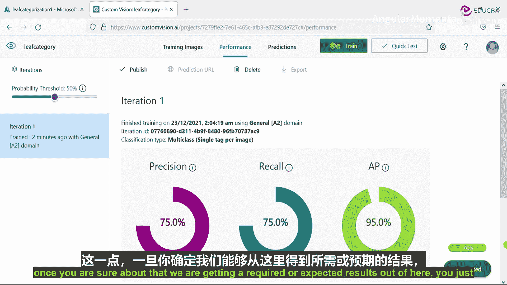

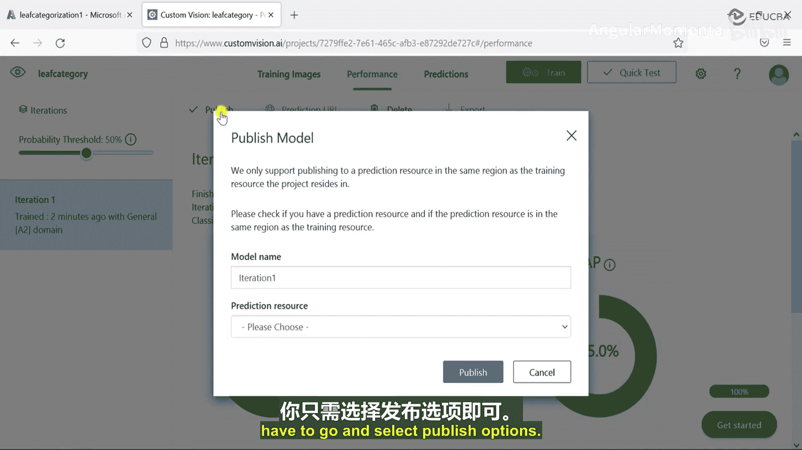

### 第六步：发布并使用预测API

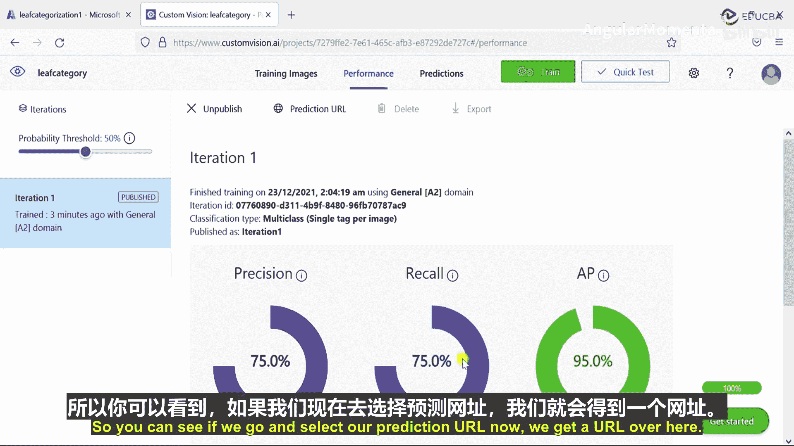

如果测试结果满意，我们就可以发布模型，并通过API在外部应用中调用它。

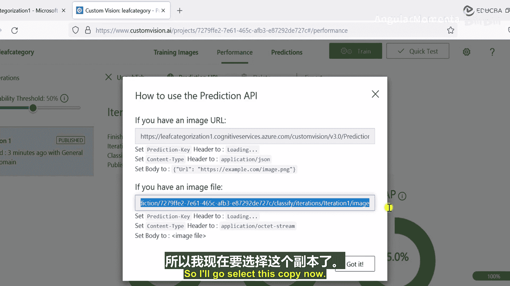

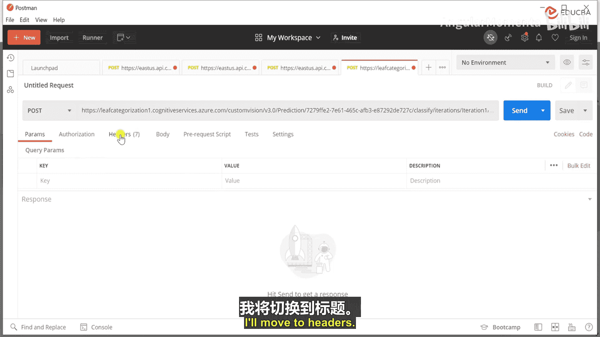

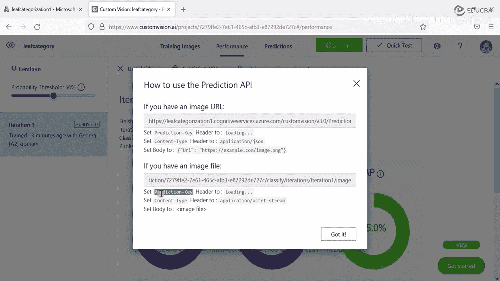

1.  点击“性能”选项卡下的“发布”按钮。
2.  为发布的模型迭代起一个名字（如`LeafModel`），然后点击“发布”。
3.  发布成功后，点击“预测URL”。你将看到两种调用方式的示例：通过图像URL或直接上传图像二进制文件。
4.  复制“如果你有图像文件”对应的URL。
5.  使用API测试工具（如Postman）进行测试：
    *   **方法**：`POST`
    *   **URL**：粘贴复制的预测URL。
    *   **Header**：
        *   `Prediction-Key`: 在自定义视觉门户的“设置”（齿轮图标）>“密钥和终结点”页面获取。
        *   `Content-Type`: `application/octet-stream`
    *   **Body**：选择`binary`，然后上传一张测试图片。
6.  发送请求后，你将收到JSON格式的响应，其中包含预测的标签和概率。

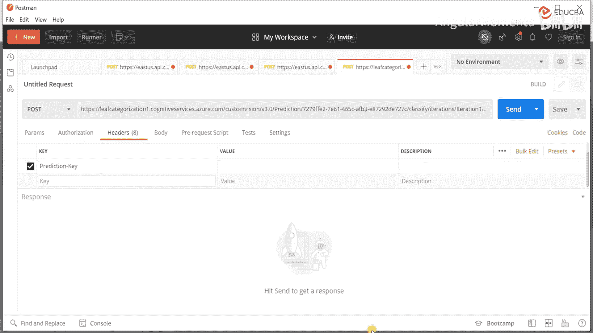

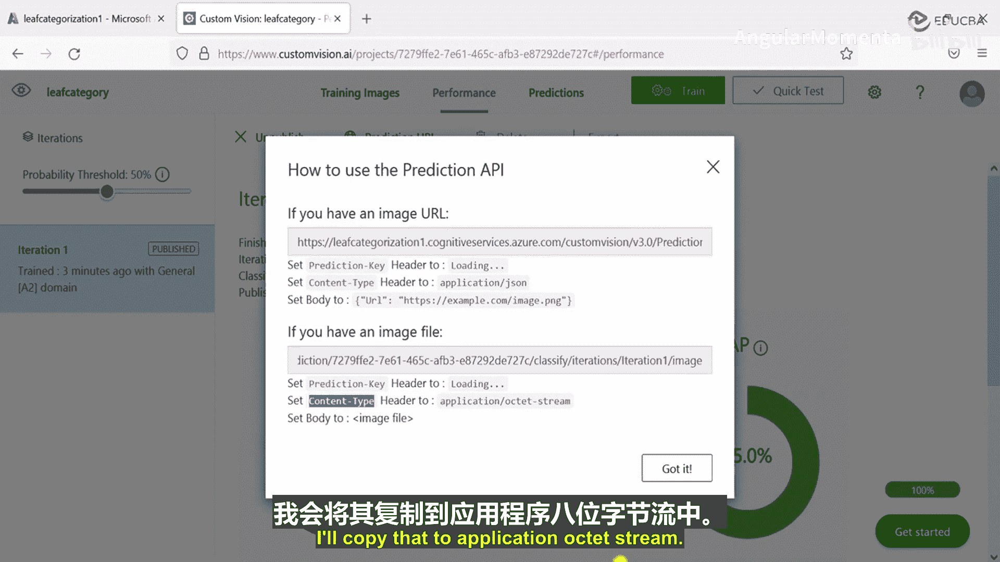

### 第七步：清理资源（重要）

为避免产生不必要的费用，实践完成后请务必清理资源。

1.  在自定义视觉门户中，进入“性能”选项卡，点击“取消发布”模型。
2.  进入“设置”（齿轮图标）>“我的项目”，找到你的项目并点击“删除”。
3.  回到Azure门户，找到你创建的自定义视觉资源，点击“删除”。

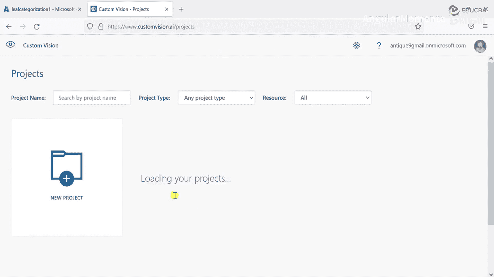

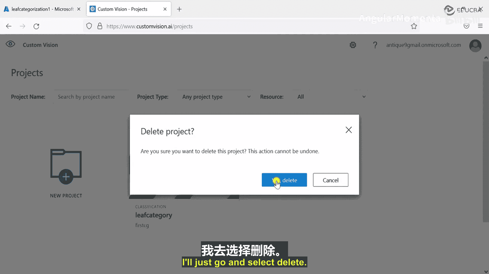

## 总结

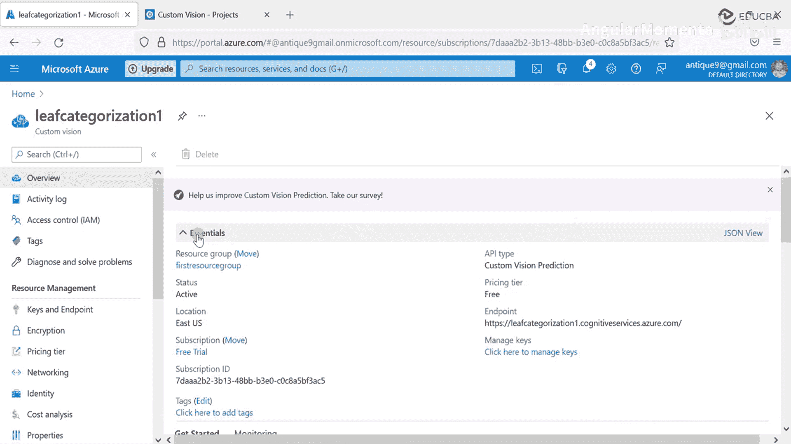

本节课中我们一起学习了Azure自定义视觉服务。我们了解到，该服务专为独特的图像分类场景而设计，它极大地简化了定制化AI模型的创建过程，使我们无需具备深厚的机器学习知识即可构建实用的分类器。通过“树叶分类器”的实践，我们完整经历了从创建资源、准备数据、训练模型、测试验证到最终通过API集成使用的全流程。记住，对于通用识别任务，可优先考虑标准计算机视觉API；而对于像区分特定产品、检测特定缺陷这类个性化需求，自定义视觉服务是你的强大工具。