# 004：形态与墨水识别器概述 🧠

在本节课中，我们将学习Azure认知服务提供的另外两种视觉服务：**视频索引器**和**表单识别器**。我们将了解它们的功能、应用场景，并通过实际操作演示如何使用这些服务。

## 视频索引器服务概述

上一节我们介绍了基础的视觉服务，本节中我们来看看视频索引器。这项服务的主要目的是为视频建立索引。它通过分析我们传入的音频和视频文件，从中提取元数据来完成这项工作。

一旦从音视频中提取出元数据，这些数据就可以用来为视频文件打上标签。以下是该服务可以提取的元数据类型：

*   **口述文字**：视频中人物所说的内容。
*   **书面文字**：视频画面中出现的文本。
*   **主题**：视频内容的核心主题。
*   **品牌**：视频中出现的品牌标识。
*   **人脸**：识别视频中出现的人物。
*   **说话者**：区分不同的说话者。
*   **情绪**：分析人物的情绪状态。

这些是从音视频文件中提取的宝贵信息。该服务能节省大量时间和人力。例如，对于一个10分钟的视频，人工提取所有元数据需要完整观看并记录。而使用此服务，只需上传视频，即可自动获取所有元数据，过程简单高效。

这项服务有多种应用方式。例如，假设我们有一个视频库，用户想搜索特定视频。如果用户提供一些元数据（如“包含天空的户外场景”），我们可以利用此服务快速找到匹配的视频。另一种方式是，我们可以上传一个样本视频，获取其元数据，然后与现有视频库进行交叉比对，从而创建智能检索系统。

## 表单识别器服务概述

在视频索引器之后，我们来了解表单识别器服务。该服务旨在从表单中提取数据和表格。

许多机构（如银行、学校）会提供需要填写的电子表格。假设我收到一份由PDF编辑器填写好的学校表格。如果需要从这些已填写的表格中提取特定的键值对信息，传统方法是人工阅读和录入。而更高效的方式是，将这些表格传递给表单识别器服务。

该服务会以键值对的格式从表单中提取数据。例如，我们通过PDF编辑器填写了一份表单。将其传入表单识别器服务后，服务会从中提取键值对信息。这样，我们就可以根据需求对数据进行索引，无需手动处理。

## 数字墨迹识别器概述

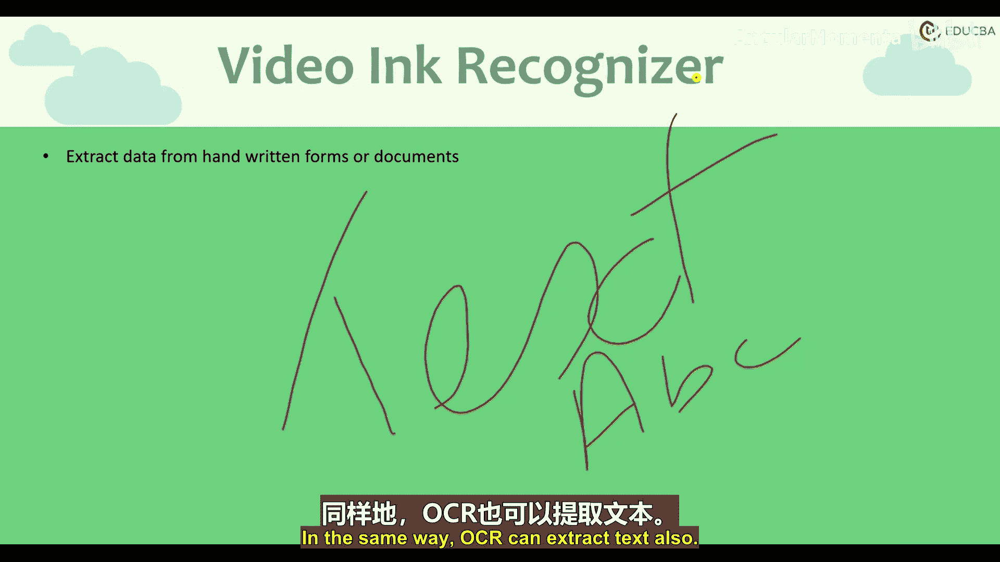

在上一部分，我介绍了如何从数字填写的表单中提取数据。但有时，人们会手动填写某些信息，例如手写文字或绘制图形。

例如，我在这里写了一些文字。这类文本需要被提取。这种特定的笔迹轨迹被称为**数字墨迹**。我们可能用鼠标在电脑上绘制了这些文字，或者画了一幅图。

数字墨迹识别器服务会接收这些笔划轨迹，并返回识别出的文本和简单形状。屏幕上有一个示例：我手写了一段文字。我的服务会读取它，并基于此返回识别结果。它处理手写文本的方式也是如此。我们甚至可以尝试上传用笔在纸上书写内容的扫描件，服务也能以同样的方式提取文本。

---

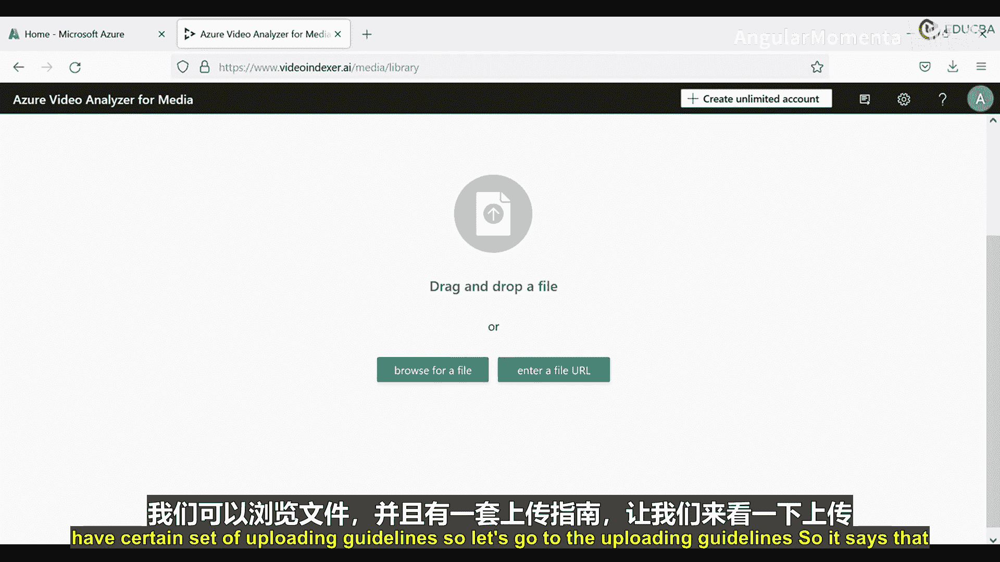

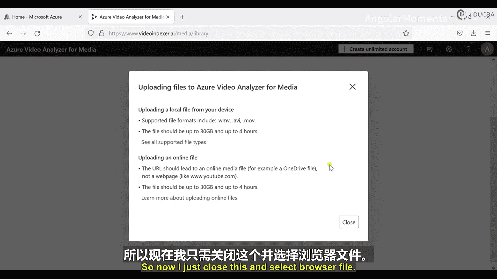

## 视频索引器动手实践

在本次实践环节，我们将对上一节介绍的视频索引器服务进行实际操作。这是我的Azure门户，但当我在此搜索“视频索引器”时，并不会显示任何相关服务。

实际上，这项服务由Azure单独提供。我们需要访问 `media.indexer.ai` 这个特定网址。进入该网站后，需要再次创建账户。我将在此创建我的第一个账户，选择使用Google账户登录。

登录后，我们可以看到Azure视频分析器服务提供的功能。这里有媒体文件、模型定制和账户设置选项。在“媒体文件”下，有库、项目和样本。这是一个示例服务配置文件。我返回“库”并选择“上传”。

在上传部分，我们可以浏览文件，并有一些上传指南。指南指出，视频不应超过4GB，并且支持特定的文件格式。

现在关闭指南，选择文件。我转到下载文件夹，这里有一些我之前下载的免费视频（这些视频目前没有音频）。等待几秒钟，视频开始上传。

可以看到，一个视频已经上传完成，现在正在被索引。我返回并选择上传另一个视频。现在第二个视频也开始上传了。

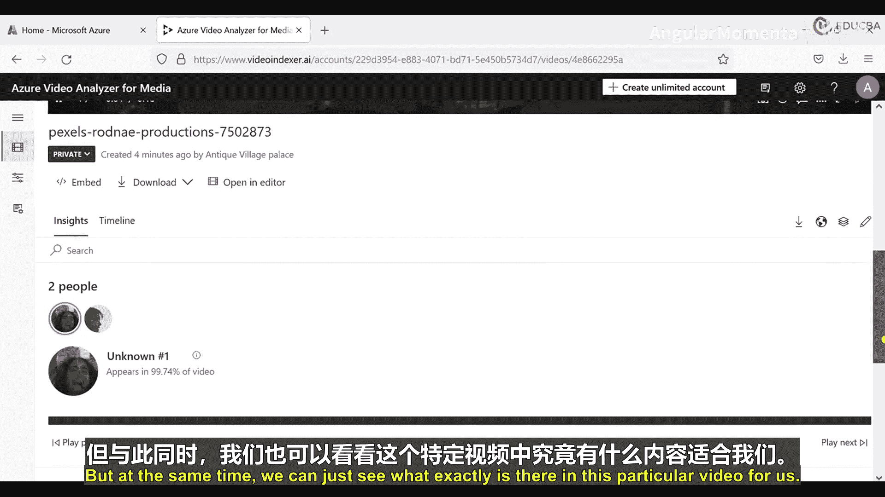

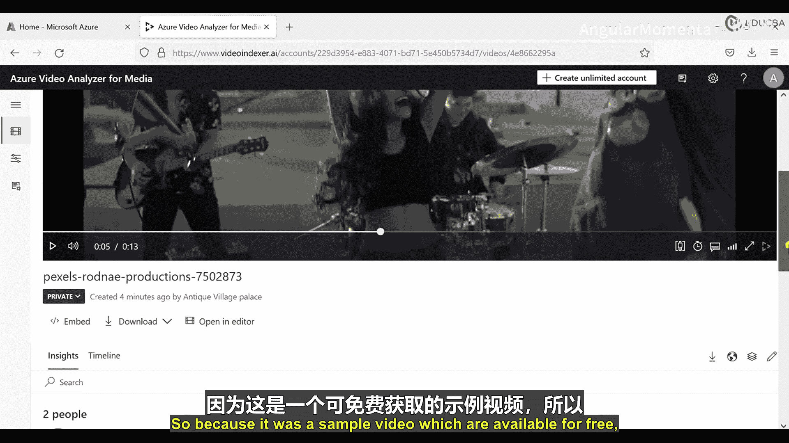

可以看到，这个视频出现在最近上传列表中，并且正在索引。同时，第一个视频的索引进度已达到30%。处理方式有两种：对于我们现在上传的小视频，索引不会花太多时间；但如果你有更大的视频，上传后，该服务会向指定邮箱发送通知，告知视频索引已完成。

目前，一个视频索引进度为53%，另一个为30%。由于视频很小，应该很快就能完成。视频索引完成后，我们可以查看提取出的各种信息。如果认为某些信息缺失，我们还可以选择重新索引这些视频。

刷新页面，可以看到其中一个视频已经完成索引。点击播放，这是一个12秒的视频。在播放的同时，我们可以看到该视频的分析结果。由于这是一个免费样本视频，我们无需购买任何版权。

根据这个视频，我们得到了一些详细信息：视频中有两个人物，以及他们在视频中出现的百分比。第二个人物出现了23.19%。我认为它没有覆盖视频中的每一个人。第一个人物（主唱）出现了199.74%（注：此处百分比可能为显示或计算误差，实际应不超过100%）。

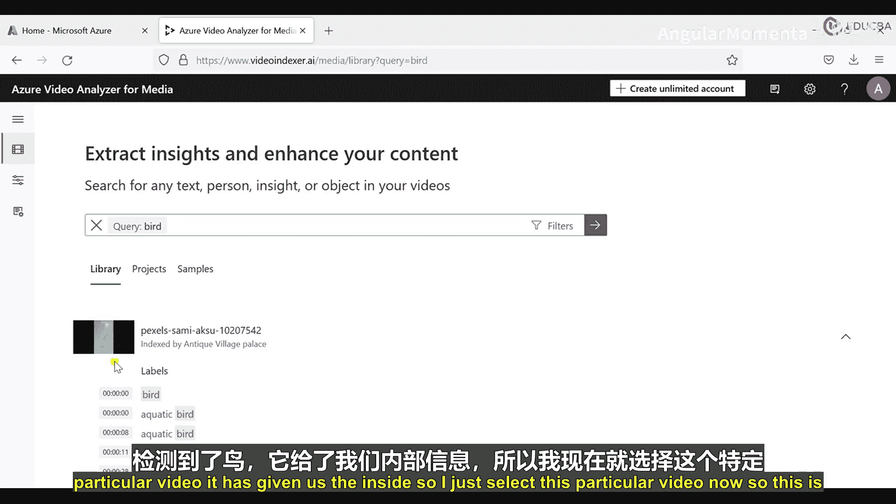

此外，服务还为我们捕获了19个标签。展开查看，包括：户外、人物、女性、天空、服装、套装、摩天大楼、人脸等。这些是基于传入视频生成的标签。还有一些被识别出的场景。这就是它为我们索引内容的方式。

我们可以选择查看不同的分析维度。这里有“洞察”、“字幕辅助功能”等选项。因为当前视频没有音频，所以没有生成字幕。我们甚至可以编辑某些内容，例如，如果想删除某个人物，也可以做到。

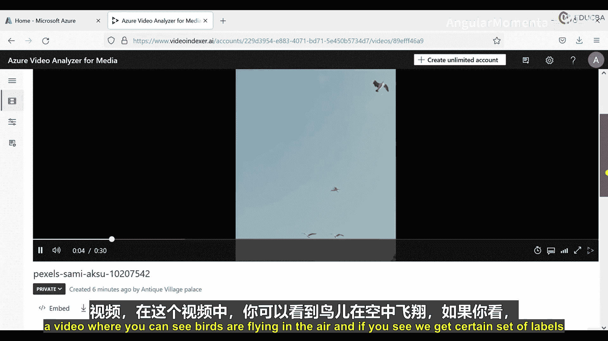

现在返回。在搜索框中，例如我搜索“bird”。可以看到，它为我们运行了查询，并指出在这个视频中出现了鸟，以及鸟在视频中被检测到的具体时间点。点击这个时间点。

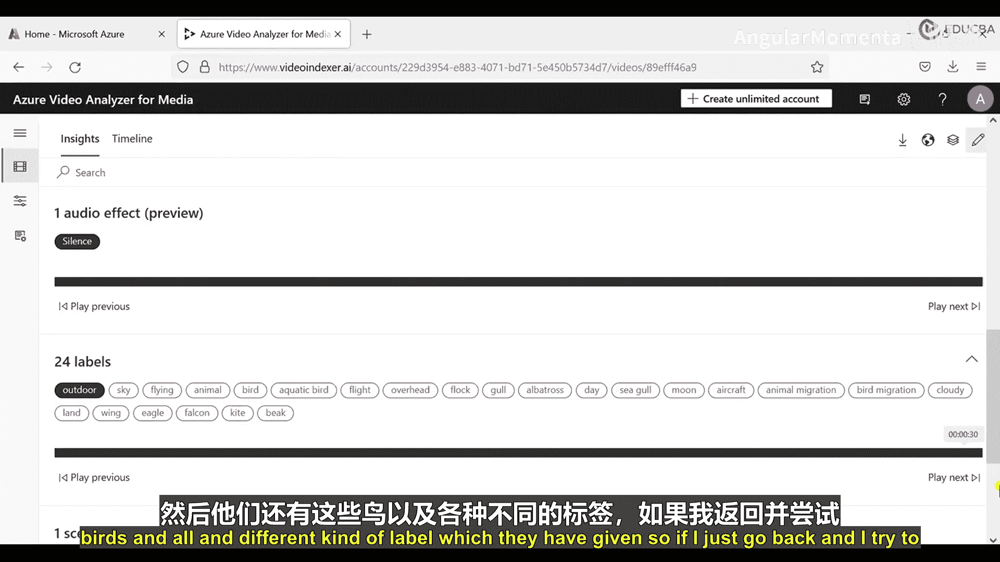

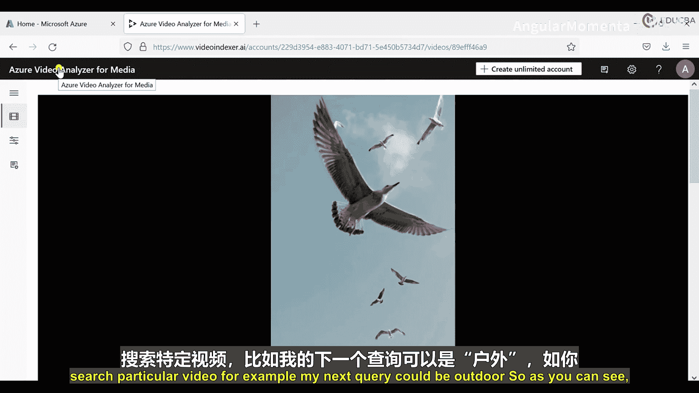

这是鸟在天空中飞翔的视频片段。同时，我们得到了一些标签：“户外”标签同样存在，还有“鸟”等不同的标签。如果我返回并尝试搜索另一个关键词，例如“outdoor”，可以看到两个视频都被检索出来了。

如果搜索“girl”，这个特定视频会被Azure视频分析器推荐。如果搜索“outdoor music”，也可以传递该查询。这就是该服务在Azure前端的工作方式。但请注意，这项服务是Azure单独提供的，有其独立的URL。你可以前往该网站创建免费账户，可以使用Google账户、Microsoft账户或其他方式登录，之后就可以按需使用这项服务了。

---

## 表单识别器动手实践

现在，我们进行表单识别器的动手实践。这是我的Microsoft Azure门户，我需要在此搜索“表单识别器”服务。

启动该服务后，需要选择“创建”。我的订阅是免费试用版。接着，需要选择资源组，我将使用在本系列课程开始时创建的初始资源组。区域选择“美国东部”。然后，需要命名，我将其命名为“demo-form-recognizer”。接下来，设置定价层，我选择免费的F0层。然后点击“下一步”。

在“网络”部分，我选择“所有网络”。“身份”部分不做更改。不添加标签。然后点击“查看 + 创建”，最后选择“创建”。部署需要一些时间。

部署完成后，可以看到我们的“demo-form-recognizer”服务。点击进入。在“概览”页面，我们可以看到服务的一些详细信息，包括位置、服务名称等。这些和我们之前操作其他服务时类似。这里还有密钥，我们将在使用服务时用到它们。

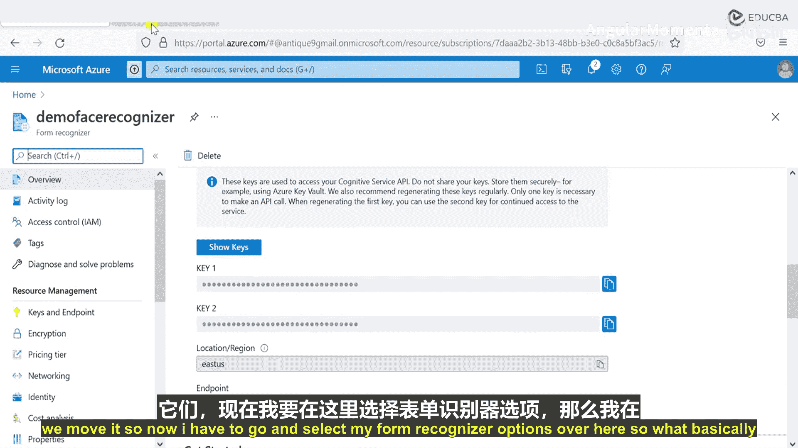

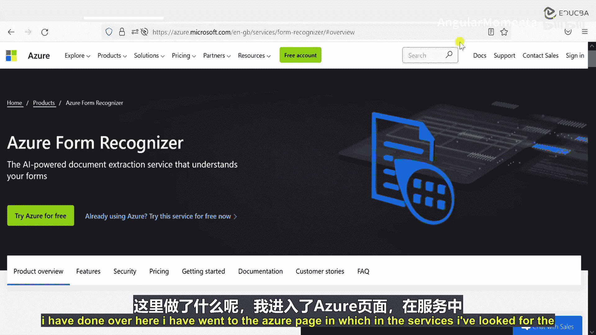

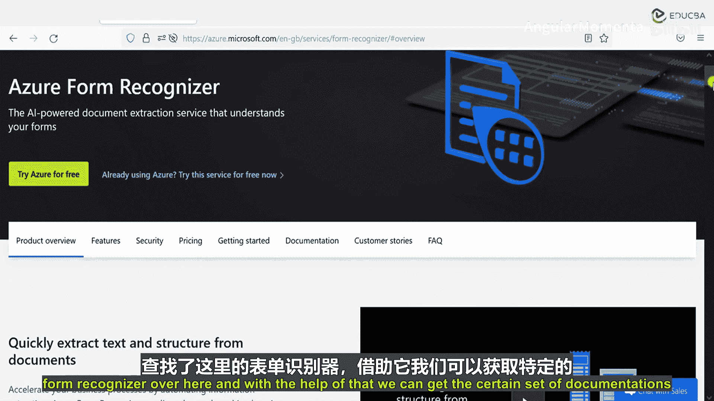

现在，我需要使用我的表单识别器。基本上，我访问了Azure页面，在服务中查找“表单识别器”，通过其文档可以了解详细信息。文档部分有点复杂：表单识别器支持两种类型，一个是表单识别器API（版本2.1），另一个是较新的、目前处于预览版的API。我们暂时不看预览版，只关注2.1版本，并尝试使用它。

我们首先获得了演示URL。文档指出，我们需要端点等信息。根据文档，因为我们使用的区域是“美国东部”，所以选择对应的端点。我提前打开了文档，这是我的实际请求URL。

我需要打开记事本，复制这个URL。页面加载可能有点慢，我们可以稍等。或者，我已经提前复制好了。URL格式是：`https://eastus.api.cognitive.microsoft.com/`，后面跟着API名称（表单识别器版本），然后是`/layout/analyze`。之后，我们需要指定传递的内容类型以及订阅密钥等。

我将打开Postman，粘贴服务URL，请求类型设为POST。转到“Headers”选项卡，需要填写详细信息。首先需要传递我的密钥。我们知道从哪里获取密钥。粘贴密钥。接着，需要选择内容类型。我将传递一个PDF文件。所以内容类型是`application/pdf`。

然后，转到“Body”选项卡，选择“binary”，然后选择文件。我选择我的演示表单文件，然后发送请求。

现在，我们得到了一个202状态码（已接受），但还没有直接的结果返回。这是因为在第一次请求中，服务会为我们提供一个唯一的标识ID。我们需要在后续请求中使用这个ID来获取结果。

要获取这个ID，我需要查看从服务返回的响应头。在响应头中，有一个名为`Operation-Location`的字段，其中包含一个唯一的标识号。我复制这个URL。

然后，在Postman中创建一个新的GET请求，粘贴这个URL。在Headers中，只需要传递订阅密钥。然后发送请求。

现在，我们得到了响应，状态是200。响应中包含诸如状态、创建时间、最后更新时间等详细信息。还有分析结果，我们使用的版本是2.1。基于每一页，都有详细的边界框信息，描述了文档中文字的位置。稍后我会展示文档。

我们继续向下看，还有文本信息。这表明服务能够扫描我们传入的文档中的所有细节。

现在，我尝试处理另一个不同的文件。这是一个演示文件。我传递这个文件。这样做的原因是，每个我们发送的请求都会获得不同的唯一ID。可以看到，我们得到了一个新的URL，其中包含一个新的ID。在发送新请求获取结果之前，可以看到这个ID与之前使用的完全不同。这就是API的工作方式：每个请求获得一个唯一ID，服务根据这个ID存储结果。

我复制这个新ID，在Postman中创建一个新的GET请求，粘贴URL，在Headers中添加订阅密钥，然后再次发送请求。

成功获得响应。这就是该服务的工作方式。在文本字段中，我们可以找到传入表单中的具体数据、所有数据内容以及它们所在的位置框。

我使用了两种表单。让我打开下载文件夹查看。这些就是我们传入的文件。这是分析结果。例如，我尝试查找与“King John Way Coffee”相关的内容。可以看到，我们找到了“Exchange”这个词。如果再往下看，找到了“$477 per year”等信息。这就是它的工作方式。

至此，表单识别器服务在Azure上的操作就完成了。我们不再需要这个服务，因此可以将其删除。

---

## 课程总结

在本节课中，我们一起学习了Azure认知服务中的两项重要视觉服务：

1.  **视频索引器**：用于自动分析视频内容，提取元数据（如文字、主题、人脸、品牌等），实现视频内容的智能检索、标签化和洞察分析。
2.  **表单识别器**：用于从结构化或半结构化的文档（如表单、发票）中自动提取文字、键值对和表格数据，将非结构化文档信息转化为可索引、可搜索的结构化数据。

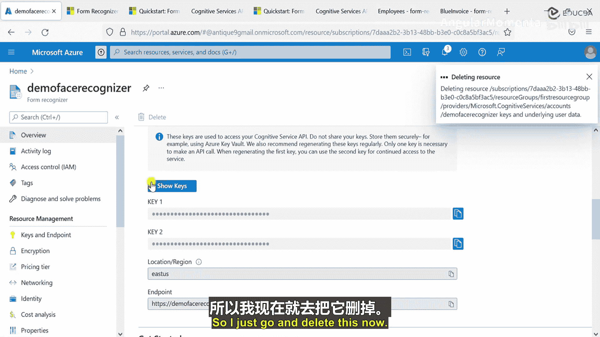

我们通过实际操作，演示了如何创建和使用这两项服务，包括上传视频进行索引分析，以及调用API处理PDF表单并提取数据。这些服务极大地自动化了内容理解和数据提取过程，为处理大量音视频和文档资料提供了高效的解决方案。