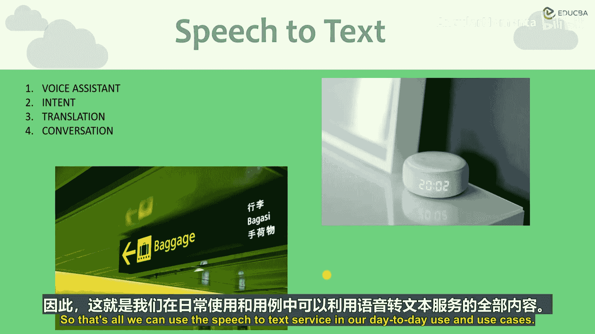
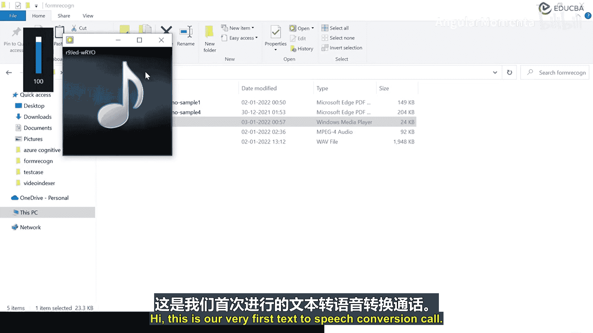
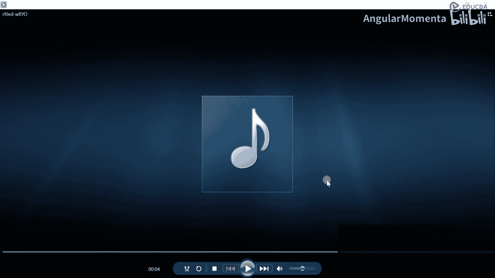

# 005：认知语音服务 🎤

在本节课中，我们将要学习Azure认知服务中的语音服务类别。我们将了解如何将语音转换为文本，以及如何将文本合成为语音，并通过实际操作演示这两个核心功能。

## 概述

上一节我们介绍了视觉类认知服务，本节中我们来看看语音服务。语音服务使我们能够处理和理解人类语音。借助这些服务，我们可以将口语转换为文本，或者将文本合成为听起来自然的语音。我们还可以翻译口语，并进行说话人验证。与视觉服务相比，此类别下的服务种类较少，主要有四种核心服务。

## 核心语音服务

以下是语音类别下的主要服务：



1.  **语音转文本**：将口语转换为文本。
2.  **文本转语音**：从文本生成听起来自然的语音。
3.  **语音翻译**：将语音从一种语言翻译成另一种语言。
4.  **说话人识别**：此服务目前处于预览阶段，不推荐用于生产工作负载。它可以用于实现未来风险功能，例如语音登录或身份验证。

让我们从语音类别下的第一个服务开始。

## 语音转文本服务 🗣️➡️📝

关于这项服务，无需过多解释，因为您可能已经确切知道它的功能。该服务接受预录制的音频文件作为输入，并输出语音对应的文字记录或文本。

**核心流程**可以表示为：
`音频文件输入 -> 语音转文本API -> 文本输出`

您可以在应用程序中使用返回的文本。发送给此API的音频文件质量越高，成功转换的几率就越大。想象一下，我们调用服务并接收回文本，那么我们可以用这些文本做什么呢？

以下是几个应用场景：
*   由于计算机无法直接处理语音，但可以处理文本，因此获取文本后，您可以存储它或将其传递给其他认知服务。
*   例如，在**语音助手**场景中：用户说话后，语音被转换为文本，然后传递给其他API。通过这些API，我们可以计算出用户的意图，从而实现语音助手功能。这正是您日常使用的语音助手（如Alexa）的工作原理。
*   您也可以将此文本传递给**翻译服务**，将一个人的语音翻译成您熟悉的语言（例如从英语翻译成法语、西班牙语等）。
*   我们甚至可以将此服务用于更传统的用例，例如**转录**。例如，您可以转录客服中心通话记录，以供未来调查使用。

这就是我们如何在日常用例中使用语音转文本服务。

---

## 实践：语音转文本

在本节中，我们将进行实际操作，尝试传递一段语音并从中提取文本数据。

1.  **创建语音服务资源**
    首先，在Azure门户中创建新的语音服务资源。
    *   搜索“认知服务”或直接搜索“语音服务”。
    *   选择“创建”并填写详细信息：
        *   **资源组**：选择现有或创建新的资源组。
        *   **区域**：选择“East US”或其他可用区域。
        *   **名称**：例如 `speech-conversion-service`。
        *   **定价层**：选择“免费F0”层。
    *   完成其他设置（网络、标签等）后，查看并创建资源。

2.  **获取访问密钥和终结点**
    资源部署完成后，进入该资源。
    *   在“密钥和终结点”部分，复制其中一个**密钥**以及**服务区域**（如 `eastus`）。稍后将用到它们。

3.  **查阅API文档**
    我们需要使用REST API调用该服务。打开Azure认知语音服务的[官方文档](https://docs.microsoft.com/azure/cognitive-services/speech-service/rest-apis)，找到“语音转文本”REST API部分。
    *   找到基本请求URL，格式通常为：
        `https://<REGION_IDENTIFIER>.stt.speech.microsoft.com/speech/recognition/conversation/cognitiveservices/v1`
    *   将 `<REGION_IDENTIFIER>` 替换为您的服务区域，例如 `eastus`。

4.  **使用Postman测试API**
    *   打开Postman，创建一个新的POST请求。
    *   **URL**：粘贴上面构建的请求URL。
    *   **Headers**：需要设置以下请求头：
        *   `Ocp-Apim-Subscription-Key`: 粘贴您的语音服务密钥。
        *   `Content-Type`: 指定音频格式。支持 `audio/wav` 或 `audio/ogg`。我们使用 `audio/wav`。
        *   （可选）`Accept`: 可以设置为 `application/json`。
    *   **Body**：选择“binary”，然后上传一个.wav格式的音频文件。
    *   发送请求。如果成功，响应体（JSON格式）中将包含识别状态和转换后的文本，例如：
        ```json
        {
          "RecognitionStatus": "Success",
          "DisplayText": "This is a sample audio file for Azure cognitive service..."
        }
        ```

---

## 文本转语音服务 📝➡️🗣️

接下来，我们看看语音类别下的第二个API：文本转语音。同样，您应该对其功能有很好的理解。您可以向该服务传递一些文本，之后它将处理该文本并返回一个生成的语音文件。您几乎可以在任何地方播放该语音文件。

这项API有几个重要的用例。最重要的是，您可以使用它来构建能够自然说话的应用程序和服务。此服务生成的语音不仅仅是单调、毫无生气的，甚至听起来也不像机器人声音。您可以从数十种声音中进行选择，包括不同口音的男声或女声。语音逼真，非机器人式。

您甚至可以更进一步，通过一种名为**SSML**的特殊XML语法来自定义语音。SSML（语音合成标记语言）是包括微软在内的许多服务提供商使用的标准标记语言。您还可以更进一步，创建自己的自定义语音。您需要做的就是录制自己的声音样本，然后将其传递给语音工作室，并基于您的声音训练一个模型。模型训练完成后，您就可以用它来生成具有自己声音特色的语音。这非常强大。

在跳转到演示之前，让我们简要概述一下实际操作如何进行。

---

## 实践：文本转语音

由于我们已在之前的会话中启动了语音服务，因此无需创建新服务。我们直接使用现有的语音服务资源。

1.  **获取身份验证令牌**
    文本转语音API的访问方式略有不同。我们需要先获取一个访问令牌。
    *   在API文档中找到“身份验证令牌服务”的URL，格式通常为：
        `https://<REGION_IDENTIFIER>.api.cognitive.microsoft.com/sts/v1.0/issueToken`
    *   在Postman中，向此URL发送一个**POST**请求。
    *   设置请求头 `Ocp-Apim-Subscription-Key` 为您的语音服务密钥。
    *   发送请求后，响应体中将返回一个**访问令牌**（一串长字符串）。复制此令牌。

2.  **获取支持的声音列表**
    *   在文档中找到“获取声音列表”的GET请求URL。
    *   在Postman中新建一个GET请求，使用该URL。
    *   设置请求头 `Authorization` 为 `Bearer <你的访问令牌>`。
    *   发送请求后，您将收到一个JSON响应，其中列出了所有支持的语言和声音（如“en-US-JennyNeural”）。记下您想使用的声音名称。

3.  **合成语音**
    *   在文档中找到文本转语音合成的POST请求URL。
    *   在Postman中新建一个POST请求，使用该URL。
    *   设置以下请求头：
        *   `Authorization`: `Bearer <你的访问令牌>`
        *   `Content-Type`: `application/ssml+xml`
        *   `X-Microsoft-OutputFormat`: 指定输出音频格式，例如 `audio-16khz-128kbitrate-mono-mp3`。
    *   在**Body**中，选择“raw”，并输入SSML格式的文本。例如：
        ```xml
        <speak version='1.0' xml:lang='en-US'>
          <voice xml:lang='en-US' xml:gender='Female' name='en-US-JennyNeural'>
            Hi, this is our very first text to speech conversion call. Thank you.
          </voice>
        </speak>
        ```
        *   将 `name` 属性替换为您在步骤2中选择的声音名称。
    *   发送请求。如果成功，响应体将是一个音频文件（二进制数据）。您可以在Postman中将其保存为 `.mp3` 或 `.wav` 文件并进行播放。

## 总结





本节课中我们一起学习了Azure认知语音服务的核心功能。我们深入探讨了**语音转文本**服务，它能够将音频内容转换为可编辑和处理的文字；以及**文本转语音**服务，它可以将文字合成为逼真、自然的语音。通过实际操作，我们分别在Azure门户中创建了服务资源，并使用Postman调用REST API成功完成了语音与文本之间的相互转换。这些服务为开发语音助手、无障碍应用、媒体转录和交互式语音响应系统等场景提供了强大的支持。