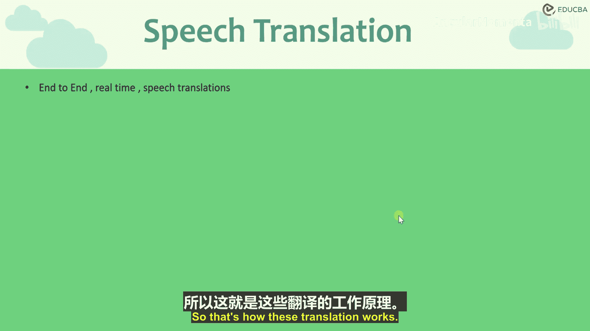
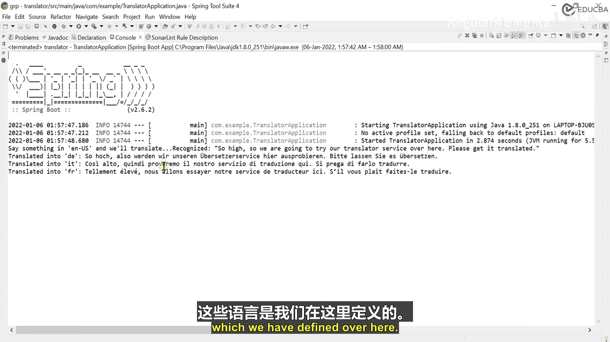
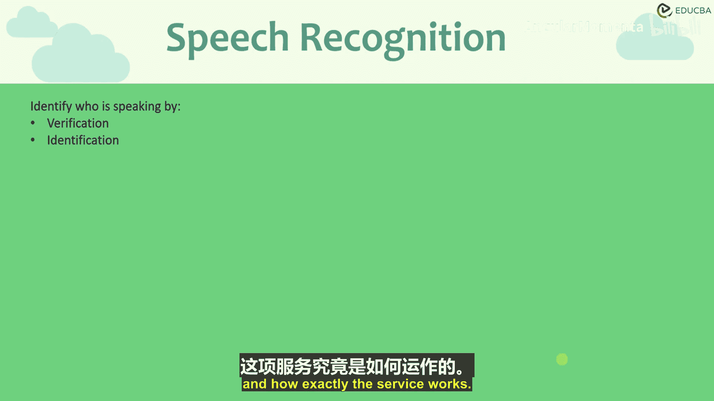
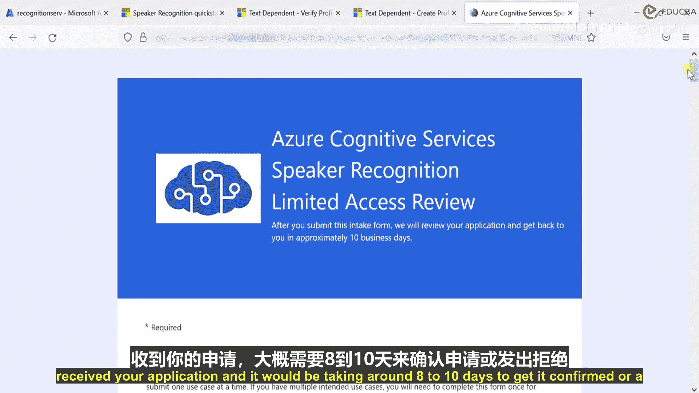
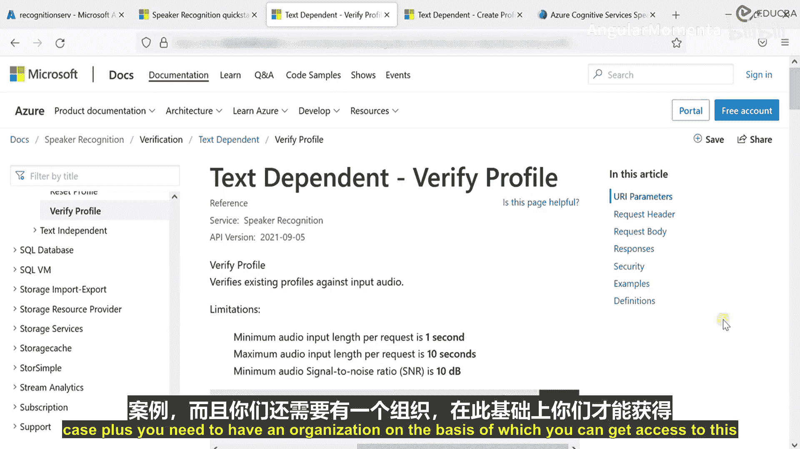

# 006：语音翻译服务概览 🎤



在本节课中，我们将要学习Azure认知服务中语音API的第三种服务：**语音翻译服务**。我们将了解它的工作原理、核心概念以及如何通过SDK实现一个简单的翻译程序。

## 概述

上一节我们介绍了文本转语音服务。本节中，我们来看看语音翻译服务。在日常生活中，我们经常听说翻译器。例如，一个人从美国搬到俄罗斯，他听到的主要语言是俄语。为了理解当地人的交流，他需要一个翻译器。这可以通过懂双语的人，或者使用翻译服务来实现。

Azure的语音翻译服务允许我们将一种语言的语音实时翻译成另一种语言的文本或语音。其核心流程是：传入一段源语言（如英语）的语音，并指定期望的输出语言（如俄语或德语），服务会根据配置返回翻译结果。

我们有两种翻译器：
*   **通用翻译器**：用于日常语言转换。
*   **自定义翻译器**：用于特定领域或行业的专业翻译。

这是一个非常强大的功能，在跨国会议等场景中已有应用。接下来，我们将学习如何利用此服务。

## 实现语音翻译服务



与之前使用的服务不同，语音翻译服务目前**不提供REST API**，我们必须使用Azure提供的**SDK**来构建服务。



以下是创建一个Java项目来实现语音翻译的步骤：

1.  **准备Azure资源**
    首先，在Azure门户中创建语音服务资源，并获取密钥和区域终结点。

2.  **创建项目并添加依赖**
    使用Spring Initializr创建一个新的Java项目。在项目的`pom.xml`文件中，添加Azure语音SDK的依赖。
    ```xml
    <dependency>
        <groupId>com.microsoft.cognitiveservices.speech</groupId>
        <artifactId>client-sdk</artifactId>
        <version>1.19.0</version>
    </dependency>
    ```



3.  **编写核心代码**
    在应用程序中，配置订阅密钥、服务区域、源语言和目标语言。
    ```java
    import com.microsoft.cognitiveservices.speech.*;
    import com.microsoft.cognitiveservices.speech.translation.*;

    public class Translator {
        public static void main(String[] args) {
            // 配置密钥和区域
            String speechSubscriptionKey = "你的订阅密钥";
            String serviceRegion = "eastus"; // 你的服务区域

            // 配置翻译：从英语翻译到德语、法语、中文
            SpeechTranslationConfig config = SpeechTranslationConfig.fromSubscription(speechSubscriptionKey, serviceRegion);
            config.setSpeechRecognitionLanguage("en-US");
            config.addTargetLanguage("de");
            config.addTargetLanguage("fr");
            config.addTargetLanguage("zh-CN");

            // 创建翻译识别器，从麦克风获取音频
            try (TranslationRecognizer recognizer = new TranslationRecognizer(config)) {
                System.out.println("请开始说话...");
                TranslationRecognitionResult result = recognizer.recognizeOnceAsync().get();

                if (result.getReason() == ResultReason.TranslatedSpeech) {
                    // 输出识别和翻译结果
                    System.out.println("识别到的文本: " + result.getText());
                    for (Map.Entry<String, String> pair : result.getTranslations().entrySet()) {
                        System.out.println("翻译到 '" + pair.getKey() + "': " + pair.getValue());
                    }
                }
            } catch (Exception ex) {
                System.out.println("发生错误: " + ex.getMessage());
            }
        }
    }
    ```
    这段代码初始化了翻译服务，设置从美式英语翻译到德语、法语和中文。它通过麦克风捕获语音，并打印出识别出的原文及各语言的翻译结果。

4.  **运行与测试**
    运行程序，对着麦克风说话（例如：“Hello, how are you?”）。控制台将输出识别出的英文文本及其对应的多语言翻译。

## 总结



本节课中我们一起学习了Azure的语音翻译服务。我们了解了它的应用场景，知道了它与之前服务的区别在于必须使用SDK进行开发。通过一个简单的Java程序示例，我们实践了如何配置服务并从麦克风输入语音，实时获得多语言翻译文本。这为构建跨语言沟通应用提供了基础。