# 007：语言服务 🧠

在本节课中，我们将要学习Azure认知服务中的语言服务。语言服务能够帮助我们的应用程序理解非结构化文本的含义，并提供了多种强大的功能，例如情感分析、文本翻译和语言理解等。我们将逐一探索这些服务，并通过实际操作来理解它们的工作原理。

上一节我们介绍了语音识别服务，本节中我们来看看认知语言服务。

在实际场景中，我们经常会遇到需要处理用户评论或留言的情况。在特定时刻，我们很难快速判断这些文本是积极的还是消极的。因此，如果我们能将这些用户评论通过某种服务进行分析并得出情感倾向，那将非常有用。Azure提供了一系列服务来满足这类需求。即使我们想创建类似Alexa或Siri这样的电子助手服务，Azure也能提供帮助。

为了解决这些需求，Azure认知服务提供了语言服务。让我们开始了解Azure认知服务语言API如何帮助你的应用程序理解非结构化文本的含义。Azure主要提供了五种类型的语言服务。

以下是Azure语言服务的五大核心功能：

1.  **情感分析**：自动检测所传入文本中的情感和观点。
2.  **翻译器**：检测并翻译超过100种支持的语言和方言。
3.  **语言理解 (LUIS)**：帮助我们将自然语言理解功能构建到应用程序、机器人和物联网设备中。
4.  **实体识别**：帮助我们从传入的文本中识别常用术语和特定领域的术语。
5.  **问答制作器**：将信息提炼成易于导航的问答形式。

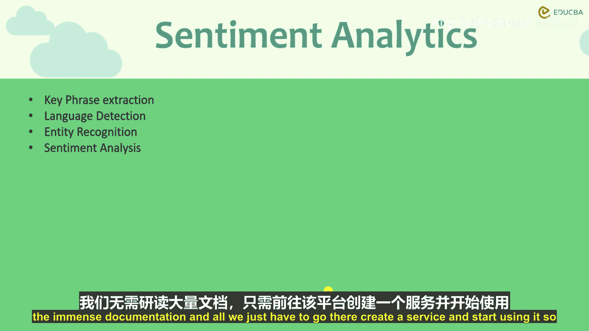

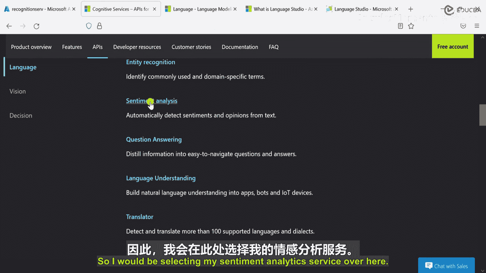

## 情感分析服务 😊😐😠

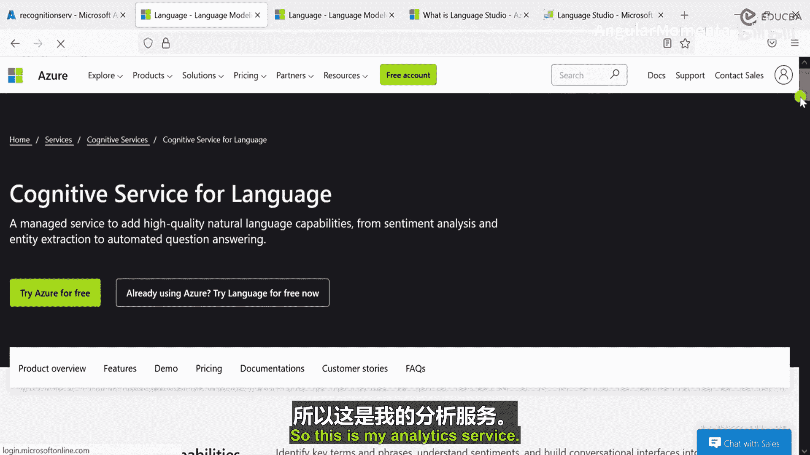

首先，我们来了解语言类别下的第一个服务：情感分析。你可以使用这项服务从文本中提取信息，找出所传入文本的情感倾向。

想象你是一家电子商务网站的店主。了解客户对你所售产品的感受对你的业务至关重要。通过情感分析，你可以发现客户是满意还是不满意，并立即采取行动。此外，该服务还可以从文本中提取关键短语，这些短语可能包括公司或事件的名称。情感分析API还能识别你传入文本的语言，这一点非常重要，因为知道了文本语言后，你可以将其传递给翻译器服务进行翻译。最后，它还能从文本中提取命名实体，包括人物、组织、名人和著名地点等名称。

### 在Azure平台上的实践操作

我们不需要一直使用Postman来调用API，因为对于情感分析乃至整个Azure语言服务，Azure提供了一个完全不同的平台来访问这些服务。该平台最终也会提供如何通过URL访问这些服务的方法，因此我们无需深入研究大量文档，只需前往该平台创建服务并开始使用即可。

这是我的Azure页面，我已经选择了认知服务产品。向下滚动，我们在左侧找到了语言服务。点击进入后，可以看到语言服务下的各项服务。我在这里选择情感分析服务。

进入我的分析服务页面后，向下滚动可以看到一个“演示”部分，但演示中只有一些视频。因此，我将转到文档部分。

在文档中，有一个快速入门指南。Azure提供了一个名为“语言工作室”的平台，我们将在这个平台上试验这项服务，因为它提供了比之前使用的Azure界面更简单的操作方式。我在新标签页中打开它。

首次访问语言工作室时，你需要创建一些凭证，登录你的Azure账户，然后选择免费或付费定价层。创建完成后，系统会要求你创建一些资源。我们不会创建新的，直接使用现有资源。向下滚动，找到“分析文本”服务，点击进入。

在试用部分，系统提示我们选择首选语言，我选择英语。这是我首次登录语言工作室时创建的Azure资源，其创建方式与在Azure门户中创建资源类似。

现在，我们需要输入一些文本来测试。有两种方式可以操作。首先，我输入一句话：“I went I like the food.” 然后点击运行服务。

服务将以两种方式提供结果：第一种是更易于用户阅读的常规结果；第二种是JSON格式的结果，当我们通过URL发送实际请求时会得到这种格式。结果显示，我们传入的句子有94%是积极的，5%是中性的，1%是消极的。它甚至指出了我们谈论的内容：评估对象是“food”，评估是“like”。

如果你想尝试更多文本，可以点击“尝试示例”。示例文本描述了一次就餐体验，其中包含一些负面句子，但整体段落是积极的。运行评估后，结果显示86%是积极的，14%是消极的。你可以查看每个句子的评估目标和情感倾向。例如，最后一个负面句子的评估是“The only complaint I have is the food didn‘t come fast enough.” 这就是情感分析服务的工作方式。

如果想查看JSON格式的结果，可以切换到JSON视图。结果显示这是一个混合情感的句子，并给出了置信度分数。例如，第一个负面情感是关于食物上得慢的抱怨，第二个正面情感是“Overall I highly recommended”。

如果你想通过REST API访问这些服务，可以看到这里定义了cURL POST命令。由于服务运行在美国东部区域，端点类似 `https://eastus.api.cognitive.microsoft.com/...`。我们可以复制这个命令到Postman中使用。请求头中需要设置 `Content-Type: application/json` 和 `Ocp-Apim-Subscription-Key`（你的密钥）。在请求体中传入JSON格式的文本数据。发送请求后，我们得到了200 OK响应和相应的分析结果。这就是情感分析服务的工作原理。

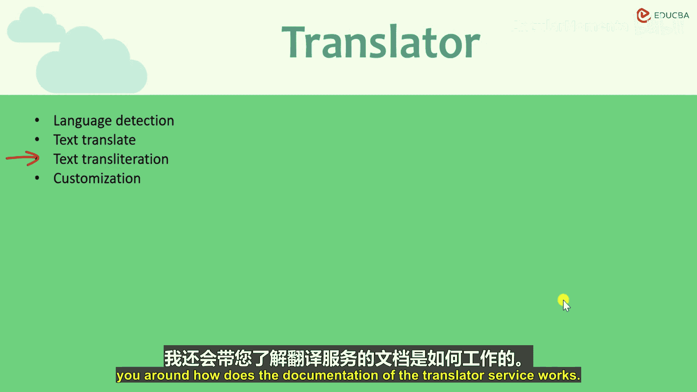

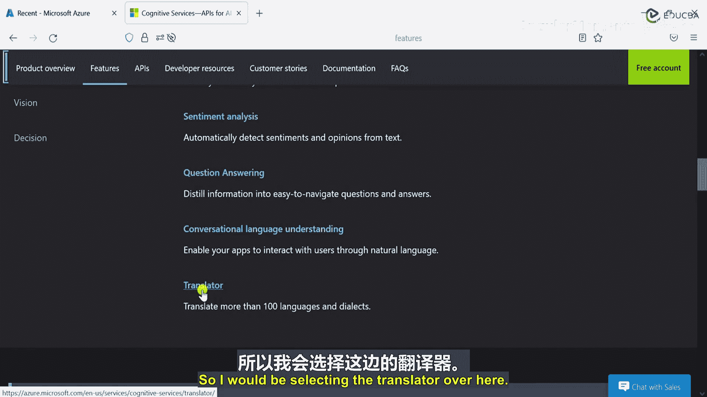

## 翻译器服务 🌐

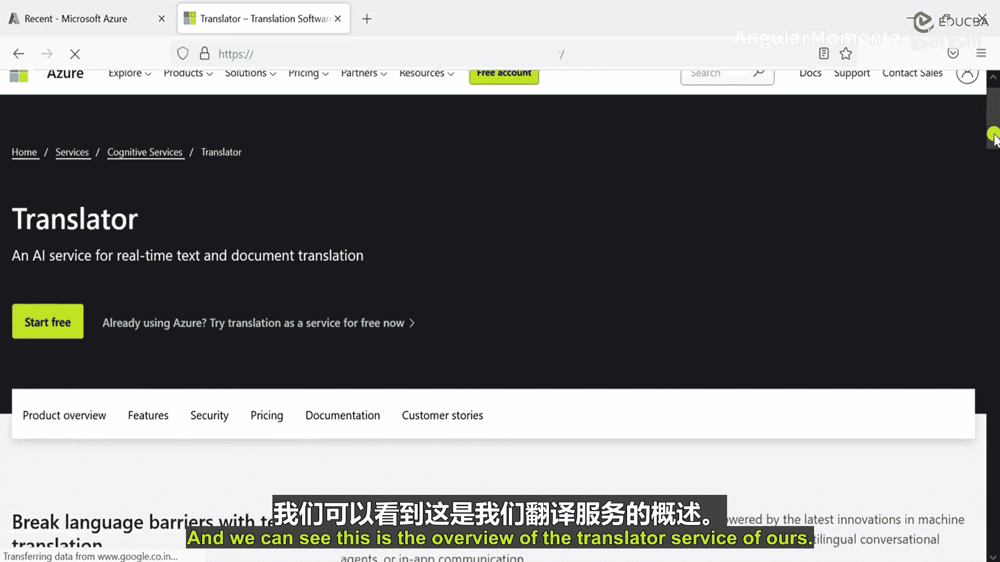

接下来介绍语言服务类别下的第二个服务：翻译器服务。我们对其功能已经有了很好的了解。

首先，你可以使用该服务检测文本的语言。检测语言非常重要。检测到语言后，你可以继续将文本传递给该服务下的另一个API，即文本翻译API。这个API接收文本并将其翻译成目标语言。该服务还允许你获取其他语言短语的发音。我们稍后会看一个例子。

翻译器文本API非常适合日常场景。然而，你也可以创建自定义的翻译器服务，针对你的特定领域或行业进行定制。因为一些翻译模型可以很容易地使用非结构化文档（如手册或网站）来创建或训练。我们也会看一下这部分。

在接下来的实践环节，我将向你展示这项服务具体如何工作，如何部署翻译器服务，以及我们如何实际使用它。我还会带你了解翻译器服务的文档。

这是我的Azure页面，我已经打开了Azure认知服务。向下滚动到底部，我们可以看到认知服务部分提供的不同服务。在语言部分，我寻找并选择“翻译器”。

这是翻译器服务的概览页面。现在我们需要查看其文档。我点击打开文档。

这是Azure翻译器服务的整体文档，提供了不同种类的文档说明。现在，我需要部署一个服务并开始使用。

为此，我将在左侧的“文本翻译”下选择“参考”部分。然后我们将使用API，这里我选择文本翻译REST API。

这是我的文本翻译API页面。同时，Azure门户也打开了。这里已经有一个我之前创建的翻译器服务。我们也可以创建一个新的服务。我搜索“翻译器”，然后点击“创建”。

选择资源组，我使用第一个资源组。然后选择区域，我使用“美国东部”。服务名称定为“SampleTranslator”。接着选择定价层，由于这里不提供免费层，我选择“标准S1”层。点击“查看 + 创建”，系统正在验证我的配置。确认无误后，点击“创建”。

在服务创建期间，我们回到文档部分。这是文本翻译的参考页面，我们有“获取语言”和“翻译”等选项。我们将只使用翻译部分。向下滚动到快速入门，我选择“翻译”。

这是我的主要翻译URL，我将复制它并在Postman中使用。我打开Postman，粘贴URL。我的API版本是3.0。

现在我们需要定义一些请求参数。一个是API版本，我们已经添加了。我们还需要定义目标语言，我选择“de”（德语）。还有其他可选参数，我们暂时不使用。

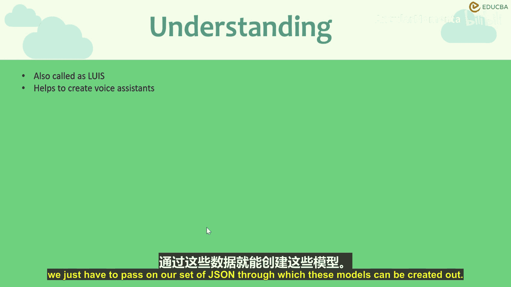

接下来是请求头部分。这有点复杂。我在新标签页中打开头信息示例。复制 `Content-Type: application/json` 并粘贴到Postman的Headers中。然后我们需要查看认证部分，它提到了 `Ocp-Apim-Subscription-Key`。我复制我的订阅密钥并粘贴到Header中。我们之前也复制过订阅密钥，都知道如何获取：在Azure中选择服务，然后进入“密钥和终结点”。

我们还需要在Header中定义订阅区域，因为我们在美国东部区域工作，所以添加 `Ocp-Apim-Subscription-Region: eastus`。我们目前没有任何持有者令牌，所以不需要授权头。

现在我们需要一些文本内容。可以从文档中复制一个示例。转到Body部分，选择“raw”，类型为JSON，粘贴示例文本。注意，请求方法需要是POST。发送请求。

如你所见，它首先完成了语言检测，指出文本是英语，置信度为1。然后它为我们进行了翻译。这就是这项服务的工作原理。为了验证它工作正常，我可以复制翻译后的德语文本，将其作为输入，目标语言改为“en”（英语），再次发送请求。结果显示检测到的语言是德语，并成功翻译回了英语，文本内容与最初传入的相同。这就是翻译器服务的工作方式。

## 语言理解服务 (LUIS) 🤖

在翻译器服务之后，语言类别下还有一个极其有用的服务，称为语言理解服务，也常被称为LUIS。

这项服务可以帮助我们从文本输入中提取内容，进而用于许多其他有用场景，例如为我们创建语音助手。借助LUIS，我们可以尝试从传入的实际上下文中提取短语。

例如，有一个用户发出“打开灯”或“关闭灯”的命令。在没有机器学习或智能助手的情况下，我们必须为应用程序编写硬编码的逻辑。但即便如此，如果用户的输入有细微变化，例如有人说“请把灯关掉”，应用程序可能还能处理。但如果有人说“把灯调暗”，我们就必须确保我们的硬编码逻辑能够理解人们可能使用的所有表达方式，这并不容易。

LUIS可以帮助我们解决这个问题。在LUIS中，我们创建一组高度可定制的模型。模型创建后，我们训练它们，然后部署这些模型供我们使用。为了让我们更轻松，Azure提供了LUIS门户，通过它我们可以更容易地完成这些工作。在LUIS门户中，我们只需要传入我们的JSON数据，通过这些数据就可以创建出模型。

在本节中，我们将进行实践操作：我将创建一个Python应用程序，通过它创建一个模型，然后让该模型在LUIS服务上进行训练和发布，接着我们将传入一段文本，尝试从中提取某些上下文。

为此，我将创建一个Python应用程序。在本节中，我们只创建应用程序；在下一节，我将进入LUIS门户，从那里获取凭证并传入我们的应用程序，向你展示应用程序如何工作。

现在我将使用Visual Studio。首先创建一个目录，命名为“quicksstart”。进入该目录，创建一个Python文件。

现在我需要安装一些库。我将安装一些Azure基础库。使用pip命令安装 `azure-cognitiveservices-language-luis` 等库。安装完成后，我们就可以开始使用了。

我打开文件夹，选择“quicksstart”目录。这里可以看到一些文件。现在我需要添加一些依赖项。我将从 `azure.cognitiveservices.language.luis.authoring` 导入 `LUISAuthoringClient`，并从 `azure.cognitiveservices.language.luis.runtime` 导入 `LUISRuntimeClient`。同时还需要导入 `msrest.authentication` 进行认证。

之后，还需要导入 `json`、`time` 和 `uuid`。

依赖项导入完成后，我们开始构建代码。首先定义一个 `quickstart` 函数。在函数内，创建一些变量，如 `authoring_key`（暂时为空，将从LUIS门户获取）、`authoring_endpoint`、`prediction_key` 和 `prediction_endpoint`。

接着，使用 `uuid` 生成一个唯一ID，与基础应用名拼接，以避免名称冲突。版本ID设为“0.1”。意图名称设为“OrderPizza”。

然后，使用 `CognitiveServicesCredentials` 和 `authoring_key` 授权创建 `LUISAuthoringClient`。用这个客户端和 app 名称、版本ID 来创建应用，并获取 `app_id`。

之后，使用 `client.model.add_intent` 添加我们定义的意图。接着，添加实体（entities）。我们添加一个机器学习实体定义，包括“PizzaOrder”以及其子实体如“数量”、“大小”、“类型”和“配料”。同时，创建一个短语列表以提升实体识别。

然后，添加带标签的示例话语（labeled example utterances）。这些示例将意图与实体关联起来，用于训练模型。例如：“I want to order a large pizza with extra cheese.” 其中，“large” 被标记为“大小”实体，“extra cheese” 被标记为“配料”实体。

添加完示例后，调用 `client.train.train_version` 开始训练模型。我们使用一个while循环来检查训练状态，每隔10秒查询一次，直到所有模型训练完成。

训练完成后，调用 `client.apps.update_settings` 将 `is_public` 设为 `True`，然后调用 `client.apps.publish` 发布该版本的应用。

发布后，我们使用 `prediction_key` 和 `prediction_endpoint` 创建 `LUISRuntimeClient`。然后，使用这个运行时客户端，通过 `prediction.get_slot_prediction` 方法传入一个测试查询（例如：“I’d like to order two small pizzas with more salsa.”）来获取预测结果。

最后，打印出预测结果中的顶级意图及其置信度，以及识别出的所有实体。完成后，我们调用 `client.apps.delete` 清理资源，删除创建的应用。

这就是使用Python应用程序创建LUIS应用的基本流程。我们创建了多个函数：第一个用于创建应用，之后基于此创建和训练模型，然后发布模型，最后传入测试短语进行预测。

这是我的LUIS门户。如你所见，我已经登录并创建了一个名为“PizzaApp”的应用。你可以通过点击“新建应用”来创建应用，输入应用名称并选择区域（我使用了“美国西部”区域）。

进入我的PizzaApp应用。目前还没有创建任何意图。但有一个“管理”部分。进入“管理”部分，我们可以获取所需的密钥和终结点。这里有预测资源和创作资源的主密钥，以及终结点URL。由于我们使用的是美国西部区域，创作和预测资源的终结点URL是相同的。

我已经在我的应用程序中进行了相应的更改，添加了密钥。现在，我只需要运行我的应用程序。我选择运行选项卡，然后选择“开始执行(不调试)”。

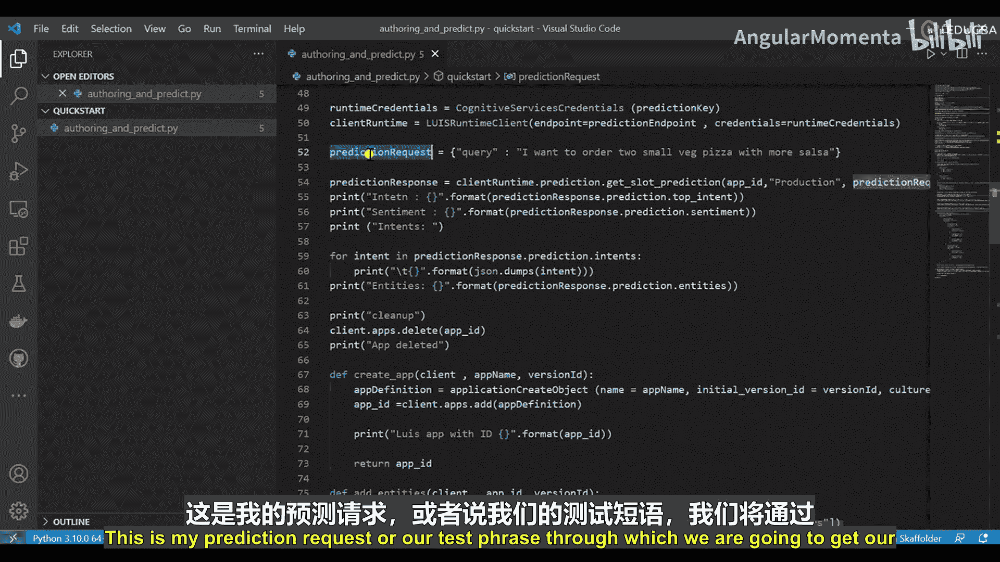

现在可以看到终端打开了。它正在运行Python应用程序。它显示正在使用特定ID创建LUIS应用程序。然后，基于我们创建的带标签的示例话语，它正在为我们创建和训练模型。它说正在等待10秒以训练模型。

之后，它显示模型已训练完成。然后，它显示我们的意图是“OrderPizza”。基于我们传入的查询（“我想要一个小号披萨”），它说用户情感为“无”，但意图是订购披萨。最终，它清理了我们的应用程序并将其删除。

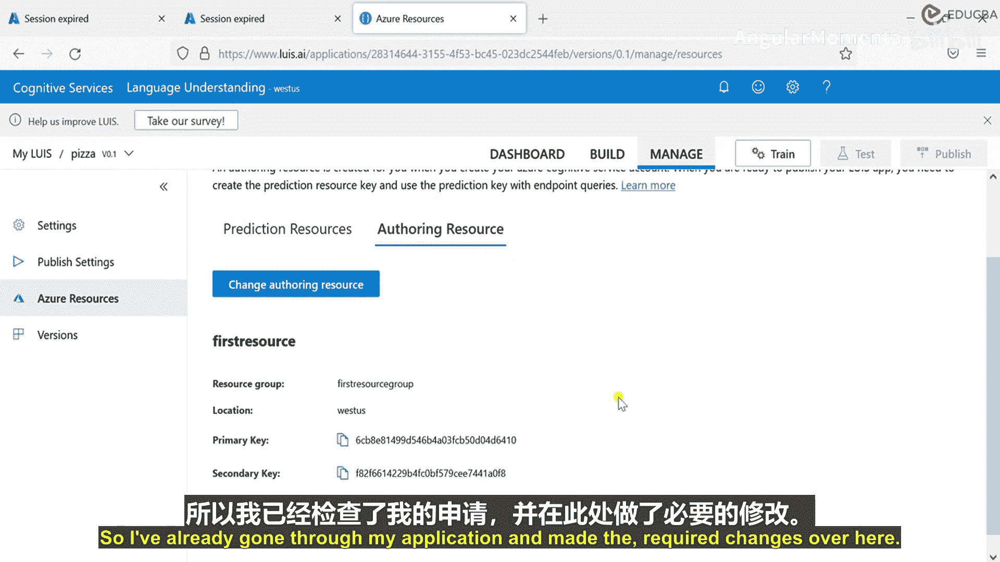

这就是如何使用基本的Python应用程序创建LUIS应用。如果需要，我们也可以在仪表板中创建特定的模型，然后通过仪表板训练它们，最后发布并通过REST API开始使用。这就是LUIS应用程序的工作方式。

---

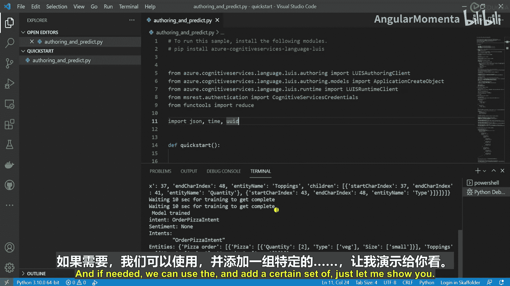

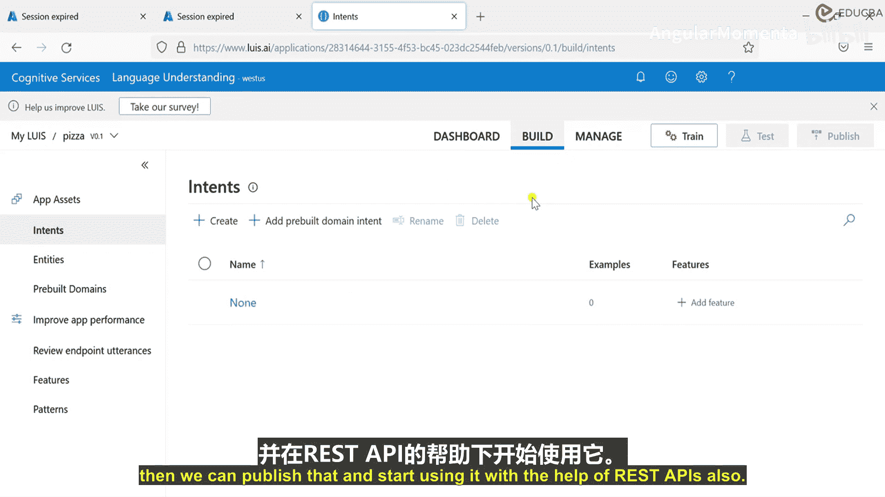

**本节课中我们一起学习了** Azure认知服务中的语言服务，包括情感分析、翻译器和语言理解(LUIS)三大核心服务。我们了解了每项服务的基本概念、应用场景，并通过实际操作在Azure语言工作室和本地Python环境中体验了服务的使用流程。这些服务能够极大地增强应用程序处理和理解自然语言的能力。