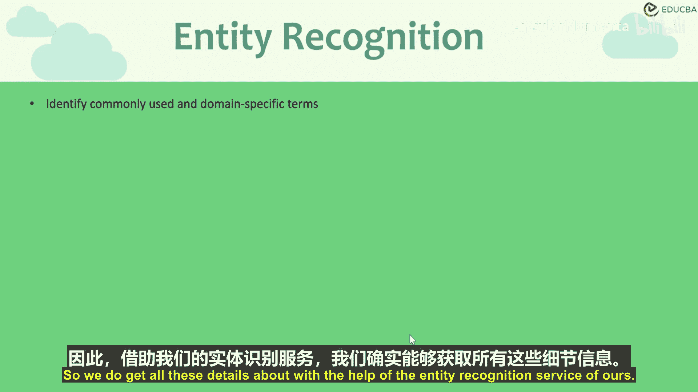
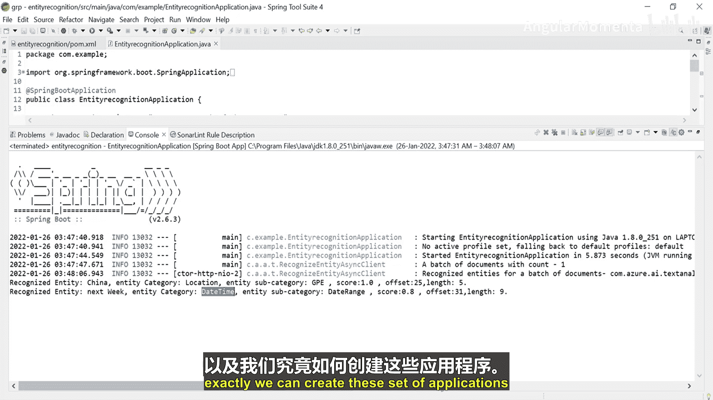

# 008：实体识别服务 🧠

在本节课中，我们将学习Azure认知服务中的**实体识别**功能。我们将了解其核心概念，并通过一个Java Spring Boot应用实例，演示如何调用该服务从文本中提取关键信息。

---



## 概述

实体识别服务是Azure认知服务中语言服务的一部分。它利用云端的机器学习和算法，帮助开发者构建涉及书面语言的智能应用。该功能的主要作用是**识别并分类非结构化文本中的实体**，例如人物、地点、组织、数量、日期范围和事件等。

上一节我们介绍了认知服务的整体框架，本节中我们来看看如何具体使用其中的实体识别功能。

---

## 创建Java Spring Boot应用

我们将创建一个基于Spring Boot的Java应用程序。Spring Boot能帮助我们更轻松地管理项目依赖。

以下是创建项目的基本步骤：

1.  选择创建一个新的Spring Starter项目。
2.  将项目命名为 `EntityRecognition`。
3.  完成项目创建，等待基础结构生成。

项目创建完成后，我们需要在 `pom.xml` 文件中添加必要的依赖。

---

## 配置项目依赖

为了使用Azure的文本分析服务，我们需要在 `pom.xml` 中添加相应的依赖库。

以下是需要在 `pom.xml` 的 `<dependencies>` 部分添加的内容：

```xml
<dependency>
    <groupId>com.azure</groupId>
    <artifactId>azure-ai-textanalytics</artifactId>
    <version>5.1.0</version>
</dependency>
```
添加依赖后保存文件，项目会自动构建。

---

## 编写应用程序代码

现在，我们开始编写主要的应用程序逻辑。首先，我们需要从Azure门户获取访问服务所需的密钥和终结点URL。

### 1. 声明静态变量

在 `main` 方法所在的类中，声明两个静态变量来存储密钥和终结点。

```java
private static String KEY = “你的Azure服务密钥”;
private static String ENDPOINT = “你的Azure服务终结点URL”;
```

### 2. 创建文本分析客户端

在 `main` 方法中，我们需要创建 `TextAnalyticsClient` 的实例来与服务进行身份验证和通信。

```java
public static void main(String[] args) {
    TextAnalyticsClient client = authenticateClient(KEY, ENDPOINT);
    recognizeEntitiesExample(client);
}
```

### 3. 实现身份验证方法

创建一个名为 `authenticateClient` 的方法来构建并返回客户端实例。

```java
static TextAnalyticsClient authenticateClient(String key, String endpoint) {
    return new TextAnalyticsClientBuilder()
            .credential(new AzureKeyCredential(key))
            .endpoint(endpoint)
            .buildClient();
}
```

### 4. 实现实体识别方法

创建一个名为 `recognizeEntitiesExample` 的方法，用于发送文本进行分析并打印结果。

```java
static void recognizeEntitiesExample(TextAnalyticsClient client) {
    String textToAnalyze = “I would be traveling to China next week.”;
    
    for (CategorizedEntity entity : client.recognizeEntities(textToAnalyze)) {
        System.out.printf(
            “实体: %s, 类别: %s, 子类别: %s, 置信度: %.2f, 偏移量: %d, 长度: %d%n”,
            entity.getText(),
            entity.getCategory(),
            entity.getSubcategory(),
            entity.getConfidenceScore(),
            entity.getOffset(),
            entity.getLength()
        );
    }
}
```

---

## 在Azure门户创建语言服务

在运行应用程序之前，我们需要在Azure门户上配置相应的认知服务资源。

以下是创建服务的步骤：

1.  在Azure门户中，选择“创建资源”。
2.  搜索并选择“语言服务”。
3.  选择你的订阅和资源组。
4.  将服务命名为 `EntityRecognitionTest`。
5.  选择定价层（例如免费层 `F0`）。
6.  审阅并创建服务。
7.  部署完成后，进入该资源。
8.  在“密钥和终结点”部分，复制 **密钥1** 和 **终结点** URL，并粘贴到代码的静态变量中。

**注意**：免费层可能限制同时只能有一个同类型服务。如果创建失败，请检查是否已有其他免费服务在运行。

---

## 运行与结果分析

配置完成后，运行Spring Boot应用程序。控制台将显示应用程序启动日志。

稍等片刻，服务会连接到云端并返回分析结果。对于示例句子 “I would be traveling to China next week.”，输出可能如下：

```
实体: China, 类别: Location, 子类别: GPE, 置信度: 1.00, 偏移量: 23, 长度: 5
实体: next week, 类别: DateTime, 子类别: DateRange, 置信度: 0.80, 偏移量: 29, 长度: 9
```

**结果解读**：
*   **China** 被识别为 `Location`（地点）类别，子类别是 `GPE`（地缘政治实体），置信度得分为1.00（即100%确定），在文本中从第23个字符开始，长度为5。
*   **next week** 被识别为 `DateTime`（日期时间）类别，子类别是 `DateRange`（日期范围），置信度得分为0.80（即80%确定），在文本中从第29个字符开始，长度为9。

---

## 总结



本节课中我们一起学习了Azure认知服务的实体识别功能。我们了解了该服务可以自动从文本中提取并分类关键实体。通过一个完整的Java Spring Boot项目实践，我们掌握了如何配置Azure资源、添加SDK依赖、编写代码调用服务，并成功从示例句子中识别出了地点和日期范围实体。这个功能是构建智能文本处理应用的重要基础。