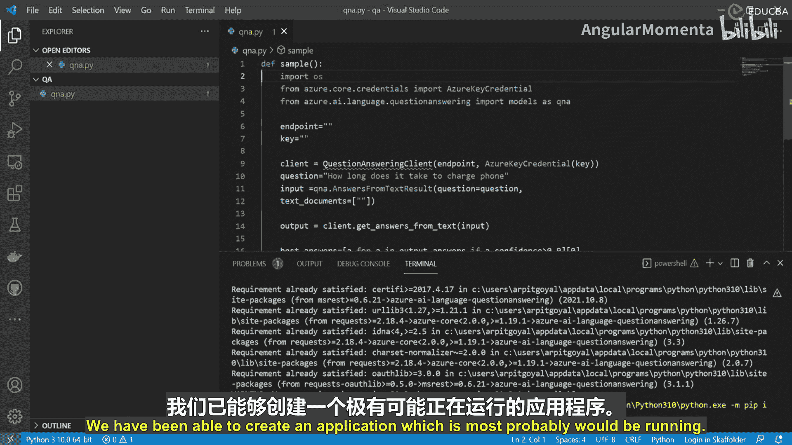
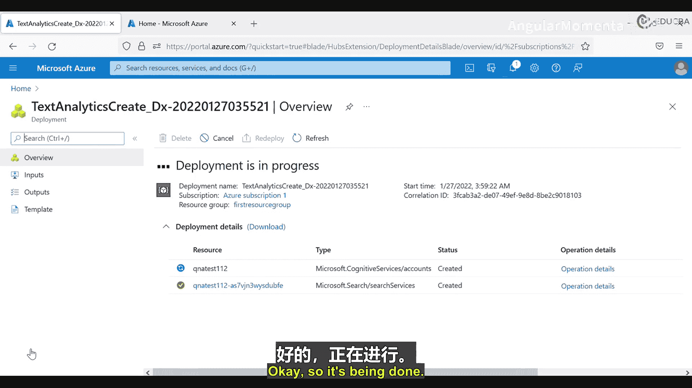
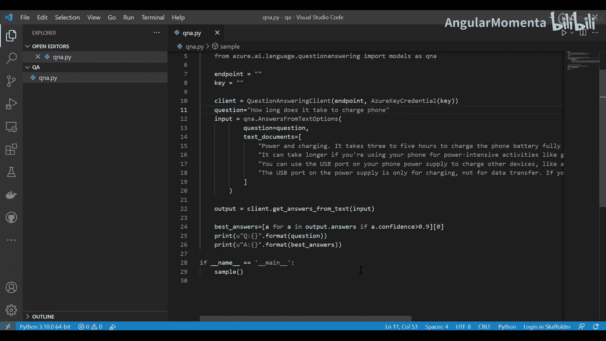
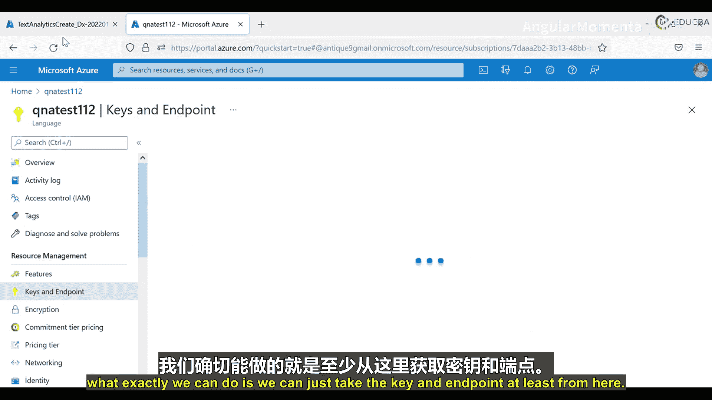
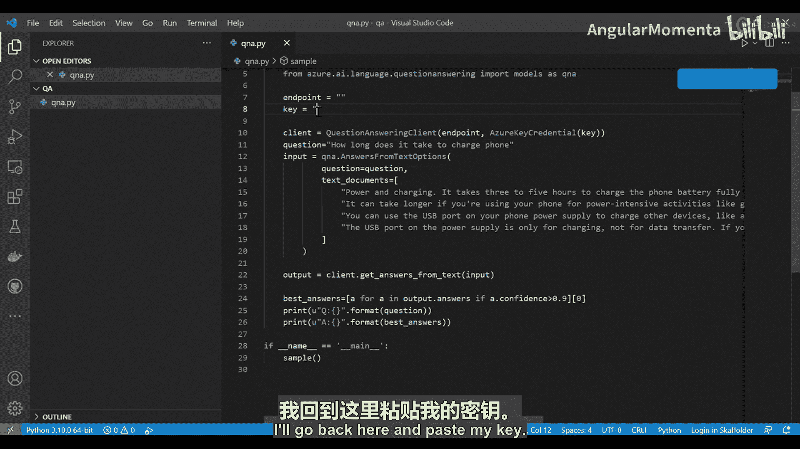
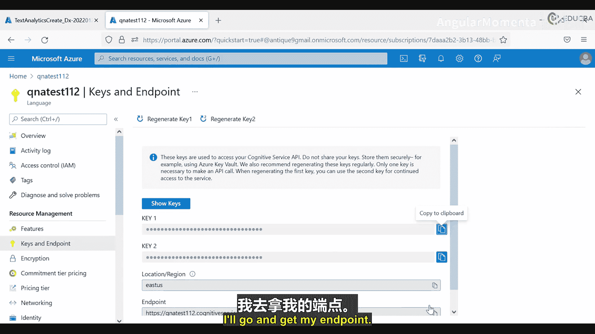
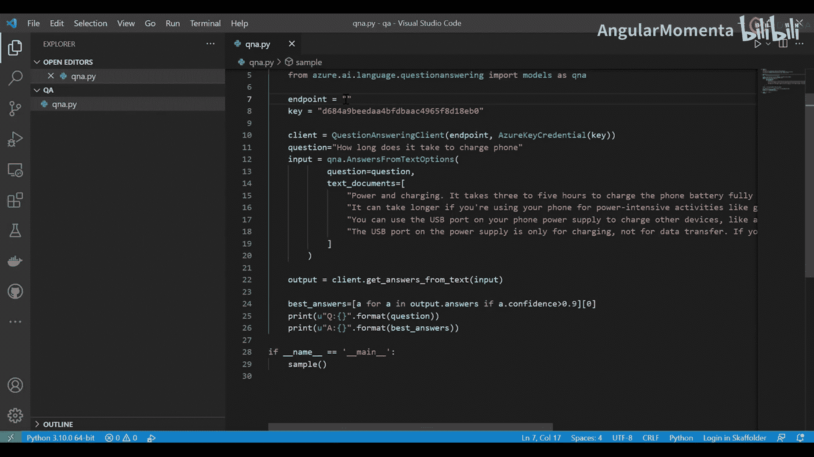
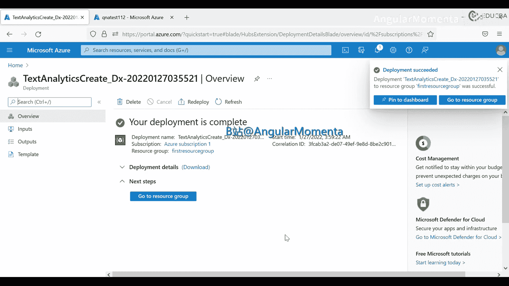
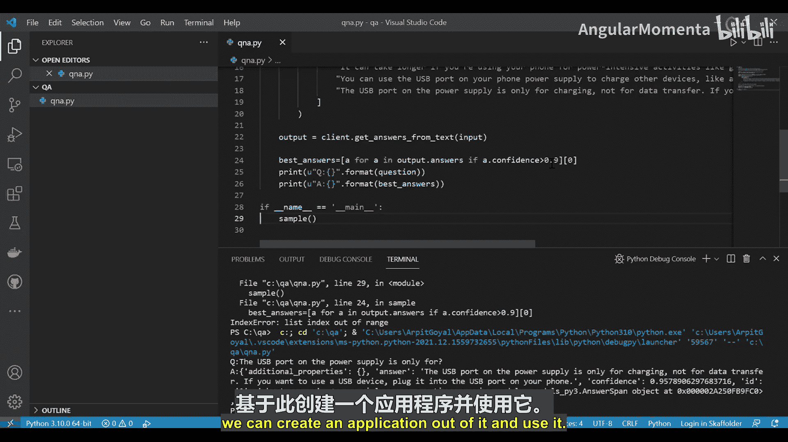

# 009：问答生成器概述 🧠

在本节课中，我们将学习Azure认知服务中语言服务系列的最后一个功能——问答生成器。我们将了解它的作用、工作原理，并动手实践如何创建一个基于Python的问答应用。

---

## 概述

我们经常花费大量时间浏览网站上的问答页面，但有时仍然难以找到问题的答案。在语言认知服务系列的最后部分，我们将介绍问答生成器服务。这是语言认知服务提供的最后一项功能，其中“Q”代表问题，“A”代表答案。该服务可用于基于我们的数据创建问答对。这些数据也可以是**非结构化**的。我们可以从不同的网站、PDF文件、Word文档、Excel CSV文件和文本文件中获取非结构化数据集。基于这些数据集，服务会创建自己的问答知识库。我们也可以创建自己特定的问题集及其答案，并基于此生成知识库。

那么，我们能用这一堆创建好的知识库做什么呢？问答生成器通过一个完整的API提供所有这些问答对。用户或你自己可以提出问题，如果问题在知识库中找到，答案将返回给用户。这项服务的美妙之处在于其背后运行的机器学习逻辑。用户的问题**不需要**与知识库中的问题完全匹配，具有相同含义的问题也会得到相同的答案。

---

## 创建问答生成器应用

上一节我们介绍了问答生成器的概念，本节中我们来看看如何使用Python语言创建一个问答生成器应用。在此之前，我需要先安装一些依赖项。

以下是安装所需依赖的命令：

```bash
pip install azure-ai-language-questionanswering
```

现在，在问答项目部分，我在这里创建了我的文件。我创建了一个名为`QA`的项目，其中有一个名为`q_and_a.py`的Python文件。我将创建一个函数。

首先，我们需要导入一些必要的模块：

```python
import os
from azure.core.credentials import AzureKeyCredential
from azure.ai.language.questionanswering import QuestionAnsweringClient
```

导入完成后，我需要创建一些本地变量。

我将定义一个名为`endpoint`的变量，用于存储从Azure门户获取的相应端点。其次，我们还需要密钥。

```python
endpoint = "你的Azure服务端点"
key = "你的Azure服务密钥"
```

一旦这些准备就绪，我们就可以看看如何创建客户端。

```python
client = QuestionAnsweringClient(endpoint, AzureKeyCredential(key))
```

现在，我们需要再创建一个变量来存放问题。

```python
question = "手机充满电需要多长时间？"
```

接下来，我们需要创建输入。我们将考虑使用基本文本来提供某些信息。

```python
input = {
    "question": question,
    "records": [
        {
            "id": "1",
            "text": "这里是你的样本文本内容。例如：使用电源充电，手机电池从空电状态充满需要三到五个小时。"
        }
    ]
}
```



之后，我们需要调用一个新变量来获取输出。

```python
output = client.get_answers(input)
```

我们将根据置信度打印答案。我们之前已经讨论过置信度这个概念。

```python
if output.answers:
    best_answer = max(output.answers, key=lambda x: x.confidence)
    print(f"答案: {best_answer.answer}")
    print(f"置信度: {best_answer.confidence}")
else:
    print("未找到答案。")
```

这样，我们就创建了一个应用程序，它很可能可以运行。

---

## 在Azure门户配置服务



现在，让我们转到Azure门户来创建我们的语言服务。

1.  选择“自定义问答”服务。
2.  点击“继续创建资源”。
3.  确保选择了正确的订阅。
4.  选择资源组（可以使用之前一直使用的同一个）。
5.  为服务命名，例如 `QnA112`。
6.  选择定价层。
7.  查看并接受条款与条件。
8.  在网络、身份和标签部分，通常无需更改，直接点击“下一步：查看 + 创建”。
9.  验证通过后，点击“创建”。

服务部署通常不会花费太长时间。在等待部署时，我可以展示一下我们添加的文本样本。

**样本文本内容：**
“使用电源充电，手机电池从空电状态充满需要三到五个小时。如果你在充电时使用手机进行游戏、视频流媒体等高耗电活动，充电时间可能会更长。你可以使用手机电源适配器上的USB端口为其他设备（如另一部手机）充电。”



基于这个样本文本，我将回答用户的问题。现在，让我们回到服务列表，看看是否创建成功。

部署完成后，我们需要获取密钥和端点。





1.  进入创建好的资源。
2.  在“密钥和终结点”部分，复制`密钥1`和`终结点`。



回到我们的代码，将复制的密钥和终结点粘贴到相应的变量中。





```python
endpoint = "粘贴你的终结点URL"
key = "粘贴你的密钥"
```

现在服务已经准备就绪。

---

## 运行与测试应用

回到我的系统，选择运行程序（无需调试）。让我们看看会发生什么。

我们提出的问题是：“手机充满电需要多长时间？”
程序返回的答案是：“使用电源充电，手机电池从空电状态充满需要三到五个小时。如果你在充电时使用手机进行游戏、视频流媒体等高耗电活动，充电时间可能会更长。” 同时，也给出了置信度。

现在，让我问一个样本文本中没有涉及的问题：“手机是什么颜色的？”
这个问题在我们的文本中没有定义。运行程序后，由于找不到相关信息，可能会返回错误或空答案。

再问一个文本中可能涉及的问题：“电源适配器是什么？”
运行后，我们得到了答案：“电源适配器上的USB端口仅用于充电，不用于数据传输。”

这就是Azure问答服务的工作方式。如果我当初将置信度阈值设置得更低（比如大于0.5而不是0.9），那么我们针对不同问题可能会得到更多答案。这就是Azure问答服务的工作原理。我们需要确保在Azure门户创建好服务，然后就可以基于它创建应用程序并使用它了。

---

## 总结



本节课中，我们一起学习了Azure认知服务中的问答生成器。我们了解了它如何从结构化或非结构化数据创建知识库，并通过机器学习理解问题语义来提供答案。我们逐步实践了如何使用Python SDK创建问答客户端，如何在Azure门户配置自定义问答资源，以及如何运行和测试问答应用。关键在于准备好数据、获取服务的终结点和密钥，并理解置信度在答案筛选中的作用。