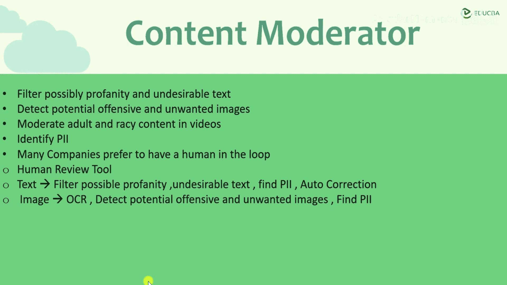
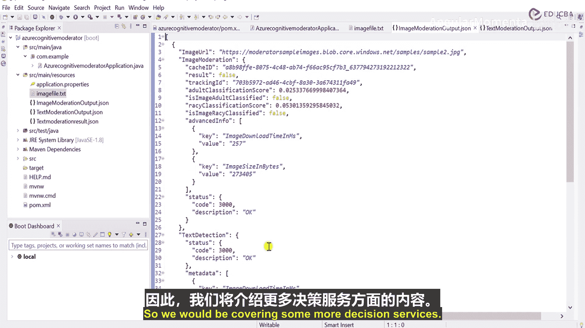

# 010：认知决策服务 🧠

在本节课中，我们将要学习Azure认知服务中的“决策”服务。决策服务旨在帮助你的应用程序快速做出明智的判断。接下来，我们将深入了解这一类别下的具体服务。

## 概述

决策服务包含一系列工具，它们能协助应用程序处理内容、检测异常并进行个性化推荐。本节课程将重点介绍其中的内容审查服务，并通过一个Java应用示例，展示如何对文本和图像进行自动化审查。

## 服务简介

决策类别下主要提供三项服务：
*   **内容审查器**：用于过滤文本、图像和视频中的不良内容。
*   **异常检测器**：用于识别时间序列数据中的异常点。
*   **个性化推荐器**：用于根据用户行为提供个性化的内容或产品推荐。

在接下来的部分，我们将首先深入探讨内容审查器服务。

## 内容审查器详解 📝

上一节我们介绍了决策服务的整体框架，本节中我们来看看第一个核心服务——内容审查器。你可以利用此服务过滤可能存在的亵渎或不雅文本，检测潜在的冒犯性和不良图像，并对视频中的成人及挑逗性内容进行审查。

这为许多应用场景提供了解决方案。例如，在开发聊天应用时，可以集成此服务以确保成员间不会传播不良文本。同样，对于在线照片或视频库，它可以自动检查上传内容，防止传播冒犯性、不良或成人内容。

该服务的功能不仅限于此。它还能识别个人身份信息。与我们之前在语言服务中看到的文本PII识别类似，内容审查器可以对图像和视频中的文本进行识别。

与其他认知服务一样，内容审查器也提供一定程度的自定义功能。许多公司倾向于采用“人在回路”的模式，即当文本、图像或视频被标记为不良内容时，由人工审核员来最终批准或否决该判断，这可以通过人工审核工具来实现。

现在，让我们更详细地了解这项服务的具体功能。

### 文本审查

你可以使用内容审查器来过滤可能的亵渎和不雅文本。它还能用于在文本内容中查找个人身份信息，例如姓名、电子邮件、电话号码、社会安全号码、银行卡号等。

该服务还有一个很酷的功能：它能处理故意拼写错误的脏话（例如，用感叹号代替字母“i”，或用星号代替某些字符）。内容审查器足够智能，可以对传入的文本内容执行自动校正。虽然校正并非100%准确，但效果值得期待。

### 图像审查

在图像方面，该服务可以检测潜在的冒犯性和不良图像，并为我们标记出来。它还有一个强大的功能：能够识别图像中的文字。服务会对图像执行OCR（光学字符识别），提取其中的文本，然后对该文本执行内容审查。

这是一个非常强大的工具。接下来，我们将通过实践来学习如何使用它。

## 构建内容审查应用 💻

前面我们了解了内容审查器的理论功能，本节我们将动手构建一个Java应用程序。我们将通过这个应用传递一些文本和图像，并观察服务如何过滤其中的特定内容。本次实践将涵盖两个主要部分：文本处理流程和图像处理流程，暂不实现人工审核工具。

### 项目初始化与依赖配置

在本小节，我将创建第一个审查应用。我会新建一个Spring Starter项目，将其命名为 `AzureCognitiveModerator`。初始化时，我不选择任何预定义的JAR包或依赖。

项目创建完成后，需要在 `pom.xml` 文件中添加必要的依赖声明。

以下是项目所需的关键依赖：
*   **Azure内容审查器SDK**：用于调用审查器服务。
*   **Gson**：用于处理JSON数据序列化与反序列化。
*   **FasterXML Jackson Core**：用于高效的JSON处理。

添加依赖后，我们需要定义一些必要的配置信息，例如审查URL、订阅密钥和服务终结点。这些信息可以从Azure门户获取。

### 核心代码结构

首先，创建一个 `EvaluationData` 类，用于封装审查结果。这个类需要包含以下字段：
*   `imageUrl`：被审查图像的URL。
*   `evaluation`：审查评估结果。
*   `ocrText`：从图像中识别出的文本。
*   `foundFaces`：检测到的人脸信息。

接下来，创建 `ContentModeratorClient` 客户端并进行身份验证。这需要用到之前配置的终结点和订阅密钥。

然后，我们创建核心的审查方法。主要分为两个函数：
1.  `moderateImage`：用于处理图像审查。
2.  `moderateText`：用于处理文本审查。

在 `moderateImage` 方法中，我们将依次调用服务评估图像的成人/挑逗内容、进行人脸检测以及执行OCR文本识别。每次调用后，会添加短暂的线程睡眠以确保调用顺序。审查结果会被收集到一个列表中。

在 `moderateText` 方法中，我们将读取一个文本文件，调用文本审查API，并分析返回的结果，例如是否包含PII信息。

最后，使用 `BufferedWriter` 和 `Gson` 库将审查结果（无论是图像还是文本）以JSON格式写入到本地文件 `moderation_result.json` 中，以便查看。

### 运行与结果分析

配置好订阅密钥和终结点后，即可运行应用程序。程序启动后，会依次执行图像审查和文本审查。

对于文本审查，如果传入的文本包含测试语句、电子邮件、电话号码和地址，服务会对其进行标准化处理，并提取出其中的PII信息（如邮箱、国家、手机号），在结果文件中清晰列出。

对于图像审查，服务会分析指定的图像URL。它不仅评估图像内容，还会通过OCR提取图像中的文字进行审查，并尝试检测图像中是否存在人脸。所有这些详细信息都会输出到结果文件中。

通过这个实践，我们直观地看到了Azure内容审查器服务如何自动化地处理文本和图像内容审查。

## 总结

本节课中，我们一起学习了Azure认知决策服务，并重点深入了内容审查器。我们了解了其三大功能：文本过滤、图像审查和视频审查，并通过一个完整的Java Spring Boot应用示例，实践了如何集成该服务对文本和图像进行自动化内容审查与PII信息识别。这为构建安全、合规的应用程序提供了强大的支持。在后续课程中，我们将继续探讨决策服务中的其他工具。