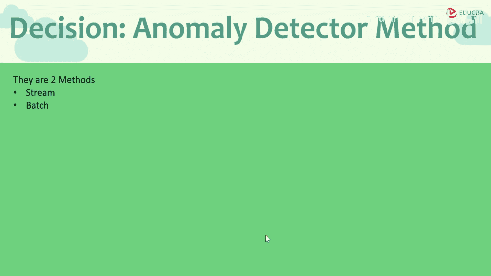
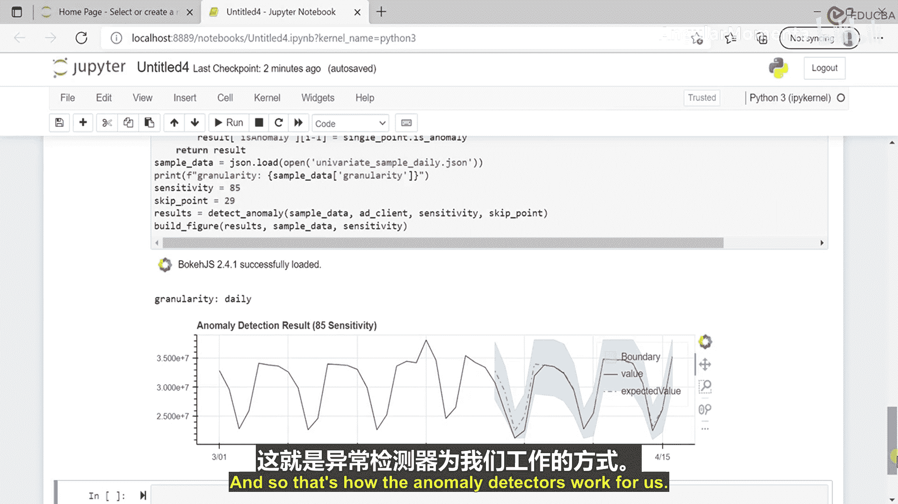

# 011：异常检测器概述 🎯

## 概述
在本节课中，我们将学习Azure认知服务中的异常检测器。我们将了解它的定义、工作原理、应用场景，并通过一个Python示例来演示如何创建和运行一个异常检测应用。

---

## 什么是异常检测器？🔍
上一节我们介绍了Azure认知服务家族，本节中我们来看看异常检测器。

异常检测器是一项认知服务。它使你能够使用机器学习来监控和检测时间序列数据中的异常。

这里需要澄清，时间序列数据是按时间顺序索引的一系列数据点。你很可能以数据流的形式接收这些时间序列。

以下是时间序列数据的几个例子：
*   热传感器收集的数据（可能来自热电厂或核电厂）。
*   从一级方程式赛车引擎收集的数据。
*   从不同连接的物联网设备收集的数据。



异常检测器的作用是：它会从数据的正常模式中学习，并基于现有数据范围得出一个所谓的“正常数据范围”。之后，如果有新的数据系列到来，它会根据之前用于绘制正常数据范围的数据流，尝试在这个新的数据流中发现异常。

## 为什么异常检测至关重要？⚠️
异常检测在某些场景中至关重要。在这些场景中，我们需要根据数据在几秒甚至微秒内做出响应。

以下是几个关键场景：
*   **赛车场景**：我们接收赛车引擎的RPM数据。如果维修区的团队成员发现存在异常，而车手继续驾驶，可能导致严重的发动机或变速箱问题。此时需要立即通知车手。
*   **核电站场景**：如果核电站的温度在几秒钟内超过允许极限，必须发出警报并通知技术人员。即使几秒钟的延迟也可能是灾难性的。
*   **股票市场场景**：如果你接收股票市场价格数据，当价格跌破预期下限时，你可能希望买入股票。
*   **数据库安全场景**：如果你在Azure中托管一个数据库实例，该数据库通常只接受来自特定IP地址的流量。如果突然收到来自未知IP的请求，这实际上就是一种异常，可能构成安全威胁，需要处理。事实上，Azure SQL数据库提供了一个高级数据保护计划，它在底层进行异常检测以发现此类安全异常。

## 异常检测的两种模式 ⚙️
上一节我们了解了异常检测的重要性，本节中我们来看看它的具体工作模式。

异常检测服务可以执行两种主要模式，并且有对应的不同端点。

以下是两种模式的介绍：
1.  **流模式**：该服务将学习先前数据，以判断最后一个数据点是否为异常。这是你应该用于实时数据的模式，它的性能更高、更准确。
2.  **批处理模式**：该模式作用于数据中的所有数据点。假设你有一整年的数据，你想将其传递给服务并获取该数据集中的所有异常，你应该使用批处理模式。

需要注意的是，批处理服务不应用于实时数据。对于实时数据，你应始终根据需求使用流模式。

---

## 创建第一个异常检测应用（Python）🐍
在接下来的部分，我们将使用Python创建第一个异常检测器应用程序。

### 环境与依赖设置
在开始编码之前，我将使用Jupyter Notebook，因为它便于绘图，并且对于新手来说编码更简单。

首先，我们需要添加一些依赖项并导入所需的库。

以下是需要导入的库：
```python
# 导入Azure异常检测器相关库
from azure.ai.anomalydetector import AnomalyDetectorClient
from azure.ai.anomalydetector.models import DetectRequest, TimeSeriesPoint, APIError
from azure.core.credentials import AzureKeyCredential

# 导入数据处理与可视化库
import pandas as pd
import numpy as np
from bokeh.plotting import figure, show
from bokeh.models import ColumnDataSource
import datetime
from dateutil import parser
import ipywidgets as widgets
```

### 初始化配置与客户端
现在，我将设置订阅密钥和异常检测端点，并创建客户端连接。

```python
# 定义订阅密钥和端点
subscription_key = "你的订阅密钥"
endpoint = "你的服务端点"

# 创建客户端
credential = AzureKeyCredential(subscription_key)
client = AnomalyDetectorClient(endpoint, credential)
```

### 构建绘图函数
一旦我们调用异常检测器并获得结果，我们需要绘制图表。为此，我将创建一个绘图函数。

```python
def plot_graph(result, sample_data, sensitivity):
    """
    根据异常检测结果绘制图表。
    :param result: 异常检测返回的结果对象
    :param sample_data: 原始时间序列数据
    :param sensitivity: 检测敏感度
    """
    # 从结果中提取数据
    expected_values = result.expected_values
    is_anomaly = result.is_anomaly
    is_negative_anomaly = result.is_negative_anomaly
    is_positive_anomaly = result.is_positive_anomaly
    upper_margins = result.upper_margins
    lower_margins = result.lower_margins

    # 提取时间戳和值
    timestamps = [point.timestamp for point in sample_data.series]
    values = [point.value for point in sample_data.series]

    # 创建图表
    p = figure(x_axis_type="datetime", title=f"Anomaly Detection (Sensitivity: {sensitivity})", height=400, width=800)
    p.xaxis.formatter = DatetimeTickFormatter(days="%m/%d", months="%m/%Y")

    # 绘制预期值线
    p.line(timestamps, expected_values, legend_label="Expected Value", line_width=2, color='navy')

    # 绘制上下边界带
    upper_band = [exp + margin for exp, margin in zip(expected_values, upper_margins)]
    lower_band = [exp - margin for exp, margin in zip(expected_values, lower_margins)]
    band_x = np.append(timestamps, timestamps[::-1])
    band_y = np.append(upper_band, lower_band[::-1])
    p.patch(band_x, band_y, color='navy', alpha=0.2, legend_label="Normal Range")

    # 标记异常点
    anomaly_indexes = [i for i, anomaly in enumerate(is_anomaly) if anomaly]
    anomaly_times = [timestamps[i] for i in anomaly_indexes]
    anomaly_values = [values[i] for i in anomaly_indexes]
    p.circle(anomaly_times, anomaly_values, size=8, color='red', legend_label="Anomaly")

    # 显示图例和图表
    p.legend.location = "top_left"
    show(p)
```

### 创建异常检测函数
接下来，我将创建核心的异常检测函数，它将调用Azure服务并返回结果。

```python
def detect_anomaly(sample_data, sensitivity, skip_points=29):
    """
    调用异常检测器服务。
    :param sample_data: 时间序列数据（TimeSeriesPoint列表）
    :param sensitivity: 敏感度，建议85-99
    :param skip_points: 跳过的初始数据点数，用于训练
    :return: 检测结果
    """
    # 设置数据粒度（例如：每天）
    granularity = "daily"

    # 准备请求
    request = DetectRequest(
        series=sample_data.series,
        granularity=granularity,
        sensitivity=sensitivity,
        max_anomaly_ratio=0.25,
        custom_interval=1
    )

    # 调用服务进行检测（这里以批处理模式为例）
    # 注意：对于流式数据，应使用 `detect_last_point` 方法
    response = client.detect_entire_series(request)

    return response
```

### 运行与测试应用
最后，我将配置密钥，准备示例数据，并运行整个流程来可视化异常。

```python
# 1. 准备示例时间序列数据（这里用简单示例代替，实际应从文件或API获取）
# 示例：创建包含一个异常点的数据
timestamps = []
values = []
base_date = datetime.datetime.now()
for i in range(100):
    timestamps.append(base_date + datetime.timedelta(days=i))
    # 大部分是正常值，在第75天插入一个异常高值
    value = 50 + np.random.randn() * 5
    if i == 75:
        value = 120  # 异常点
    values.append(value)

series_points = [TimeSeriesPoint(timestamp=ts, value=val) for ts, val in zip(timestamps, values)]

# 2. 封装数据
class SampleData:
    def __init__(self, series):
        self.series = series

sample_data = SampleData(series_points)

# 3. 设置敏感度并运行检测
sensitivity = 95
result = detect_anomaly(sample_data, sensitivity)

# 4. 绘制结果图表
plot_graph(result, sample_data, sensitivity)
```

运行上述代码后，你将看到一个图表。图表中会显示预期值线、正常范围区域，并用红点标记出检测到的异常。

你可以调整 `sensitivity` 参数（例如从95改为85）并重新运行，观察检测结果如何变化。敏感度越高，对偏差越敏感，可能检测到更多异常；敏感度越低，则对轻微偏差更宽容。

---

## 总结
本节课中，我们一起学习了Azure认知服务中的异常检测器。

我们首先了解了异常检测器的定义及其对时间序列数据的监控能力。接着，探讨了它在赛车、核电、金融和安全等关键场景中的重要性。然后，我们分析了其两种工作模式：**流模式**适用于实时数据，而**批处理模式**适用于历史数据分析。

最后，我们通过一个完整的Python示例，演示了如何设置环境、初始化客户端、创建绘图函数、调用异常检测API以及可视化结果。你学会了如何通过调整敏感度参数来影响检测的严格程度。



通过本教程，你应该能够开始使用Azure异常检测器来监控自己的时间序列数据，并识别其中的异常模式。