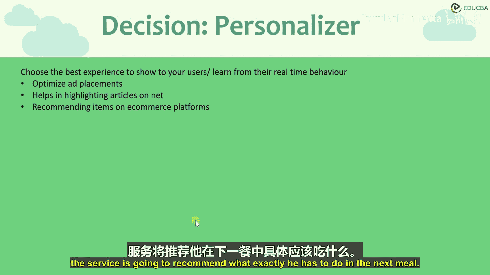
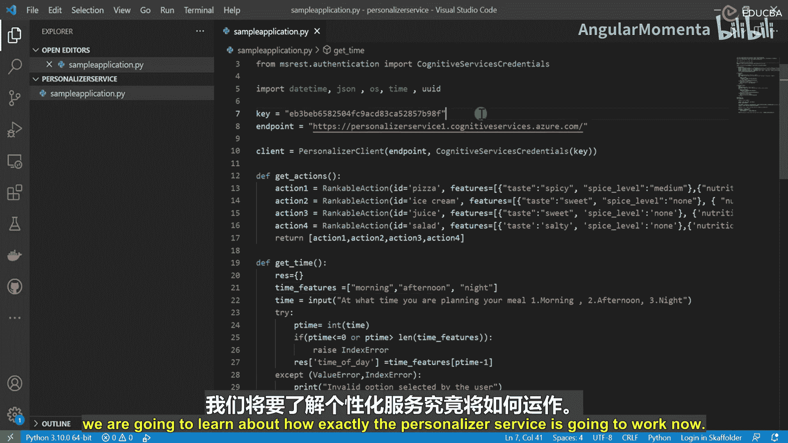
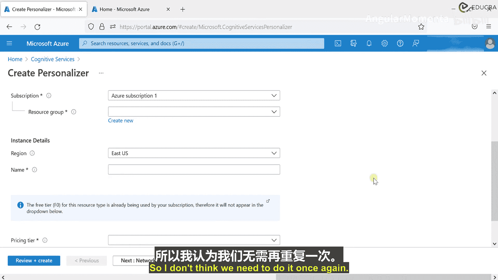
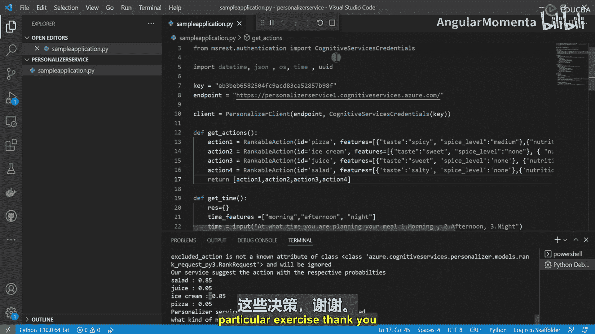
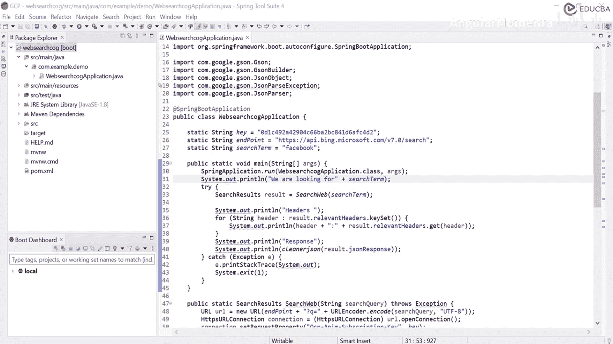

# 012：决策个性化器概览 🧠

在本节课中，我们将学习Azure认知服务决策组下的最后一个服务：个性化器服务。该服务能基于用户实时行为，在多个选项中做出智能推荐。

## 个性化器服务简介

上一节我们介绍了决策组下的其他服务，本节中我们来看看个性化器服务。该服务帮助我们在多个事物之间做出选择，其依据是用户的实时行为体验。服务会计算用户的实时行为，并据此推荐最合适的操作。

想象我们有一个网站，需要在上面展示一系列广告。这些广告应该放在左上角、右上角、底部，还是其他位置？没有一种“银弹”解决方案适用于所有广告位，因为这取决于每个用户的个人偏好。那么，如何根据个体行为，将这些广告放置在网站的正确位置呢？这时，个性化器服务就派上用场了。

此服务将监控并学习用户的实时行为，然后将其用于未来的参考决策。

## 应用场景

以下是几个可以考虑的应用场景：

*   **优化网站广告位**：借助此服务，可以优化网站上广告的展示位置。
*   **电商商品推荐**：在电商网站（如亚马逊、eBay）上，基于用户之前的购买记录，持续推荐新产品。
*   **新闻内容个性化**：在新闻网站上，根据用户之前感兴趣的文章和主题，高亮并推荐相关文章。

## 实践：创建餐饮推荐应用



在接下来的课程中，我们将创建一个基于Python的应用程序。该程序将帮助用户决定下一餐吃什么。依据是用户之前吃过的餐食或其偏好。

例如，如果用户每天喜欢吃甜食，我们收集了相关数据集，服务就会推荐用户：如果想吃点甜的，可以尝试哪种冰淇淋；如果想吃点咸的，可以吃什么。服务将基于用户的历史经验创建一个模型，并根据该模型推荐下一餐的具体选择。

---

# Azure实践：12.1：创建个性化器Python应用 🐍

在本节中，我将演示如何创建一个个性化器服务应用。我们将构建一个基于Python的程序，为用户建议下一餐可以吃什么。

## 环境准备

在开始编码之前，我们需要安装必要的依赖项。打开终端并执行以下命令：

```bash
pip install azure-cognitiveservices-personalizer
```

这将安装我们Python应用所需的依赖包。

## 创建应用文件

现在，创建一个Python应用文件：

```python
# sample_application.py
```

## 导入依赖项

首先，导入所有必需的库和模块：

```python
from azure.cognitiveservices.personalizer import PersonalizerClient
from azure.cognitiveservices.personalizer.models import RankableAction, RewardRequest, RankRequest
from msrest.authentication import CognitiveServicesCredentials
import datetime
import json
import uuid
import time
```

## 配置客户端

我们需要定义密钥和终结点来连接Azure云服务。这些值将在后续步骤中填充。

```python
key = “” # 填入你的密钥
endpoint = “” # 填入你的终结点
```

使用密钥和终结点创建个性化器客户端：

```python
client = PersonalizerClient(endpoint, CognitiveServicesCredentials(key))
```

## 创建示例数据

在服务开始工作之前，我们需要为其创建一些基础样本数据。基于这些数据，服务将学习并为用户提供餐食建议。

以下是创建“动作”（即餐食选项）的代码：

```python
def get_actions():
    actions = []
    # 动作1: 披萨
    actions.append(RankableAction(
        id=“pizza”,
        features=[
            {“taste”: “salty”, “spice_level”: “high”, “nutrition”: 4, “cuisine”: “italian”}
        ]
    ))
    # 动作2: 意大利面
    actions.append(RankableAction(
        id=“pasta”,
        features=[
            {“taste”: “salty”, “spice_level”: “medium”, “nutrition”: 6, “cuisine”: “italian”}
        ]
    ))
    # 动作3: 冰淇淋
    actions.append(RankableAction(
        id=“ice_cream”,
        features=[
            {“taste”: “sweet”, “spice_level”: “none”, “nutrition”: 5}
        ]
    ))
    # 动作4: 沙拉
    actions.append(RankableAction(
        id=“salad”,
        features=[
            {“taste”: “neutral”, “spice_level”: “none”, “nutrition”: 8}
        ]
    ))
    return actions
```

## 获取用户时间偏好

接下来，创建一个函数来获取用户计划用餐的时间（例如，早晨、下午、夜晚）。

```python
def get_user_time_of_day():
    time_features = [“morning”, “afternoon”, “night”]
    print(“At what time are you planning to have your meal? (0: morning, 1: afternoon, 2: night)”)
    try:
        time_idx = int(input())
        if time_idx < 0 or time_idx >= len(time_features):
            raise IndexError
        selected_time = time_features[time_idx]
        print(f“Option selected by the user: {selected_time}”)
        return [{“time”: selected_time}]
    except (ValueError, IndexError):
        print(“Invalid input. Please enter a valid number.”)
        return [{“time”: time_features[0]}]
```

## 获取用户口味偏好

然后，创建一个函数来询问用户想要甜味还是咸味的餐食。

```python
def get_user_preference():
    preference_features = [“sweet”, “salty”]
    print(“What kind of meal do you want? (0: sweet, 1: salty)”)
    try:
        pref_idx = int(input())
        if pref_idx < 0 or pref_idx >= len(preference_features):
            raise IndexError
        selected_pref = preference_features[pref_idx]
        print(f“Preference selected: {selected_pref}”)
        return [{“preference”: selected_pref}]
    except (ValueError, IndexError):
        print(“Invalid input. Please enter a valid number.”)
        return [{“preference”: preference_features[0]}]
```

## 核心推荐逻辑

现在，我们将整合以上部分，创建主循环来获取推荐。

```python
def main():
    keep_going = True
    while keep_going:
        # 生成唯一事件ID
        event_id = str(uuid.uuid4())
        
        # 获取用户上下文（时间和口味偏好）
        context = get_user_time_of_day() + get_user_preference()
        
        # 获取所有可能的动作（餐食选项）
        actions = get_actions()
        
        # 构建排名请求
        rank_request = RankRequest(actions=actions, context_features=context, excluded_actions=[“salad”], event_id=event_id)
        
        # 调用服务获取排名
        response = client.rank(rank_request)
        
        # 打印每个动作的概率
        print(“\nProbabilities for each action:”)
        for ranked_action in response.ranking:
            print(f”  {ranked_action.id}: {ranked_action.probability:.2f}”)
        
        # 打印推荐的动作
        print(f”\nYou would like to have: {response.reward_action_id}”)
        
        # 询问用户是否对推荐满意（此处简化，实际应发送奖励反馈）
        print(“\nAre you happy with this suggestion? (y/n)”)
        if input().lower() != ‘y’:
            keep_going = True # 在实际应用中，这里会发送负奖励并调整模型
        else:
            keep_going = False # 或发送正奖励

if __name__ == “__main__”:
    main()
```

## 应用测试与总结

在下一节，我们将运行此应用，查看个性化器服务如何根据输入提供推荐。您需要先在Azure门户创建个性化器资源，并获取密钥和终结点填入代码中。

本节课中，我们一起学习了如何创建Azure个性化器服务应用。我们构建了一个Python程序，它能够根据用户的时间偏好和口味偏好，从多个餐食选项中推荐最合适的一个。通过定义动作、收集用户上下文并调用排名API，我们实现了一个简单的个性化推荐系统。

---

# Azure实践：12.2：个性化器服务工作原理与演示 🎯

在本节中，我们将学习个性化器服务具体如何工作，并演示我们创建的应用。

## 配置与运行应用

我已经在我的Azure账户上创建了一个个性化器服务，并获取了相应的密钥和终结点。我们知道如何在Azure账户上创建此服务，之前已经操作过多次。只需在门户中搜索“Personalizer”服务并创建即可。

现在，回到我们的应用程序，填入密钥和终结点，然后运行它。

```python
# 填入从Azure门户获取的值
key = “YOUR_SUBSCRIPTION_KEY”
endpoint = “YOUR_ENDPOINT_URL”
```

运行应用（不调试）：

```bash
python sample_application.py
```

## 应用演示



假设应用启动后，用户选择想吃“咸的”(salty)，并计划在“下午”(afternoon)用餐。

基于我们为每个餐食定义的营养数据和用户要求，服务将推荐“沙拉”(salad)。从输出中可以看到，沙拉的推荐概率高达0.85（85%），而其他三个选项（果汁、冰淇淋、披萨）的概率均为0.05（5%）。

这就是个性化器服务的工作方式：基于我们传递给服务的数据，它提供智能建议。

## 总结与扩展



通过收集用户输入并将其与所有用户的历史经验相结合，我们可以基于海量用户数据做出决策。例如，决定广告的投放位置、向用户推荐哪些文章等。所有这些决策都可以借助个性化器服务来实现。

本节课中，我们一起探索了Azure个性化器服务的工作原理。我们配置并运行了一个Python应用，该应用根据用户对口味和用餐时间的偏好，成功推荐了最合适的餐食选项。这展示了如何利用用户实时行为数据来训练模型并做出个性化决策。



---

# Azure实践：13：网络搜索认知服务概览 🌐

现在，我们将讨论认知服务中的最后一个大类：网络搜索认知服务。我相信大多数人对这类服务已有一定了解。

## 服务简介

隶属于网络搜索认知服务的各项服务，使我们的应用程序能够利用Bing搜索引擎的强大功能。简而言之，通过简单的RESTful API调用，您可以将搜索引擎的能力集成到您的应用中，其后台使用的是Bing。

在进一步深入之前，请确保不要将认知服务下的网络搜索服务与Azure搜索服务混淆，因为这两者是截然不同的工具。

## 服务列表

目前，网络搜索认知服务下包含九项服务：

以下是这些服务的列表：

*   **Bing 网络搜索**：提供广泛的网页搜索结果。
*   **视觉搜索**：基于图像进行搜索。
*   **实体搜索**：搜索特定实体，如人物、地点。
*   **图像搜索**：搜索图片。
*   **视频搜索**：搜索视频。
*   **新闻搜索**：搜索新闻文章。
*   **自动建议**：提供搜索词自动完成建议。
*   **拼写检查**：纠正拼写错误。
*   **本地商业搜索**（可能包含在部分套件中）：搜索本地商业信息。

我们将在接下来的课程中逐一详细介绍这些服务。其中，我们将以网络搜索服务为基础创建一个演示应用程序。该程序将展示网络搜索服务如何工作，我们还会创建一个基于Java的应用程序，通过RESTful服务调用认知网络搜索API，并传递一个测试短语。基于该短语，服务将以JSON格式返回结果，我们将从中了解可以从Bing网站获取哪些匹配结果。

---

# Azure实践：13.1：网络搜索服务详解 🛠️

接续上一节的讨论，我将详细介绍认知服务下的各项网络搜索服务。

## 1. 网络搜索 (Web Search)

这是我们日常生活中最常用的服务，例如Google、Bing、Yahoo等。使用此服务，您可以：
*   控制想要获取结果的**市场或区域**。
*   开启或关闭**安全搜索**。
*   控制数据的**新鲜度**（例如，获取最多一天前或一个月前的数据）。

我们将在下一节更详细地探讨此服务，并为其创建一个演示应用。

## 2. 拼写检查 (Spell Check)

此服务不仅可用于纠正拼写错误的单词，还能根据上下文纠正用词。

## 3. 自动建议 (Autosuggest)

我相信大家都曾在使用搜索引擎时，在屏幕上看到过搜索建议。当我们在Google上搜索内容时，输入过程中会得到一些用于补全短语的建议。自动建议服务可用于在我们的应用程序中实现相同的功能。

## 4. 图像搜索 (Image Search) & 视频搜索 (Video Search)

*   **图像搜索**：这是一个不言自明的服务。您可以传递一个短语（如“银河系”、“太阳系”或水果名“苹果”），服务将返回基于该短语的图片。您可以控制安全搜索的开关和数据的新鲜度，但通常不能控制返回数据的区域。
*   **视频搜索**：其工作方式与图像搜索非常相似。您可以指定短语、控制区域、安全搜索和数据新鲜度。Bing网络搜索将返回一些视频结果，您可以观看这些视频。

## 5. 实体搜索 (Entity Search)

此服务可用于搜索特定的地点或人物。您可以控制市场和位置参数。实体服务将返回数据，供您在应用中使用。

## 6. 视觉搜索 (Visual Search)

如果您想基于图像进行搜索该怎么办？例如，我想购买某种衬衫或T恤，并且我有一个参考图片。我可以将该图片作为输入上传到服务，Bing搜索引擎将为您查找相似图片并返回结果，您可以从这些结果中找到该产品。这时，视觉搜索服务就派上用场了。

在下一节中，我将创建一个应用程序。首先在Azure上创建服务，然后基于该服务构建一个应用，通过触发测试短语从服务中获取返回结果。

---

# Azure实践：13.2：创建Java网络搜索应用 ☕

在本节中，我将创建一个用于访问网络搜索服务的应用程序。

## 项目初始化

我将创建一个新的Java 8项目，命名为 `WebSearchCognitive`。

项目创建后，我们需要在 `pom.xml` 文件中添加一些依赖项，特别是用于JSON解析的Gson库。由于此应用需要与Azure服务交互，我们还需要添加Azure相关的依赖。

## 基础代码结构

首先，在主要Java类中定义一些静态字段：

```java
public class Main {
    // 订阅密钥和终结点
    static String subscriptionKey = “”;
    static String host = “https://api.bing.microsoft.com”;
    static String path = “/v7.0/search”;
    // 搜索词
    static String searchTerm = “Microsoft Cognitive Services”;

    public static void main(String[] args) {
        // 主逻辑将在这里编写
    }
}
```

## 构建搜索功能

我们将创建一个执行搜索并返回结果的方法。

```java
public static SearchResults SearchWeb (String searchQuery) throws Exception {
    // 构造完整的URL
    URL url = new URL(host + path + “?q=” + URLEncoder.encode(searchQuery, “UTF-8”));
    // 打开连接
    HttpsURLConnection connection = (HttpsURLConnection) url.openConnection();
    connection.setRequestProperty(“Ocp-Apim-Subscription-Key”, subscriptionKey);

    // 接收JSON响应体
    InputStream stream = connection.getInputStream();
    Scanner scanner = new Scanner(stream);
    String response = scanner.useDelimiter(“\\A”).next();
    scanner.close();
    stream.close();

    // 将JSON字符串转换为对象
    Gson gson = new GsonBuilder().setPrettyPrinting().create();
    SearchResults results = gson.fromJson(response, SearchResults.class);
    return results;
}
```

## 定义结果类

我们需要一个类来映射JSON响应。

```java
class SearchResults {
    HashMap<String, String> relevantHeaders;
    String jsonResponse;
    // 构造函数、Getter和Setter
    public SearchResults(HashMap<String, String> headers, String json) {
        relevantHeaders = headers;
        jsonResponse = json;
    }
}
```

## 美化JSON输出

创建一个辅助函数来美化打印JSON。

```java
public static String prettify(String json_text) {
    JsonParser parser = new JsonParser();
    JsonObject json = parser.parse(json_text).getAsJsonObject();
    Gson gson = new GsonBuilder().setPrettyPrinting().create();
    return gson.toJson(json);
}
```

## 完善主方法

现在，在主方法中整合所有功能。

```java
public static void main(String[] args) {
    try {
        System.out.println(“Searching the Web for: “ + searchTerm);
        SearchResults result = SearchWeb(searchTerm);
        // 打印相关HTTP头（可选）
        System.out.println(“\nRelevant HTTP Headers:\n”);
        for (String header : result.relevantHeaders.keySet())
            System.out.println(header + “: “ + result.relevantHeaders.get(header));
        // 美化并打印JSON响应
        System.out.println(“\nJSON Response:\n”);
        System.out.println(prettify(result.jsonResponse));
    } catch (Exception e) {
        e.printStackTrace();
        System.exit(1);
    }
}
```

## 后续步骤

代码中可能还存在一些细微问题。在下一节中，我将使用从部署的服务中获取的相关终结点URL和密钥来填充代码，并运行此应用程序。

---

# Azure实践：13.3：运行与演示网络搜索应用 🚀

在本节中，我们将运行上一节创建的Java网络搜索应用，并查看其结果。

## 配置服务

如你所见，我已经根据从已部署服务获取的值，填充了代码中的密钥和终结点。我们都知道如何在Azure上部署此服务：在搜索栏中查找“Bing Search”，创建资源，然后即可获取密钥和终结点。

我已填充了这些值。在终结点中，请确保添加 `v7.0/search`。然后，我将运行应用程序。

## 运行演示

展开控制台查看输出。应用程序正在搜索相关结果。从Azure网络搜索中，它获取到了大量结果。

基于网络搜索，我们可以看到多个类别的内容：
*   **网页结果**：如“云计算服务”、“免费账户”、“定价”等。
*   **实体信息**。
*   **视频结果**。
*   **排名响应**。

这表明搜索API涵盖了Azure认知网络搜索的每个元素。你甚至可以看到与YouTube相关的内容，说明它能够从所有可用资源中获取详细信息。

## 尝试不同搜索词

如果我们传递一个新的搜索字符串，例如“Facebook”，然后再次运行服务。

现在，我们将获得基于“Facebook”搜索的结果。控制台显示了估计的匹配数量、使用的网络搜索URL，以及登录页面、查找朋友、收件箱等结果。

## 总结

这就是网络搜索认知服务的工作方式。如果您不想直接访问搜索引擎，可以创建自己的应用程序，并帮助您的应用程序根据需要查询这些服务并获取结果。



本节课中，我们一起完成了Azure网络搜索认知服务的集成与演示。我们创建了一个Java应用，通过调用Bing搜索API，成功获取并格式化了包括网页、实体、视频在内的多种搜索结果。这展示了如何将强大的搜索引擎能力无缝嵌入到自定义应用程序中。