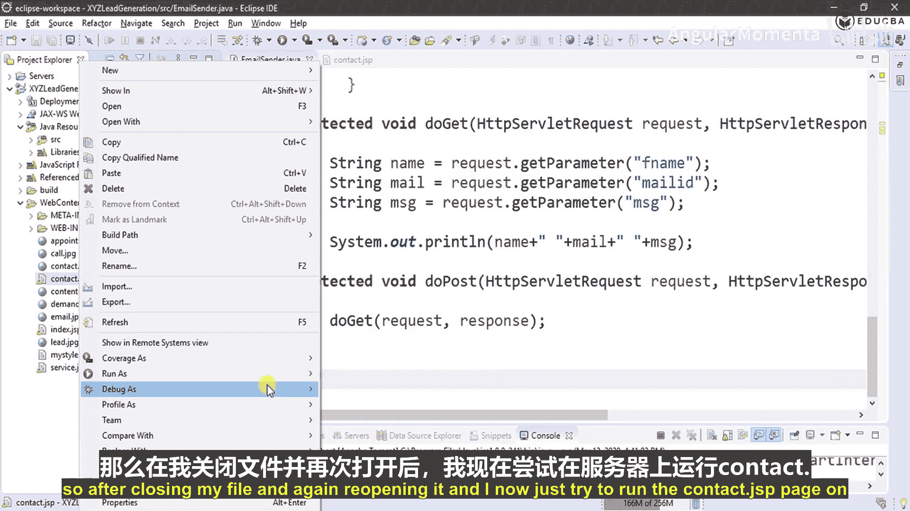
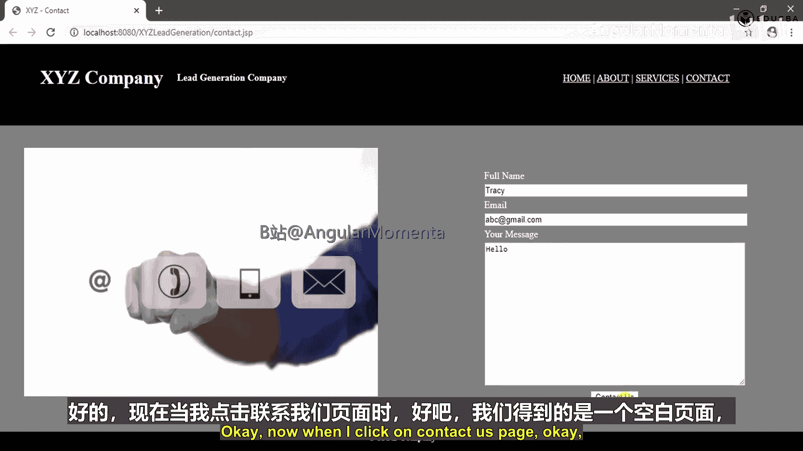
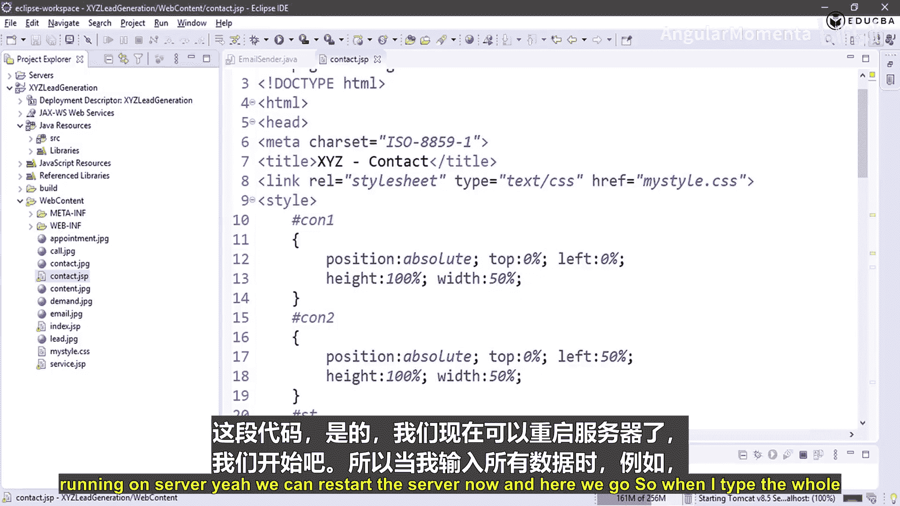
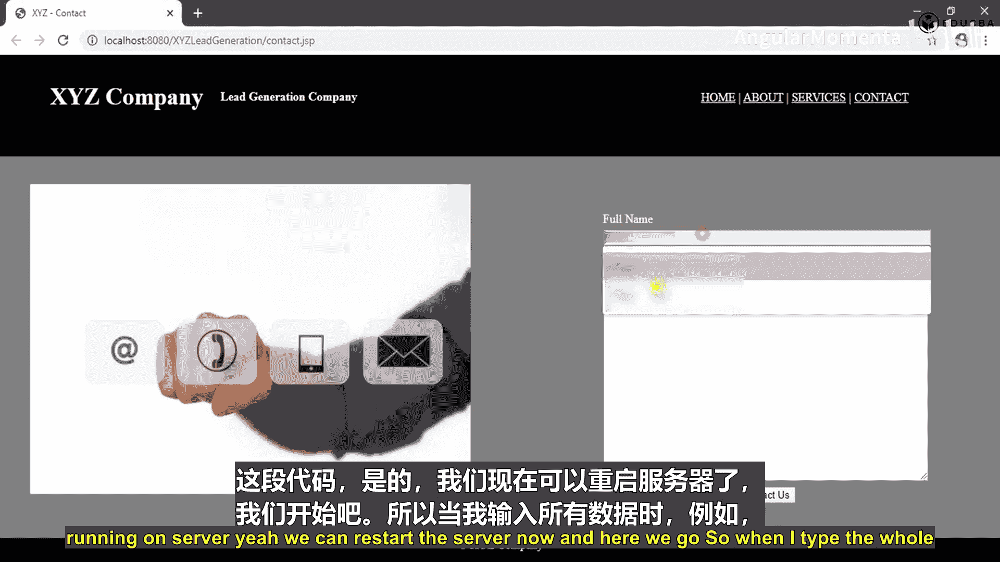
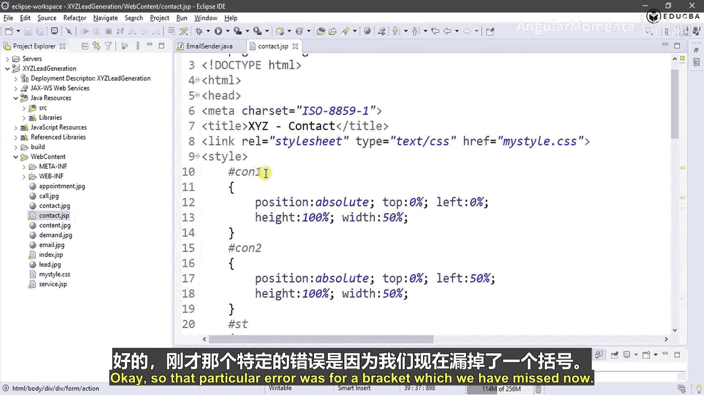
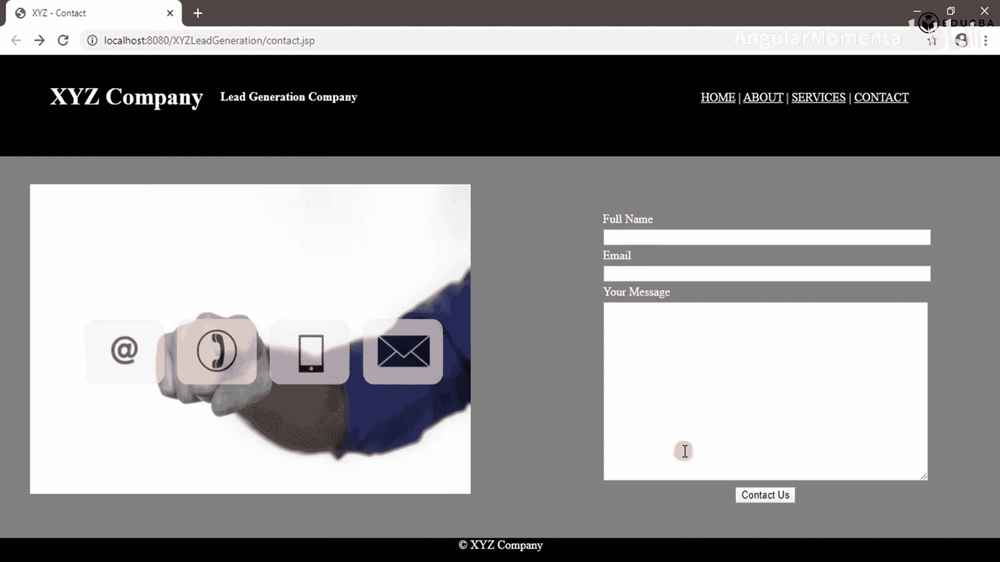
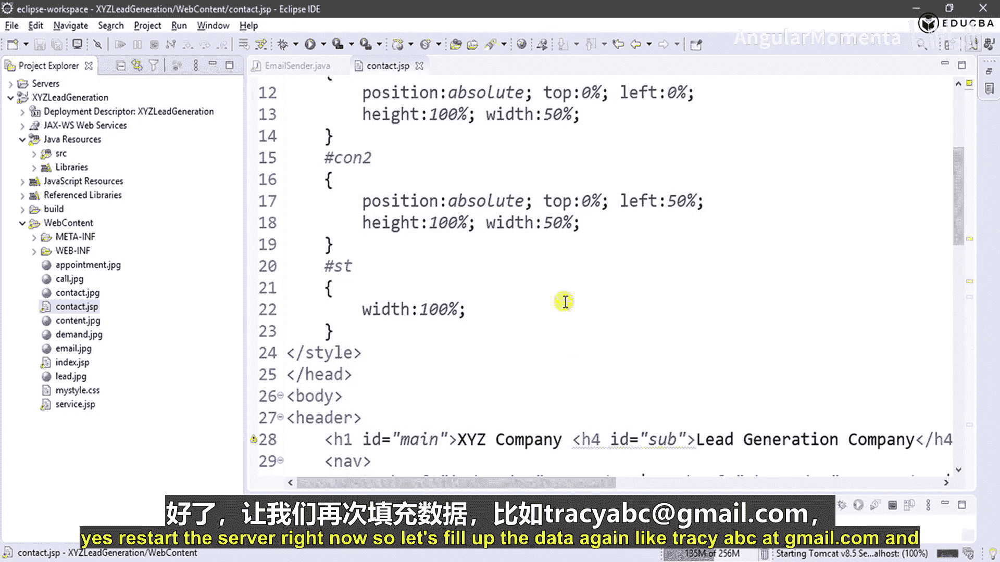
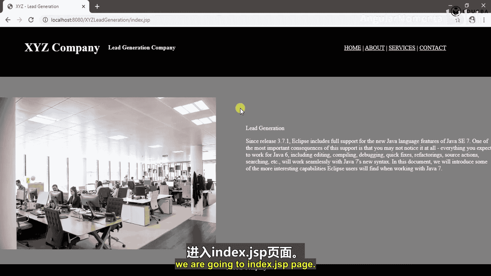
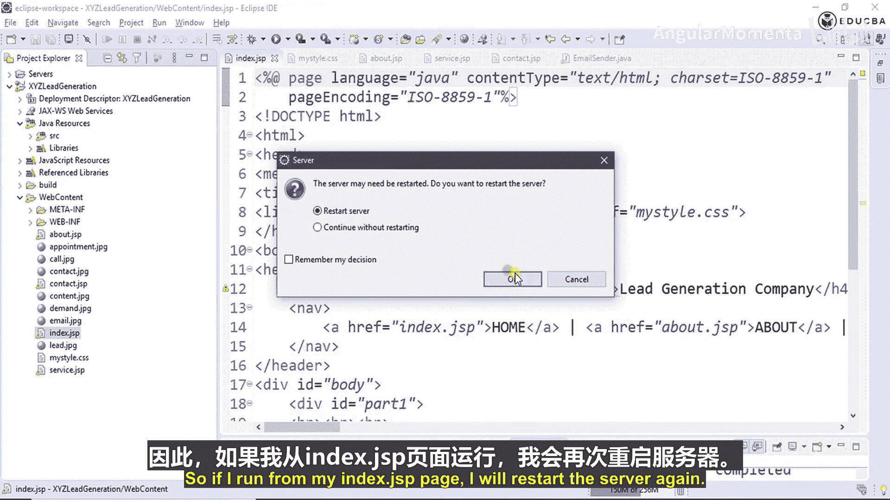
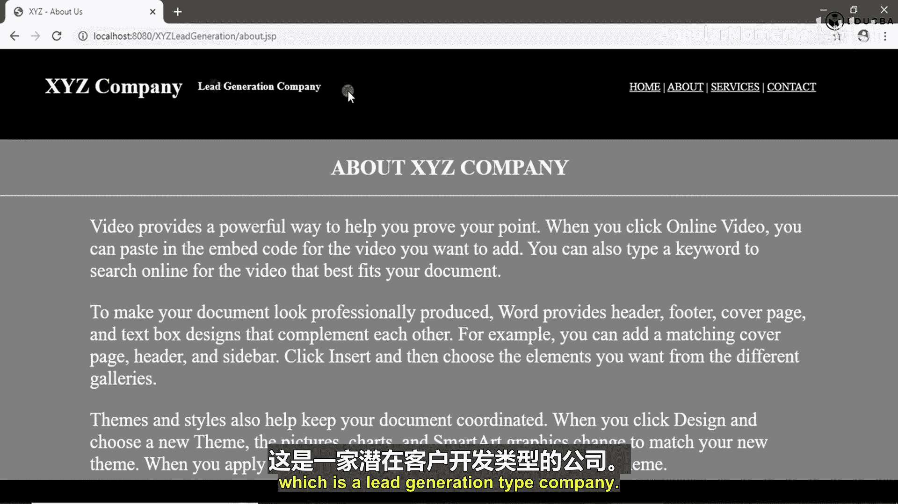

# 004：发送电子邮件 第3部分 📧



在本节中，我们将完成电子邮件发送功能的集成与测试。我们将把从联系表单获取的数据，通过之前创建的邮件发送方法，实际发送到指定邮箱。

上一节我们介绍了如何从JSP页面获取用户输入的数据。本节中，我们来看看如何调用邮件发送方法，并处理可能出现的错误。

## 运行与测试联系页面

首先，运行服务器并打开联系页面（`contact.jsp`）。




在表单中输入测试数据。例如，姓名为“Tracy”，邮箱为“abc@gmail.com”，消息为“hello”。

点击“Contact us”按钮后，页面跳转到一个空白页（`emailSender`页面）。在Eclipse控制台中，可以看到成功获取了表单数据：“Tracy”、“abc@gmail.com”和“hello”。这证明数据获取功能工作正常。

## 调用邮件发送方法

获取数据后，需要将其发送给用户。我们将使用之前创建的 `EmailSender` 类的 `send` 方法。

以下是调用该方法的步骤，需要传入必要的参数：

1.  **发件人邮箱**：例如 `jasonT.smith2801@gmail.com`。
2.  **发件人邮箱密码**：该邮箱的登录密码。
3.  **收件人邮箱**：例如 `tracy@gmail.com`。
4.  **邮件主题**：例如设为“A lead”。
5.  **邮件正文**：将获取的表单数据（姓名、邮箱、消息）拼接成一个字符串。

在Servlet的`doGet`方法中，添加以下代码来调用发送方法并重定向页面：

```java
// 拼接邮件内容数据
String data = name + " " + mailId + " " + message;



// 调用发送邮件方法
EmailSender.send("jasonT.smith2801@gmail.com", "yourPassword", "tracy@gmail.com", "A lead", data);



// 邮件发送成功后，重定向回首页
response.sendRedirect("index.jsp");
```

## 执行代码与错误调试





保存代码并重新运行服务器，再次在联系表单中填写数据并提交。

此时，服务器返回了“500内部服务器错误”。




查看错误日志，发现是代码中缺少了一个括号导致的语法错误（位于`EmailSender`类第22行附近）。

修复这个语法错误（补上缺失的括号），并确保相关文件已保存。



## 功能验证

修复错误后，重启服务器并再次测试。


在表单中填写数据（如Tracy, abc@gmail.com, hello）并提交。

页面成功跳转回首页（`index.jsp`）。同时，在Eclipse控制台中没有再出现异常信息，这表明邮件已经成功发送到指定的收件人邮箱（`tracy@gmail.com`）。


## 项目回顾与总结

至此，我们完成了一个使用JavaMail API发送电子邮件的完整功能。

让我们回顾一下整个项目的流程：
1.  创建并配置了Tomcat服务器。
2.  创建了首页（`index.html`/`index.jsp`）。
3.  创建样式表（`style.css`）来美化页面。
4.  创建了“关于我们”、“服务”和“联系我们”页面。
5.  在“联系我们”页面（`contact.jsp`）的表单中，设置`action`指向处理邮件的Servlet（`EmailSender`）。
6.  创建了`EmailSender` Servlet。在其`doGet`方法中：
    *   获取表单提交的姓名、邮箱和消息。
    *   调用`send`方法，传入发件人凭证、收件人地址、主题（“A lead”）以及拼接好的表单数据作为邮件正文。
    *   发送成功后，将用户重定向回首页。
7.  `send`方法内部配置了邮件会话属性（如SMTP主机、端口、SSL工厂、认证等），创建并发送了邮件。



最终，这个为“XYZ公司”创建的简易网站具备了潜在客户信息收集功能：用户填写联系表单后，信息会通过电子邮件自动发送给指定负责人。




本节课中我们一起学习了如何将前端表单与后端邮件发送服务集成，实现了数据的完整传递，并掌握了基本的错误排查方法。