# 002：操作风险资本计算

在本节课中，我们将要学习巴塞尔协议中关于操作风险资本计算的核心方法——业务指标法。我们将重点解析其构成部分与计算逻辑，帮助初学者理解这一标准化、定量化的风险管理工具。

上一节我们介绍了操作风险的重要性，本节中我们来看看如何通过业务指标法来量化操作风险并计算所需资本。

业务指标法的核心公式为：**操作风险资本 = BIC × ILM**。其中，BIC代表业务指标部分，ILM代表内部损失乘数。这个公式提供了一个计算操作风险资本的高级框架。

## 理解业务指标

业务指标是计算操作风险资本的基础，它由三个核心财务组成部分加总而成。

以下是构成业务指标的三个具体部分：

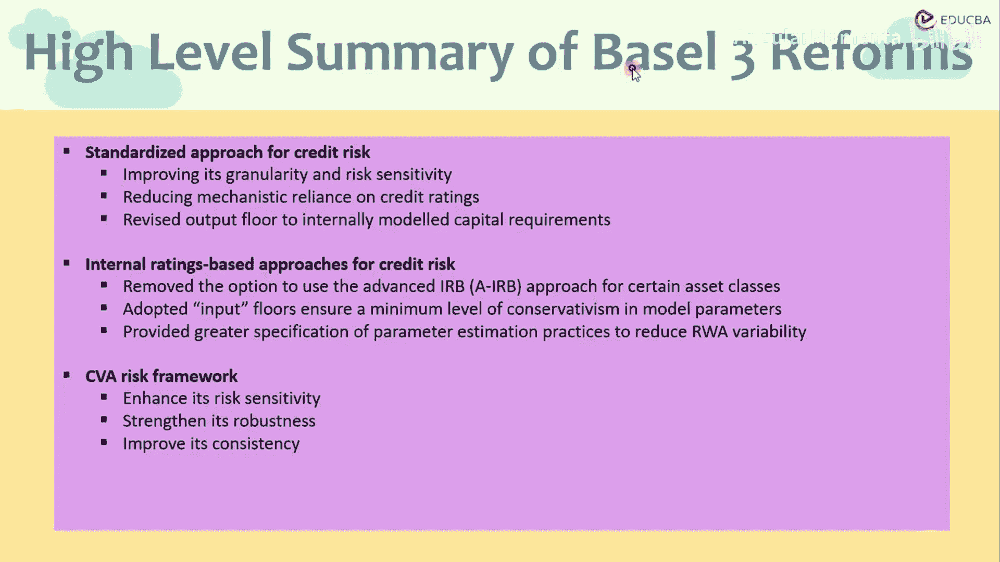

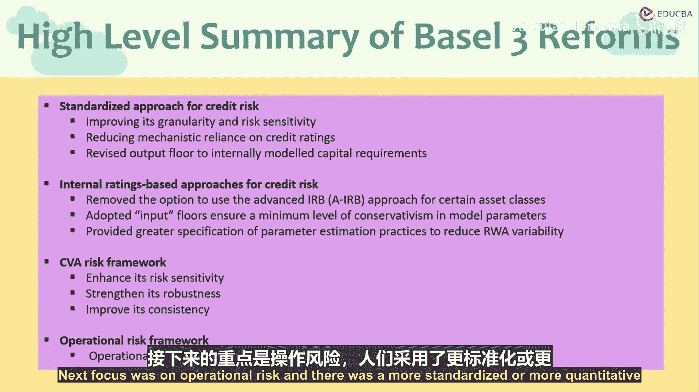

1.  **利息、租赁与股息部分**：这部分收入与银行的传统信贷和投资业务相关。
2.  **服务部分**：这部分收入主要来源于银行提供的各类服务，例如手续费和佣金收入。
3.  **金融部分**：这部分与银行的交易活动和金融工具相关。

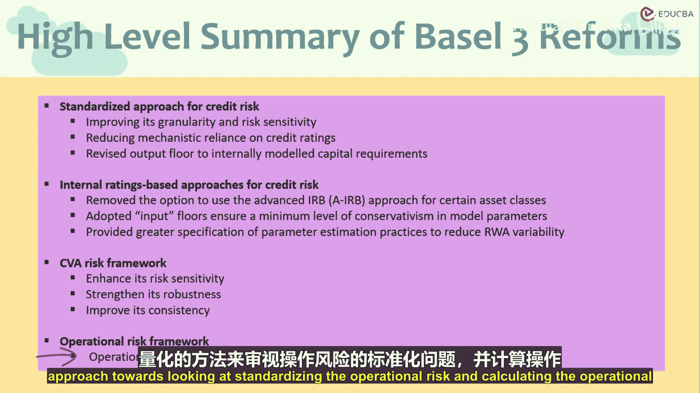

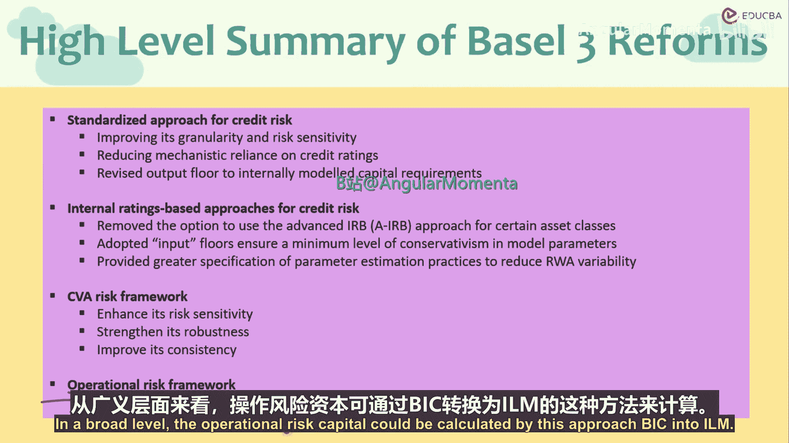

在将这三个部分加总后，需要乘以一个固定的系数 **α**。根据巴塞尔协议的规定，**α** 通常设定为 **12%**。因此，业务指标部分的计算公式可以表示为：

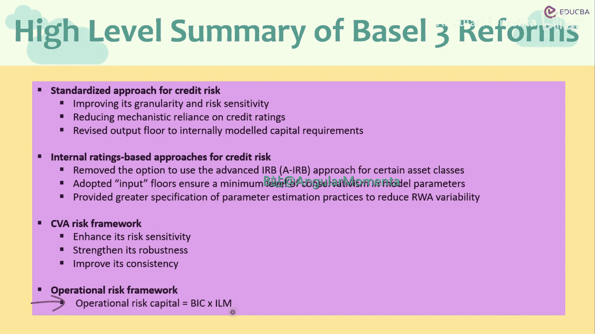

**BIC = (利息、租赁与股息部分 + 服务部分 + 金融部分) × α**

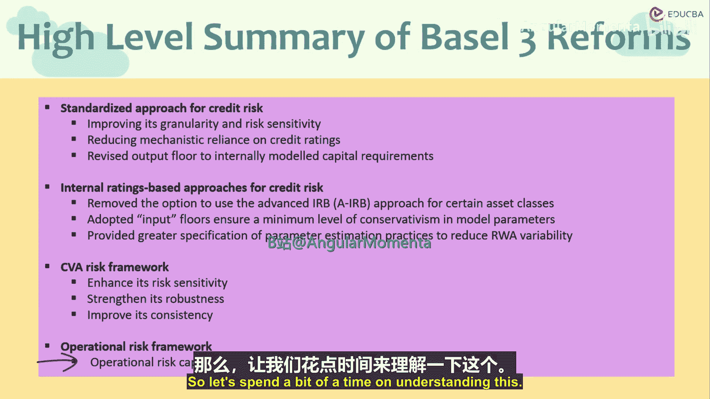

## 内部损失乘数

接下来，我们探讨公式中的另一个关键因子——内部损失乘数。ILM 的作用是将银行自身的内部损失经验纳入资本计算，使资本要求更能反映银行的个体风险状况。

ILM 的计算基于银行的平均历史损失与业务指标之间的关系。其公式为：

**ILM = ln( exp(1) - 1 + (平均历史损失 / BIC)^0.8 )**

这个公式确保了当银行的历史损失数据增加时，其所需的操作风险资本也会相应增加，从而激励银行加强自身的操作风险管理。

## 计算流程总结

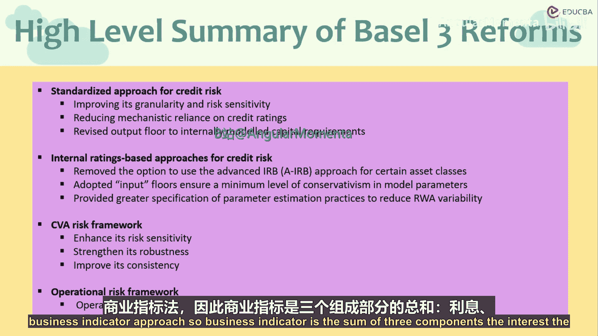

现在，让我们将整个计算流程串联起来。

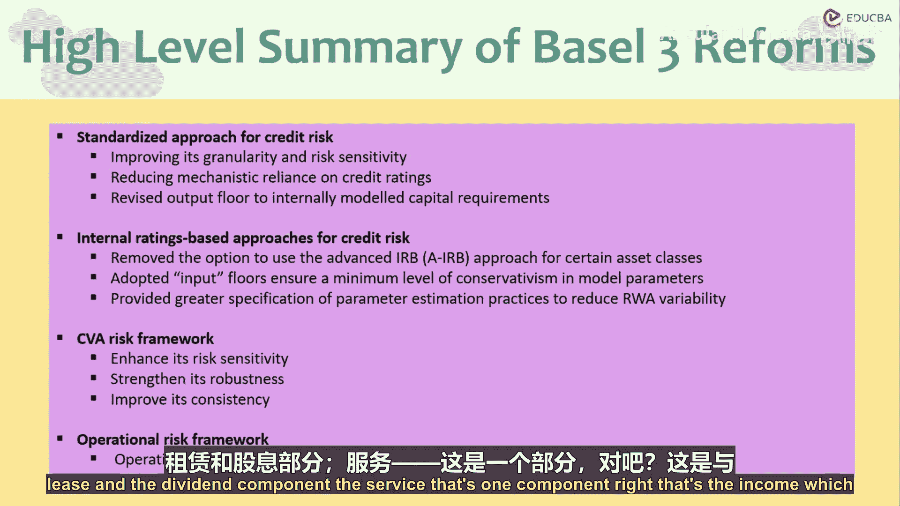

以下是使用业务指标法计算操作风险资本的标准步骤：

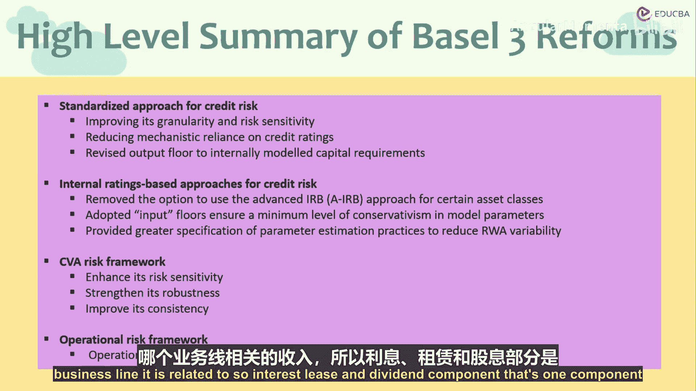

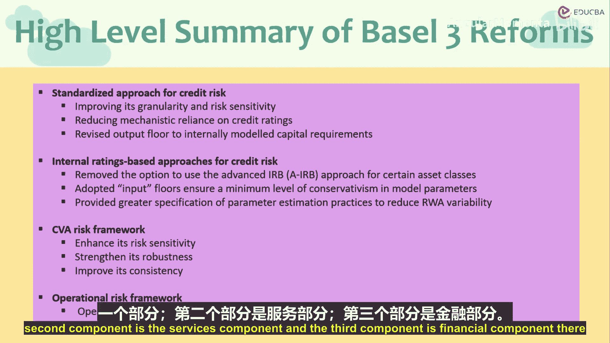

1.  收集数据：汇总过去三年的利息、服务及金融部分收入。
2.  计算业务指标：将三部分收入相加，并乘以系数 α（12%），得到 BIC。
3.  确定历史损失：计算银行过去十年的平均内部操作风险损失。
4.  计算内部损失乘数：将平均历史损失与 BIC 代入 ILM 公式进行计算。
5.  得出最终资本要求：将 BIC 与 ILM 相乘，即得到银行应持有的操作风险资本。

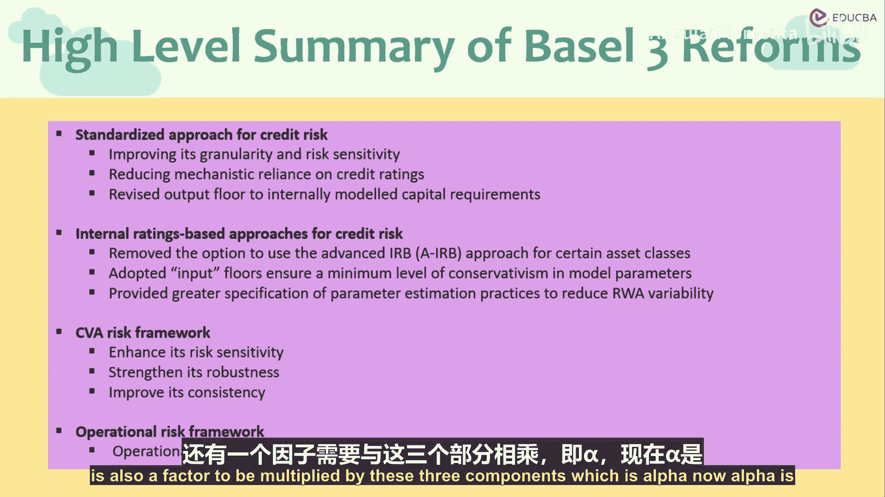

本节课中我们一起学习了巴塞尔协议中操作风险资本计算的业务指标法。我们理解了其核心公式 **操作风险资本 = BIC × ILM**，并详细拆解了业务指标的三个组成部分以及内部损失乘数的计算逻辑。这种方法通过结合银行的业务规模和自身损失历史，为确定操作风险资本要求提供了一个标准化且具有风险敏感性的框架。