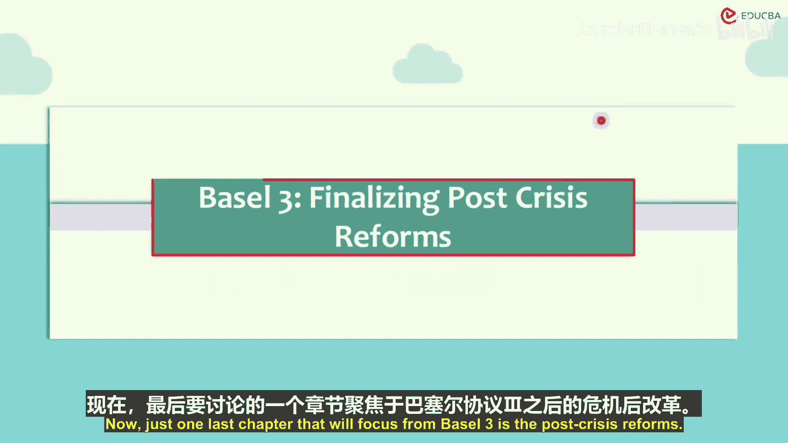
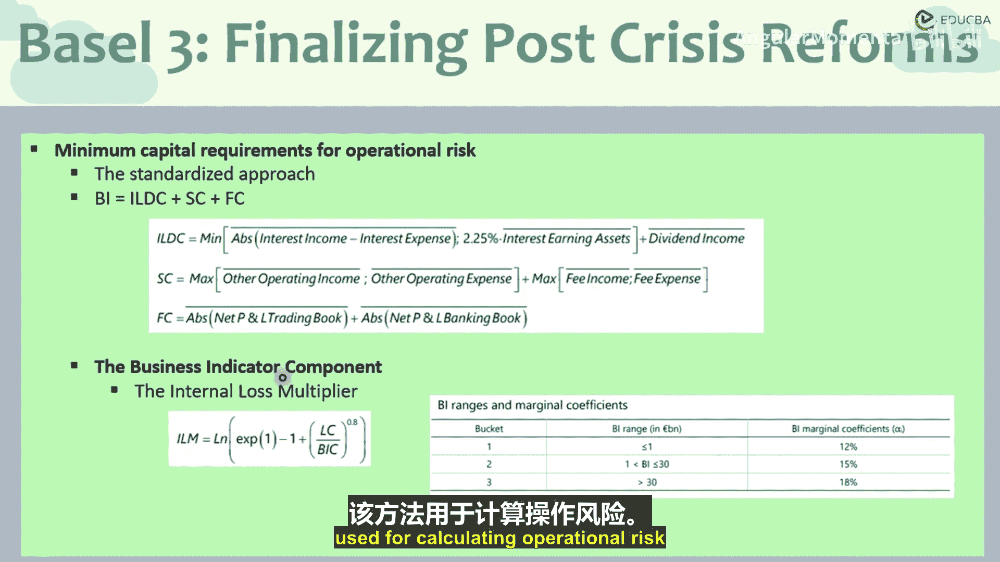

# 004：危机后改革定案 🏦

在本节课中，我们将聚焦于巴塞尔协议III的危机后改革，特别是操作风险资本的计算方法。我们将学习如何通过业务指标和内部损失乘数来确定银行应持有的操作风险资本。

上一节我们介绍了巴塞尔协议的整体框架，本节中我们来看看危机后改革中关于操作风险资本计算的具体定案。

## 操作风险资本的计算方法

根据巴塞尔协议III的改革，操作风险资本（ORC）的计算采用标准法，其核心公式如下：

**ORC = BIC × ILM**

其中：
*   **BIC** 代表业务指标部分。
*   **ILM** 代表内部损失乘数。

这个公式结合了基于银行收入结构的标准化计算（BIC）和反映银行自身历史损失经验的调整因子（ILM）。

## 业务指标部分详解

业务指标部分（BIC）的计算，依赖于银行的业务指标（BI）和一个系数乘数（α）。

**BIC = BI × α**

业务指标（BI）本身是以下三个组成部分在过去三年平均值之和：

**BI = (ILDC + SC + FC) 的平均值**

以下是这三个组成部分的具体定义：

1.  **利息、租赁和股息部分**：这部分是以下三项的最小值：
    *   净利息收入（利息收入 - 利息支出）的绝对值。
    *   利息收入资产的2.25%。
    *   股息收入（绝对值）与租赁收入之和。

2.  **服务部分**：这部分是以下两项的最大值之和：
    *   其他营业收入与其他营业支出的最大值。
    *   费用收入与费用支出的最大值。

3.  **财务部分**：这部分是交易账簿净损益与银行账簿净损益的绝对值之和。

系数α的值根据业务指标（BI）的规模区间确定：

*   当 **BI < 10亿欧元** 时，**α = 12%**。
*   当 **10亿欧元 ≤ BI ≤ 300亿欧元** 时，**α = 15%**。
*   当 **BI > 300亿欧元** 时，**α = 18%**。

## 内部损失乘数详解

内部损失乘数（ILM）将银行自身的损失历史引入资本计算，其公式如下：

**ILM = ln( exp(1) - 1 + (LC / BIC) )**

其中：
*   **LC** 是损失部分，计算公式为：**LC = 15 × 过去10年的平均操作风险损失**。
*   **BIC** 即上文计算出的业务指标部分。

这个乘数的特性是：
*   当 **LC = BIC** 时，**ILM = 1**。此时操作风险资本完全等于BIC。
*   当 **LC > BIC**（即历史损失较高）时，**ILM > 1**，银行需要持有更多资本。
*   当 **LC < BIC**（即历史损失较低）时，**ILM < 1**，资本要求可适当降低。

## 方法的核心思想

这种ILM方法在操作风险资本计算中建立了一种权衡机制。BIC部分提供了一个基于银行收入结构的、标准化的资本基准。而ILM部分则根据银行自身过去10年的实际损失经验（通过LC体现）对这个基准进行调整。这鼓励银行加强风险管理以降低实际损失，从而可能获得更低的资本要求。

本节课中我们一起学习了巴塞尔协议III危机后改革中关于操作风险资本计算的核心方法。我们掌握了由业务指标部分和内部损失乘数构成的完整公式，理解了如何根据银行的收入结构和自身损失历史来确定所需的资本金，从而增强银行的抗风险能力。