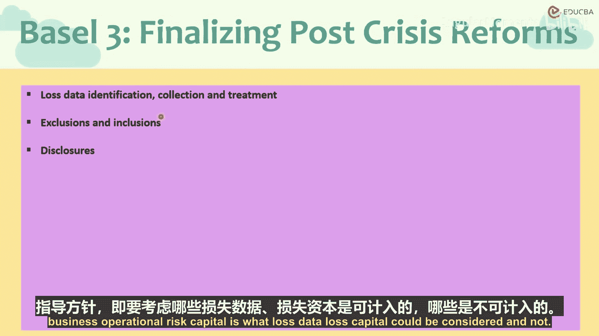
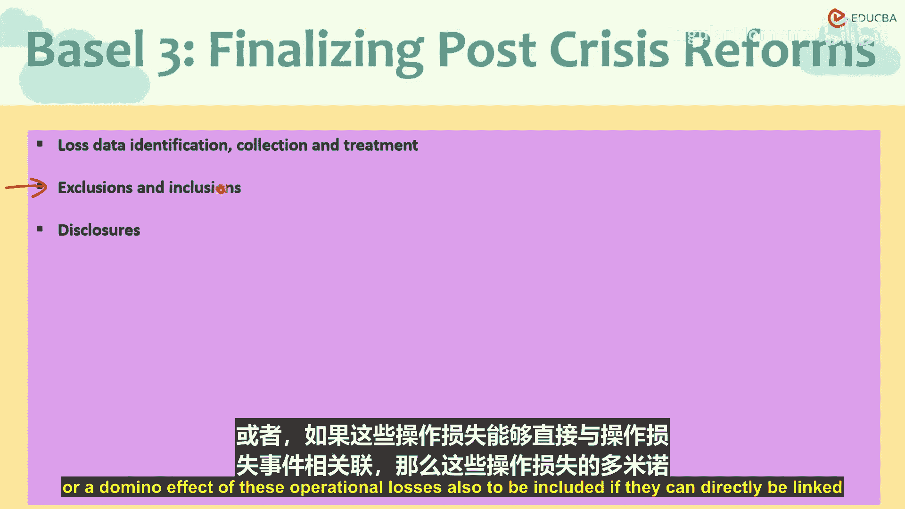
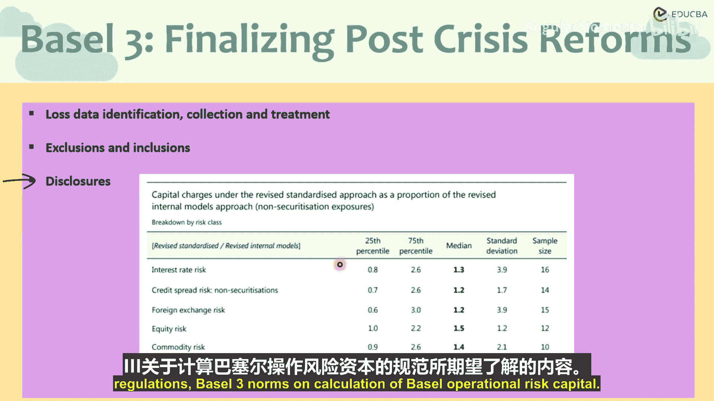

# 005：操作风险资本计量准则

在本节课程中，我们将学习在使用标准化方法计量操作风险资本时，需要遵循的数据与披露准则。我们将明确哪些损失数据应被纳入计算，哪些应被排除，并了解相关的信息披露要求。

上一节我们介绍了操作风险资本的标准化计量方法，本节中我们来看看在应用此方法时需遵循的具体准则。

## 内部损失数据的使用准则

使用内部损失数据计量操作风险资本时，需满足以下基本要求。

以下是关于内部损失数据的关键准则列表：
*   **观察期要求**：内部生成的损失数据计算应至少基于**10年**的观察期。当银行从其他方法转向标准化方法时，应至少拥有**5年**的数据，并在接下来的五年内逐步增加到10年。
*   **业务相关性**：内部损失数据必须与银行当前的业务活动、技术水平和风险管理流程明确关联。如果银行的业务性质或经营方式发生变化，这种变化应反映在业务指标三个组成部分的乘数中。

## 损失数据的界定与处理

在计量损失时，必须区分总损失、净损失和回收。

以下是关于损失计量的具体规则列表：
*   **总损失**是指回收前的损失。
*   **净损失**是指考虑预期回收影响后的损失。如果已知实际回收值则采用实际值，否则可采用预期值。
*   **回收处理**：回收的发生独立于损失事件本身，但与原损失事件相关。对于独立的损失事件，其回收率也应被视为独立。
*   **成本包含**：净损失应包含任何直接相关的费用支出，例如减值费用、结算费用、核销成本等。
*   **外部费用**：与操作损失直接相关的外部费用，如法律费用、支付给顾问或律师的酬金，也应计入净损失成本。
*   **重置成本**：资产重置成本也应计入净损失。
*   **拨备与损益影响**：拨备及其对损益表的影响必须包含在内。
*   **连锁损失**：由操作损失事件直接引发的后续或连锁效应损失，若能明确关联，也应纳入计算。

因此，在可能的情况下，应尽量将不同的操作风险损失事件分开处理。尽管在实践中，一个操作风险事件可能引发多个连锁事件，难以完全分割。

## 信息披露要求

巴塞尔协议对操作风险资本计量有明确的信息披露规定，以提升透明度。

以下是主要的信息披露要求列表：
*   **披露触发条件**：当银行的业务指标超过**10亿美元**时，必须进行相关披露。
*   **披露内容**：需披露所使用的乘数、内部损失数据情况、操作风险资本的计算过程、采用的系数以及计入的费用等所有细节。
*   **业务指标构成披露**：必须披露哪些类型的收入计入了业务指标的三个组成部分（利息、服务与金融），以及费用、损失、利润和收入的构成。
*   **资本要求披露**：针对不同类型资产和风险的标准化乘数或资本要求也需要披露。

这些披露信息通常在行业层面进行汇总。从考试角度，我们无需记忆所有细节，但需了解这是巴塞尔协议III在操作风险资本计量方法上的监管期望和规范要求。

本节课中，我们一起学习了使用标准化方法计量操作风险资本的核心准则。我们明确了合格内部损失数据的要求，学会了如何界定和处理总损失与净损失，并了解了为确保透明度而必须遵守的关键信息披露规定。这些准则共同构成了稳健操作风险资本计量的基础。