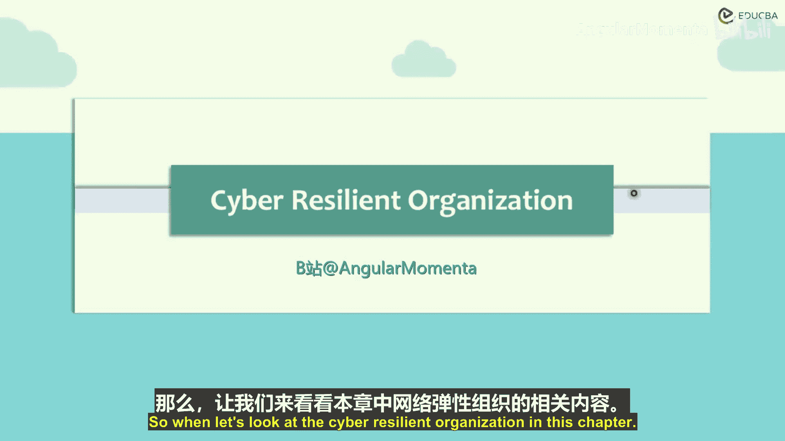
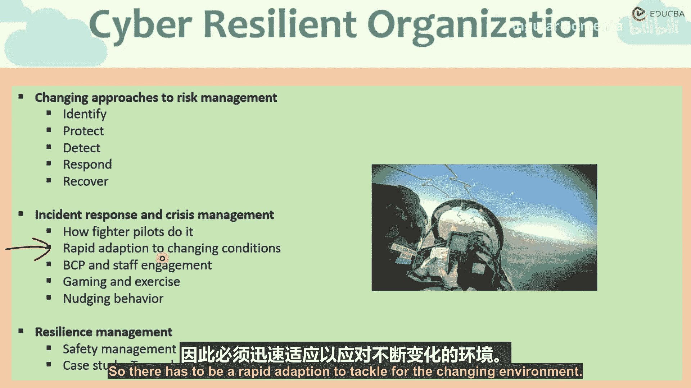

# 006：事件响应与管理

在本章节中，我们将探讨操作风险的一个不同方面——网络风险。我们将通过案例研究，分析具备网络韧性的组织特征，并为组织提供应对网络风险的关键要点。

上一节我们介绍了网络风险的基本概念与应对框架，本节中我们来看看如何构建一个具备网络韧性的组织。

## 网络风险管理框架

美国国家标准与技术研究院提出了一种网络风险管理方法。该框架包含五个核心功能，旨在帮助组织系统性地管理网络风险。

以下是该框架的五个功能：

1.  **识别**：建立组织对网络风险的理解，以管理涉及系统、人员、资产和数据的风险。
2.  **保护**：制定并实施适当的安全防护措施。
3.  **检测**：制定并实施适当的活动，以识别网络风险事件的发生。
4.  **响应**：对检测到的事件采取行动。
5.  **恢复**：制定并维护韧性计划，以恢复可能因网络安全事件而受损的能力。

请注意，本章重点在于网络韧性组织。因此，重点不仅在于识别和检测，更在于恢复。该框架的最后一部分至关重要，它关乎组织在遭受网络攻击后如何恢复正常运作。无论我们采取何种保护措施，网络攻击的风险始终存在，这是一个不断演变的现象。网络风险事件发生的概率始终不为零。组织的重点应放在如何恢复到之前的状态，或组织对网络风险事件的韧性有多强。

## 危机管理与事件响应

重点不仅在于识别、保护和响应，还在于危机管理。

网络安全系统是一个复杂且需要专业技能的过程，它需要人力资源具备特定的操作和技能。人与机器之间需要达到一种关键的平衡，即硬件、软件和人员如何协同工作。尤其是在我们日益迈向互联和数字化的时代，物联网使得生活的方方面面都有联网设备，网络安全变得至关重要，其影响范围将越来越广。

危机管理或事件响应的一种方法是借鉴战斗机飞行员的处理方式。

战斗机飞行员在飞机可能坠毁时，有能力从驾驶舱紧急弹射，并使用降落伞安全着陆，或在紧急条件下以降低的能力着陆。这种方法首先依赖于人与机器界面的良好协调，以及人员为应对预期和意外事件所做的培训和准备。问题可能因各种原因在任何情况下发生。必须理解，无论准备多么充分，总会出现意想不到的情况。因此，组织需要具备广泛备份、灾难恢复计划、快速行动方案的能力，同时也需要具备应对异常和意外情况的方法，以及事件响应的总体思路。

## 适应快速变化的环境

我们需要牢记的第二点是，这是一个快速发展和变化的世界。互联网和网络安全每天都触及我们生活的不同方面。程序在演变，网络安全在演变，恶意行为者也在演变。这是一个快速发展的领域。

因此，作为一个组织，我们必须快速适应不断变化的环境。在智能手机出现之前的时代，互联网仅触及我们生活的少数方面。如今，甚至我们的手表、心脏起搏器、数字助听设备都通过物联网连接到互联网。因此，如果网络安全遭到破坏，后果可能非常致命。例如，如果您的助听器或起搏器被外部代理入侵或覆盖，可能会危及生命。

所以，必须快速适应以应对不断变化的环境。

---

本节课中，我们一起学习了构建网络韧性组织的关键框架与方法。我们了解了NIST提出的识别、保护、检测、响应、恢复五步风险管理框架，并认识到恢复与韧性建设的重要性。我们还探讨了借鉴战斗机飞行员理念的危机管理方法，以及组织必须快速适应日新月异的网络威胁环境。核心在于，组织不仅需要预防和检测风险，更需要建立强大的响应与恢复能力，以在不可避免的攻击后迅速恢复正常运营。