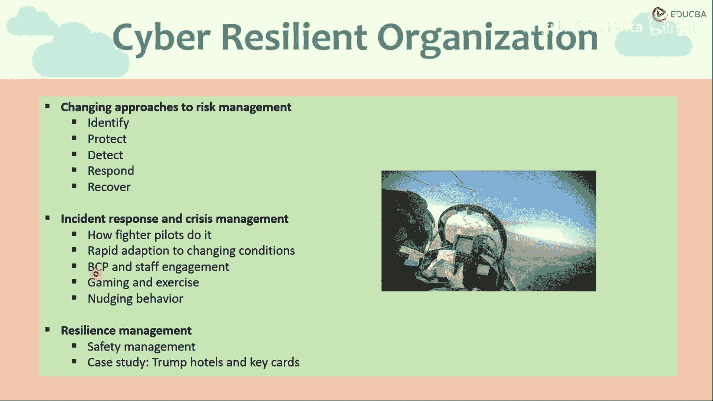
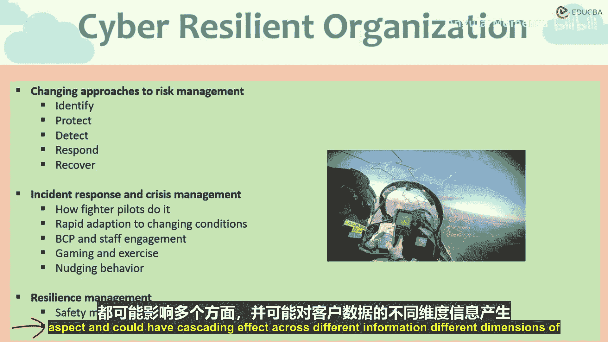

# 007：事件响应与管理（续）

在本节课中，我们将继续探讨事件响应与管理，重点学习业务连续性计划、通过游戏化与演练提升员工参与度，以及数据安全管理。这些方法共同构成了应对网络事件的多维度策略。

上一节我们介绍了事件响应的基本框架，本节中我们来看看如何通过制定周密的计划与日常演练来增强组织的韧性。

## 制定业务连续性计划

业务连续性计划旨在预见各类可能发生的事件，并制定广泛的应对策略，包括如何建立备份机制。

该计划可遵循特定的国际标准指南，例如 **ISO 27001** 和 **ISO 22301**。这些标准为组织将网络安全事件纳入业务连续性计划提供了稳健的指南。

*   **ISO 27001**：该国际标准描述了信息安全管理体系的最佳实践。
*   **ISO 22301**：该国际标准专门针对业务连续性计划。

通过结合这两套标准，我们可以将网络安全事件有效地整合到业务连续性计划中。该计划可包含以下基本方面：

*   **数据与系统备份**：例如，如果员工需要居家办公，可以将所有数据存储在云端，通过安全网络访问，确保业务持续运行。
*   **服务器备份**：对服务器进行备份。
*   **软件备份**：对关键软件进行备份，甚至建立“备份的备份”。
*   **地理分布**：将这些备份地理分布在不同位置。这样，即使某个地点的站点或服务器发生问题，也可以通过切换到不同地点（甚至不同国家）的服务器来执行连续性计划。

如果员工无法在短时间内返回办公室，必须居家或从世界任何地方工作，那么通过受控软件、受保护线路和安全线路，从服务器和云端软件访问数据与软件的能力，对于维持业务连续性就至关重要。这一点在新冠疫情期间的封锁中得到了非常密切的验证。

## 游戏化与演练

接下来是采用游戏与演练的方法。这种方法在某种程度上是模拟网络安全事件，并通过游戏化方式来处理。

这主要有两种形式：

第一种是设计游戏形式的练习，要求员工以特定方式工作，从而增强和巩固他们应对网络风险的理解。例如，与其枯燥地讲授如何识别钓鱼邮件，不如通过互动程序、互动学习环节或游戏事件来应对网络安全风险或钓鱼邮件。这被称为**游戏化**。目前已有许多培训项目和人才实验室奖项专注于开发游戏化应用。这些应用可以是基于网页或桌面的，旨在将网络安全与网络韧性行为融入员工的日常行为中。

第二种是进行特定的演练。就像进行消防演习一样，也可以进行网络安全演习。有一点必须注意，所有这些都依赖于员工的参与。我们必须将这些网络安全事件或安全行为融入员工的日常行动、关注点和活动中。这种参与必须发生在从高层到底层的每个层级。这些网络安全风险事件应该是高度可见的，并成为日常例行工作的一部分。例如，可以在食堂或洗手间等日常必经之处进行提示。还可以进行测试、突击检查，或运行内部程序来模拟钓鱼邮件，以检查有多少员工能够识别。

例如，可以测试有多少员工会落入钓鱼邮件的陷阱并实际采取行动，如点击特定链接、安装程序或下载附件。与其等待外部攻击者发送钓鱼邮件并惊讶于有多少人中招，网络安全团队可以内部发送此类欺诈性邮件，观察普遍的反应模式。如果太多人中招，可以针对这部分员工进行再培训或采取不同的培训方法。如果员工表现出安全的网络行为，则应予以鼓励。这些响应措施不应被孤立看待，而应作为协调一致的联动事件。

## 数据安全管理

这是一种多管齐下、多维度的处理网络事件和网络危机管理的方法，适用于不同情境。它们不能孤立运作，而必须协同工作，共同应对各种情况。

安全管理是其中的重点，包括对数据的妥善保管，特别是个人可识别信息数据。从网络风险和网络安全的角度，数据可以根据敏感性被分类为：公开数据、受保护数据、个人数据、私有数据、个人身份数据等。基于不同的分类，可以采取不同的措施来保护数据。任何私有数据的处理方式都可能与公开数据不同；涉及客户身份的数据，如客户的金融交易详情、安全信息详情、国民保险详情等，则需要区别对待，并可能为其设置额外的保护层。

不同类型的数据将有不同的安全措施。这不仅适用于软件和数据，也适用于硬件及外围系统。我们可以参考一个案例：在2014年至2017年间，美国前总统唐纳德·特朗普旗下的特朗普酒店发生数据泄露。此次泄露最终暴露了7万张信用卡号码以及所有曾与特朗普酒店关联的客户记录。这一事件仅在银行开始发现数百起欺诈交易后才被曝光。银行追踪了这些卡片的金融交易，发现它们最后一次合法交易均发生在特朗普酒店。数据被泄露，信用卡信息被盗并被大规模滥用，出现了大量欺诈性收费和安全身份盗用，这充分暴露了特朗普酒店在网络安全管理上的缺失和松懈。调查发现，黑客侵入了特朗普酒店的中央预订系统。这个预订系统显然用于处理酒店的在线预订，该专用定制程序被软件提供商Sabre Networks的一个数据漏洞所攻破。恶意攻击者利用软件提供商的这个漏洞，进入了特朗普酒店的预订系统，并从中窃取了大量金融信息用于欺诈交易。由此可见，在整个网络安全链的某一环节出现一个小漏洞，就可能影响多个方面，并对客户数据的不同维度产生连锁反应。

本节课中，我们一起学习了构建业务韧性的三个关键方面：制定遵循国际标准的业务连续性计划、通过游戏化和演练提升全员网络安全意识与参与度，以及实施基于数据分类的精细化安全管理。这些策略需要协同实施，共同构建一个多层次、主动式的网络事件防御与响应体系。