# 008：网络韧性目标 🎯

在本节课中，我们将学习如何区分具备良好网络韧性的组织与表现不佳的组织，并深入探讨构成网络韧性的四个核心属性。我们还将通过一个真实案例，分析失败与成功的具体表现，最终明确网络韧性的核心目标。

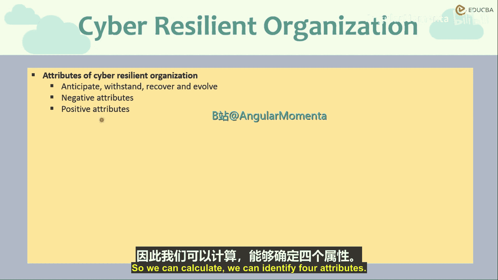

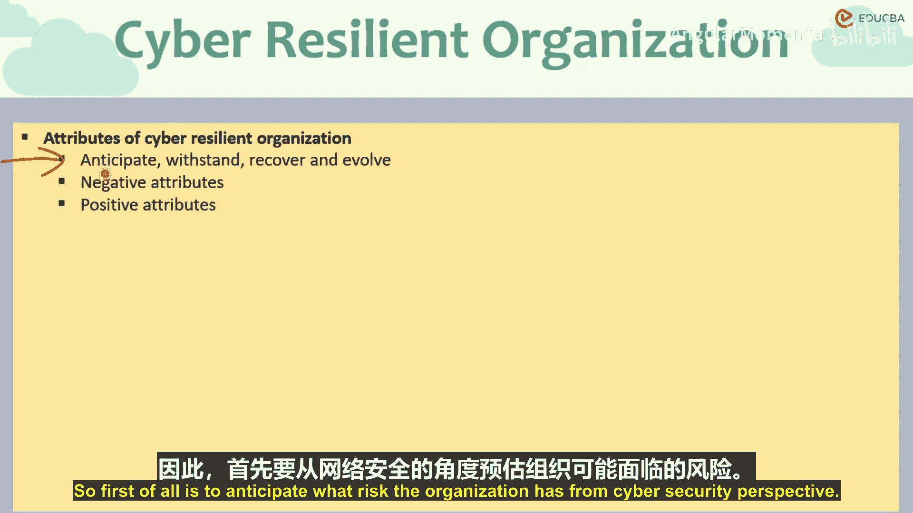

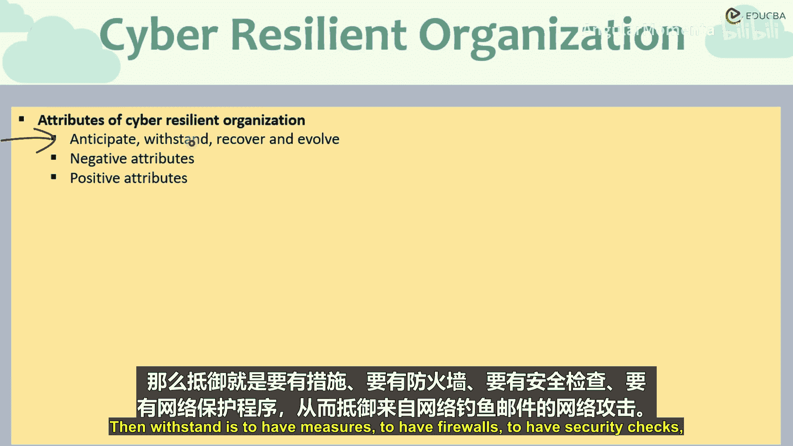

## 网络韧性组织的四大属性

通过对比分析，我们可以识别出网络韧性强的组织普遍具备的四个关键属性。这些属性构成了一个完整的防御与恢复循环。

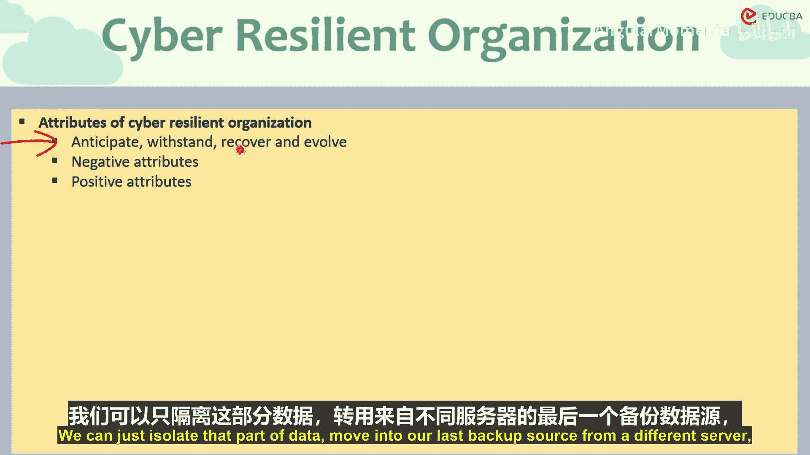

以下是网络韧性组织的四大核心属性：

1.  **预见**
    组织需要从网络安全角度，全面识别自身面临的各种网络风险和威胁。这些风险可能与其他组织相同，也可能存在独特的部分。

2.  **抵御**
    组织需要部署防火墙、安全检查、网络保护程序等措施，以抵御网络攻击。例如，防范网络钓鱼邮件的策略、垃圾邮件防护政策和反病毒程序等。

3.  **恢复**
    无论系统多么坚固，攻击总会发生。因此，必须制定从攻击中恢复的计划。例如，如果一个数据中心遭遇数据泄露，应有独立的、未联网的备份数据。这样，当一组服务器数据损坏时，可以隔离该部分数据，切换到来自另一台服务器的最近备份源，并恢复业务运营。

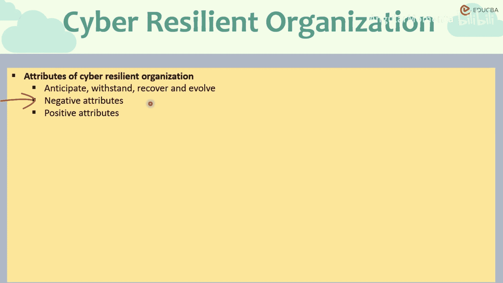

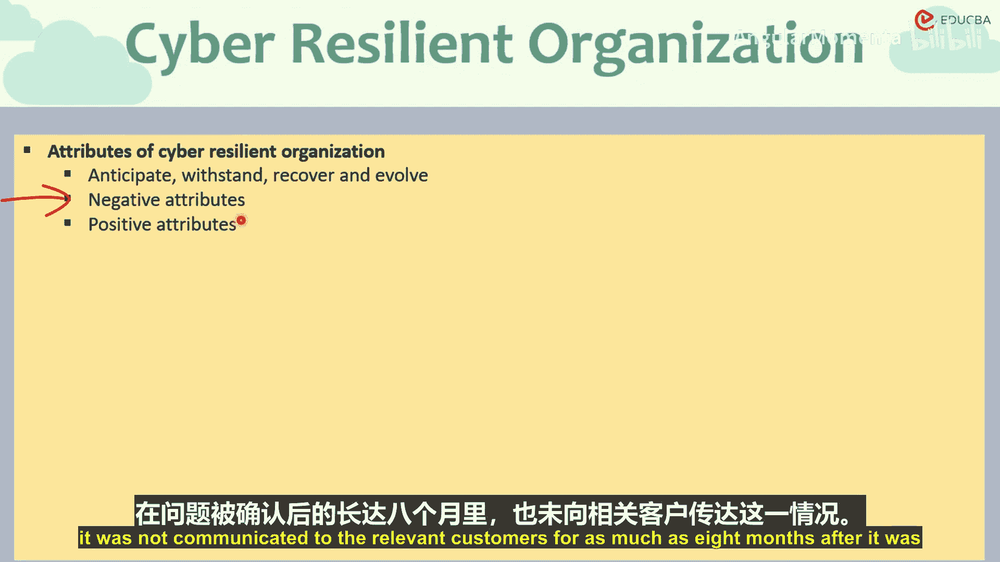

4.  **演进**
    一旦识别出一次安全漏洞或网络威胁，组织需要改进系统以克服它，避免再次成为受害者。这种演进必须是频繁、规律且主动的过程，而不仅仅是事后反应。组织应能够在外界威胁真正构成威胁之前就识别它们。

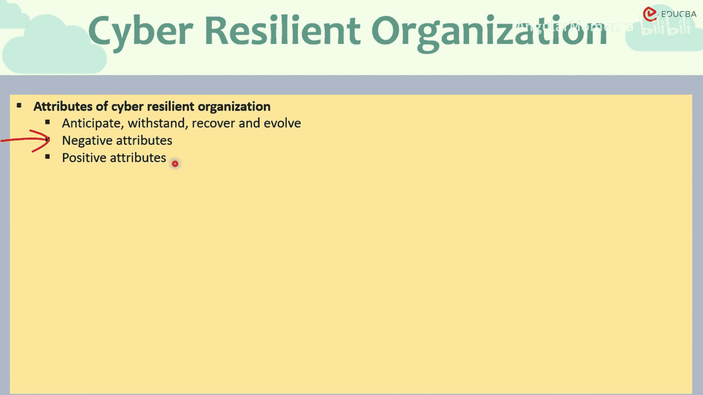

## 负面属性案例分析：Equifax数据泄露事件

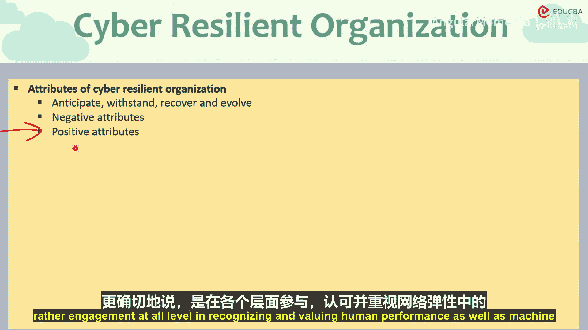

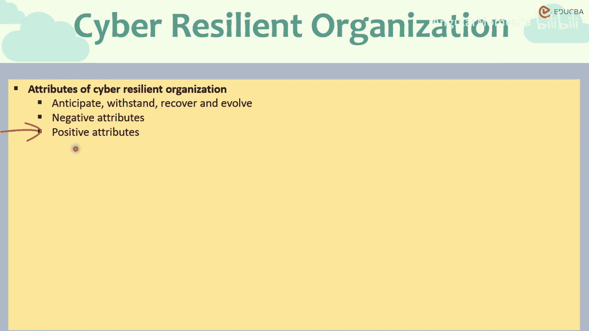

上一节我们介绍了网络韧性的理想属性，本节我们通过一个反面案例来看看缺乏这些属性的后果。2017年Equifax的数据泄露事件是一个经典案例。

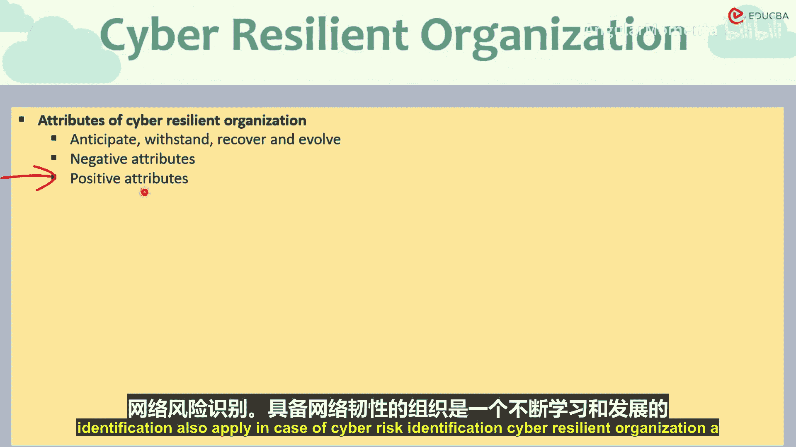

以下是该事件中暴露的负面属性：

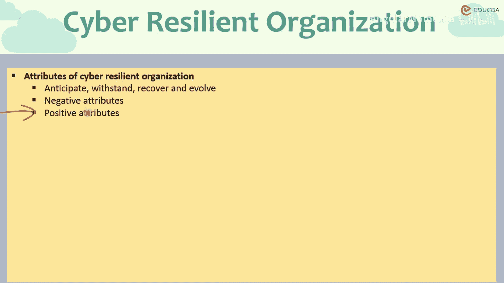

*   **未能预见与抵御**：攻击发生后至少六周内未被发现，表明其监测和抵御机制存在严重缺陷。
*   **未能恢复**：事件被识别后，长达八个月未通知受影响的客户，缺乏有效的恢复和沟通计划。公司CEO将原因归咎于飓风导致数据中心瘫痪，无法确定受影响的客户范围，这恰恰说明了恢复计划的缺失。
*   **沟通不透明**：未能及时、公开地与利益相关者沟通，是网络韧性失败组织的一个重大负面标志。

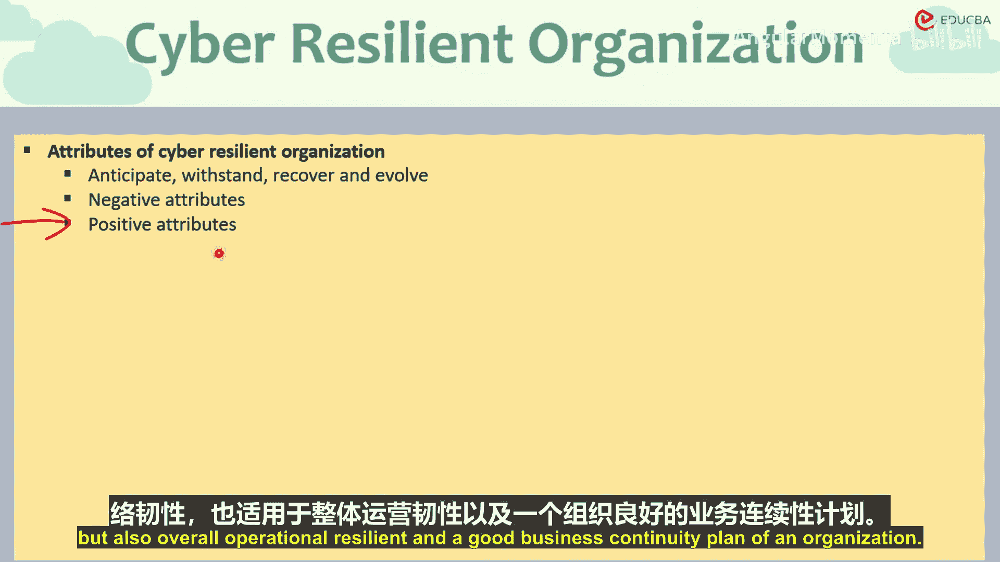

## 正面属性与网络韧性目标

了解了负面案例，我们再来看看构成网络韧性的正面属性有哪些。这些属性不仅适用于网络风险，也适用于整体的运营风险。

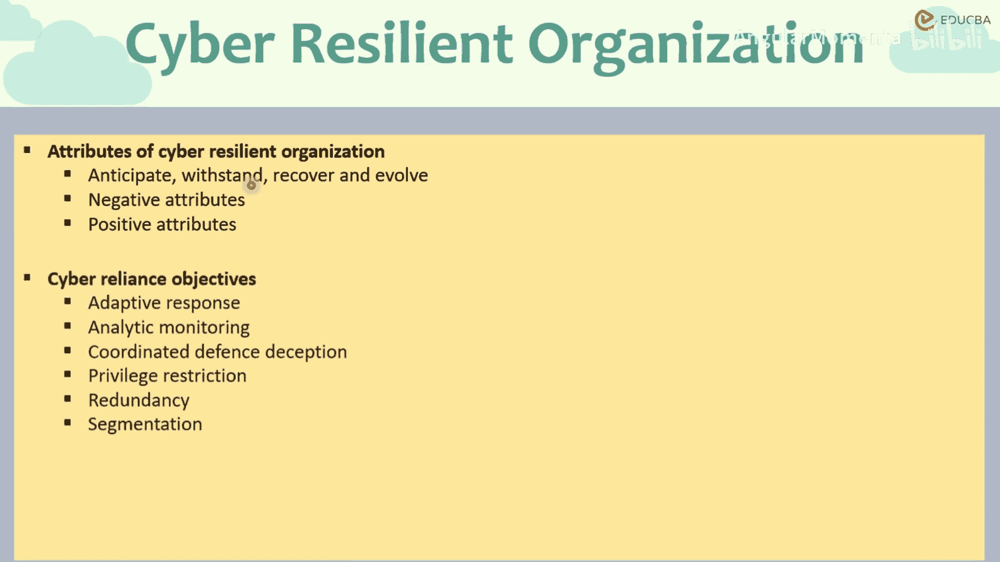

以下是网络韧性组织的关键正面属性：

*   **高层承诺与全员参与**：高层领导的支持以及各级员工在识别和重视人力与机器绩效方面的参与。
*   **支持问题报告的文化**：鼓励报告安全问题的组织文化。
*   **持续学习与演进**：由于攻击者每天都在进化，防御方也必须以同等甚至更快的速度学习和适应。
*   **了解自身强弱项**：清楚认识组织的优势与弱点，并有计划地识别和克服弱点。
*   **灵活适应性**：最大化在不损失功能的情况下解决问题的能力。例如，数据中心故障可切换至备用中心，硬件故障可转向云端软件，物理系统无法访问时有数字化备份等。这要求员工交叉培训，确保一个团队或地点失效时，其职能有后备支持。

这些属性共同服务于网络韧性的核心目标：**在遭受网络威胁时，能够恢复并将业务中断降至最低**。这不仅要求能够抵御攻击，还必须具备恢复机制。

为实现此目标，需要采取以下关键行动：

1.  **适应性响应与灵活性**：执行和监控行动计划，采取最佳行动改变受攻击面并维持关键能力，以恢复功能。
2.  **分析性监控**：持续收集和分析数据，并在不同部门、业务线和防御模式之间进行协调沟通。
3.  **欺骗战术**：在网络战中，可以采用欺骗手段误导攻击者，例如诱导其攻击冗余区域。
4.  **系统冗余**：建立备份的备份。例如，拥有执行相同任务但位于不同地点的第二个数据中心，并进行每日隔离备份，确保一个中心受攻击时另一个不受影响。但需在冗余成本与遭受攻击的潜在损失之间取得平衡。
5.  **业务分割**：将不同业务线彼此隔离，以便一部分失效时，其他受保护的部分能继续运行。
6.  **事件响应计划**：制定类似消防队的应急预案。虽然每次网络攻击都独一无二，但可以制定通用的行动指南，明确需要采取和预防的行动、如何审计追踪和处理数字证据、如何查找漏洞、以及事件发生后团队内的责任分配和取证调查流程。这些预案需要反复测试演练，确保实际攻击发生时组织能有效响应。

## 总结

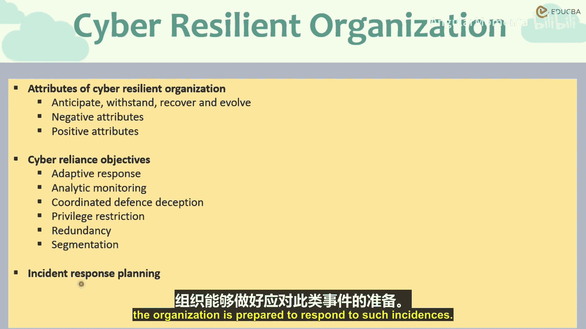

本节课中，我们一起学习了网络韧性组织的四大核心属性：**预见、抵御、恢复、演进**。通过Equifax的案例，我们分析了缺乏这些属性导致的严重后果，如未能及时发现攻击、缺乏恢复计划和沟通不透明。同时，我们也探讨了构建网络韧性的正面属性，如高层承诺、学习文化和灵活适应性。最终，我们明确了网络韧性的目标是**最小化业务中断并快速恢复**，并围绕该目标介绍了包括冗余设计、事件响应计划在内的关键实施策略。