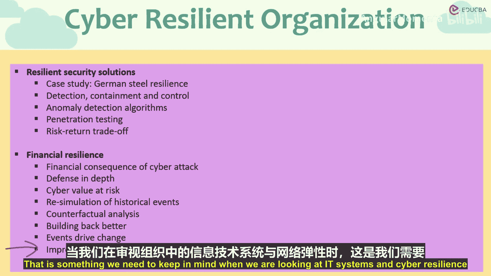
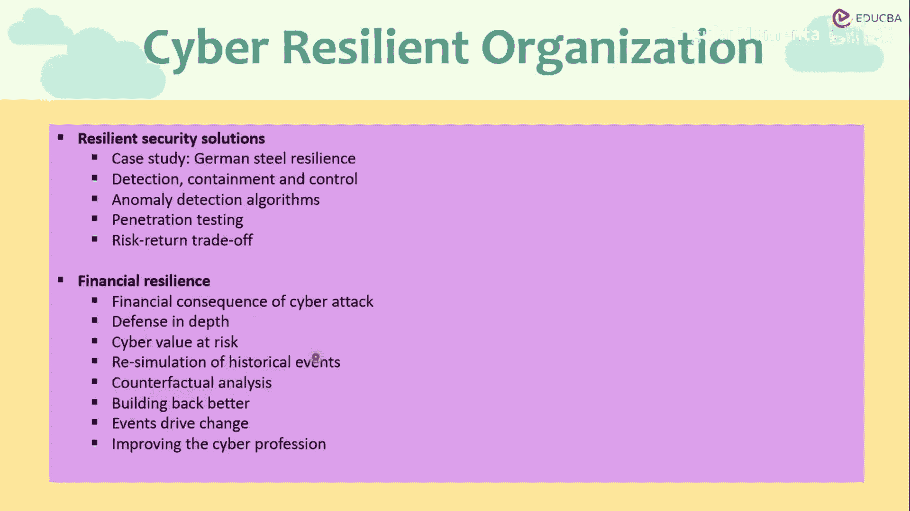

# 009：财务韧性

在本节课中，我们将通过一个真实的案例，探讨网络安全事件如何影响企业的财务韧性。我们将学习如何通过早期检测、快速响应和持续改进来构建组织的网络弹性，并理解这与金融风险管理的核心原则是相通的。

## 案例研究：蒂森克虏伯的网络攻击

上一节我们讨论了网络攻击的普遍性，本节中我们来看看一个成功抵御攻击的案例。

2016年，东南亚的黑客对德国钢铁巨头蒂森克虏伯集团发动了攻击。这些黑客窃取了该集团的技术知识产权数据。值得注意的是，蒂森克虏伯的安全系统很早就检测到了这次入侵。

该集团的网络安全系统和应对措施得到了迅速且有效的实施，因此这次攻击造成的损失非常有限。该组织展现了高度的韧性。它首先能够早期检测并从攻击中恢复，其次能够迅速恢复正常业务运营。这显示了其网络安全目标具有很高的韧性水平。

需要指出的是，这次攻击被认为具有国家背景，是一次完全专业的间谍攻击。对于一家钢铁制造商而言，遭遇如此复杂和意外的网络攻击是不同寻常的。

## 无处不在的网络威胁与系统性风险

如果我们考虑到互联网的规模以及我们系统中自动化的程度，就会发现没有哪个行业是绝对安全的。

我们的大部分电力生产是自动化的。如果恶意行为者，例如国家支持的特工或流氓国家，攻击一个国家的能源生产系统，或者控制特定水坝闸门运行的系统，他们可能覆盖这些系统，直接关闭发电或打开水坝闸门。其影响可能是灾难性的。这里甚至不需要发射导弹，攻击本身可能不会造成人员伤亡，但对被攻击国而言可能是巨大的损失。

因此，没有任何行业、没有任何业务领域可以免受网络攻击，尤其是来自专业和国家支持的行为者的针对性攻击。在这样的背景下，不存在绝对安全的领域。

## 构建网络韧性的核心策略：检测、遏制与控制

重要的是要制定检测、遏制和控制的计划。这一点可以从多个角度来理解。

**早期检测与遏制**：部署防火墙并制定控制计划，能够阻止并遏制攻击，就像应对物理火灾一样。早期的船舶在船体底部设有隔舱，这样如果一个隔舱受损进水，水不会蔓延到整艘船。受损的隔舱被限制在该区域内，不影响船舶的整体完整性。这就是**遏制**。

同样的方法可以以不同形式应用于网络韧性。**视觉控制**的目标是在最短时间内控制住攻击。

以下是实现检测与控制的关键方法：

*   **异常检测算法**：通常认为，任何网络攻击都会留下痕迹。某些程序的行为中可能存在异常，这些异常在用户界面表面可能不明显，但可能发生在程序深处。可以运行算法来持续扫描程序内部的这些异常。在个人电脑中，我们称之为**杀毒程序**。它们首先搜索常见的异常，也搜索以前无法检测的未知异常。对于常见或已知的异常（即已知病毒），可以消除它们。对于不常见或未知的病毒攻击，这些算法可以被编程或训练，以遏制这些异常并将其与其他系统隔离，防止它们传播到系统的其他部分。
*   **内部测试与道德黑客**：也可以从内部系统进行测试。我们可以建立道德黑客系统。像苹果、亚马逊、微软这样的大型软件提供商，它们设有漏洞赏金计划或雇佣道德黑客。它们邀请道德黑客来寻找程序中的漏洞、故障、异常和后门，这些可能将它们的程序和系统暴露给黑客或恶意行为者。这种渗透测试可以由道德黑客、内部程序员和内部测试人员定期进行。这样我们就能领先一步，在外部恶意行为者发现之前，了解自身的漏洞和缺点，从而及早修补这些漏洞。

## 风险与回报的权衡：安全成本考量

当然，在100%受保护和0%暴露之间存在权衡。安全是有成本的。因此，必须在风险与回报之间进行权衡。

我们可以为数据设置10个不同的备份服务器，但这显然会让我们付出10倍的成本。因此，我们必须权衡网络攻击的可能成本与抵御该网络攻击的可能成本。必须进行风险权衡。

## 网络韧性对财务韧性的影响

网络韧性显然也触及财务韧性。网络攻击会带来财务方面的影响。

直接的影响是，例如，如果网络攻击影响到你的个人财务数据，那么就会产生直接冲击。间接影响则包括声誉损失、相关的法律成本等。直接成本可能包括雇佣软件程序、部署检测程序以克服这些网络攻击。间接成本可能包括建立备份或韧性计划、满足报告要求等。但总体而言，每次攻击都会影响整体的财务韧性能力，因为会产生财务后果。

## 深度防御与压力测试

接下来，你需要理解**深度防御**。就像在金融系统中，雷曼兄弟的倒闭或美国国际集团的失败可能引发系统性影响一样，对某个特定组织的系统性风险暴露也可能在不同组织中产生连锁效应。在网络风险方面也是如此。

因此，我们必须进行压力测试，必须理解关联性并实施深度防御。必须有**多层防御**。就像古时候堡垒有不同级别的防御，有多重城门和通道来抵御敌人一样，同样的原则也适用于网络安全。

就像我们为计算市场风险而估算的市场风险价值（**VaR**）单一指标一样，也可以有**网络风险价值**。这是操作风险的一部分，因此我们可以采用操作风险管理方法。

## 从历史中学习：模拟与持续改进

我们可以进行历史事件模拟。就像在金融模拟中，我们可以重新运行2008年危机的模拟事件，观察利率、通胀和就业等如何变化。在网络韧性攻击方面，我们也可以重新运行过去历史事件的模拟。可以从攻击者角度进行反事实分析，也可以进行事件驱动的变革，即从错误中学习。

从组织实际遭遇过、但未能检测或抵御的攻击中学习，必须持续关注**持续改进**。2008年奥巴马政府团队的重点是“重建得更好”。这是从2007年金融危机中恢复的哲学。他们曾说，绝不要浪费一场严重的危机。你要做的是将其视为一个机会，去了解你以前不知道的事情并加以改进。《巴塞尔协议III》监管规定作为对全球金融危机的回应，就是“重建得更好”的一个例子。

任何攻击，如果你的组织确实遭受了网络攻击（这是非常可能的，无论你的安全系统多好），当你在恢复时，要记住从这些事件中学习并“重建得更好”，以确保类似事件或相关联的事件不会再次发生。这就是持续改进。

## 最薄弱的一环：持续教育与技能发展

必须为参与网络安全和IT的员工制定持续的教育和技能发展计划，因为一个组织只与其最弱的个人或最弱的环节一样强大。链条的强度只取决于其最薄弱的一环。因此，组织在IT系统、IT技能、IT知识或网络安全知识方面，只与其最弱的成员一样强大。在网络韧性方面，持续的技能发展和教育变得至关重要。

攻击者每天会发送数百万封网络钓鱼邮件。他们只需要一次机会、一个缺口、一个人点击了钓鱼链接或下载了恶意软件，就能达到目的。这就像防御者每次都必须成功，但攻击者只需要成功一次。就像猎物每次都必须跑赢猎人，但猎人只需要成功一次。网络攻击者只需要成功一次，而组织和安全防御必须每次都成功。这是我们在审视组织IT系统和网络韧性时需要牢记的一点。

## 总结

本节课中，我们一起学习了网络韧性如何构成企业财务韧性的关键部分。通过蒂森克虏伯的案例，我们看到了早期检测和快速响应的重要性。我们探讨了构建网络韧性的核心策略，包括**检测算法**、**遏制措施**和**道德黑客测试**。同时，我们理解了安全需要成本，必须在风险与回报之间进行权衡。最后，我们强调了**深度防御**、从历史攻击中学习的**压力测试**模拟，以及对全体员工进行**持续教育**的必要性，因为组织防御的强度取决于其最薄弱的环节。记住，防御者必须每次都成功，而攻击者只需成功一次。