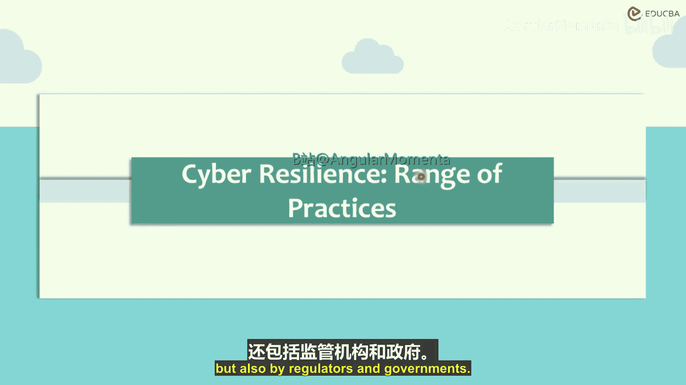
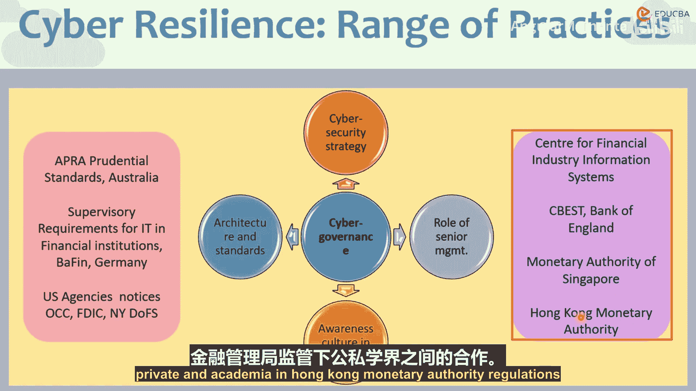

# 010：监管应用 🏛️

在本章中，我们将探讨网络韧性的实际应用层面。这包括私营实体、监管机构和政府所采用的一系列网络韧性技术与实践。

上一节我们讨论了网络韧性的核心框架，本节中我们来看看全球监管机构如何具体应用这些原则。

## 概述

网络韧性包含四个核心方面：**战略**、**高级管理层职责**、**意识与文化**以及**架构与标准**。这一框架由G20财长、央行行长及网络安全专家共同制定，并体现在金融部门网络安全基本要素中。支付与市场基础设施委员会（CPMI）和国际证监会组织（IOSCO）也共同推动了相关标准的发展。

与巴塞尔银行监管委员会发布银行监管指南类似，IOSCO等机构也提出了关于网络监管与韧性的建议。这些全球性标准，如 **ISO/IEC 27001**，以及巴塞尔委员会自身的网络韧性指南，在上述四个核心方面存在共通性。

## 核心框架详解

以下是网络韧性框架的四个关键组成部分：

1.  **战略**：所有标准均强调，机构必须制定明确的网络安全战略。这包括确定网络安全工作是自主进行还是外包、预算分配以及监控机制。
2.  **高级管理层职责**：如同管理任何风险目标一样，高级管理层必须密切参与并监督网络风险管理。
3.  **意识与文化**：网络安全意识必须融入组织文化。需要持续对员工进行教育，使其了解如何防范网络威胁。
4.  **架构与标准**：必须采用全球认可的标准和架构，例如 **ISO/IEC 27000** 系列标准。这还应与业务连续性计划（BCP）相结合，并得到相关标准（如 **ISO 22301**）的支持，从而在不同组织和政府间实现标准化与统一性。

接下来，我们看看不同监管机构如何具体实施这些原则。

## 全球监管实践

以下是部分国家和地区监管机构在网络韧性方面的具体措施：

*   **澳大利亚审慎监管局（APRA）**：发布了审慎标准 **CPG 234（信息安全）**，要求受APRA监管的实体建立与其信息资产面临的威胁相匹配的安全能力，明确董事会、高级管理层和员工的责任，并实施相应的控制措施。
*   **德国联邦金融监管局（BaFin）**：发布了针对金融机构的ICT（信息与通信技术）监管要求，其重点在于让机构做好应对网络安全威胁的准备并提高意识。这些要求基于欧洲银行管理局（EBA）的指南进行了本地化调整。
*   **美国监管机构**：包括货币监理署（OCC）、联邦存款保险公司（FDIC）和纽约州金融服务部（NYDFS）在内的多个机构都发布了各自的网络安全指南与通知。例如，NYDFS的法规要求纽约州的受监管机构必须制定网络安全计划，设立首席信息安全官（CISO），并由董事会批准书面政策。
*   **英国审慎监管局（PRA）/英格兰银行**：实施了CBEST框架，该框架提供基于威胁情报的渗透测试，以评估金融机构的韧性。此外，还推广了如CREST认证威胁情报经理等专业认证计划。
*   **日本金融信息系统中心（FISC）**：建议金融机构设立**首席信息安全官（CISO）**，专门负责监督和审查网络安全事件，并对组织的网络安全最终负责。
*   **新加坡金融管理局（MAS）**：要求金融机构为董事会、高级管理层及全体员工制定全面的科技风险与网络安全培训计划，并包含定期的复习与再培训。
*   **香港金融管理局（HKMA）**：推出了“专业发展计划（PDP）”作为其“金融科技2025”策略的一部分，旨在通过香港银行学会、香港应用科技研究院等机构，加强高级管理层和董事会对网络韧性计划的认知与参与，构建了**“政、产、学”** 三方合作模式。

## 总结

本节课中，我们一起学习了网络韧性在监管层面的实际应用。我们了解到，尽管全球各地的监管机构（如APRA、BaFin、美国各机构、PRA、MAS、HKMA等）可能发布不同的具体指南或标准，但它们都普遍围绕**战略、高级管理层职责、意识文化以及架构标准**这四个核心方面来构建要求。这些监管实践的核心目标，是推动金融机构建立统一、有效的网络风险防御和恢复能力，以保障整个金融体系的稳定与安全。