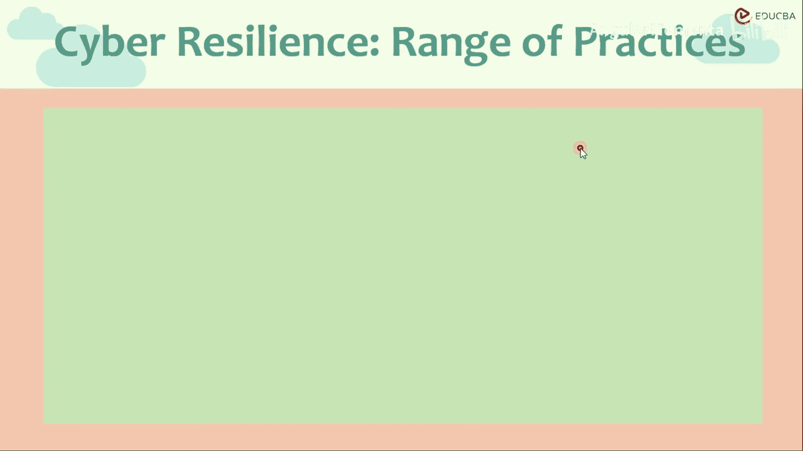
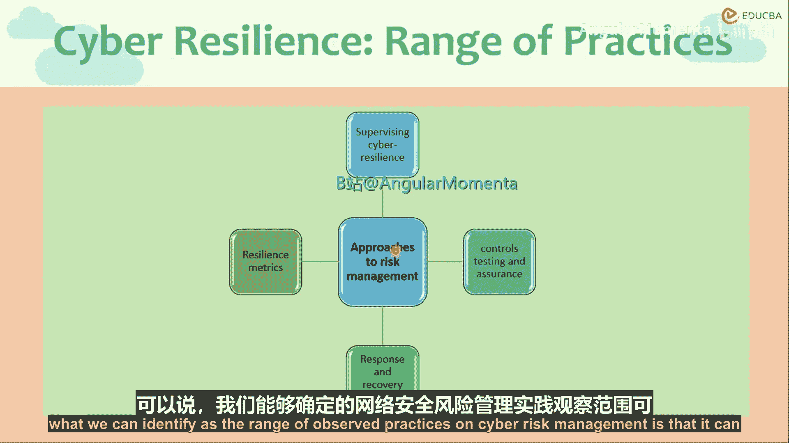
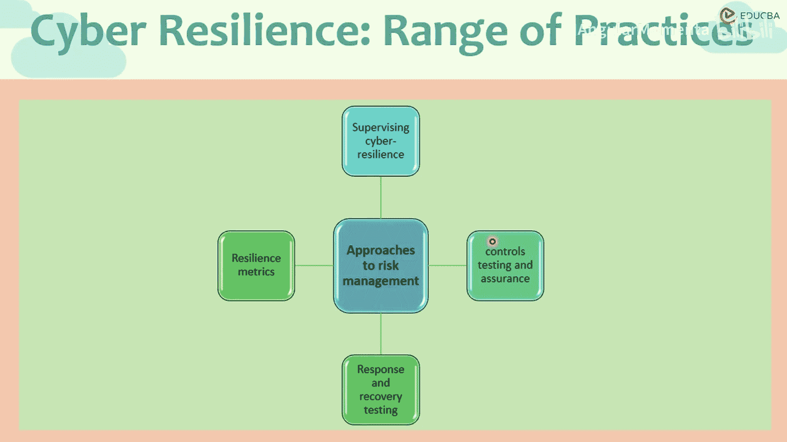
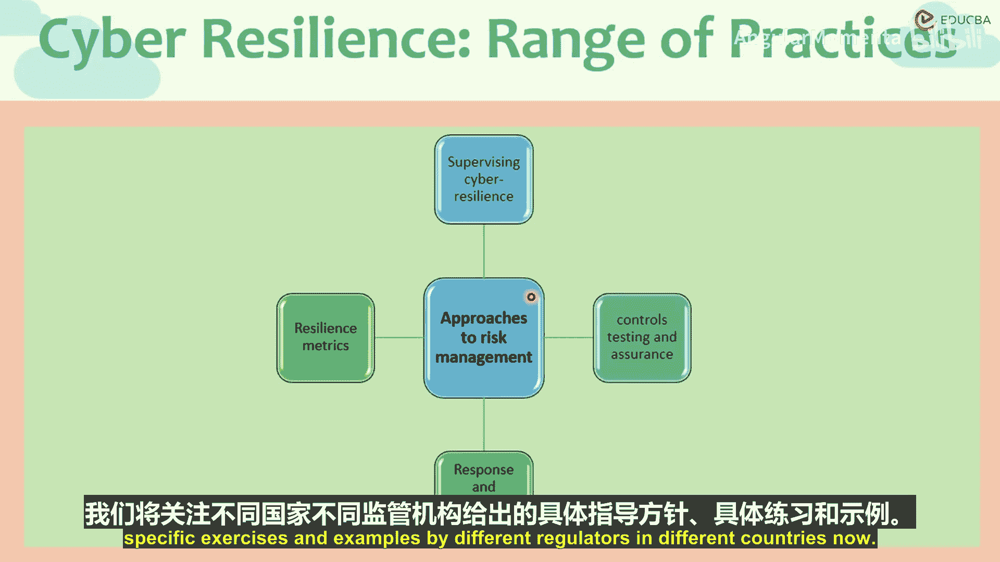

# 011：网络风险管理方法 🛡️

在本节课中，我们将学习网络风险管理的多种通用方法。我们将看到，这些实践可以被系统地划分为四个主要部分，每个部分都从不同角度构建组织的网络防御与恢复能力。

## 概述

网络风险管理存在多种方法和共性实践。通过观察，我们可以将网络风险管理的实践范围划分为四个子部分。

## 网络风险管理的四个子部分

以下是网络风险管理的四个核心组成部分。

1.  **监管层面的网络韧性**：这涉及监管机构如何发展和完善其审查视角，以评估受其监管的组织。我们已经看到不同监管机构发布的指导方针，并且在下一节中还将了解到，监管人员需要接受培训，以理解网络安全对其监管对象的影响。
2.  **控制测试与保证**：顾名思义，这部分涉及对控制措施的测试和回溯测试，包括压力测试、记录响应、记录失误和未遂事件，以及内部测试的影响和结果。其核心是预防攻击，例如部署防火墙和检测系统。
3.  **响应与恢复测试**：上一节我们介绍了侧重于预防的控制测试，本节中我们来看看响应与恢复。这部分假设网络攻击已经发生，关注组织如何恢复，例如备份机制及其测试方法。它不仅包括针对此类事件的响应和压力测试，还包括事件记录，以及从过往攻击的漏洞中学习，以增强系统的恢复能力和韧性。
4.  **韧性指标**：为了在不同组织、不同部门、不同时间点之间进行校准，需要创建一套指标体系，将定性数据转化为可量化、可分解、可比较的定量数据。这就是韧性指标。

## 韧性指标详解

以下是韧性指标的具体构成要素。

*   **事件影响次数**：记录安全事件发生的频率。
*   **检测时间**：衡量组织从攻击发生到识别出漏洞所需的时间。
*   **识别速度**：评估漏洞被识别的快慢程度。
*   **影响评估**：区分财务影响与非财务影响。
*   **责任归属**：明确事件的责任方。
*   **恢复计划**：评估恢复计划的有效性。

所有这些要素都可以转换为一个评分体系，纳入韧性指标矩阵中。该矩阵不仅可以包含真实攻击事件的影响，也可以包含测试攻击的结果，从而融合模拟信息与实际信息。这种矩阵可以作为向董事会、乃至组织外部的监管机构报告的一种现象和工具。

## 总结

本节课中，我们一起学习了构建组织整体风险抵御或运动抵御能力的通用方法。这涵盖了监管网络韧性、控制测试与保证、响应与恢复测试以及韧性指标四个层面。这套方法得到了不同国家、不同监管机构的关注，并体现在其具体的指导方针和实践中。