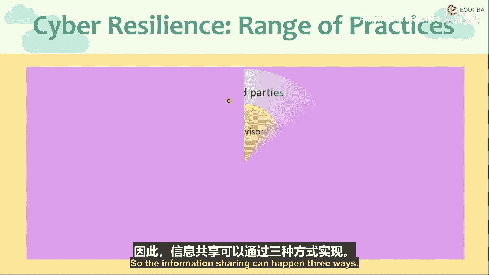
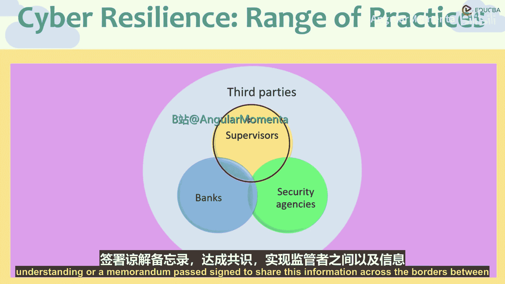
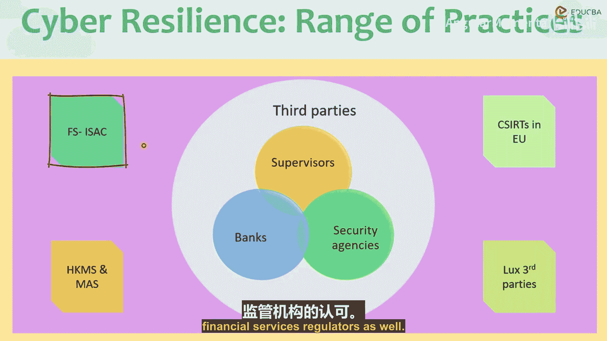

# 012：信息共享

在本节课中，我们将要学习金融行业提升网络韧性的一个核心环节：信息共享。我们将探讨信息共享的多种途径、其重要性以及一个具体的国际实践案例。

## 概述

信息共享是整个金融行业构建网络韧性的最重要方面之一。通过共享威胁情报、最佳实践和漏洞信息，金融机构、监管机构和安全机构能够更有效地协同防御，提升整个金融生态系统的安全性。

## 信息共享的三种途径

信息共享主要发生在三个主体之间，并且它们之间存在交互与重叠。

以下是信息共享的三种主要途径：

1.  **银行之间**：同一司法管辖区的银行，例如欧盟、日本、巴西或中东地区的所有银行，无论是公有还是私有，都被鼓励在彼此之间共享信息。这种共享不包括审查机密或私人信息，但有助于其他机构从一家银行的经验或教训中学习。
2.  **监管机构之间**：这包括一国境内的不同监管部门之间的共享，例如银行业监管机构与证券市场或资本市场监管机构之间的共享。同时也包括跨国境的国际信息共享。
3.  **安全机构之间**：安全机构之间共享数据非常普遍。这并非新事物，例如信用评级机构之间就在某种程度上共享信用数据。安全机构共享数据，很多时候其范围是国际性的。

## 信息共享的重要性

上一节我们介绍了信息共享的途径，本节中我们来看看为什么这种共享至关重要。

信息共享能避免“重复造轮子”，使整个系统更强大。如果一个组织发现了一个程序补丁或漏洞，并与其他安全提供商共享，那么整个系统的防御能力就会得到加强。

反之，缺乏共享则会带来风险。例如：
*   一家银行可能拥有完善的安全系统，但如果其第三方雇员或合同工在不安全的网络上工作，银行系统同样面临风险。
*   如果各安全系统之间不共享信息，那么每个机构都必须独立地发现漏洞、设计解决方案，这对于整个行业的整体进步而言是非常繁琐且有害的。

## 国际信息共享实践：FS-ISAC

在了解了共享的重要性后，我们来看一个具体的国际信息共享组织实例。

在某些司法管辖区，已经签署了谅解备忘录或协议，以促进跨国境的监管机构和信息机构之间的信息共享。一个典型的例子是**金融服务信息共享与分析中心**。

**FS-ISAC** 是一个成立于1999年的非营利实体，旨在收集并向金融服务业成员组织提供信息、潜在漏洞以及针对国家金融和服务基础设施的网络威胁与攻击预警信号。

其成员包括：
*   银行
*   信用合作社
*   结算与清算机构、存管机构
*   清算运营机构
*   保险公司
*   投资公司
*   金融部门监管机构
*   执法机构

FS-ISAC 通过举办会议、研讨会和规划演习，将来自不同组织的网络安全专家聚集在同一平台，以交流思想并学习跨组织的经验教训。它是一个跨境实体，邀请国际组织分享观点并促进机构间的交流。

## FS-ISAC 的核心要素

以下是 FS-ISAC 运作的一些核心要素：

*   **快速响应**：首先，在其成员之间实时或尽可能接近实时地分析和传播有关威胁、情报系统和恢复系统的信息。
*   **关键基础设施通知系统**：FS-ISAC 开发了自有的一套通知系统。
*   **信息共享与分析**：收集来自外部来源的信息并进行传播。它拥有从外部来源收集信息的方法，并在验证后（显然是在其成员内部）传播这些信息。
*   **数据匿名化**：在共享与威胁和恢复计划相关的信息时，会对数据进行匿名化处理，以确保不共享私人信息或敏感信息。
*   **成员驱动与非营利性**：该组织由成员驱动，是非营利性的，专门服务于金融业的需求，并得到了美国及欧盟金融服务业监管机构的认可。

## 总结

本节课中我们一起学习了金融风险管理中的信息共享环节。我们了解到，信息共享是提升网络韧性的关键，主要发生在银行、监管机构和安全机构三者之间及其交互重叠区域。有效的共享可以避免资源浪费，强化整体防御。最后，我们以 **FS-ISAC** 为例，介绍了一个成功的国际信息共享实践，其通过快速响应、数据匿名化和成员驱动等核心机制，为全球金融业的安全协作提供了重要平台。