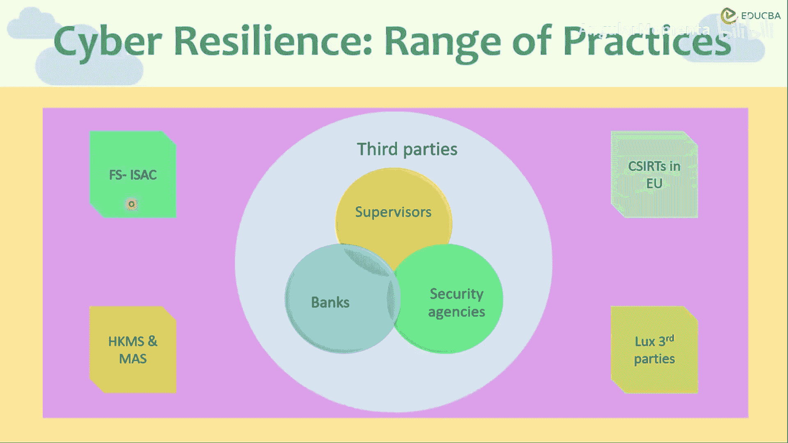
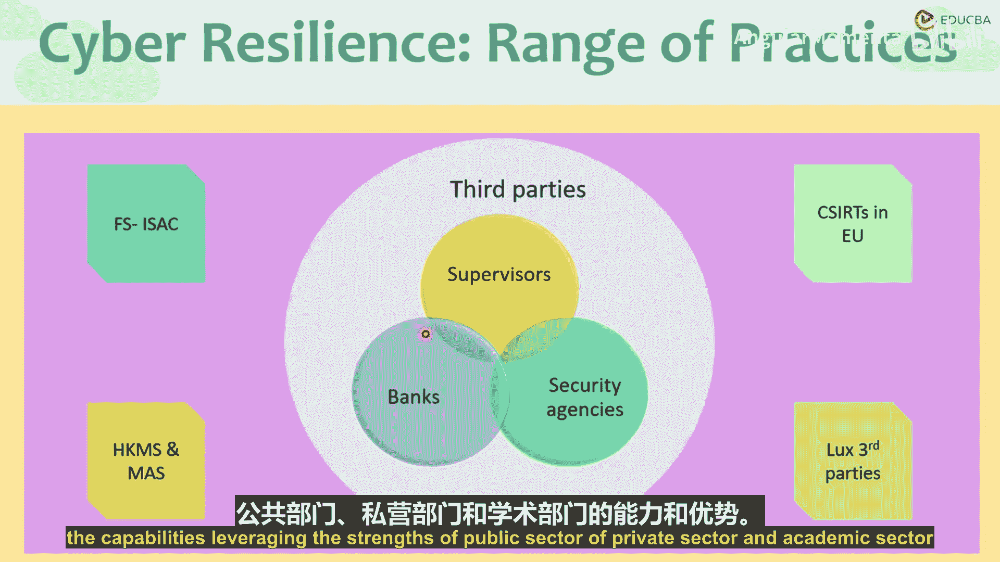

# 013：信息共享与协同防御 🔗

在本节课中，我们将继续探讨金融领域如何通过信息共享与公私合作来提升网络安全与抗风险能力。我们将重点分析具体的合作协议框架、运作原则以及跨区域协同机制。

上一节我们介绍了信息共享的基本概念，本节中我们来看看具体的实践案例与合作框架。

## 香港与新加坡的双边协议 🤝

香港金融管理局（HKMA）与新加坡金融管理局（MAS）之间签订了一份双边网络安全信息共享协议。双方通过一个既定框架，同意依据四项指导原则共享信息。

以下是该协议的四项核心指导原则：

1.  **自愿原则**：信息共享完全基于自愿，并非由监管强制要求。
2.  **及时原则**：建立及时的信息共享机制。因为一旦某个系统遭受网络攻击，威胁会迅速跨境传播。通常，一次有预谋的网络攻击会在24至48小时内蔓延至全球。
3.  **高效原则**：在信息共享、框架运行以及两个监管辖区内的组织运行其网络安全平台时，均需保持高效。
4.  **保密原则**：这是关键所在。金融机构共享信息时，保密性至关重要，必须置于最优先地位。否则，机构间将失去信任。

## 欧盟的协同防御网络 🛡️

在东南亚区域之外，欧盟也通过《网络与信息安全指令》建立了协同机制。欧盟区域内设有国家级的计算机安全事件响应小组（CSIRT）。

以下是欧盟CSIRT网络的主要职能：

*   **事件监控与应对**：它们如同快速反应部队，首先会监控全球网络安全动态，制定应对计划，并指导金融机构如何增强韧性和处理已识别的威胁。
*   **网络化协作**：各国的CSIRT团队会接入欧盟范围的网络，与各自的财政部、信息通信技术部以及欧洲网络与信息安全局协同工作。
*   **多层次合作**：它们在多个层面与不同机构合作，以更好地应对网络攻击。
*   **信息与服务交换**：它们会交换和讨论与事件及关联风险相关的信息（通常基于自愿原则），以提升整个金融行业的水平。
*   **协调与支持**：它们可以协调全球跨境、跨监管的响应行动，为成员提供应对支持，帮助成员改进自身的监管响应和网络韧性计划。
*   **能力建设**：它们还为所有成员提供通用的准备计划和改进计划，以更好地应对网络事件。

## 卢森堡的第三方监管模式 🏛️

卢森堡虽是小国，但在金融领域地位重要。该国存在受监管的第三方专业公司，专门为金融网络安全提供特定服务。

具体而言，卢森堡金融业监管委员会不仅监管金融机构本身，也监管那些为金融业提供网络韧性或网络保护计划的服务提供商。

以下是其协同运作模式：

*   **三方协同**：这些受监管的私人网络安全服务商与政府机构及非监管的政府机构协同工作。
*   **持续改进**：卢森堡政府会持续在这三方实体之间发布指南、通告，并推动数据收集工作的改进。

## 公私合作的价值 🤝

我们看到了公私合作伙伴关系如何帮助提升整个金融体系和金融行业应对网络威胁的稳健性，并改善组织内部的响应时间和韧性能力。这从核心上强化了金融组织。

恶意攻击者正在独立且不懈地寻找网络系统中的漏洞。由于系统的互联性以及不同银行、金融机构、监管辖区之间信息的快速交换与连接，我们不能将攻击视为孤立事件。例如，法国银行系统若受攻击，将对全球金融系统产生连锁影响。

因此，为了改进金融监管，该领域的所有相关方，无论是金融还是非金融部门，都必须协同协调工作，充分利用公共部门、私营部门和学术部门的能力与优势。

本节课中，我们一起学习了香港与新加坡的双边信息共享框架、欧盟的CSIRT协同网络以及卢森堡的第三方监管模式。这些案例共同揭示了通过跨机构、跨区域的信息共享与公私合作，是构建金融体系整体网络韧性和抗风险能力的关键路径。