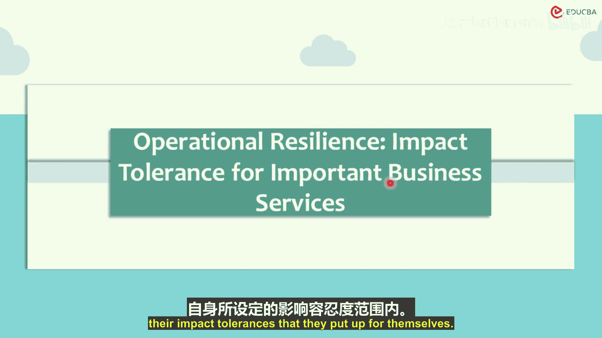
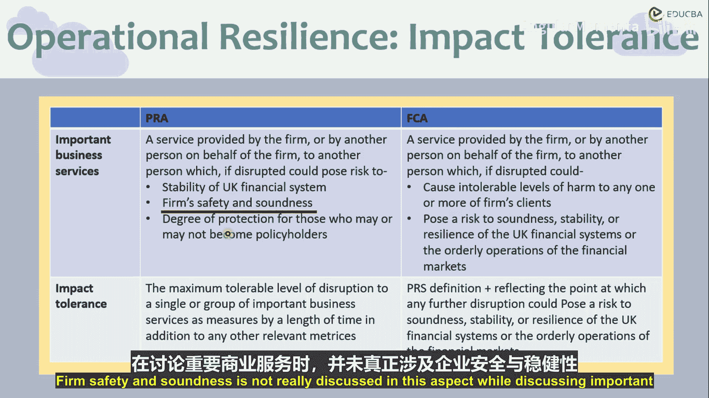

# 014：重要业务服务与影响容限

在本章节中，我们将聚焦于运营韧性及其对业务服务的影响。我们将探讨监管机构如何定义“重要业务服务”，以及金融机构如何为其设定“影响容限”，以确保在严重但可信的干扰场景下，关键服务仍能持续提供。

上一节我们介绍了资本与风险管理的宏观框架，本节中我们来看看运营层面的具体韧性要求。

## 概述

本章内容基于英国审慎监管局、金融行为监管局以及作为金融市场基础设施监管方的英格兰银行，这三家监管机构联合发布的一份关于运营韧性的讨论文件与咨询结果。其核心目标是建立一个强有力的监管框架，以提升公司和金融市场基础设施公司的运营韧性。

## 重要业务服务的定义

监管机构要求公司识别其“重要业务服务”。这要求公司评估其提供的金融服务一旦中断，可能产生的、超越其自身商业利益的影响。以下是两家主要监管机构的具体定义侧重点：

*   **审慎监管局 的定义**：重要业务服务是指由公司或代表公司的其他方提供给另一方的服务，若该服务中断，可能对以下方面构成风险：
    1.  英国金融体系的稳定性。
    2.  公司自身的安全与稳健性。
    3.  公司客户或保单持有人的保护程度。
    *公式：`重要业务服务(PR) = f(金融体系稳定性, 公司安全稳健性, 客户保护)`*

*   **金融行为监管局 的定义**：重要业务服务是指由公司或代表公司的其他方提供给另一方的服务，若该服务中断，可能造成以下后果：
    1.  对公司的任一或所有客户造成不可容忍的损害。
    2.  对英国金融体系或金融市场的有序运行构成稳健性、稳定性或韧性风险。
    *公式：`重要业务服务(FCA) = f(客户损害容忍度, 金融体系/市场风险)`*

**关键区别**：PRA将金融体系稳定性置于首位，而FCA则将客户损害列为优先考量项。

## 影响容限的设定

在识别重要业务服务后，公司必须为每项服务设定“影响容限”。这意味着公司需要明确，在发生严重但可信的干扰时，该项服务可以容忍多长时间的中断、多大程度的性能下降或多少数量的客户影响，而不会导致不可接受的后果。

公司必须确保，即使在预设的严重压力场景下，他们也能持续提供重要业务服务，并且将影响控制在其设定的容限范围之内。

## 关于内部服务的讨论

在咨询过程中，一个关键议题是“内部服务”（如人力资源、薪酬支付）是否应被纳入“重要业务服务”的范畴。许多公司反馈指出，内部服务的中断可能对最终向内部和外部用户交付服务产生重大影响。监管机构注意到了这一观点，并在最终政策考量中包含了对此类服务的评估。

## 总结

本节课中我们一起学习了运营韧性框架中的两个核心概念：**重要业务服务**与**影响容限**。监管机构通过要求金融机构识别关键服务并为其设定可容忍的干扰边界，旨在提升整个金融体系抵御运营冲击的能力。尽管PRA和FCA在定义优先级上略有不同，但其共同目标都是确保金融服务在逆境中的连续性与可靠性。