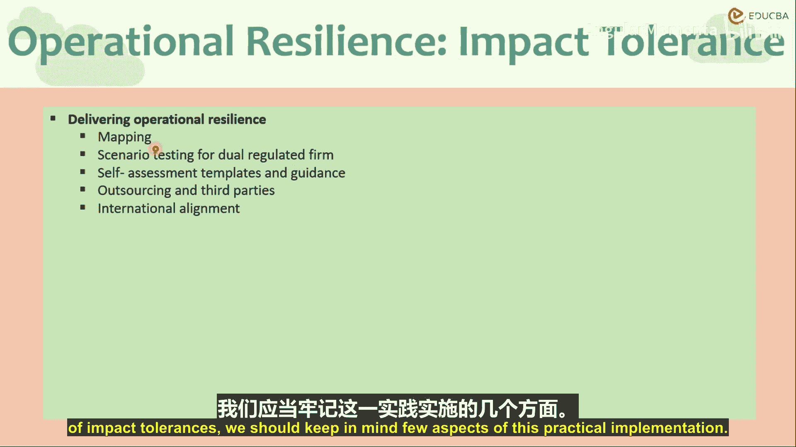
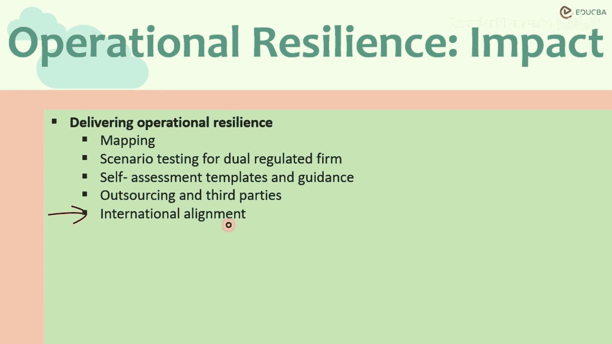

# 016：实现运营韧性 🛡️

在本节课程中，我们将学习如何实际实施运营韧性，特别是如何设定和实现影响容忍度。我们将探讨从业务映射到场景测试，再到从经验中学习并采取行动的完整流程。

## 实施运营韧性与影响容忍度

上一节我们介绍了运营韧性的概念，本节中我们来看看如何将其付诸实践。在实施运营韧性和影响容忍度时，企业需要关注几个关键方面。

首先，是**映射**环节。根据咨询文件的要求，企业和金融中介机构需要识别并记录为提供每项重要业务服务所必需的人员、流程、技术、信息系统或任何资源。这是运营韧性的一部分。

以下是映射过程中需要涵盖的要素：
*   **人员**：负责关键服务的员工。
*   **流程**：执行服务所需的操作步骤。
*   **输入/输出依赖关系**：服务所依赖的输入和产生的输出。
*   **关联性**：不同服务或资源之间的相互联系。

具体而言，映射应帮助企业实现两个目标：第一，识别在提供服务过程中存在的**脆弱性**；第二，测试其保持在**影响容忍度**范围内的能力。

## 输入严重性与输出严重性

在场景测试中，企业与监管机构之间曾就何为“严重场景”进行过大量讨论。这里需要区分两个核心概念：**输入严重性**和**输出（或结果）严重性**。

*   **输入严重性**：指外部市场或环境发生剧烈波动。例如，市场大幅上涨或下跌。
*   **输出严重性**：指尽管输入可能并不极端，但由于**杠杆**、系统弱点或其他不可预见的事件，导致最终结果被放大，造成严重损失。

举例来说，一个**市场中性多空投资组合**的理想状态是，无论市场涨跌（输入严重性），都应能获利。然而，如果该策略因使用高杠杆或存在执行缺陷，可能导致在市场轻微波动时（输入不严重）就产生巨大亏损（输出严重）。因此，测试需要涵盖这两种不同类型的严重性。

## 场景测试与经验学习

在场景测试方面，企业需要总结已识别的脆弱性及其测试方法。测试方法论应包括两个关键部分：

以下是测试后必须完成的分析步骤：
1.  **识别出的教训**：从测试中学到了什么。
2.  **行动计划**：企业正在采取哪些措施来克服在场景分析中发现的差距或脆弱性。

**经验学习**练习是至关重要的一环，其目的是确定优先事项，并投资于尽可能有效应对和从中断中恢复的能力。换句话说，就是尽可能增强业务场景下的韧性。这是整个场景分析工作的主要组成部分。

## 监管指南与模板

为了帮助企业完成这一过程，监管机构定义了一些关于何为“严重但可信”场景的指导原则。咨询文件要求确定压力事件时，需满足“**严重但可信**”这一条件。

监管机构提供了一些示例和**模板**，用于指导企业识别场景、发现脆弱性并记录从严重场景中吸取的教训。这些模板包含一些引导性问题、最低要求以及识别脆弱性后的利益相关者沟通模式。

需要强调的是，这些指南和模板仅代表**最低要求**。企业有充分的自由来定义自己的压力场景，并被鼓励超越这些最低标准进行更严格的自我评估。

## 外包与第三方参与

克服已识别脆弱性的整体实施方案，显然取决于企业自身的选择。其中涉及**外包**的两个方面：

以下是企业可能考虑的外包选项：
*   **外包分析工作**：将整个场景分析测试工作外包给咨询公司，并采纳其观点。
*   **外包业务流程**：作为改进和经验学习的一部分，将某些流程外包给第三方服务提供商，以建立备份或增强韧性。

是否在组织内部为特定重要业务流程创建备份，或是引入第三方，这是一个非常具体的问题，取决于组织自身的策略和偏好。如果涉及第三方，则必须通过文件和相互理解，妥善保护信息共享和隐私。

## 国际协调与监管一致性

本咨询文件还涉及**国际协调**问题。其重点在于使监管期望和最低要求与巴塞尔银行监管委员会（BCBS）的指导原则保持一致。

监管机构认识到企业和金融中介机构的全球互联性，以及不同监管机构之间协调的重要性。他们正努力与不同监管机构协调各项法规，以确保无论企业在何处运营，都有一套**最低标准**和监管期望。

从核心上讲，无论公司总部位于何处，都很可能受到全球事件和互联性的高度影响。监管的目标是更具审慎性，并为任何可能发生的运营压力事件做好准备，而不是让企业有机会进行**监管套利**（即选择对其更便利的法规）。

---

**本节课总结**：我们一起学习了实施运营韧性的具体步骤。从识别重要业务服务的依赖关系映射开始，到理解并测试输入与输出严重性场景，再到从测试中吸取教训并制定行动计划。我们还了解了监管机构提供的“严重但可信”场景指南和模板的作用，探讨了利用外包策略的考量，最后认识到国际监管协调对于建立全球统一韧性标准的重要性。整个过程的最终目标是使企业能够有效预防、应对并从业务中断中恢复，从而保持稳健运营。