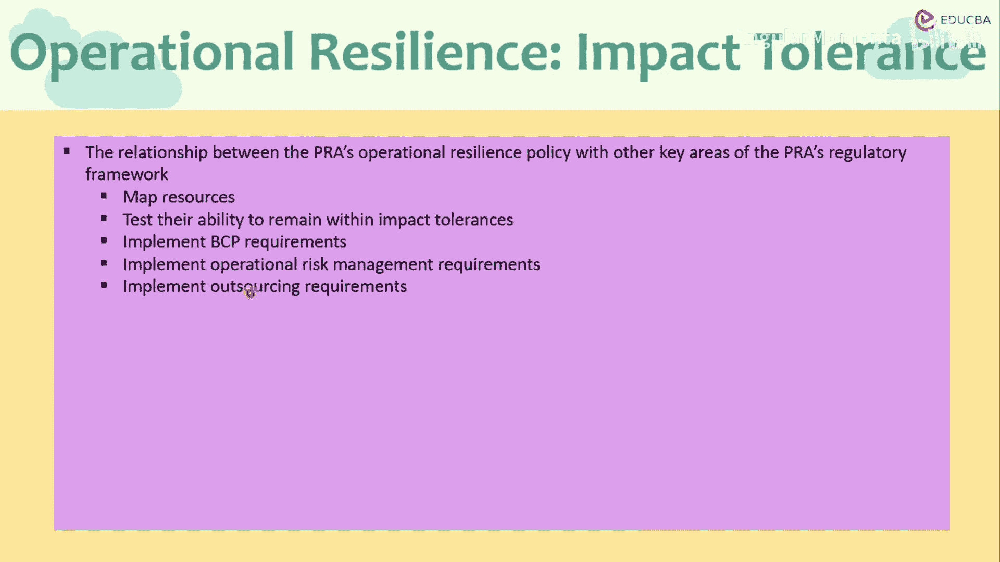
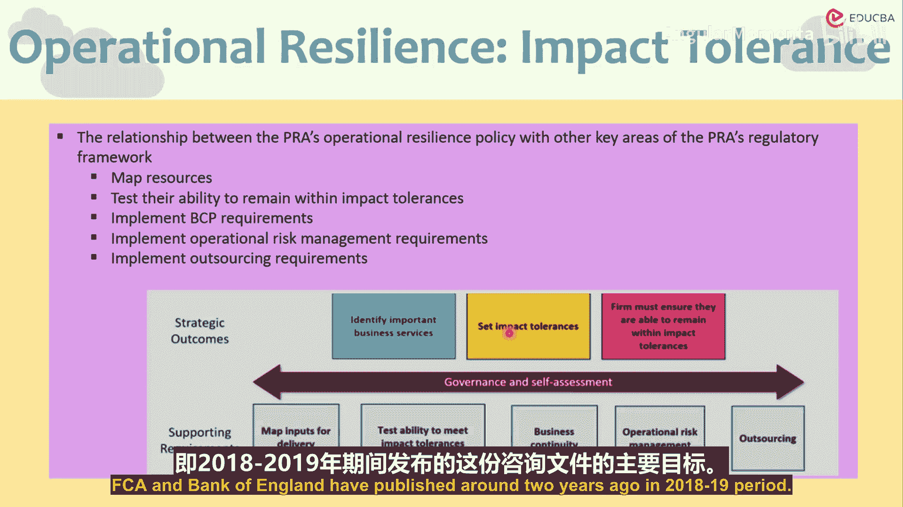

# 017：治理与自我评估

在本节课程中，我们将探讨金融机构在治理与自我评估框架下，如何识别关键业务服务、设定影响容忍度并制定应对计划，以提升运营韧性。这一过程是监管机构对金融机构提出的核心要求，旨在增强整个金融体系的稳定性。

## 概述

治理与自我评估是金融机构构建运营韧性的核心环节。它要求机构主动识别其关键业务，明确业务中断的容忍限度，并制定确保业务持续的计划。这一过程高度定制化，但监管机构提供了原则性指导，以确保全行业达到最低标准。

## 核心原则与监管期望

上一节我们介绍了运营韧性的基本概念，本节中我们来看看监管机构的具体期望。监管机构（如英国审慎监管局和金融行为监管局）发布指导原则，明确了他们对金融机构运营韧性的期望。

*   金融机构应为关键业务服务设定影响容忍度。
*   金融机构应能识别自身的关键业务服务。
*   该政策的最终目标是提升单个机构乃至整个金融行业应对运营中断的整体韧性。

此政策文件还特别关注了金融系统互联性以及机构所处的动态复杂环境所带来的风险。监管机构认为，有必要建立相称的最低运营韧性标准，以激励金融机构为潜在中断做好准备并进行必要投资。

## 机构的视角与激励

我们必须理解，这些是非常开放且高度机构特定的领域。关键业务流程、影响容忍度及应对计划都因机构而异。机构本身也希望做好准备，尽量减少业务中断。然而，做好准备意味着需要投入资源，不仅是资金，还包括人力资源。因此，机构需要为应对业务中断而预留部分资源。

那么，机构应保持多强的韧性？其业务中断的容忍度是一个相对偏好，很大程度上取决于机构的风险回报权衡以及管理层认为的适当水平。监管机构试图建立运营监管的最低标准，从而激励机构为中断做好准备并进行必要投资。因为从机构角度看，预留资本和投入资源可能被视为一种浪费，或至少是资金的机会成本——这些资金本可用于业务投资。管理层很可能将其视为额外负担。监管机构的重点在于，引导机构不将其视为负担，而是作为一种有益的激励措施，以维护机构自身及整个金融行业的运营韧性。

## 适用范围与指导性质

由于业务中断可能影响机构安全提供服务的能力，并因其互联性对整个金融服务产生连锁效应，因此该框架具有广泛适用性。根据机构的规模、业务性质和范围，它适用于所有英国银行、建房互助协会、信贷协会、审慎监管局指定的投资公司、英国偿付能力II制度下的公司、劳合社及其管理代理、保险公司等。

该框架为如何定义业务韧性流程及设定影响容忍度提供了指导。当然，这些更多是指南性质。我们无需深究这些非常详细的指南，因为它们只是指导原则，并非按部就班就能得出最终答案（即预期影响容忍度）的步骤清单。由于受该咨询文件涵盖的业务范围广泛且性质多样，不可能给出识别关键业务流程和影响容忍度的封闭式指导。但可以存在一些识别业务流程、设定影响容忍度以及制定改进财务与运营韧性计划的标准实践或最低要求。

## 实施框架与核心要素

为了更直观地展示，指导方针围绕两个层面为机构提供框架。首先是战略成果，重点在于更宏观地确定战略成果。

期望的战略成果有三方面：
1.  **识别关键业务服务**。
2.  **设定影响容忍度**。
3.  **确保制定计划，使业务保持在影响容忍度之内**。

如何实现这些成果？首先，需要确定如何判断机构是否处于影响容忍度之内，这涉及到建立衡量指标并将其转化为定性或定量数据。其次，需要进行情景分析和压力测试，以便机构能够制定计划或行动指南，应对压力事件或关键业务服务受影响的情况。这就是治理与自我评估练习的一部分。

以下是支持实现这些战略成果的自我评估工具和步骤，可视为中间环节：

*   **映射交付所需的输入**：识别关键输入，包括人员、流程、硬件、软件、资源及其他依赖项，以确定关键资源。
*   **测试保持在影响容忍度内的能力**：首先，识别可能中断这些业务流程的事件或情景；然后，评估如果这些情景发生，机构是否能保持在为自己设定的影响容忍度之内。

基于事件评估，银行和保险公司需要制定业务连续性计划。该计划应包括备份系统、各团队成员及员工的责任与职责、备用系统方案以及应急计划。如果涉及外包，也应作为业务连续性计划的一部分。外包或第三方服务提供商的使用，无论是临时性还是作为补充服务，都需要纳入考量。

## 整合与宏观视角

这整个练习将成为机构操作风险管理指南和操作风险管理模块的一部分，进而构成企业风险管理的一个方面。因此，视角将是顶层的，影响研究将在组织层面而非单个业务单元层面进行。

事实上，监管机构的视角更进一步。他们试图从以下角度评估关键业务服务：如果中断，是否会对金融行业的整体效能和健康造成严重后果。因此，他们不仅关注业务单元或机构本身，更关注英国乃至全球的整体金融行业。这就要求机构必须具备非常广阔和宏观的视野，而非局限于机构或业务单元本身的狭隘视角。这正是约两年前（2018-19年期间）由三大监管机构发布的这份咨询文件的主要目标。

## 总结

本节课中，我们一起学习了金融机构治理与自我评估的核心框架。我们了解到，机构需要主动识别关键业务、设定合理的影响容忍度，并通过情景分析和业务连续性计划来确保韧性。这一过程虽具挑战性，但监管机构通过设定最低标准和提供原则指导，旨在激励机构投资于韧性建设，最终提升单个机构及整个金融体系的稳定性和抗风险能力。