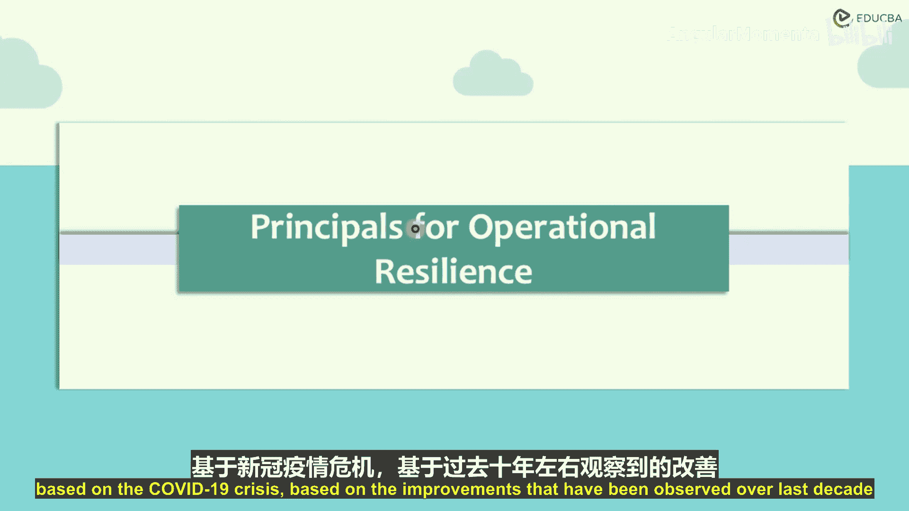
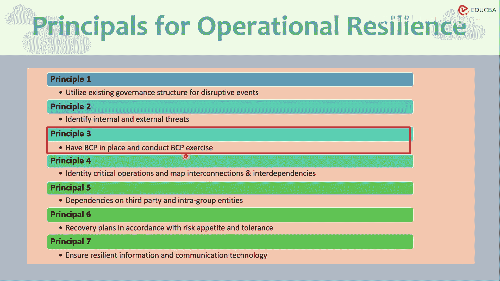

# 018：运营韧性原则

在本节课中，我们将学习巴塞尔委员会为提升金融机构运营韧性而提出的核心原则。这些原则旨在帮助银行等机构更好地应对低概率、高影响的破坏性事件，如疫情、网络攻击或自然灾害。

上一节我们探讨了英国监管机构关于运营韧性的指南，本节中我们来看看巴塞尔委员会提出的全球性框架。

## 背景与定义

巴塞尔委员会在2007-2009年全球金融危机后，推出了巴塞尔协议III等一系列审慎监管改革。这些改革不仅旨在增强金融部门的财务韧性，也着重提升其**运营韧性**。

委员会认为，尽管全球金融危机后，银行和金融部门在运营风险管理方面已持续改进，但仍需进一步提升，以涵盖诸如新冠疫情、网络事件、技术故障和自然灾害等**低概率、高影响**的事件。新冠疫情等事件在过去两年中残酷地测试了金融体系的脆弱性，尽管银行整体上比2007-08年时期更具韧性，但某些领域仍暴露出不足。

基于对全球金融危机、新冠疫情以及过去十年改进的观察，巴塞尔委员会提出了**运营韧性**的七项原则。在介绍原则之前，我们先明确其定义：

> 巴塞尔委员会将**运营韧性**定义为：银行在遭遇破坏时持续提供关键运营的能力。

这一定义意味着银行应假定破坏事件**必然会发生**，并需在整体风险偏好和容忍度的框架内进行规划。它要求银行能够：
1.  识别并保护自身免受威胁和潜在故障的影响。
2.  对破坏性事件做出响应并适应。
3.  从破坏性事件中恢复。
4.  从中学习，以持续减少其对关键服务交付的影响。

这与我们之前学习的英国监管指南中的“影响容忍度”概念在核心思想上高度一致。关于“关键运营”的界定，巴塞尔委员会参考了2006年成立的联合论坛关于业务连续性的高级原则。如今，焦点已从“业务连续性”转向更广泛、更全面的“运营韧性”。银行可根据自身职能自由界定其关键运营，前提是符合相关指导要求。

## 运营韧性七项原则

以下是巴塞尔委员会提出的七项运营韧性原则。

第一项原则涉及治理结构。银行应利用其**现有治理架构**来建立、监督和实施有效的运营韧性方法。该方法应使银行能够响应、适应破坏性事件，并从中恢复和学习，从而最大限度地减少破坏对关键运营交付的影响。简而言之，银行应通过情景分析和压力测试来检验其运营韧性，并基于测试结果制定改进计划。

第二项原则关注风险识别与管理。银行应**利用其现有的操作风险管理职能**，持续、定期地识别内外部威胁事件、潜在故障点以及人员、流程、系统中的薄弱环节。银行应及时评估关键运营的脆弱性，并管理由此产生的风险，以完善其运营韧性方法。其核心目标是，将运营风险控制在银行自身定义的风险容忍度（或英国监管机构所称的“影响容忍度”）之内。

第三项原则强调业务连续性计划。银行应制定**业务连续性计划**，并定期进行演练，以测试其有效性和时效性。这些演练应针对严重但可信的情景，以检验BCP计划的交付能力以及银行遵守该计划的能力。计划应涵盖常规中断事件，也应包括低概率、高影响的事件。这与我们从网络安全、企业风险等角度对BCP的普遍期望是一致的。

第四项原则是关于沟通与协作。银行应确保在破坏性事件期间及之后，与**内部和外部利益相关者**（包括客户、员工、供应商和监管机构）进行清晰、及时的沟通。有效的沟通对于协调响应、管理预期和维持信任至关重要。

第五项原则涉及技术韧性。银行应投资于**稳健且具有弹性的信息技术系统**，包括数据备份、灾难恢复解决方案和网络安全措施。技术基础设施必须能够承受冲击并支持关键运营的持续运行。

第六项原则是第三方风险管理。银行应**识别、评估并管理因其依赖第三方供应商（如云服务提供商或外包商）而带来的风险**。这包括确保关键第三方本身也具有足够的韧性，并制定备用方案以防第三方服务中断。

第七项原则，即最后一项原则，关乎持续改进。银行应建立一种**从破坏性事件中学习和持续改进的文化**。这包括在事件发生后进行复盘分析，更新风险识别、业务连续性计划和响应策略，并将经验教训纳入未来的运营和战略规划中。

## 总结

本节课中，我们一起学习了巴塞尔委员会关于运营韧性的七项核心原则。这些原则为金融机构构建抵御破坏性事件的能力提供了一个全面的框架，涵盖了从治理、风险识别、业务连续性到沟通、技术、第三方管理和持续改进的各个方面。理解并实施这些原则，有助于银行在日益复杂和不确定的环境中保持关键服务的稳定运行。