# 019：运营韧性核心原则（续）

在本节课中，我们将继续学习巴塞尔委员会关于银行运营韧性的核心原则。我们将重点探讨如何识别内部与外部依赖关系、管理第三方风险、制定事件响应计划以及确保信息通信技术与网络安全。这些原则共同构成了银行抵御运营中断、保障关键业务持续运行的基础框架。

上一节我们介绍了识别关键业务的原则，本节中我们来看看如何为这些业务绘制资源与依赖关系图。

## 原则四：映射互连性与相互依赖性 🗺️

该原则指出，银行在识别出关键业务后，应绘制支持这些业务所需的资源图。资源包括人员、流程、硬件、软件、系统、技术、信息系统、设施等所有用于最终交付产出的输入项和依赖项。

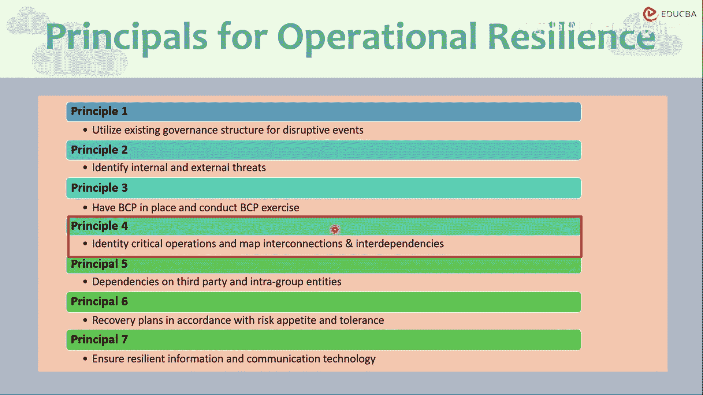

同时，银行应识别为交付关键业务产出所必需的内外部互连性与相互依赖性。

识别互连性与依赖性的重要性在于，它能帮助银行发现潜在的瓶颈和系统脆弱点，并了解哪些事件会冲击系统的哪些方面。

例如，在新冠疫情封锁的场景下，压力最大的领域是员工长期居家或远程办公的能力。如果银行的系统无法为所有员工提供硬件设备，或没有安全的网络接入方式让员工访问银行网络，那么这将成为最脆弱的环节。

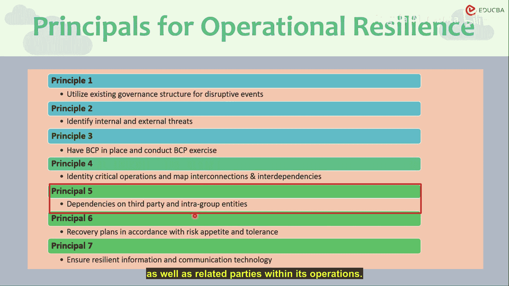

因此，银行或任何金融机构必须具备识别不同领域、不同内外部因素之间，对于重要业务功能的互连性与依赖性的能力。

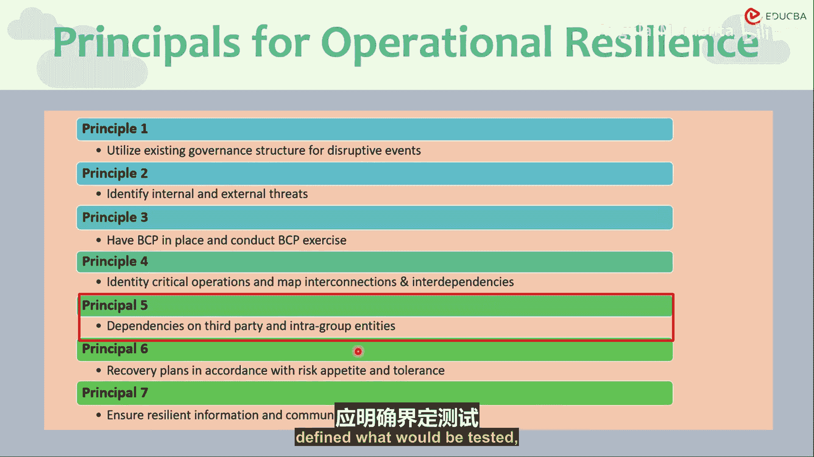

---

接下来，我们探讨与第三方依赖相关的原则。

## 原则五：管理第三方依赖 🤝

银行应能够管理其对第三方服务及相关业务实体的依赖。这些实体包括外包商、第三方服务提供商或关联实体。

银行应能识别并管理其运营中对这些相关方、第三方实体及集团内关联方的依赖。最终目的当然是确保关键业务的平稳交付。

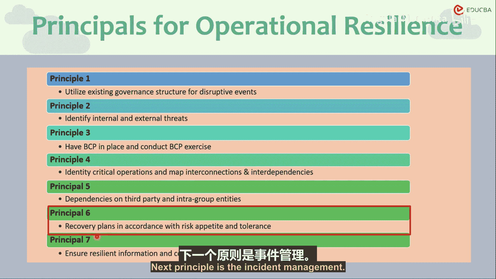

因此，银行在与外部第三方或集团内实体建立合作关系前，应进行风险评估和尽职调查，且该流程需符合银行的运营风险管理框架。尽职调查应成为运营风险框架的一部分。

尽职调查应明确定义对第三方服务或集团内实体的测试内容和期望。风险管理政策、运营风险方面、运营韧性方面，所有这些都应对以下三者进行测试：
*   **A.** 银行自身实体。
*   **B.** 与之开展业务往来的第三方或外部方。
*   **C.** 银行与第三方服务提供商作为一个组合的运营单元或相互依赖的交付系统。

如果第三方服务提供商能够弥补银行在运营韧性方面的不足，那将是最理想的结果，也是对银行业务运营的最佳补充。

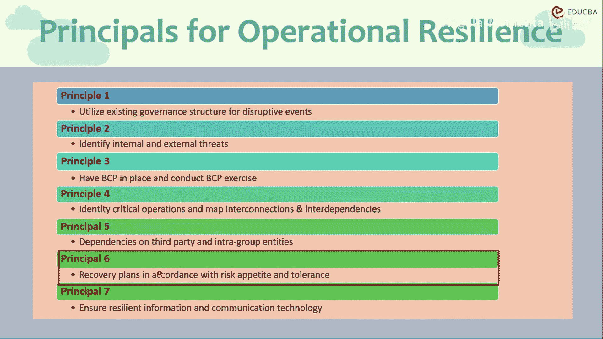

---

了解了外部依赖的管理后，我们转向内部应对机制。

## 原则六：事件管理 🚨

银行应制定并实施响应与恢复计划，以管理可能中断关键业务交付的事件，这些计划需与银行的风险偏好或我们在前面章节见过的“中断容忍度”（即风险偏好和影响容忍度）保持一致。

银行应持续监控并改进其事件响应时间、响应计划和恢复计划，以纳入从以往事件中吸取的经验教训。这预期会形成一个持续的反馈循环。

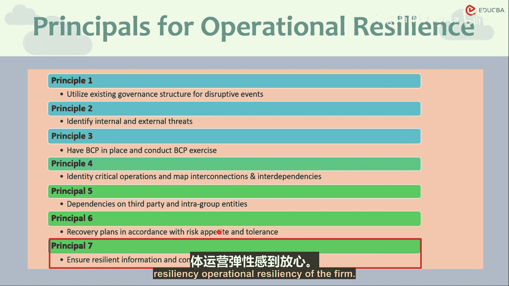

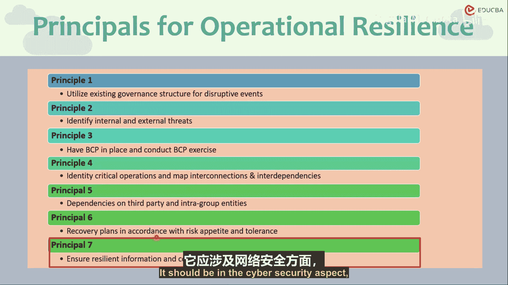

这些以往事件可以是实际发生的事件、未遂事件，或是从模拟、情景分析、测试分析中获得的经验。它们都应被同等对待，因为它们都被期望能帮助银行更好地为运营风险事件做好准备。

事件严重程度的分类应基于与结果相关的预定标准。我们见过两种方法：输入严重性分类和输出严重性分类。此处的严重性应基于**输出严重性**，而非输入严重性。即使输入参数发生微小变化，也可能对银行的产出参数或其交付关键业务服务的能力产生不成比例的影响。

因此，事件严重性应基于其对关键业务服务的影响来判定。它也可以基于预期恢复正常运营的时间来定义。

严重性可以定义为财务影响、恢复正常的时间、组织内或整个金融部门的关联性和多米诺骨牌效应，也可以基于内外部利益相关者（如监管机构、股东、董事会）定义的某些优先级。无论银行采用哪种方式，都应预先定义，并且恢复计划应根据这些事件的严重性来设定。

---

在建立了事件管理机制后，保障支撑这些机制的技术基础至关重要。

## 原则七：信息通信技术与网络安全 🛡️

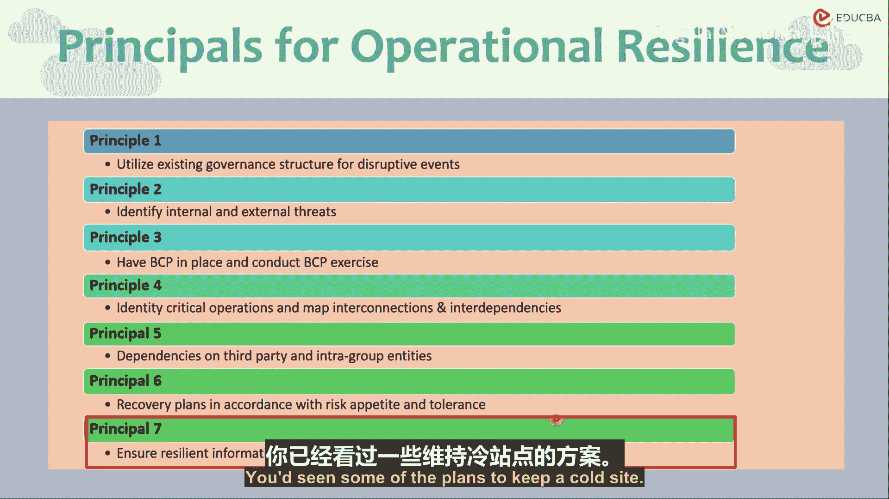

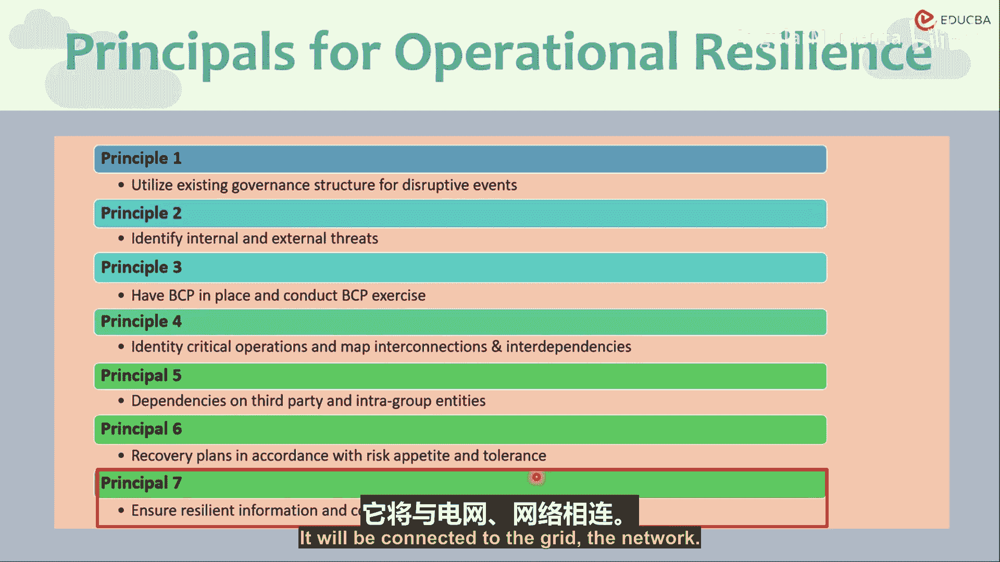

银行应具备韧性的信息通信技术，包括网络安全，并使其接受保护、检测、响应和恢复计划的约束。

这些计划应定期测试，纳入态势分析、情景感知和情景分析，并应及时为风险管理和决策传递相关信息。这将有助于支持在风险容忍度内及时交付的过程，并促进银行的关键业务运营。这不仅有助于交付关键业务，还能让高级管理层对整体的稳健性和运营韧性感到放心。

这些内容应记录在ICT政策中。网络安全的韧性方面也应成为ICT政策的一部分。政策可包括网络与ICT的治理和监督要求、风险所有权、问责制、安全措施、现有控制措施、关键信息保护、数据隐私、资产保护（硬件、软件、实物或数字资产）以及身份管理。

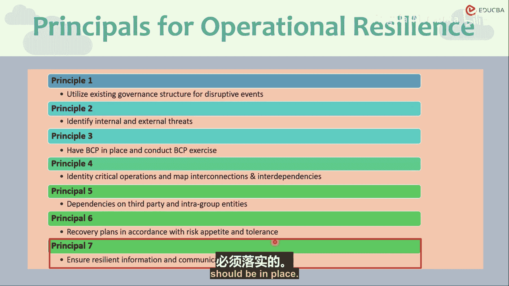

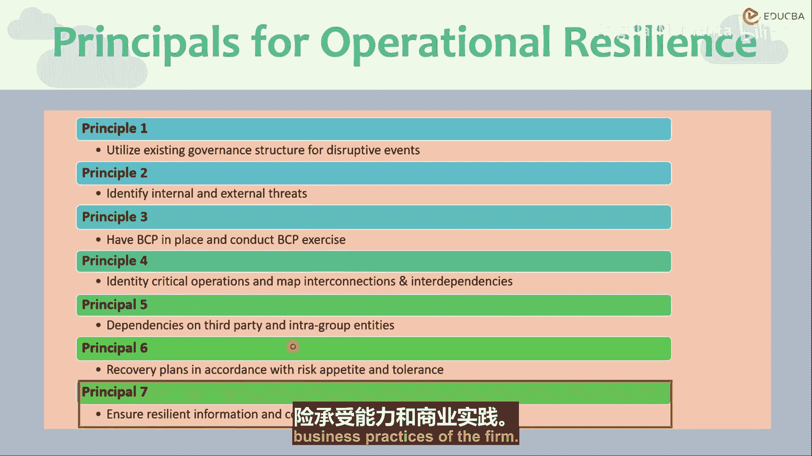

网络安全控制措施应定期测试和监控。正如前面章节所见，网络安全领域在不断演变，因此必须定期测试，并根据世界和该领域的最新发展进行改进。这是一个持续演进的过程。恶意行为者时刻试图侵入银行系统、金融系统和金融中介系统，他们只需成功一次；而防御方（银行、金融中介、机构）则必须在每一次都正确无误地保护自己免受网络攻击。

这可能包括多种计划和备份。例如，我们见过一些保持“冷站点”的计划。这里的术语是“热站点”和“冷站点”服务器。热服务器连接到系统，它们会有备份，但会连接到互联网和网络；而冷站点则通过物理措施进行备份，它们可以被替换，但不会连接到任何网络。这样，即使恶意行为者入侵了网络，冷站点仍能运行。但显然，维护冷站点成本较高且耗时，从冷站点恢复数据以实现业务韧性计划和恢复计划也既费时又昂贵，因此我们现在主要维护热站点。

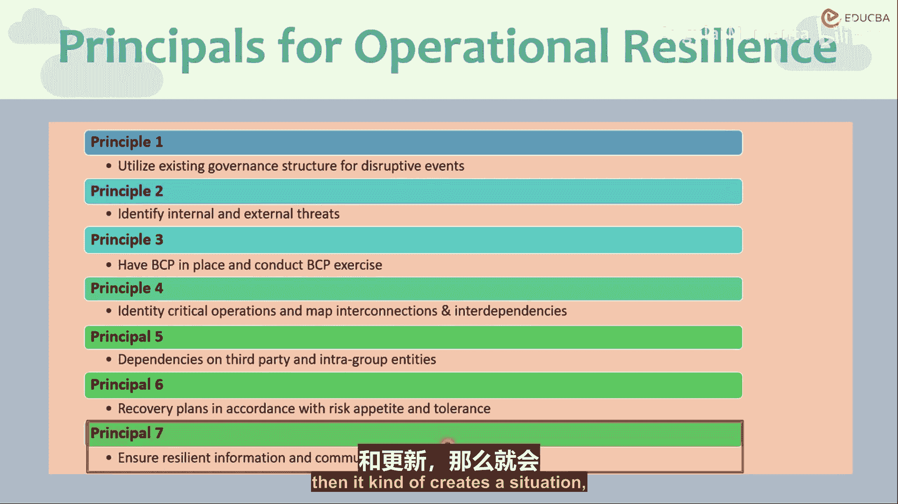

在维护更多热站点或冷站点及其相关成本之间进行权衡，这同样是一种取舍，但必须有相应的安排。银行是选择一个备份服务器还是十个，取决于其风险偏好和业务实践。但总体思想是，必须有相应的计划和政策，并对其进行修订、测试，并在必要时与内外部利益相关者沟通。关键在于要有计划。计划的强度和严重性是下一个问题，但首要问题是制定这些政策并保持更新，以便在发生任何事件时，公司能够维持运转。

一个重要的现实情况是，员工不断加入，角色在组织内外不断变动。如果应急预案或韧性计划、政策没有明确定义并及时更新，就可能造成危机局面，导致关键的重要知识流失，因为熟悉某个特定领域的专家可能已经离职。通过建立适当的文档记录和政策，可以避免这种情况，这将有助于实现韧性的运营风险管理和韧性的信息通信技术，也包括网络韧性。

---

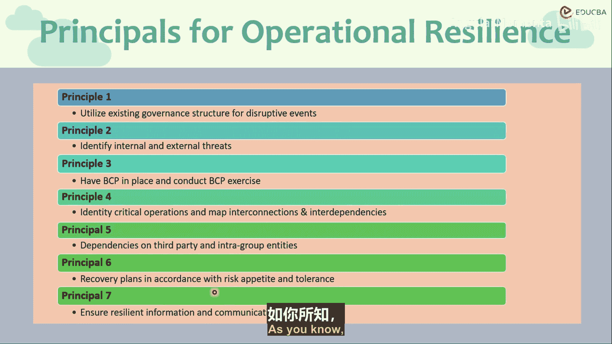

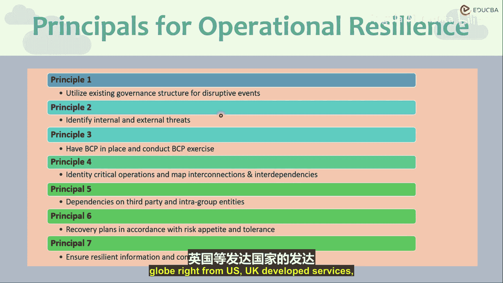

## 总结 📝

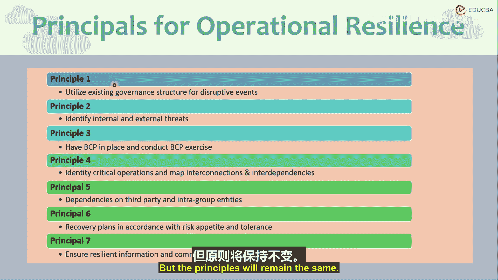

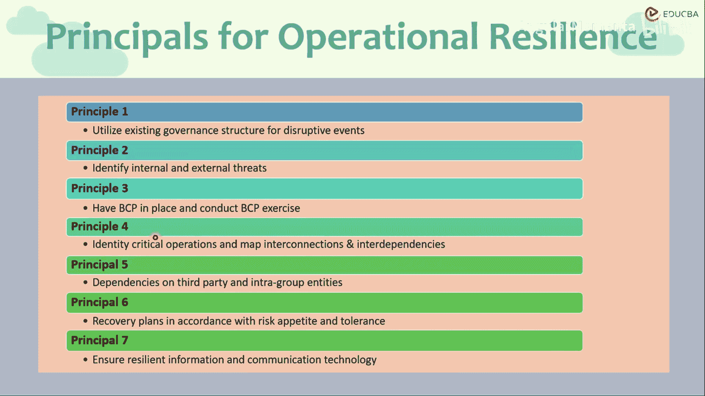

本节课中，我们一起学习了巴塞尔委员会定义的运营韧性核心原则的后半部分。我们探讨了如何通过映射互连性与依赖性来识别系统脆弱点，学习了管理第三方依赖的尽职调查与测试要求，明确了基于输出影响制定事件响应与恢复计划的重要性，并深入了解了构建韧性ICT与网络安全框架的关键要素，包括热/冷站点等具体策略。这些原则为全球银行业提供了全面的指导，但具体实施需由各国监管机构根据本地情况进行调整和采纳。掌握这些原则，是理解现代银行如何构建抵御运营冲击能力的基础。