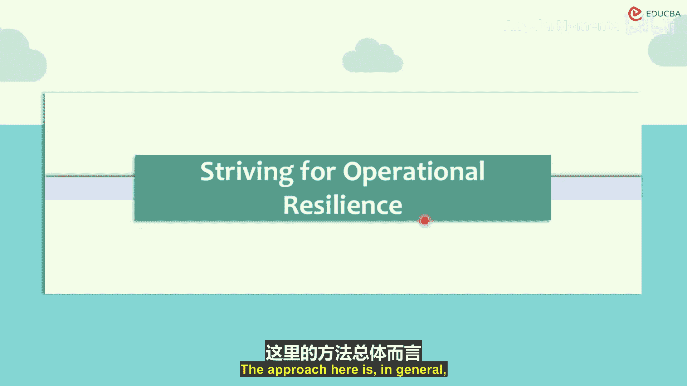
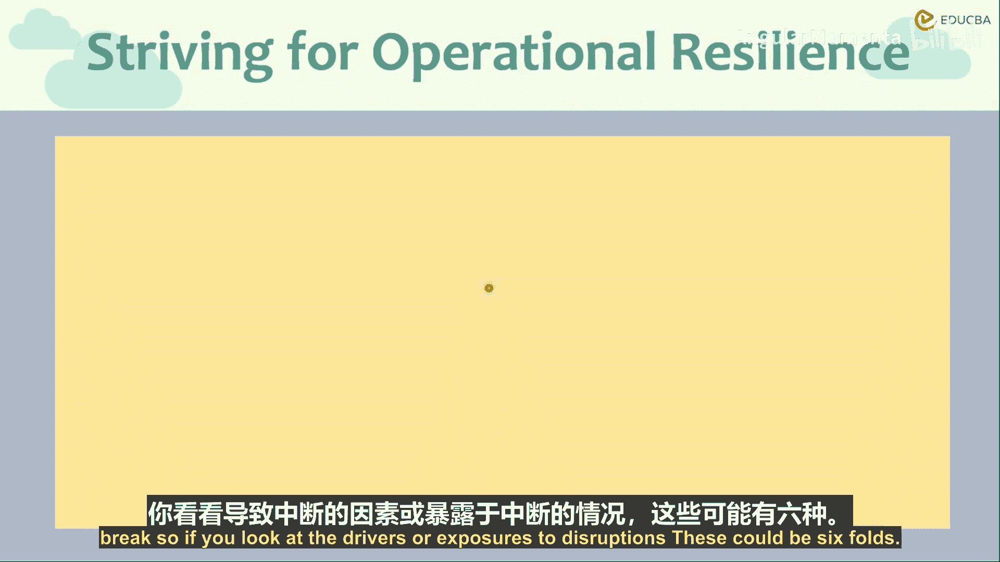
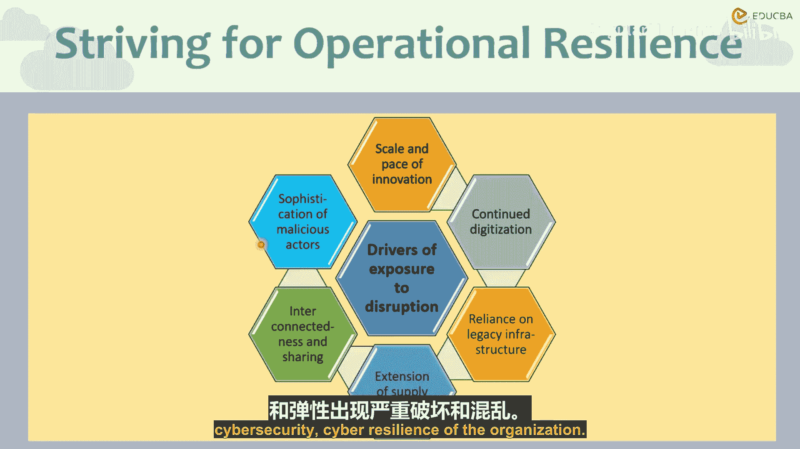

# 020：暴露驱动因素 🎯

在本节中，我们将探讨金融机构在追求运营韧性时所面临的主要暴露驱动因素。理解这些驱动因素是构建有效风险管理和业务连续性计划的基础。

上一节我们介绍了运营韧性的核心概念，本节中我们来看看具体有哪些因素会挑战组织的韧性。

## 概述：运营韧性的挑战

运营韧性要求组织在面临不利运营事件时，仍能持续提供业务服务。这并非传统的业务连续性或灾难恢复方法，后者更侧重于物理事件和特定业务单元的孤立测试。运营韧性将组织乃至整个金融行业视为一个整体，应对来自网络安全、技术、第三方、物理设施、运营及人力资源等各方面的中断与攻击。其核心理念是：**能够弯曲，但不会断裂**。

## 暴露驱动因素详解

以下是威胁组织运营韧性的六个主要驱动因素。

### 1. 创新规模与速度 🚀

创新既来自行业内部，也来自外部。金融科技公司的崛起加剧了竞争，推动了创新周期的加速。这带来了双重挑战：
*   **复杂性增加**：交付产品和服务所需的流程和基础设施变得更为复杂。
*   **失衡风险**：产品上市时间与安全保障之间出现失衡。由于高度互联，服务中断的影响会以前所未有的速度在整个市场蔓延。组织往往没有足够的时间将新服务、新创新纳入其韧性计划。

**核心挑战公式**：`创新速度 > 韧性计划整合速度`

### 2. 数字化进程 💻

物联网等技术正触及客户生活的方方面面，客户期望也随之提高。这推动了自动化水平和新技术的快速采用。传统的手工方法已无法处理海量数据，我们必须依赖系统和计算机。关键在于识别互联数字系统中的最薄弱环节。

**核心概念**：一个链条的强度取决于其最薄弱的一环。

### 3. 对遗留基础设施的依赖 🏚️

由于创新步伐极快，基础设施迅速过时并成为遗留系统。组织往往没有机会替换这些旧基础设施，而是在其上不断构建新的硬件或软件。新旧基础设施之间的任何漏洞或差距都会削弱系统，并在组织试图恢复时造成运营韧性问题。此外，随着技术过时，维护和修复它们的能力也变得稀缺。

**核心思想**：我们不应等待破坏性事件迫使我们升级遗留系统，而应主动采取措施。

### 4. 供应链延伸 🔗

随着业务的专业化和互联，组织对第三方服务提供商和业务流程外包的依赖日益加深。虽然这带来了效率，但也引入了更多依赖点。供应链中每一个新增的第三方依赖（无论组织内外）都会增加整个风险控制结构中的风险和潜在故障点。

### 5. 互联性与信息共享 🌐

这一点在不同形式中已有所涵盖。高度的互联性意味着风险与冲击更容易在系统间传导。

### 6. 恶意行为者的复杂性 🦹

网络攻击者和黑客也在快速创新，不断寻找新的攻击手段来利用系统漏洞。他们中的一些拥有专业的资源和资金，甚至可能得到国家支持。其实践的复杂性和快速创新给组织的网络攻击预防和整体网络韧性带来了更多挑战。

**核心不对称性**：攻击者只需正确或幸运一次，而防御者（网络安全人员）必须每次都正确无误。因为即使只有一个漏洞被成功利用，也可能对组织的整体网络韧性造成严重破坏。

## 总结

本节课我们一起学习了影响金融机构运营韧性的六大暴露驱动因素：**创新规模与速度**、**数字化进程**、**对遗留基础设施的依赖**、**供应链延伸**、**互联性与信息共享**，以及**恶意行为者的复杂性**。理解这些驱动因素有助于董事会和高级管理层审视自身，评估组织在多大程度上为应对运营中断做好了准备，从而制定出更全面、更主动的韧性策略，确保组织在逆境中仍能“弯曲而不断裂”。