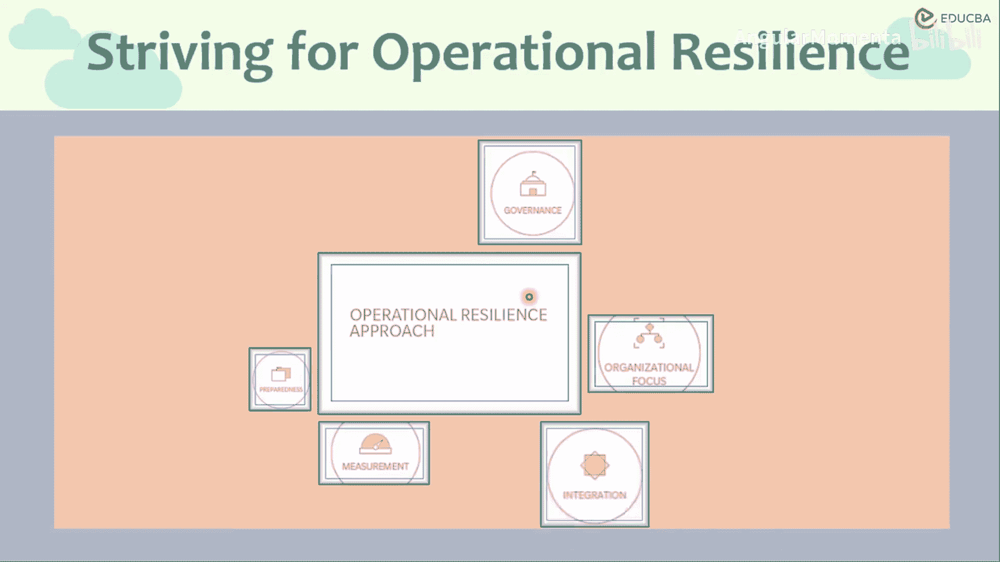
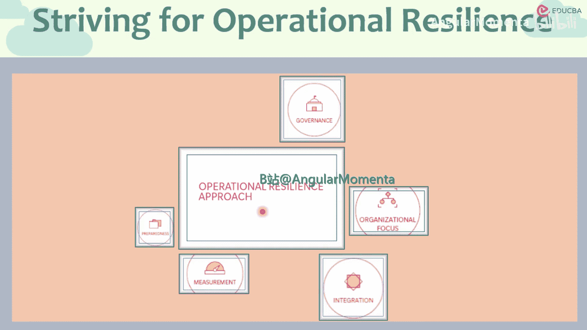
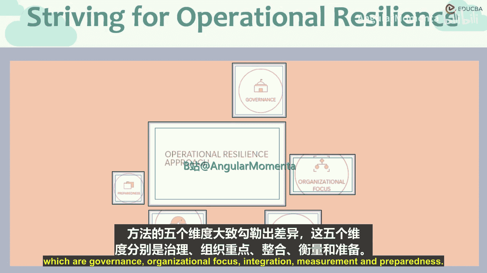
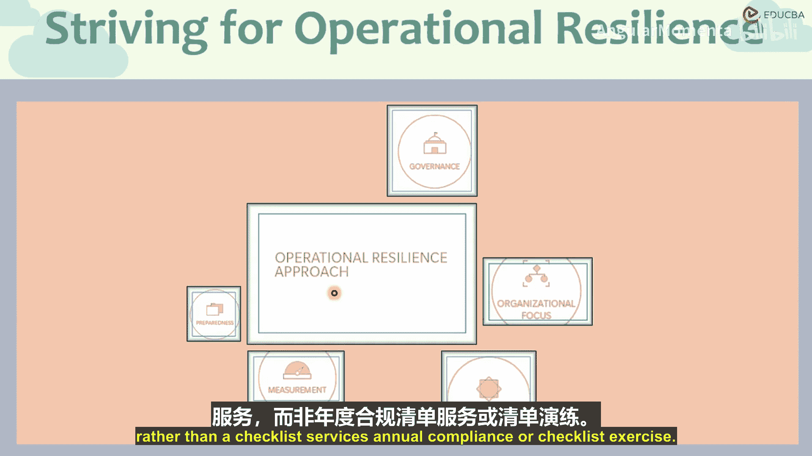
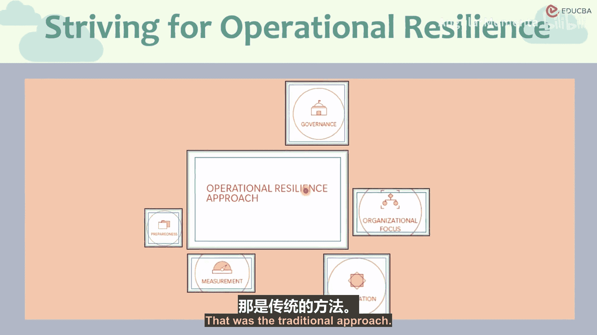

# 021：运营韧性方法 🛡️

在本节课程中，我们将学习运营韧性方法，并理解它与传统的业务连续性及灾难恢复方法在根本上的不同。

## 概述

运营韧性方法与传统方法在核心理念上存在根本差异。传统方法主要关注业务连续性和灾难恢复，而运营韧性方法则是一个更全面、更主动的风险管理框架。接下来，我们将从五个维度详细剖析这两种方法的区别。

## 五大维度对比分析

上一节我们介绍了两种方法的根本不同，本节中我们来看看它们在五个具体维度上的差异。

以下是运营韧性方法与传统的业务连续性及灾难恢复方法在五个关键维度上的对比：

1.  **治理**
    *   **运营韧性方法**：明确界定董事会和高级管理层的责任。他们需要深度参与并成为运营韧性建设的一部分，因为这是企业级风险管理的组成部分，而不仅仅是合规要求。它涉及向所有利益相关者提供全面且可执行的报告，以驱动持续改进。这是一个**持续的过程**，并受到高级管理层的密切监控和参与。
    *   **传统方法**：董事会和高级管理层的角色非常有限。更多是事后响应的“仅供参考”性质，或是一种检查清单式的合规完成工作，即只需对照清单检查公司是否合规。

2.  **组织关注点**
    *   **运营韧性方法**：关注**关键业务流程**和为客户提供的重要业务产出。它审视端到端的业务流程，而非孤立的部门。例如，对于“交易结算”这一流程，它会考察组织中所有相关团队的贡献、依赖关系和参与度，从而识别跨部门的临界点和脆弱性。其视野不仅限于组织内部，还关注中断对整个金融行业乃至宏观经济的潜在影响。
    *   **传统方法**：非常具体，通常只针对特定业务部门或技术资产。最多能扩展到公司层面，但仍是孤立的视角。

3.  **整合性**
    *   **运营韧性方法**：由于关注整体流程和业务产出，它天然地整合了多个业务部门、团队和组织资产。这包括**系统、硬件、数据、软件、第三方、设施、流程、人员、知识与技能**。它将韧性测试嵌入到业务服务、产品交付和组织资产的前期设计中，是服务与产品开发的内在组成部分。
    *   **传统方法**：更像一个外部附加部分，主要出于合规目的。它不一定融入服务和资产的开发过程，依赖关系也更多集中在业务部门层面或特定技术资产上。

4.  **衡量标准**
    *   **运营韧性方法**：审视为每个关键服务量身定制的破坏性业务场景。这些场景与业务紧密相关，具有前瞻性，旨在预测未来可能发生的情况。为此设定的**容忍度**也针对具体场景和业务服务。
    *   **传统方法**：采用“一刀切”的标准。使用标准的破坏性场景（如洪水、地震）来评估所有业务单元，无论其性质是技术部门还是交易结算部门。这导致使用标准的容忍度和场景分析，虽有其价值，但无法呈现业务整体的最佳全貌。

5.  **准备状态**
    *   **运营韧性方法**：强调危机管理，并建立明确的响应机制（如首要响应、次要响应）。它设有统一的指挥中心来处理各类事件。其规划和能力受到持续监控和测试，而非不频繁的演练。可以将其类比为**紧急救援服务**，始终保持待命和准备状态。
    *   **传统方法**：主要针对发生频率低但影响大的事件（如自然灾害）。因此能力测试不频繁（通常每年一次），且不同事件可能有不同的响应机制，缺乏对危机管理本身的集中关注。

## 总结

本节课中，我们一起学习了运营韧性方法与传统业务连续性及灾难恢复方法的区别。关键点在于，运营韧性是一个**整合的、以业务流程为中心的、由高层驱动的持续过程**，它嵌入组织运营的方方面面，并像紧急服务一样保持持续的准备状态。而传统方法则更偏向于**部门化的、合规驱动的、针对特定高影响低频事件的周期性检查**。理解这些差异对于构建真正有效的组织韧性至关重要。