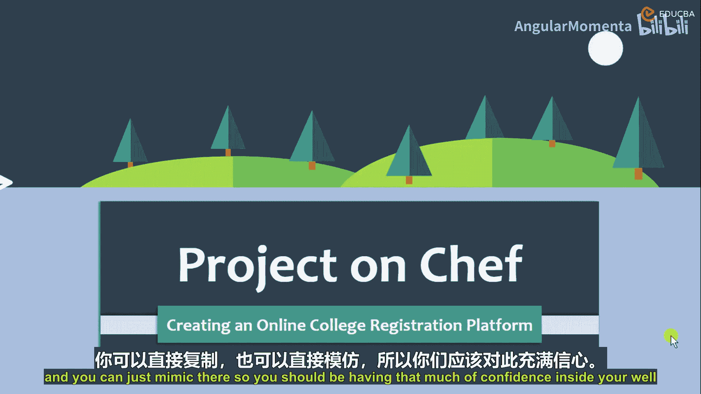
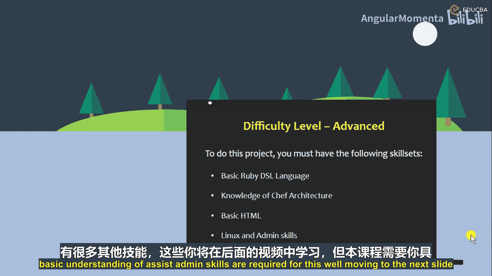
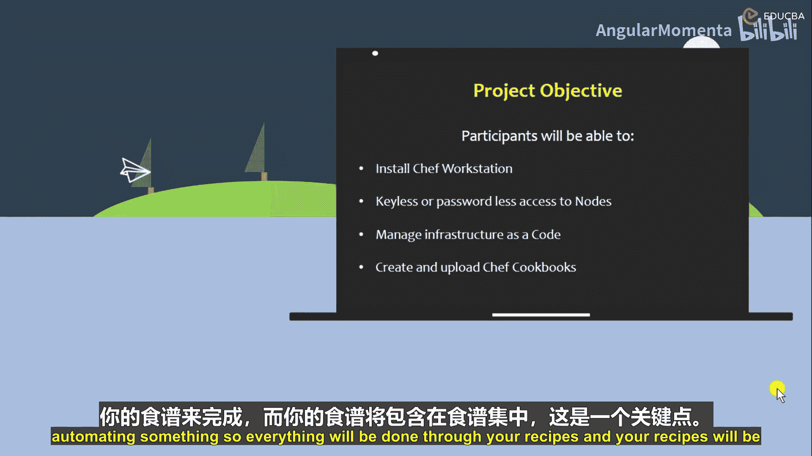
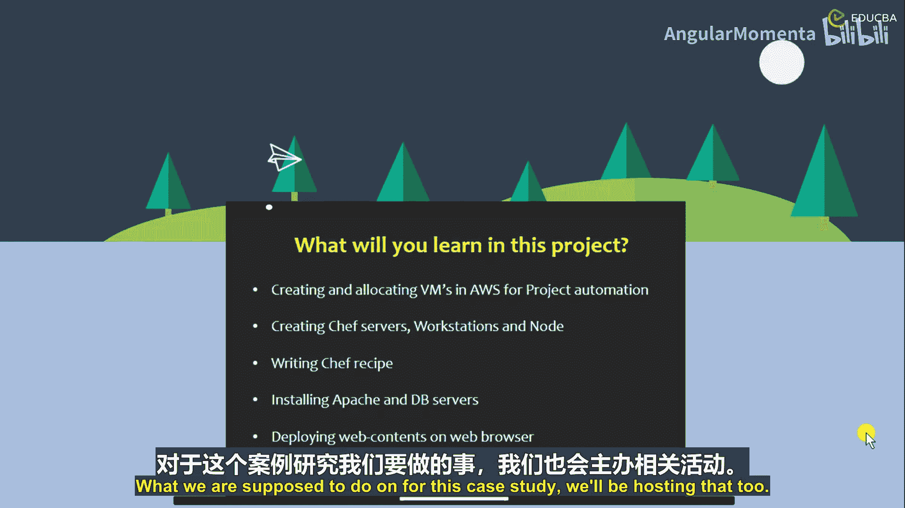
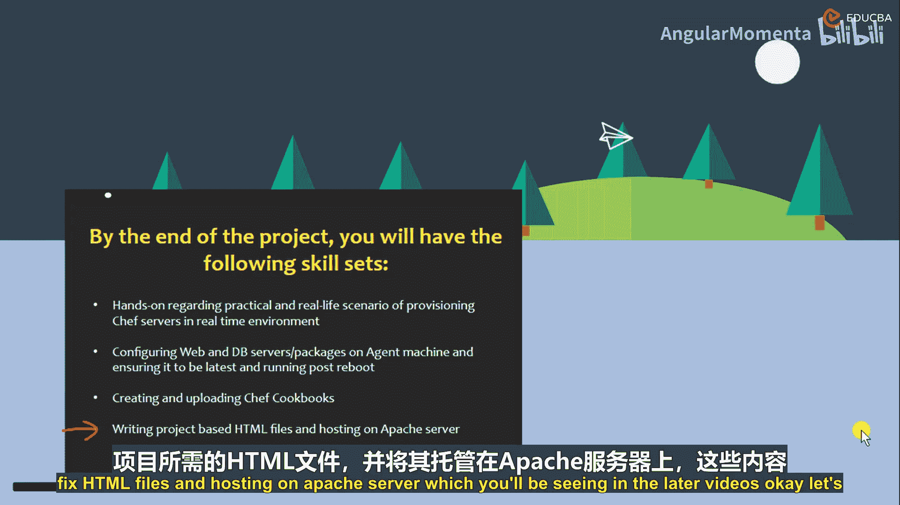
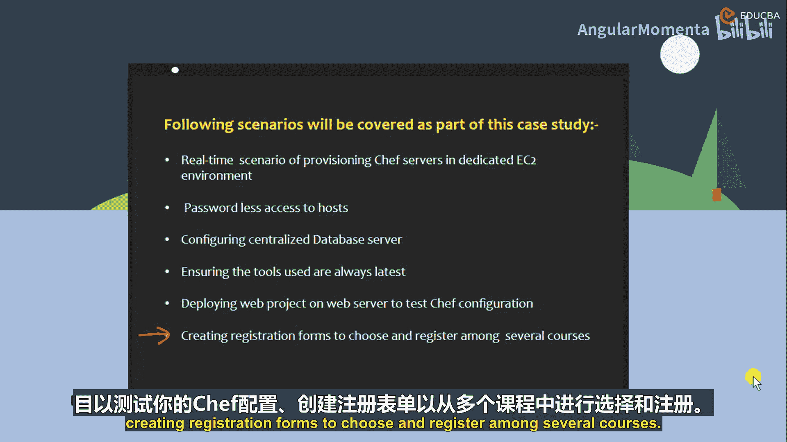

# 001：项目导论 🚀

在本课程中，我们将学习如何应用Chef自动化工具，创建一个**在线大学注册平台**。这是一个基于真实场景的案例研究，旨在通过实践掌握Chef的核心概念和应用。

## 概述

Chef是一个非常流行且重要的工具。根据需求，它可以作为**配置管理工具**、**项目自动化工具**或**编排工具**使用。用更简单的话来说，它是一个能让你的工作变得更轻松的工具。这个定义适用于所有DevOps工具。自DevOps出现以来，它使得部署和配置管理等工作变得容易得多。

本课程的目标是让你有信心将Chef引入自己的基础设施。你可以模仿和使用我在这里演示的所有功能和基础设施。你应该对此充满信心。

## 项目难度与背景

本项目的难度级别为**高级**。在开始之前，让我们讨论一下课程背景以及你需要熟悉的内容。

学习Chef的一个重要部分是能够讨论**基础设施即代码**。在本课程中，你会多次听到这个词。我们实际上是在这个案例研究中创建基础设施即代码。不用担心，你会在后续视频中看到所有相关内容。

当你能够描述基础设施即代码时，部分工作将使用Linux风格的命令行工具。因此，在开始课程之前，请确保你熟悉导航、更改目录或列出目录内容等操作。你还需要具备查看和编辑文本文件的技能。在本课程中，你可能会发现需要直接在主机上编辑文件。因此，如果你从未使用过像Vi、Nano、Emacs这样的文本编辑器，你可能需要在尝试远程编辑文件之前先了解一下。我们将在本案例研究中大量进行此类操作。

此外，你还应该意识到你正在使用基础设施即代码，并且在本课程中会看到大量代码。需要明确的是，你不需要成为一名开发人员就可以开始学习Chef。但由于Chef依赖于Ruby编程语言，你需要对**变量**、**循环**、**数组**以及如何传递变量、函数和数组等有基本的理解。这是基本的编程语言概念，不仅限于Ruby。如果你熟悉任何编程语言，你应该了解如何引入循环、变量以及如何在脚本中传递参数。因此，你需要具备一些这方面的知识。这就是为什么我们将此案例研究定义为高级难度。

简而言之，只需对Ruby有高层次的概念理解即可开始本案例研究。

## 重要前提

需要指出的是，学习本案例研究并不需要深入的Chef知识，但你应该对**Chef架构**、其遵循的树状层次结构有基本的了解。

除此之外，你需要的是一台控制机器，最好使用Linux。在本课程中，我们将使用Linux作为控制机器。如果你想模仿我在这里演示的内容，请使用Ubuntu或OpenSUSE等Linux发行版。

你需要能够通过SSH进行通信的虚拟机节点。SSH意味着节点之间的安全传输。一旦安装了节点，它们就会进行通信，因为我们保存了公钥和私钥，并使它们能够相互通信。因此，节点之间应该能够相互通信。

关于服务器的知识，你可以为此案例研究选择任何物理服务器或云服务器。我们将使用AWS，但你也可以使用Azure、Google Cloud、阿里云等公有云。我建议使用AWS，因为我们在这里使用它，这样如果你想演示相同的内容，对你来说会更容易。

我们将详细介绍每个安装过程，不用担心节点机器或虚拟机，我们会在后续视频中讨论。

另外还需要的是**基本的HTML知识**。HTML也是一种编程语言，你在HTML中所做的更改将托管在Web服务器上，它只是包含页面的网站。我不期望你成为HTML专家，但你应该对HTML标签、字段、如何定义字段、如何插入标签以及如何用CSS级联等有概念性的理解。这样，当我编写代码时，你应该能够熟悉正在发生的事情以及我们如何调用所有这些内容。因此，需要基本的HTML标签知识，因为本课程最终依赖于HTML内容。我们将通过Web服务器上的HTML发布所有网站或网页。

最后是你的**管理员技能**。这里的管理员技能指的是中级技能。你将会有很多命令，比如启动和停止服务器、检查服务器状态或检查你使用的Chef服务器版本等。你将在后续视频中学到更多技能，但需要对这些管理员技能有基本的理解。

## 项目目标

参与者将能够安装Chef工作站，实现到节点的**无密钥或免密码访问**，并在项目中引入这些设置。

如果你在本案例研究中描述所有这些内容，你将安装Chef工作站。我们将为此设置一个集中式工作站，安装Chef，并拥有节点。我们将在节点上实现自动化。我们将有一个主服务器和一个工作站，在那里编辑所有文件。

我们需要节点，因为节点是客户端机器。我们在主服务器上所做的任何自动化，其最终目的都是要传输到节点，因为它应该在客户端机器上完成。节点将如何通信？假设在你的组织中有50个节点，50台客户端机器，你的更改需要在那里复制。无论你在工作站上做什么，都会在那里被模仿和复制。因此，节点将如何配置、节点之间如何通信、节点如何与你的Chef工作站通信？为此，我们将确保实现无密钥或免密码访问，这样当你的节点需要与其他节点或工作站通信时，不需要任何人工干预，它应该是免密码的。如果不是免密码的，每次你在主机上做所有事情时，都必须去那里输入密码。确保对节点的访问是无密钥或免密码的。

第三件事是**管理基础设施即代码**。正如我讨论过的，你会听到很多关于基础设施即代码的内容，因为Chef就是基础设施即代码。我们正在用代码创建基础设施。我们编写所有设置基础设施所需的代码。

最后一件事是**创建和上传Chef Cookbook**。在这个案例研究中，你将创建配方（recipes）并将配方上传到中央服务器和节点上，这将作为基础设施记录使用。

你刚刚听到“Cookbook”这个词。Chef就像一个准备食物的人。配方就像他在准备食谱，而Cookbook就是食谱书。类似地，在Chef中，Cookbook包含配方。一捆配方被称为Cookbook。在配方中，我们将拥有所有我们尝试安装的模块，比如安装服务器、删除服务器、创建内容、部署某些东西或自动化某些事情。所有事情都将通过你的配方完成，而你的配方将位于Cookbook内部，这就是层次结构。

## 你将学到什么

在这个项目中，你将学习如何为项目自动化在AWS上创建和分配虚拟机。

你将在AWS机器上创建节点。我们将为你的节点或集中式工作站分配专用的虚拟机。这是第一件事，就像创建基础设施和设置一样。

之后，我们将创建Chef服务器、工作站和节点。在此之前，我们只是创建架构，接下来我们将托管它。现在，我们只是安装Chef服务器，我们想要安装的Web服务器或Chef服务器版本，我们将安装在一个节点上。我们将配置工作站并设置我们的节点。

之后，我们将编写Chef配方，正如我之前解释的。配方将包含你的代码，这些代码将用于自动化目的。

下一件事是**安装Apache和数据库服务器**。这是主要的事情，实际上是你案例研究的核心。没有Apache，你就不会有Web服务器，不会有网站，也不会有我们做这个案例研究的目的。这个案例研究是关于进行无纸化在线交易，就像一个大学注册表单。如果没有Web服务器，因为Web服务器是用来托管Web应用程序的，那么什么应用程序会制作HTML应用程序呢？它们将托管在Web服务器上，所以我们需要Apache服务器，或者我们可以使用Nginx服务器作为你的Web服务器，并且我们需要数据库服务器。

为什么？因为数据库服务器服务于最终目的。没有数据库服务器，你几乎无法想象任何事情。假设你进入一个在线商店，比如亚马逊，尝试做任何事情。从你登录的那一刻起，你导航到某些产品、购买某些产品或结账的所有细节，所有时候，一切都存储在数据库服务器中。从你登录数据库服务器的那一刻起，我们要做的第一件事就是安装数据库服务器，因为所有交易都应该进入数据库。没有数据库，你如何存储东西？大学想要存储所有申请者的信息，他们实际上倾向于某些科目或类似的东西。如果你进行输入，你必须把它保存在某个地方，对吧？以前人们用文件保存，现在我们把所有这些东西保存在数据库位置，那是虚拟的。

最后一件事是**在Web服务器上部署Web内容**。这就是我们讨论过的，Web服务器将是Apache、Nginx或任何服务器，部署Web内容就像部署你的HTML内容或其他内容。对于这个案例研究，我们也将托管这些内容。

## 项目要求与先决条件

我们已经讨论过这一点，让我们简要回顾一下。

正如我之前告诉你的，需要**Ruby DSL语言的基本知识**、**Chef架构的知识**，因为当我演示Chef如何工作以及所有内容时，我需要你对架构、它遵循的层次结构有一个清晰的了解。当然，还需要**HTML标签**，这对我们的案例研究是必需的，以及**Linux语言**。说到Linux，我不是要求你具备脚本知识，只需要Linux的基本命令语言。

## 目标学员

任何想学习Chef作为DevOps工具的人都可以。可以是任何人，可以是你，可以来自酒店行业，可以来自跨国公司。任何想学习Chef作为DevOps工具的人，因为DevOps让事情变得更容易。任何想学习Chef作为DevOps工具并希望将其集成到自己的架构和基础设施中的人，都可以从这个案例研究中获得大量知识。

下一类学员是**从事DevOps工程师工作的参与者**。因为Chef是DevOps的一部分，所以任何DevOps工程师都需要获得Chef的知识。还有很多其他DevOps工具可以做Chef所做的同样的事情，比如你有Ansible、Puppet。对于Ansible，人们过去常常编写Playbook，然后将其传播到所有节点，他们只需要一个中央服务器，不需要在节点上安装代理，只需要在所有节点上安装Python。当你编写节点时，Ansible节点实际上正在被推送所有这些内容，节点在你推送所有代码后实际上正在被自动化。所以Ansible就是你的推送机制。而这里，Chef是你的拉取机制。你在工作站（也就是主服务器）上安装Chef，你的Chef机器将不断从中央服务器拉取，以获取你部署的最新副本，这样你的子节点或节点将拥有最新的部署。这是一个基本的区别。

因此，**从事自动化或开发工程师工作的参与者**将需要它，因为Chef是一个有助于你部署目的的工具。如果你是开发人员，并且想将某些东西部署到服务器上，你将学习本课程。如果你是工程师，你想自动化你的代码，或者你不想去10台服务器做同样的事情，只需在你的Chef目录中自动化代码，它将被传播到所有节点。所以它基本上完成了你的自动化开发工作。你可以使用编排工具。

最后但同样重要的是，**从事自动化项目编排的学生**。如果你是大学生或工程师，想实际进行自动化项目，他们可以使用Chef作为自动化工具，因为Chef完全满足DevOps工具所需的所有自动化。他们可以学习本课程，他们将获得大量关于如何将Chef用作DevOps自动化或开发工具的知识，并可以用于这个项目编排。

## 你将获得的技能

在本项目结束时，你将拥有以下技能：

*   **实践经验和真实场景**：关于配置Chef服务器实时环境的实践经验。当然，如果你完成了所有这些内容，你可以在你的实时环境、你的办公室中创建所有这些Chef服务器。如果你在跨国公司工作，显然是在某些服务器上工作，你可以模仿所有这些内容到你的架构中，并且你将有足够的信心引入Chef。
*   **运行Web和数据库服务器**：在代理机器上运行Web和数据库服务器，并确保其在重启后保持最新运行状态。正如我告诉你的，必须在你的代理机器上配置Web和数据库服务器，因为代理机器就是你的客户端机器，你希望在那里进行所有更改。如果你完成了所有这些自动化，制作了所有Web内容，假设你目标部署内容的Web服务器没有运行，那么自动化就失败了，你一无所有。因此，需要所有这些自动化内容在一个正常运行的Web服务器上。必须确保即使你的虚拟机宕机，一旦你的虚拟机恢复，你也不需要单独去启动你的Web服务器或数据库服务器。我们将编写代码，确保每当你的数据库服务器启动时，你的Web服务器也启动；每当你的虚拟机启动时，你的Web服务器和数据库服务器都处于运行状态。
*   **创建和上传Chef Cookbook**：你将创建和上传Chef Cookbook。
*   **编写项目HTML文件并托管在Apache服务器上**：你将编写项目HTML文件并将其托管在Apache服务器上，你将在后续视频中看到。

## 案例研究核心

现在让我们进入重点，即本案例研究的核心。案例研究讲述了一所大学希望升级其招生流程，旨在实现注册过程的数字化。

如果你想将这种情况与现实生活情况联系起来，现在是疫情时期，全球都面临新冠病毒问题，这是一场大流行。每项业务都受到影响，你的大学、商场等一切都不景气。一所典型的学生过去线下学习的大学正遭受巨大损失，他们必须支持员工，必须教学生，必须维持业务。他们将如何做到这一点？现在他们计划推出数字表单，你过去所做的一切，比如在纸上填写所有信息、支付和注册，比如你的姓名、年龄、性别、地址？你想学什么课程？假设这是一所工程学院，那么工程学院有土木工程、机械工程、IT、化学等各类工程。为了选修这些课程，你需要注册。只有这样，它才会进行，你才能在你的视频上看到所有内容，或者你能够进行实时培训或视频会议，所有事情都在你的OTT机器上进行。在这种情况下，我们想要演示并实现这一点。

此外，它希望拥有以下功能：

*   **功能完整的注册表单和学生注册表单**。所谓功能完整的注册，意味着注册表单将包含注册所需的一切，比如需要你的姓名、年龄、电子邮件地址、你选择的课程（比如如果你选择计算机科学工程，你将选择计算机科学工程）、邮寄地址等。一旦学生填写了所有详细信息，他们将能够注册。一旦你能够注册，所有详细信息将进入你的数据库服务器。一旦大学验证了数据库服务器，就会进入支付页面。一旦你完成支付，你将能够观看所有内容，并获得大学要求你获得的所有学习资料。这是本案例研究的基本目标。
*   为此，我们需要一个**专用的最新Web服务器**来托管应用程序，因为这些表单将托管在Web服务器上。如果Web服务器不存在或不是最新的，那么将会有困难，因为你将无法模仿这些内容，也无法进行更改。
*   为什么我们需要这个最新的Web服务器？我们需要最新的Web服务器，因为在早期版本的Web服务器中可能存在母公司已在最新版本中修复的错误或问题。如果你有最新版本，我们为什么不使用最新的呢？我们将只使用最新的Web服务器，并且在我们的代码中，我们将注明，每当Web服务器有变化，比如Web服务有新版本时，请自动安装最新的Web服务器，而无需停机。我们将做到这一点。
*   下一件事是**集中式数据库**，用于存储你的所有详细信息。
*   第三件事是**详细的课程信息**，当然，可供注册，正如我们已经讨论过的。

这些场景将作为本案例研究的一部分涵盖，正如我们之前讨论的，即配置Chef服务器到实时环境的真实场景、对主机的免密码访问、配置你的集中式数据库服务器、确保你使用的工具是最新的、在Web服务器上部署Web项目以测试你的Chef配置、创建注册表单以在多个课程中选择和注册。

## 总结

在本节课中，我们一起学习了本Chef自动化项目的**概述、目标、先决条件以及核心案例研究内容**。我们了解到，本项目旨在通过构建一个在线大学注册平台，实践应用Chef实现基础设施即代码、自动化部署和管理。这是一个高级项目，需要你具备Linux命令行、基础编程概念和HTML的基本知识。接下来，我们将开始动手搭建环境并实施自动化。