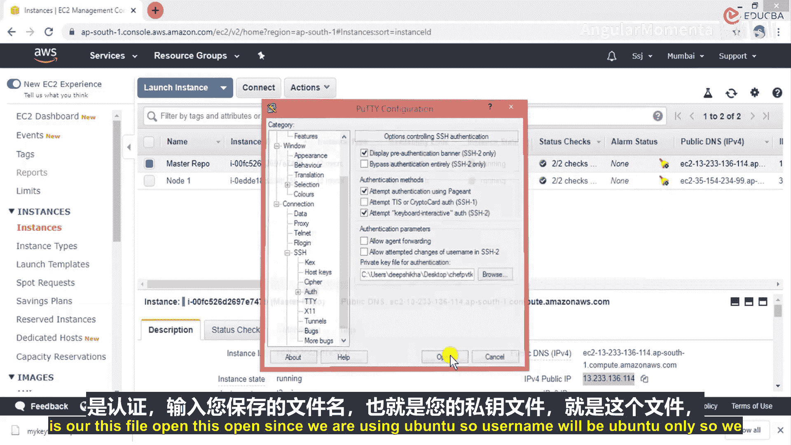
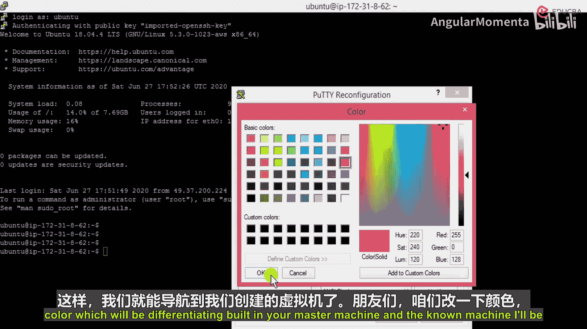
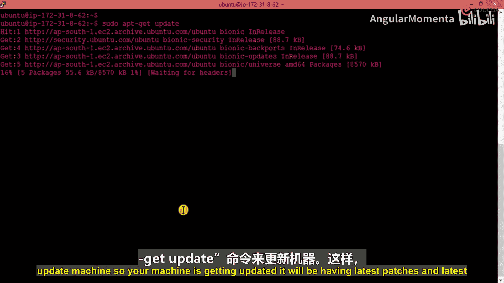

# 002：AWS节点与Chef连接配置 🚀

在本节课中，我们将学习如何配置AWS EC2实例，并将其作为节点连接到Chef服务器。我们将完成从启动实例到通过SSH成功连接的完整流程。

## 环境设置

上一节我们介绍了Chef的基本概念，本节中我们来看看如何准备运行Chef的基础设施环境。首先，我们需要在AWS上创建虚拟机实例。

### 访问AWS控制台

登录AWS管理控制台。在顶部导航栏的“服务”菜单下，找到“计算”分类，并点击“EC2”。

**请注意**：EC2实例是区域特定的服务，而非全局服务。你创建的服务仅存在于所选区域。请根据你的地理位置选择合适区域，例如亚太地区（孟买）或美国东部（弗吉尼亚北部）。

### 启动EC2实例

在EC2控制面板，点击“启动实例”按钮。

以下是配置实例的详细步骤：

1.  **选择Amazon Machine Image (AMI)**：进入“社区AMI”选项卡，搜索并选择“Ubuntu Server 18.04 LTS (HVM)， SSD Volume Type”。请确保选择64位版本。
2.  **选择实例类型**：为了使用免费套餐，选择 `t2.micro` 实例类型。
3.  **配置实例数量**：在本课程中，我们需要创建两个实例，一个作为Chef服务器（主节点），另一个作为被管理的节点。在“配置实例”步骤，将实例数量设置为 `2`。其他高级设置保持默认即可。
4.  **配置存储**：在“添加存储”步骤，使用默认的根卷设置（通常为8GB gp2卷），无需添加额外存储。
5.  **配置安全组**：这是关键步骤，需要开放必要的端口。
    *   安全组名称可自定义，例如“chef-sg”。
    *   编辑默认的SSH规则，将“源”设置为“任何位置”（0.0.0.0/0, ::/0）。**注意**：在生产环境中，这存在安全风险，应仅允许特定IP访问。此处为演示目的暂时放宽限制。
    *   点击“添加规则”，选择“所有流量”，同样将“源”设置为“任何位置”。这将开放所有端口以便Chef通信。
6.  **审核与启动**：检查所有配置，确认无误后点击“启动”。

### 创建并下载密钥对

在弹出的对话框中，需要选择密钥对以安全连接实例。

1.  选择“创建新密钥对”。
2.  为密钥对命名，例如 `my-private-key-for-chef`。
3.  点击“下载密钥对”，将私钥文件（`.pem`格式）保存到本地安全位置。
4.  点击“启动实例”。实例将开始初始化。

### 为实例添加标签

实例启动后，返回EC2实例列表。为了便于区分，我们为两个实例添加名称标签。

1.  选中第一个实例，在“标签”选项卡或右键菜单中，选择“管理标签”。
2.  添加一个标签，键为 `Name`，值为 `master-repo`。这个实例将作为我们的Chef服务器。
3.  选中第二个实例，同样添加标签，键为 `Name`，值为 `node-1`。这个实例将作为被管理的节点。

## 配置SSH连接

现在我们的实例已经运行，接下来需要配置SSH客户端来连接它们。我们将使用PuTTY和PuTTYgen工具（适用于Windows用户）。

### 转换密钥格式

PuTTY需要使用`.ppk`格式的私钥。我们需要转换下载的`.pem`文件。

1.  打开 **PuTTYgen** 工具。
2.  点击“Load”（加载）按钮。
3.  在文件选择器中，将文件类型过滤器改为“All Files (*.*)”，然后找到并选择你下载的 `.pem` 文件。
4.  加载成功后，点击“Save private key”（保存私钥）按钮。
5.  将文件保存为 `private-key.ppk`。你可以忽略关于是否保存空密码的警告。

### 使用PuTTY连接实例

现在，我们可以使用转换后的密钥连接到Ubuntu实例。

1.  打开 **PuTTY**。
2.  在“Session”（会话）界面：
    *   在“Host Name (or IP address)”（主机名）字段，粘贴你的EC2实例的**公有IPv4地址**（可在AWS控制台实例列表中查看）。
    *   端口保持为 `22`。
    *   在“Saved Sessions”（已保存的会话）下输入一个名称（如“Chef-Master”），然后点击“Save”（保存）以便下次使用。
3.  在左侧目录树中，展开“Connection” -> “SSH” -> “Auth”（认证）。
4.  在“Private key file for authentication”（用于认证的私钥文件）栏，点击“Browse”（浏览），选择刚才保存的 `private-key.ppk` 文件。
5.  返回“Session”界面，点击“Open”（打开）以启动连接。
6.  首次连接会弹出安全警告，点击“Accept”（接受）。
7.  登录用户名是 `ubuntu`（对于Ubuntu AMI）。连接成功后，你将看到终端提示符。



### 优化终端与系统更新

为了提高可读性，可以调整PuTTY的显示设置（如颜色和字体大小）。连接成功后，第一件事是更新系统软件包，确保实例拥有最新的安全补丁和软件。



执行以下命令：
```bash
sudo apt-get update
sudo apt-get upgrade -y
```
`sudo apt-get update` 命令会刷新软件包索引列表。`sudo apt-get upgrade -y` 命令则会自动升级所有可更新的软件包。

等待更新完成。现在，你的AWS EC2实例已经准备就绪，可以作为Chef节点进行后续配置。



---

本节课中我们一起学习了配置AWS基础设施的核心步骤：从启动EC2实例、配置安全组、管理密钥对，到使用PuTTY建立SSH连接并初始化系统。这些是后续将节点纳入Chef自动化管理的基础。下一节，我们将在这些准备好的服务器上安装和配置Chef客户端与服务端。