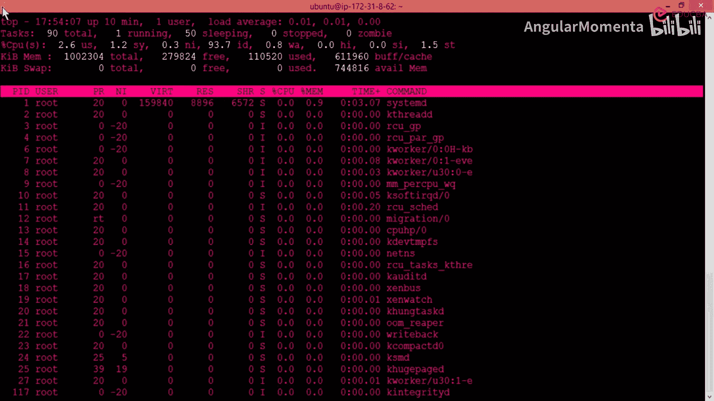
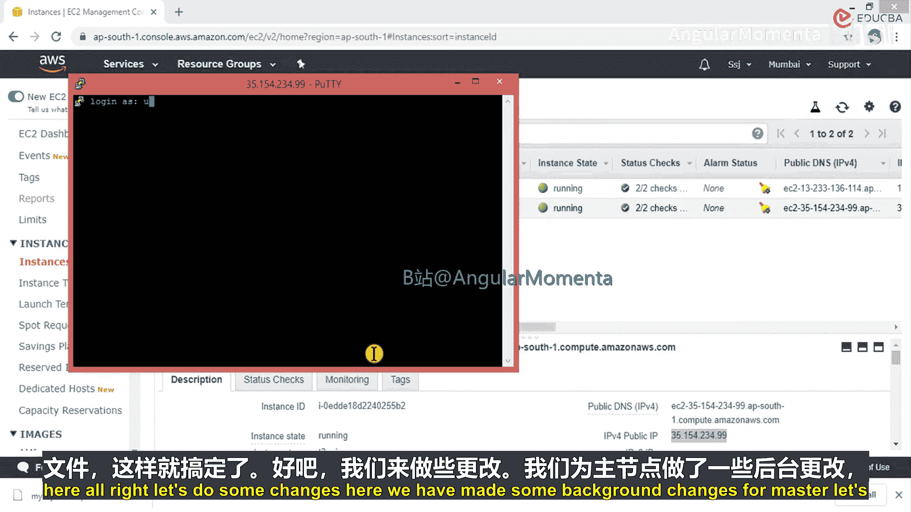
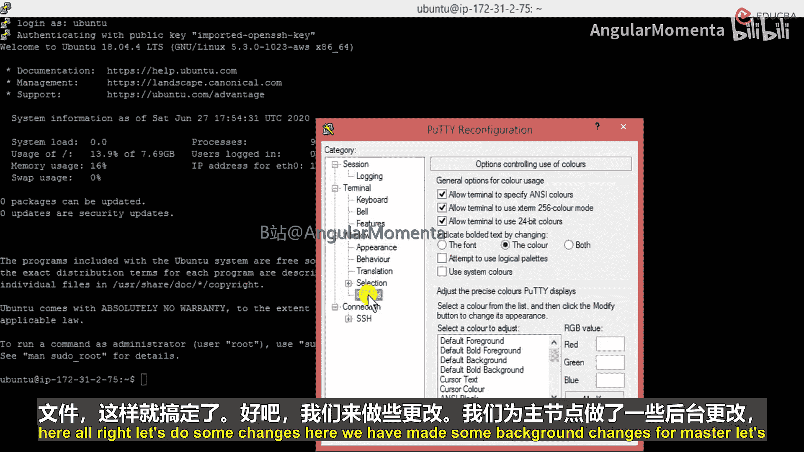
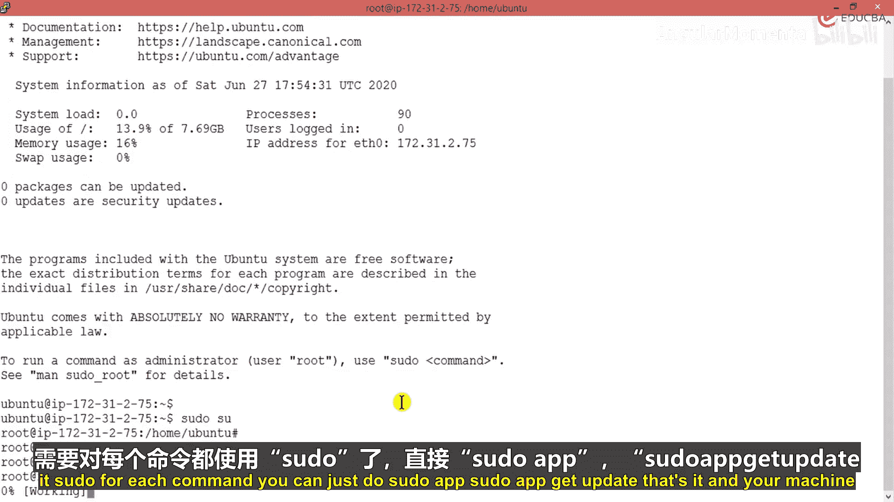
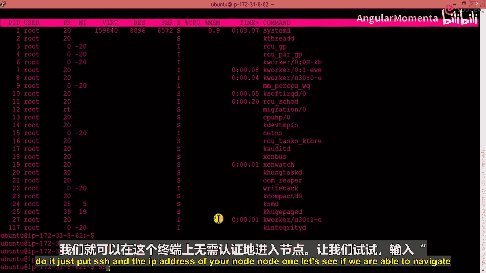
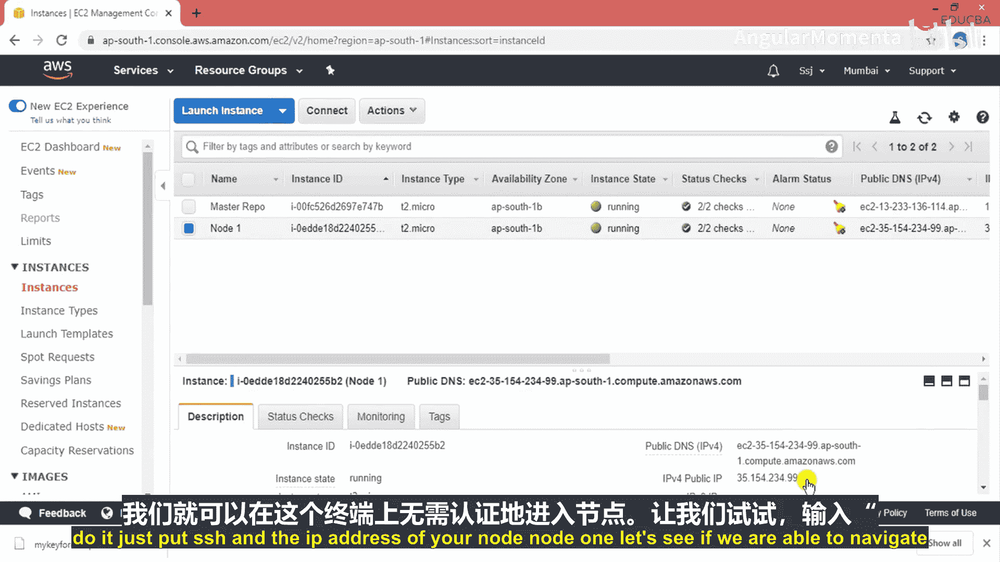
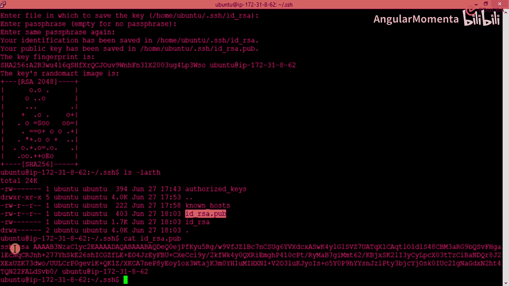

# 003：AWS节点连接用于Chef继续




在本节中，我们将学习如何配置第二台服务器（节点），并建立从主服务器到节点的SSH无密码连接。这是配置Chef自动化环境的关键步骤。



## 创建并配置第二个节点

上一节我们配置了主服务器。本节中我们来看看如何配置第二个节点服务器。



现在，创建另一台服务器，即另一个节点。

转到节点1的控制台，执行与主服务器相同的初始配置步骤。使用切换身份验证方式，选择你的密钥文件。


接下来，进行一些调整。我们为主服务器做了一些后台配置更改。



为了让界面更易于区分，我们更改这个系统的颜色主题。


为了让操作更清晰，我们将终端字体调大一些。进入外观设置进行调整。

现在更新这台机器的软件包。我们使用 `sudo` 命令，因为它代表超级用户权限。



你可以直接使用 `sudo` 作为 `su` 的替代。现在你是root用户。



你不需要为每个命令都输入 `sudo`，可以执行 `sudo -i` 切换到root会话。


执行更新命令：
```bash
sudo apt update && sudo apt upgrade -y
```
更新完成。你的机器将在此过程中更新。

通过这种方式，我们配置好了两台基于Ubuntu的机器，并且它们都已更新。

## 配置主节点间的SSH连接

现在我们已经创建了两台机器，下一步是为你的主服务器配置SSH访问权限到节点。这意味着如果你在主服务器上输入 `ssh` 加上节点的IP地址，可以无需密码直接进入节点终端。

让我们尝试一下，在主服务器上输入：
```bash
ssh <node1的IP地址>
```


看看我们是否能无任何问题地连接。


系统询问“是否确定要继续连接？”，输入 `yes`。

然后我们遇到了“权限被拒绝”的问题。同时，该主机的密钥已被永久添加到已知主机列表。

这个步骤中出现问题的原因是，节点之间的SSH尚未配置。当主服务器尝试连接到节点时，连接失败，因为主服务器的公钥不在节点的授权密钥列表中。每台机器安装后都有自己独特的密钥指纹，只有指纹匹配才能建立无密码连接。

现在我们必须解决这个问题以实现SSH无密码访问，因为这是安装Chef的基本步骤。我们必须让节点能够接受来自主服务器的连接，而不需要任何密钥文件或密码。

## 解决SSH连接问题

让我们看看如何解决这个问题。首先，列出 `.ssh` 目录的内容：
```bash
ls -la ~/.ssh
```
在这个目录中，有 `authorized_keys` 和 `known_hosts` 文件。

这些是SSH连接所需的密钥文件。`known_hosts` 文件存储了这台机器已知的所有主机列表。如果你查看它，会发现刚才尝试连接的主机IP已被添加。因为机器“认识”了那台主机，所以将其加入了列表。

如果我们用 `cat` 命令查看 `known_hosts` 文件：
```bash
cat ~/.ssh/known_hosts
```
你会看到里面有机器的IP地址信息（实际上是加密后的形式）。当你首次尝试SSH连接并输入`yes`时，该主机的加密IP地址就被保存到了这里。

我们看到的另一个重要文件是 `authorized_keys`。这个文件包含了所有被允许无密码访问本系统的机器的公钥。

查看授权密钥文件：
```bash
cat ~/.ssh/authorized_keys
```
你会看到当前已有的密钥。如果你删除了这里所有的密钥，那么将没有任何机器能无密码登录到本系统。因此，这个文件对本机至关重要。

## 生成并配置SSH密钥

要解决连接问题，我们需要在主服务器上生成一个SSH密钥对，并将公钥添加到节点的 `authorized_keys` 文件中。

以下是需要添加的密钥生成步骤。要为你的系统生成密钥，只需输入：
```bash
ssh-keygen -t rsa
```
按回车接受默认设置。它将在默认位置为你生成密钥。

一旦你看到“RSA”密钥生成的提示，意味着你的密钥已创建成功。你得到了一个可以用于其他机器的密钥。如果你将公钥放到节点上，就能实现无密码导航。

现在，再次列出 `.ssh` 目录的内容：
```bash
ls -la ~/.ssh
```
你会看到新的文件，例如 `id_rsa`（私钥）和 `id_rsa.pub`（公钥）。

你需要做的是，复制公钥的内容：
```bash
cat ~/.ssh/id_rsa.pub
```
你将看到公钥字符串。



**关键操作**：将上面显示的全部公钥内容，复制并添加到**节点服务器**的 `~/.ssh/authorized_keys` 文件中。你可以使用 `vim`、`nano` 编辑器或 `echo` 命令追加。

在节点上执行：
```bash
echo \"<粘贴主服务器的公钥>\" >> ~/.ssh/authorized_keys
```

完成此操作后，返回主服务器，再次尝试SSH连接节点IP。这次应该可以无需密码直接登录，为后续安装和配置Chef客户端做好准备。

## 总结


本节课中我们一起学习了配置第二个Chef节点，并解决了主节点间SSH无密码连接的核心问题。我们通过生成SSH密钥对，并将主服务器的公钥添加到节点的授权列表中，成功建立了安全的自动化管理通道。这是构建Chef自动化基础设施的基础。