# 004：配置无密码SSH与Visual Studio Code连接 🚀

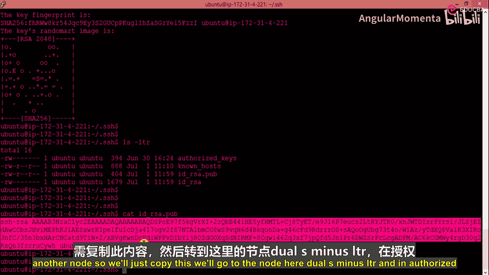

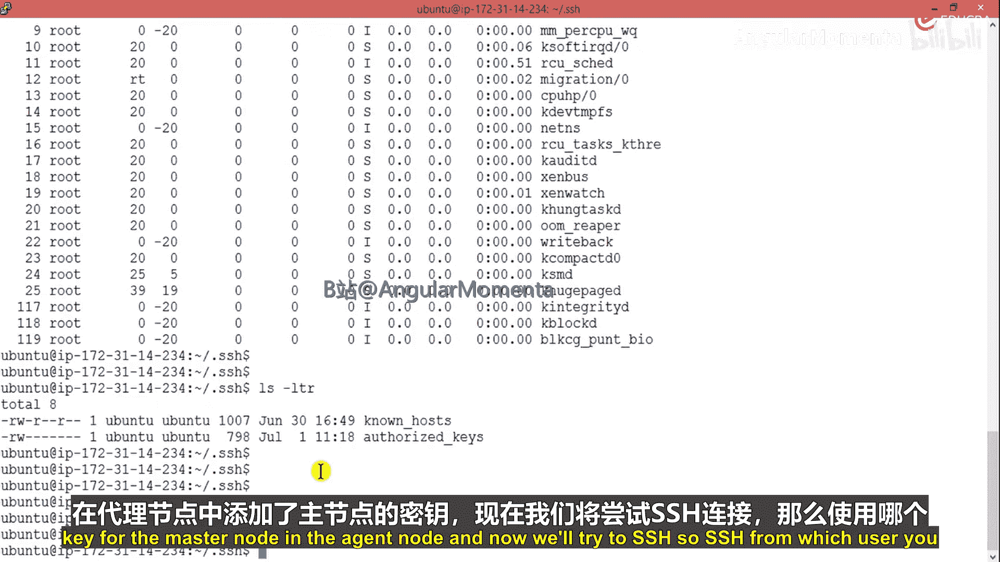

## 概述
在本节课程中，我们将学习两个核心技能。首先，我们将配置主节点与代理节点之间的无密码SSH连接，这是自动化基础设施管理的基础。其次，我们将设置Visual Studio Code编辑器，使其能够通过SFTP协议连接到我们的Ubuntu工作站，从而实现本地编辑、远程执行的便捷工作流。

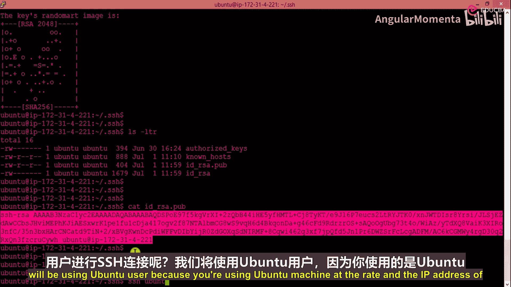

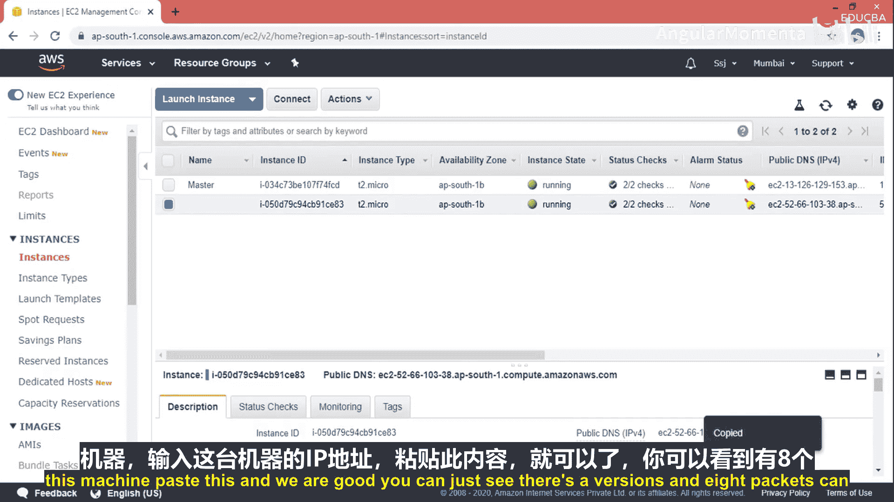

---

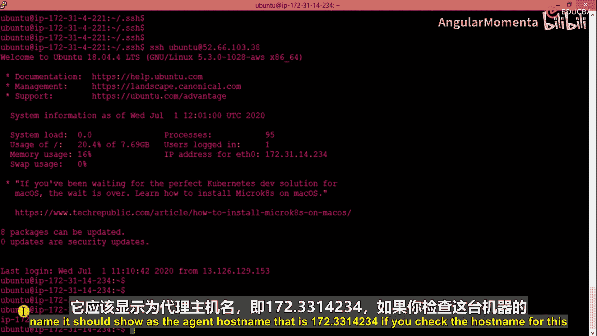

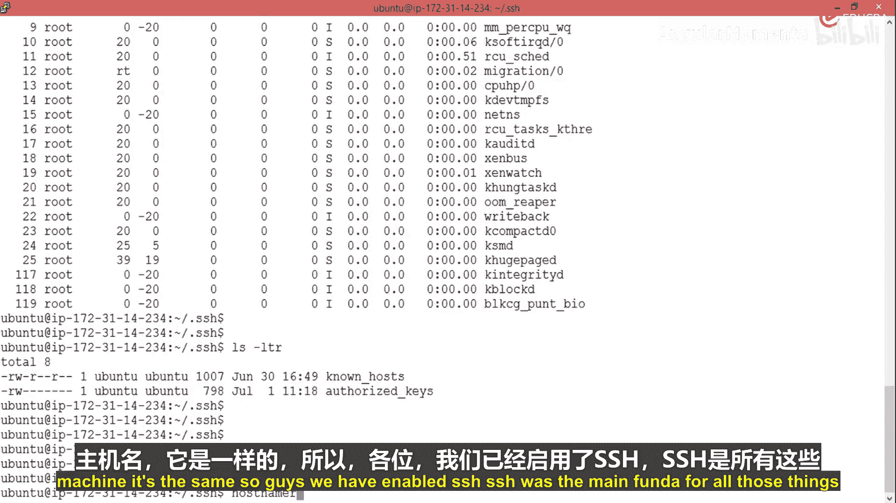

## 配置无密码SSH连接 🔑

上一节我们完成了节点的基本设置，本节中我们来看看如何实现节点间的安全、无密码通信。这是实现自动化管理的关键一步。

我们首先查看主节点的公钥文件内容。
```bash
cat /path/to/master_public_key.pub
```
接着，我们将此公钥内容复制到代理节点的授权密钥文件中。
```bash
# 在代理节点上执行
echo "复制的公钥内容" >> ~/.ssh/authorized_keys
```

操作完成后，我们尝试从主节点通过SSH连接到代理节点。
```bash
ssh ubuntu@<代理节点IP地址>
```
连接成功，且无需输入密码。这证明我们已经建立了无密码SSH连接。

现在，我们可以验证代理节点的主机名。
```bash
hostname
```
输出应为代理节点的IP地址，例如 `172.3.3.14`。

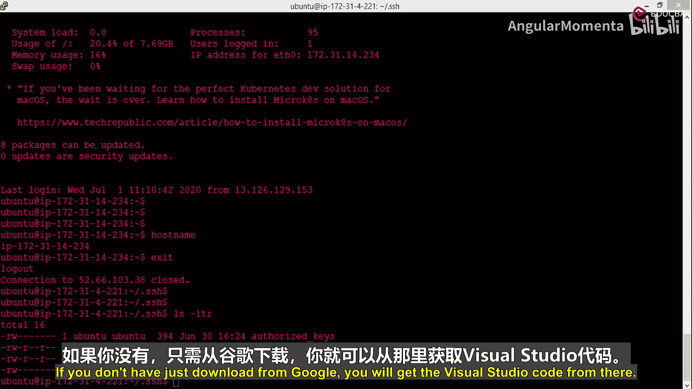

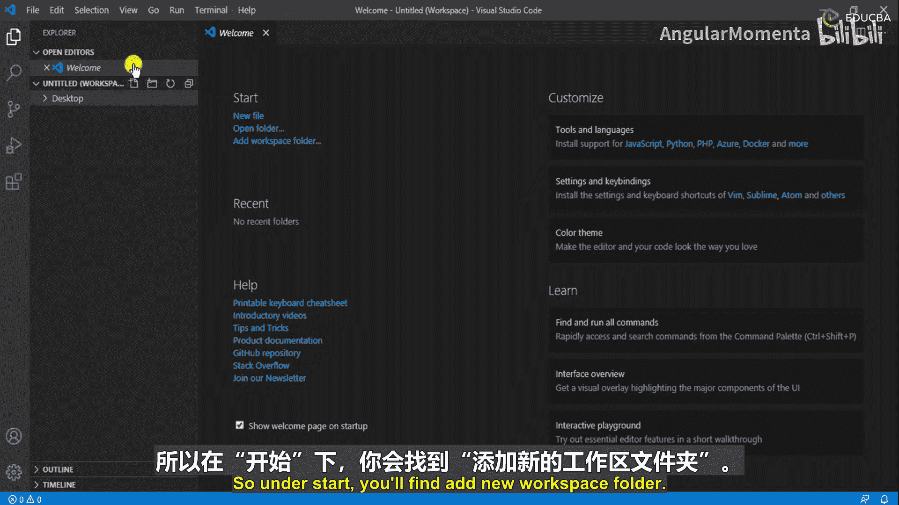

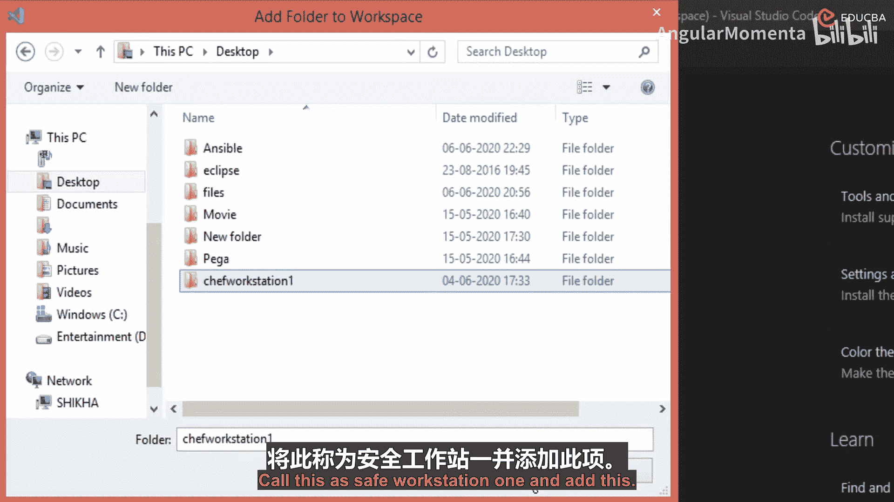

**核心概念**：无密码SSH架构。其原理是主节点持有私钥，代理节点持有对应的公钥。当主节点发起连接时，代理节点使用存储的公钥进行验证，从而无需手动输入密码。公式可表示为：`主节点(私钥) <--验证--> 代理节点(公钥)`。

我们已成功实现一个重要的里程碑：建立无密码或密钥式基础设施。这意味着节点之间可以自由通信，无需交互式密码验证，为后续的自动化操作铺平了道路。

完成此设置后，我们退出代理节点，返回主节点。

---

## 设置Visual Studio Code远程连接 💻

基础架构已准备就绪，现在让我们来配置代码编辑环境。我将展示我偏好的设置：使用Visual Studio Code连接AWS EC2工作站。

首先，打开Visual Studio Code。如果你尚未安装，可以从官网下载。

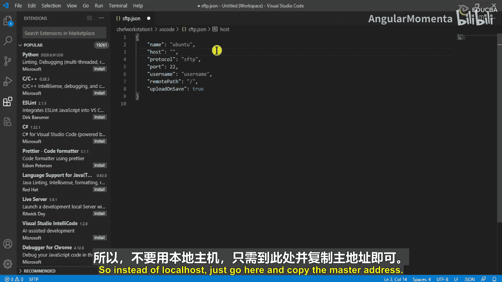

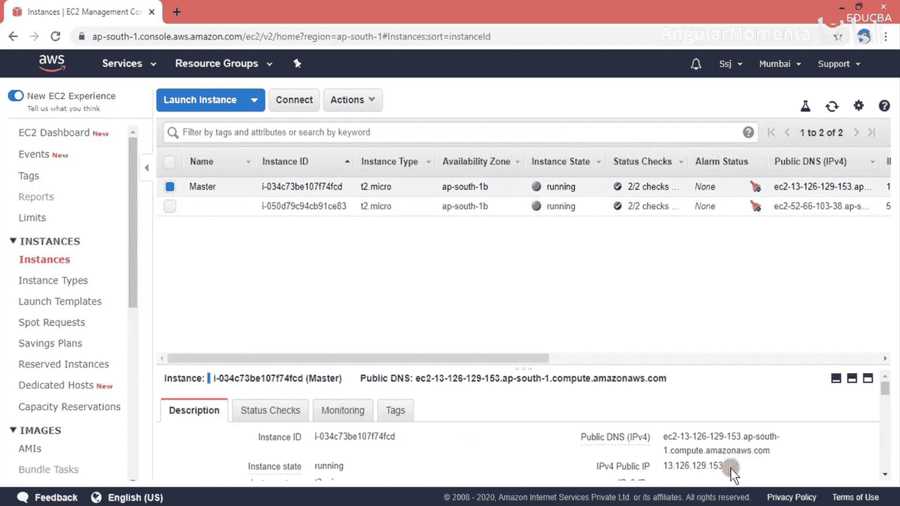

为了组织代码，我将创建一个新的工作区文件夹。
1.  在桌面上创建一个名为 `Chef_workstation` 的文件夹。
2.  在VS Code中，通过“文件”->“打开文件夹”来打开这个新文件夹。

接下来，我们需要安装一个扩展，以便将Ubuntu工作站“映射”到VS Code中。以下是具体步骤。

### 安装并配置SFTP扩展
我们将使用SFTP扩展来连接Ubuntu虚拟机。

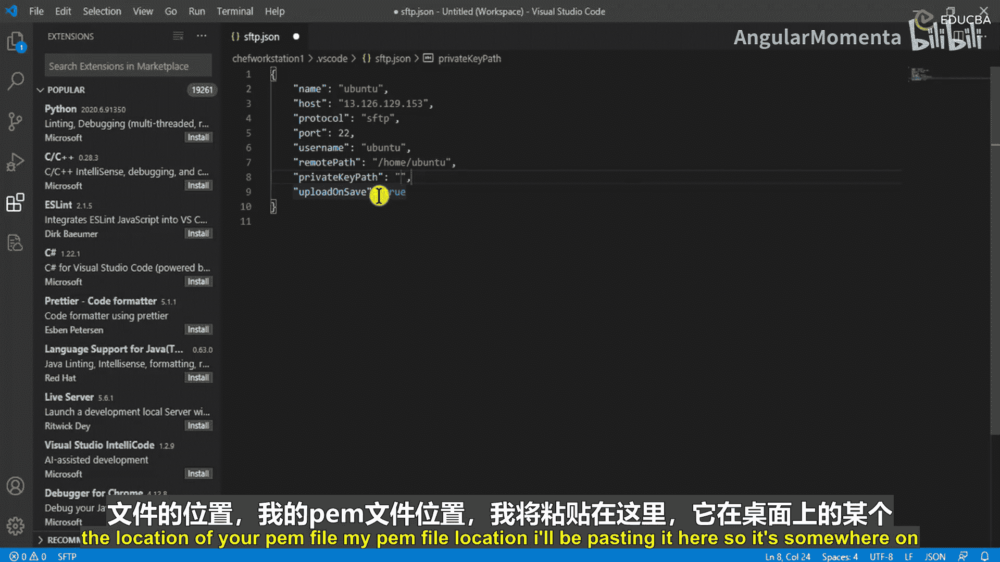

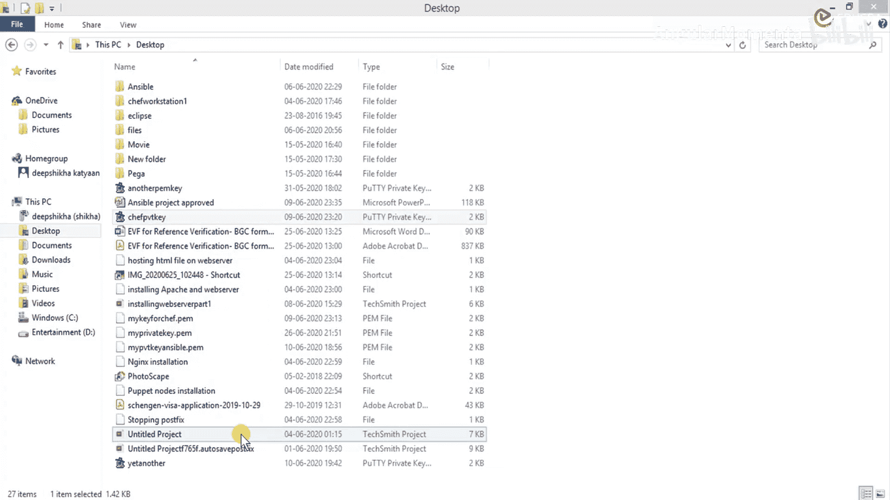

1.  点击左侧活动栏的“扩展”图标（或按 `Ctrl+Shift+X`）。
2.  在搜索框中输入 `SFTP`。
3.  找到名为“SFTP”的扩展并点击“安装”。

安装完成后，我们需要配置连接信息。操作如下：
1.  按下 `Ctrl+Shift+P` 打开命令面板。
2.  输入 `sftp config` 并选择“SFTP: Config”命令。
3.  系统会提示你选择一个文件夹来存放配置文件，选择我们刚创建的 `Chef_workstation` 文件夹。

这将在项目根目录下生成一个 `sftp.json` 配置文件。我们需要编辑此文件以填入连接详情。

以下是 `sftp.json` 文件的标准配置模板，你需要根据实际情况修改：
```json
{
    "name": "Ubuntu_Workstation",
    "host": "你的_EC2_实例_IP_地址",
    "protocol": "sftp",
    "port": 22,
    "username": "ubuntu",
    "remotePath": "/home/ubuntu",
    "uploadOnSave": true,
    "privateKeyPath": "C:\\Users\\你的用户名\\.ssh\\your_key.pem"
}
```
**配置项说明**：
*   `host`：你的Ubuntu工作站（EC2实例）的公有IP地址。
*   `username`：连接使用的用户名，通常是 `ubuntu`。
*   `remotePath`：远程服务器上的默认工作目录，例如 `/home/ubuntu`。
*   `uploadOnSave`：设置为 `true` 后，当你在VS Code中保存文件时，它会自动上传到远程服务器。
*   `privateKeyPath`：指向你本地存放的`.pem`私钥文件的**Windows路径**。注意，Windows路径中的反斜杠`\`需要转义，即写成双反斜杠`\\`。

保存 `sftp.json` 文件后，连接就配置好了。此时，在VS Code的文件资源管理器中，你可以右键点击文件夹或文件，选择“SFTP: Download”来将远程文件同步到本地进行编辑。

### 验证连接
配置完成后，你可以在VS Code中直接浏览和编辑远程Ubuntu机器上的文件。例如，你可以找到之前配置SSH时修改过的 `~/.ssh/known_hosts` 文件，在VS Code中打开并查看。

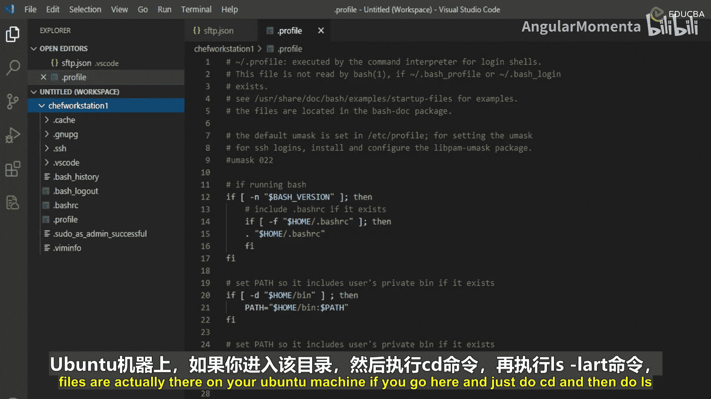

**工作流程**：你在VS Code（本地Windows）中编辑文件 -> 保存文件 -> 文件通过SFTP自动上传到Ubuntu服务器。这样，你就能在熟悉的本地编辑器环境中，无缝地对远程服务器进行代码和配置管理。

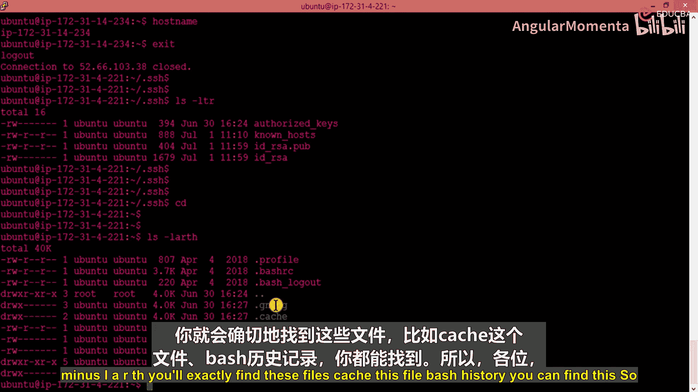

为了保持演示清晰，避免混淆，在后续课程中，我将主要使用Visual Studio Code来编辑文件，而在终端中执行命令。

---

## 总结
本节课中我们一起学习了两个至关重要的实践技能。
1.  **建立了无密码SSH连接**：通过在代理节点的`authorized_keys`文件中添加主节点的公钥，我们实现了节点间的密钥认证，为自动化工具管理多节点打下了基础。
2.  **配置了Visual Studio Code远程开发环境**：通过SFTP扩展，我们将远程Ubuntu工作站映射到本地编辑器，实现了“本地编辑、远程生效”的高效工作模式，这将极大方便后续Chef食谱和资源的编写与管理。

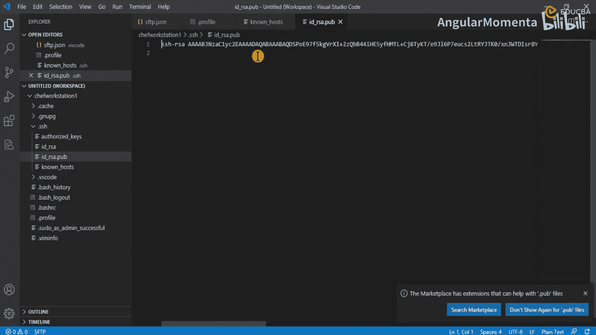

至此，我们的自动化基础设施和开发环境都已就绪，接下来就可以开始创建Chef资源、食谱，并推进我们的案例研究了。