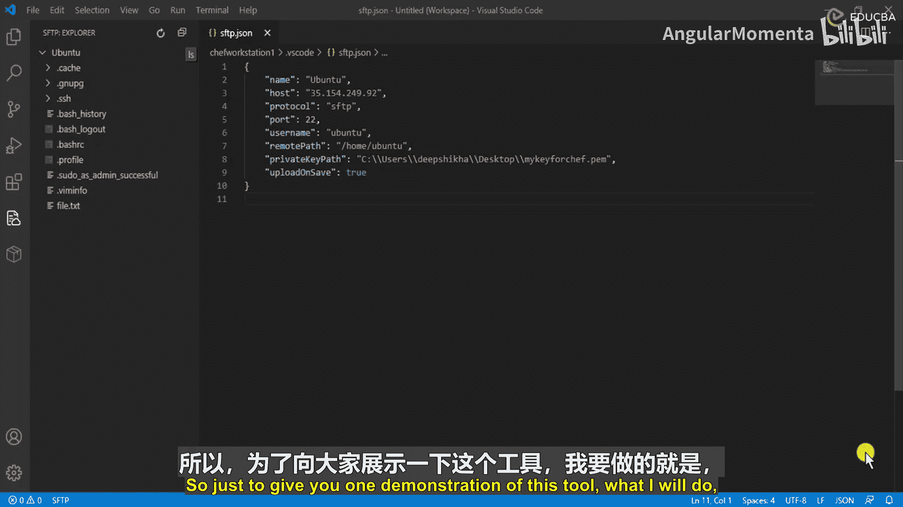
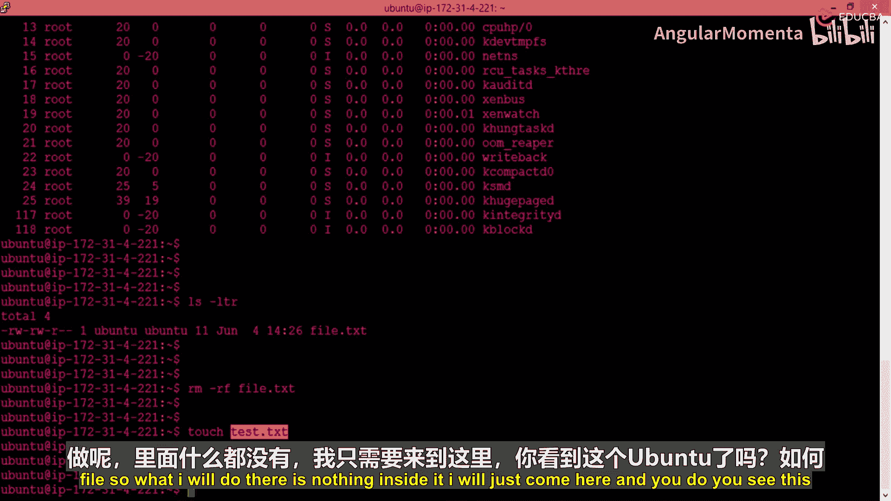
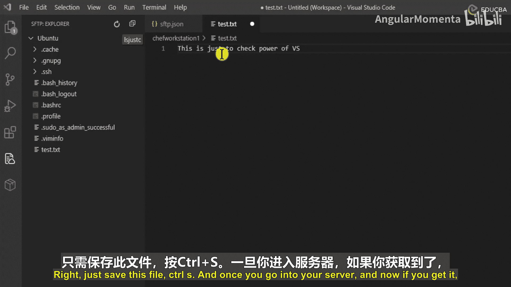
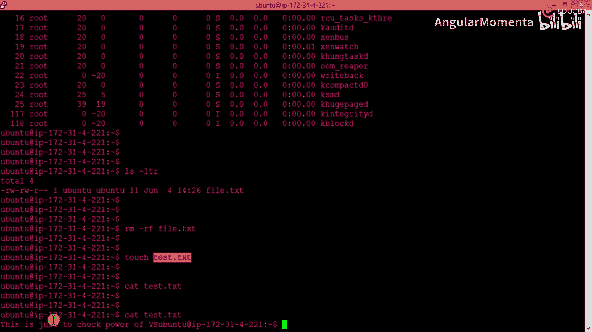
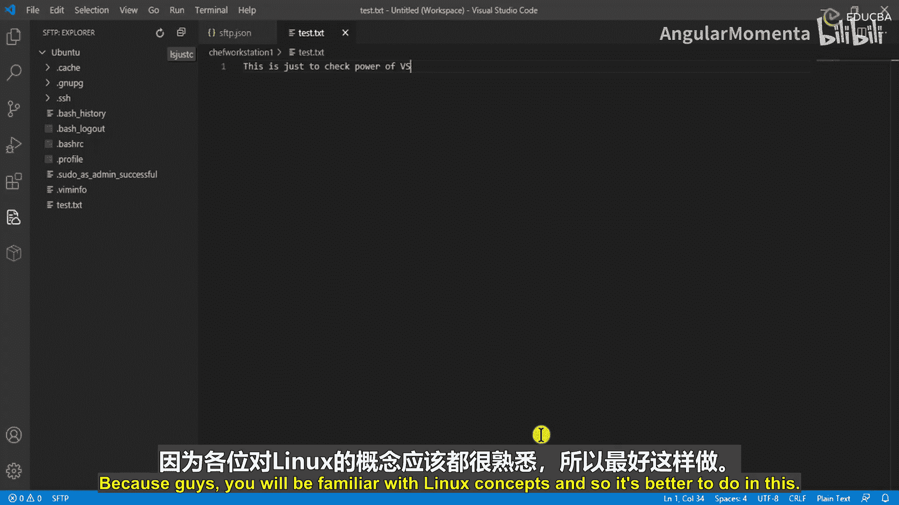
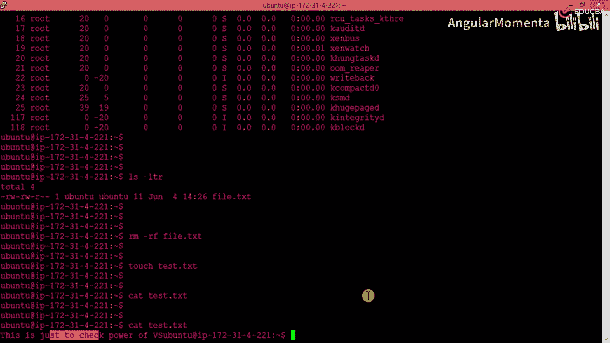
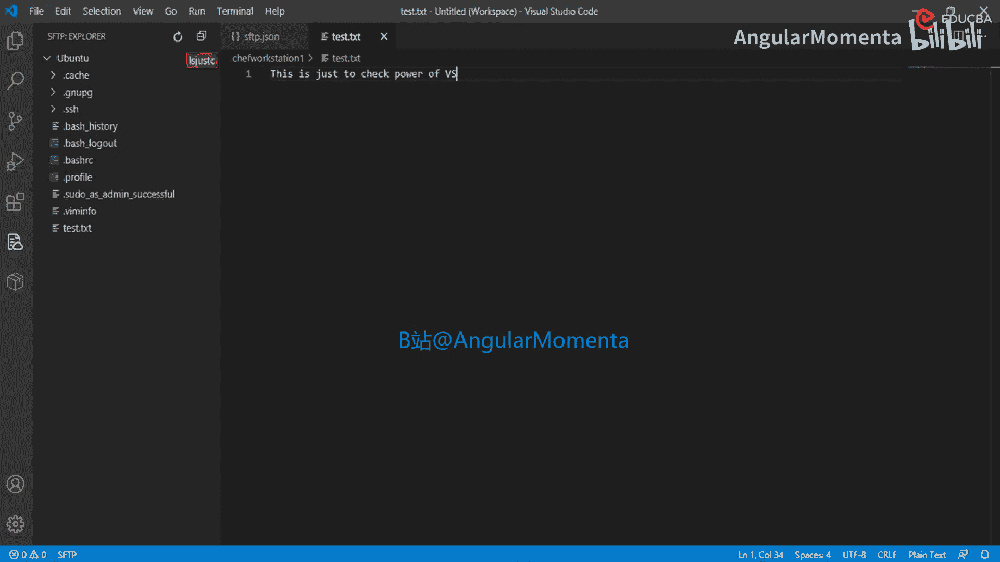
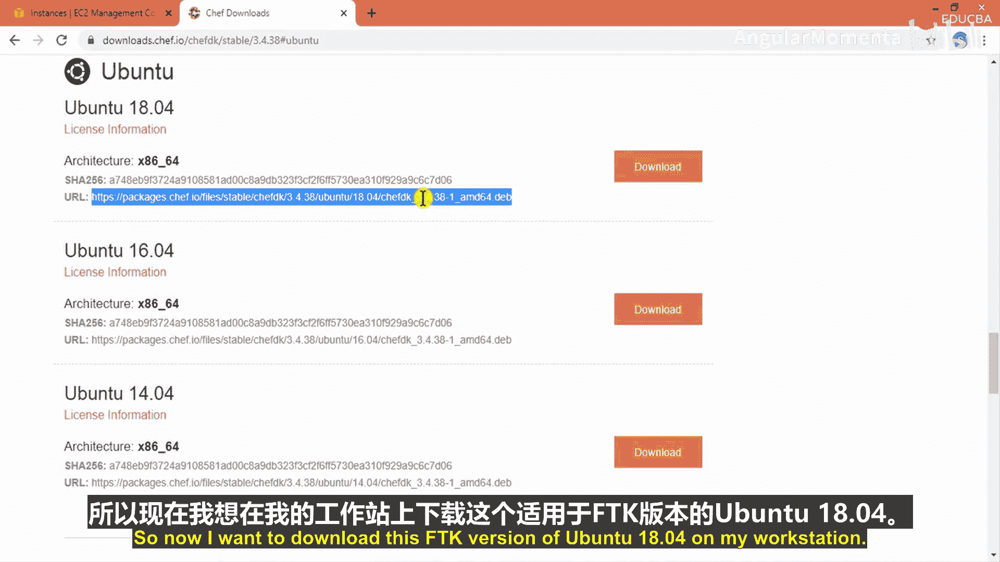
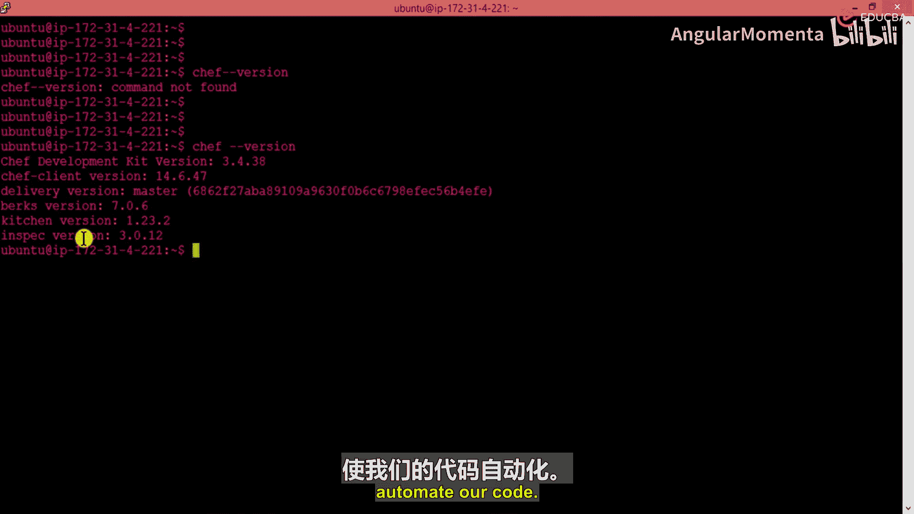

# 005：在厨师工作站上设置Chef开发工具包 🛠️

在本节课中，我们将学习如何在Chef工作站上安装和配置Chef开发工具包（Chef DK），这是编写、测试和部署Chef代码的核心环境。我们将通过实际操作演示其功能，并验证安装是否成功。



## 工具功能演示

上一节我们介绍了工作站的基本概念，本节中我们来看看Chef DK附带的一个强大工具。这个工具允许我们方便地在本地编辑远程服务器上的文件。



我将登录到一台名为`open2`的虚拟机，并在其上创建一个空文件。


以下是创建文件的步骤：
1.  在`open2`虚拟机上创建一个名为`Du.txt`的空文件。
2.  该文件目前没有任何内容。

接下来，我将在工作站上使用SFTP工具连接到这台虚拟机。这个工具已经预先配置了连接所需的主机和密钥信息。


连接后，刷新文件列表，可以看到远程服务器上刚创建的`Du.txt`文件。如果直接双击尝试编辑，会提示错误。正确的方法是右键点击文件，选择“在本地编辑”。

在本地编辑器中，我可以为文件添加任意内容，例如输入“Just a check”。保存后，这些更改会自动同步回远程服务器。






现在，如果再次登录到`open2`服务器查看该文件，会发现内容已经更新。


这个工具非常强大，它允许我们在终端中并排操作，一边编写代码一边查看输出。不过，为了让学习过程更简单直观，在本课程中，我将主要使用这个工具进行文件编辑。大部分Linux操作和文件创建仍将在虚拟机终端中完成。






## 下载Chef开发工具包

现在，让我们进入准备Chef环境的最后一步：下载Chef开发工具包（Chef DK）。

Chef DK包含了用于构建、测试和部署Chef代码的一系列工具。我们可以从Chef官方网站下载它。



1.  访问下载页面：`downloads.chef.io`。
2.  在页面上找到Chef开发工具包的下载链接并打开。


3.  在发布版本中，我选择`3.4.38`这个版本。为了确保课程演示的一致性，建议你也使用相同版本。当然，你也可以尝试更新的版本，但由于我的系统配置限制，我选择了这个兼容性更好的较低版本。
4.  在操作系统列表中选择`Ubuntu`。因为我使用的是`Ubuntu 18.04`，所以选择对应的Ubuntu版本下载链接。
5.  复制这个下载链接的URL。

## 安装Chef开发工具包

接下来，我们需要在工作站上下载并安装这个工具包。

首先，使用`wget`命令下载软件包到本地工作站。

```bash
wget [复制的下载链接URL]
```




下载完成后，使用`dpkg`命令来安装这个`.deb`软件包。

```bash
sudo dpkg -i [下载的.deb文件名]
```

安装过程需要超级用户权限，因此需要使用`sudo`。安装程序会解压文件、设置依赖，并完成所有必要的配置。

安装成功后，会显示“感谢安装Chef开发工具包”的提示信息。至此，我们已经成功安装了Chef DK。

## 验证安装

为了验证Chef DK是否安装成功，我们可以检查其版本信息。

运行以下命令：

```bash
chef --version
```



该命令会显示Chef DK及其所有组件的版本号，例如：
*   Chef DK版本：`3.4.38`
*   Delivery CLI版本
*   Berkshelf版本
*   Test Kitchen版本
*   InSpec版本

看到这些版本信息，就证明Chef开发工具包已经准备就绪。现在，我们可以开始编写自动化代码，并让Chef DK来执行和管理它们了。

---

**本节课总结**


在本节课中，我们一起学习了：
1.  **演示了Chef DK附带工具的功能**：如何通过SFTP在本地编辑远程服务器文件。
2.  **下载了Chef开发工具包**：从官网选择了适合的版本（`3.4.38` for Ubuntu 18.04）并获取了下载链接。
3.  **安装并验证了Chef DK**：使用`wget`下载，用`dpkg`安装，最后通过`chef --version`命令成功验证了安装。现在，我们的Chef工作站环境已经搭建完成，可以开始进行自动化编码了。