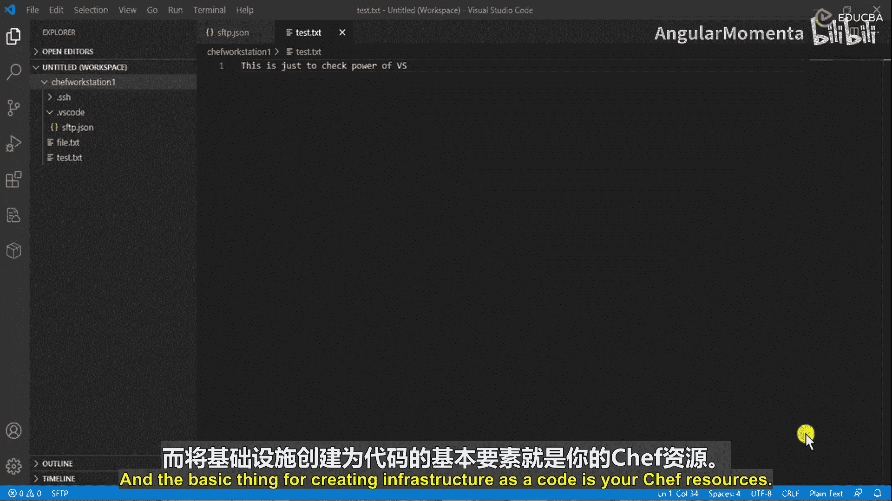
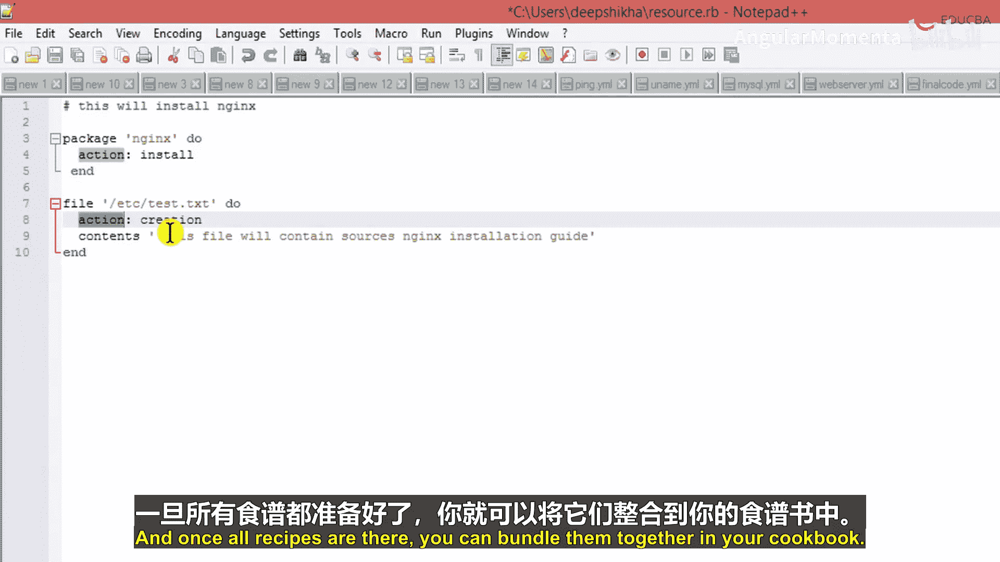

# 006：资源与Ruby编程原则 🧱



在本节课中，我们将学习Chef的核心构建单元——资源，并理解其如何基于Ruby编程语言实现基础设施即代码。

---

## 什么是Chef资源？

上一节我们介绍了Chef的基本概念，本节中我们来看看构成Chef代码的基础元素——资源。

资源是Chef的基本构建块，它定义了将配置项带入**期望状态**所需的步骤。资源本质上是一段代码，这段代码用于实现自动化配置。我们提到了“期望状态”这个术语，它指的是你希望某个特定组件被配置成的最终形态。

例如，如果你有一个名为“Web服务器”的资源，其期望状态就是该服务器被安装并处于运行状态。为了达到这个状态，资源会执行一系列动作，如安装软件包、确保服务启动，甚至创建并托管一个HTML文件。

---

## 基础设施即代码与Ruby DSL

你或许听说过“基础设施即代码”，Chef正是这一理念的实践。之所以如此，是因为我们使用Ruby编程语言的抽象形式来声明系统组件的配置方式。

Chef代码本质上是内嵌在Chef配方单中的Ruby编程。这种抽象被称为**领域特定语言**。因此，Chef是一种构建在Ruby之上的领域特定语言。

---

## 如何定义资源？

让我们通过一个例子来具体看看如何定义资源。以下代码展示了如何编写一个资源。

```ruby
# 这将安装Nginx
package 'nginx' do
  action :install
end
```

首先，我们通过`#`符号添加注释，说明代码意图。这有助于他人或未来的你理解代码目的。

接着，我们定义了一个**package**资源，并指定其名称为`'nginx'`。在`do`和`end`构成的Ruby代码块中，我们声明了Chef应对此资源执行的操作：安装(`:install`)。这个简单的资源定义了将Nginx软件包安装到期望状态的步骤。

---

## 更多资源示例

除了软件包，Chef还支持多种资源类型。以下是另一个定义**file**资源的例子。

```ruby
file '/etc/test.txt' do
  action :create
  content 'This is Nginx setup guide.'
end
```

在这个例子中：
1.  资源类型是 **`file`**。
2.  资源名称（即路径）是 **`/etc/test.txt`**。
3.  在代码块中，我们指定的动作为创建(`:create`)。
4.  我们还通过`content`属性定义了文件的内容。

请注意，每个动作（如`:install`、`:create`）前面都有一个冒号，这在Ruby中称为**符号**。动作是资源特定的，例如，`:create`动作只适用于文件资源，而不适用于软件包资源。

当Chef在节点上运行这段代码时，它会检查`/etc/test.txt`文件是否存在。如果不存在，则创建该文件并写入指定内容；如果已存在，则会确保其内容符合定义。

---

## 资源、配方单与食谱的关系

理解资源的层级关系至关重要：
*   **资源**是基础的代码构建块。
*   将多个资源组合在一个代码文件中，就构成了**配方单**。
*   将多个相关的配方单组织在一起，就形成了一个**食谱**。

因此，其关系可以总结为：**食谱包含配方单，配方单包含资源**。掌握了各种资源的使用方法，你就能编写配方单，进而构建出功能完整的食谱来自动化你的基础设施。

---

## 总结

本节课中我们一起学习了：
1.  **Chef资源**是定义基础设施组件期望状态的基本单元。
2.  Chef通过**Ruby领域特定语言**实现“基础设施即代码”。
3.  我们通过`package`和`file`资源的代码示例，了解了如何定义资源类型、名称和动作。
4.  明确了资源、配方单和食谱之间的层级包含关系。



理解并熟练使用资源，是开始用Chef自动化你的云基础设施项目的第一步。