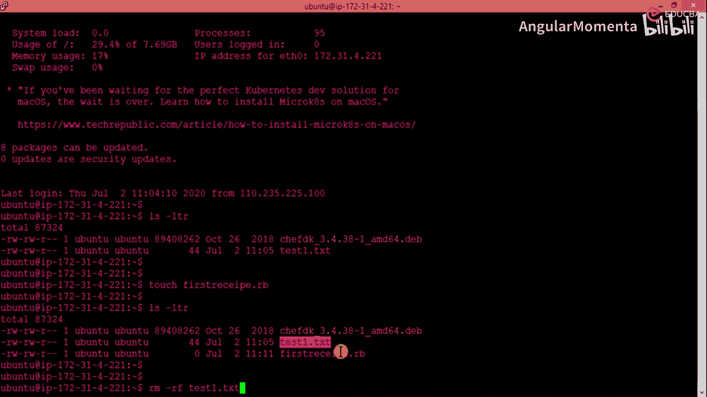
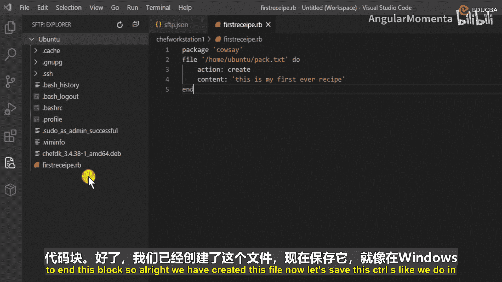
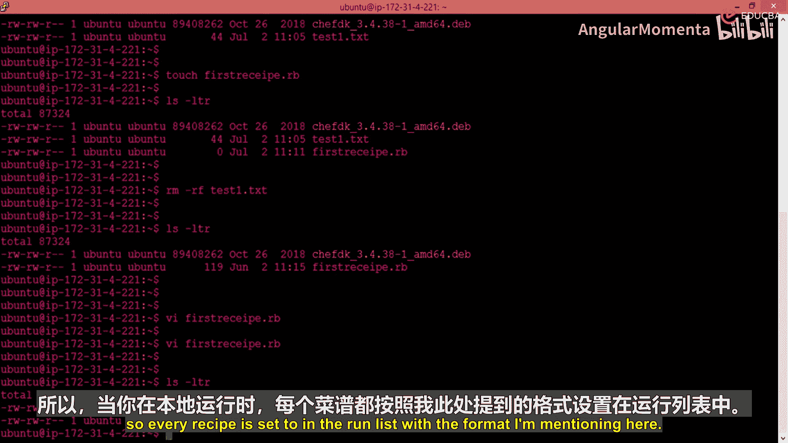
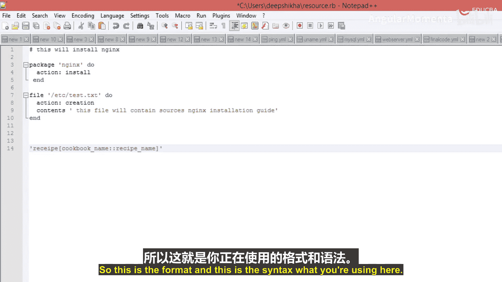
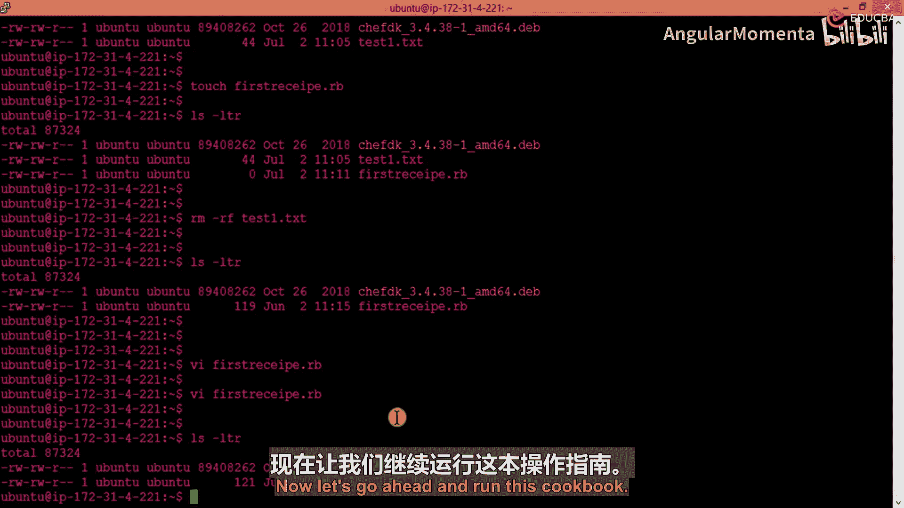

# 007：在本地模式下部署配方 🧑‍🍳

在本节课中，我们将学习如何创建并运行你的第一个Chef配方（Recipe）。我们将从创建一个空的配方文件开始，逐步添加配置资源，并最终在本地模式下使用Chef客户端来执行它，以验证自动化过程。

## 创建第一个配方

上一节我们介绍了Chef的基本概念，本节中我们来看看如何动手创建配方。配方是Chef中定义配置策略的核心，它声明了资源和资源类型，这些是配置系统所需的一切。



配方本质上是扩展名为 `.rb` 的Ruby文件。现在，让我们创建一个名为 `first_recipe.rb` 的空文件。

```ruby
# 这是一个空的Ruby文件，我们将用它来配置系统。
```

Ruby是一种动态的通用编程语言，其语法易于阅读和使用，因此被选为Chef的配置语言。

## 定义配方内容

我们已经创建了文件，接下来需要在其中定义具体的配置资源。我们将声明两种资源类型：一个用于安装软件包，另一个用于创建文件。



以下是配方文件的内容：

```ruby
# 声明一个‘package’资源来安装名为‘tree’的软件包
package 'tree' do
  action :install
end

# 声明一个‘file’资源，在指定路径创建文件
file '/home/ubuntu/test.txt' do
  action :create
  content 'Hello, this is my first recipe.'
end
```

在这段代码中：
*   **`package ‘tree’`** 是一个资源声明，它告诉Chef需要管理名为 `tree` 的软件包。
*   **`do … end`** 块定义了该资源应执行的操作（action）。
*   **`action :install`** 指定了期望的操作是安装该软件包。
*   类似地，**`file`** 资源声明了需要在 `/home/ubuntu/test.txt` 路径创建一个文件，其内容为指定的字符串。

## 理解Chef客户端

配方文件编写完成后，需要有一个“执行者”来读取并应用这些配置。这个执行者就是Chef客户端代理。

Chef客户端是一个运行在每个由Chef管理的机器上的本地代理。当它运行时，会检查配方中定义的资源状态，并在必要时将这些资源调整到配方所描述的**期望状态**。例如，如果 `tree` 软件包没有安装，Chef客户端就会执行安装命令；如果指定的文件不存在，就会创建它。

简而言之，Chef客户端是实现所有自动化“魔法”发生的地方。

## 在本地模式下运行配方

通常，Chef客户端默认会连接Chef服务器来获取要执行的配方（即默认模式）。但为了测试，我们将在**本地模式**下运行，这意味着客户端会直接从本地文件系统读取配方文件，而无需服务器。

要启用本地模式，需要在运行 `chef-client` 命令时加上 `--local-mode` 标志。同时，我们需要通过 `-o` (override run list) 参数来指定要运行的配方。

运行配方的命令格式如下：

```
sudo chef-client --local-mode -o “recipe[<cookbook_name>::<recipe_name>]”
```

由于我们目前还没有将配方组织到正式的Cookbook结构中，可以暂时使用一个简化的路径格式来直接运行我们的文件。但请注意，在生产环境中，配方通常被组织在Cookbook中。

以下是运行我们刚刚创建的配方的命令示例：

```bash
sudo chef-client --local-mode -o “recipe[first_recipe]”
```

执行此命令后，Chef客户端将：
1.  解析 `first_recipe.rb` 文件。
2.  检查当前系统状态（`tree` 包是否已安装？`/home/ubuntu/test.txt` 文件是否存在？）。
3.  执行必要的操作，使系统状态与配方中定义的期望状态一致。
4.  在终端输出详细的执行日志，报告它做了哪些事情。



你可以通过检查软件包是否安装和文件是否被成功创建，来验证配方是否执行成功。

## 总结





本节课中我们一起学习了Chef自动化配置的实践第一步。我们创建了一个包含 `package` 和 `file` 资源的简单配方文件，理解了Chef客户端作为“执行者”的角色及其**期望状态**模型，并掌握了如何使用 `--local-mode` 参数在本地模式下运行配方以进行测试。这为后续学习更复杂的Cookbook结构和服务器模式打下了基础。