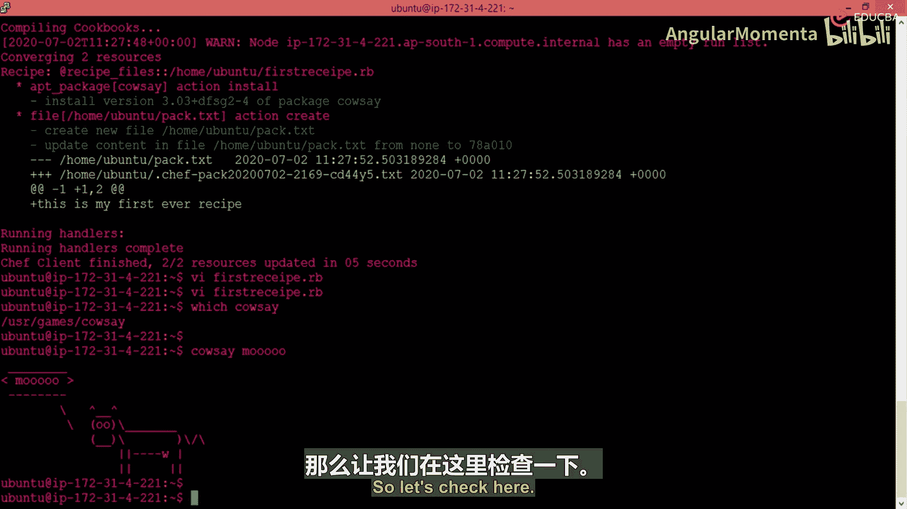
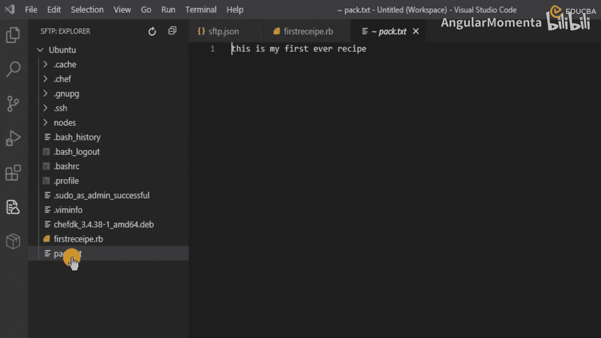
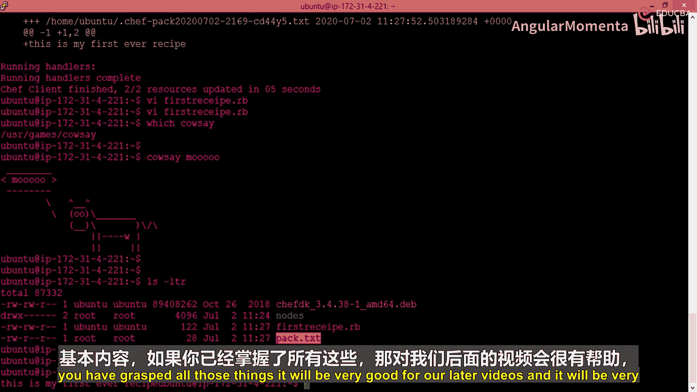

# 008：在本地模式下部署配方

## 概述
在本节课中，我们将学习如何在本地模式下执行一个Chef配方（recipe）。我们将通过一个具体的例子，演示如何运行配方来安装软件包和创建文件，并验证执行结果。这是理解Chef自动化工作流程的基础。

## 执行配方
上一节我们介绍了配方的基本结构，本节中我们来看看如何实际运行它。由于我们使用的是Ubuntu系统，需要超级用户权限来执行命令。可以使用`sudo`命令来获取权限。

以下是执行配方的命令：
```bash
sudo chef-client --local-mode recipe.rb
```
运行此命令将启动Chef客户端，并开始执行我们定义的配方。

## 处理语法错误
在执行过程中，我们可能会遇到语法错误。例如，在资源定义中错误地使用了冒号。

以下是修正后的文件资源定义：
```ruby
file '/tmp/bak.txt' do
  content 'This is my first ever recipe'
  action :create
end
```
修正错误后，需要确保文件已正确保存，然后重新运行执行命令。

## 分析执行结果
命令执行完成后，Chef客户端会输出详细的执行报告。报告显示了资源的收敛过程。

执行结果摘要如下：
*   **执行状态**：Chef运行完成，成功更新了2个资源。
*   **资源详情**：我们定义了两个资源（一个`package`和一个`file`），两者均已成功处理。
*   **警告信息**：输出中可能包含关于缺少Cookbook目录的警告，这在仅运行独立配方文件时是正常的，可以暂时忽略。

## 理解Chef执行流程
Chef客户端的执行分为两个主要阶段：
1.  **编译阶段**：Chef解析配方文件，检查语法并将所有资源编译成内部对象。如果此阶段发现错误（如之前的语法错误），执行会中止。
2.  **收敛阶段**：Chef执行所有已成功编译的资源，使系统状态符合配方的定义。只有成功通过编译，才会进入此阶段。

## 验证资源执行效果
我们需要验证配方中的两个资源是否按预期生效。

**验证软件包安装：**
运行以下命令检查`cowsay`软件包是否安装成功：
```bash
which cowsay
cowsay "Hello Chef!"
```
如果安装成功，`which`命令会显示可执行文件路径，并且`cowsay`命令会打印出一头牛和消息。





**验证文件创建：**
运行以下命令检查文件是否创建并包含正确内容：
```bash
cat /tmp/bak.txt
```
此命令应显示我们在配方中定义的文件内容：“This is my first ever recipe”。你也可以在文件浏览器或编辑器中查看该文件以进行确认。



## 总结
本节课中我们一起学习了Chef配方在本地模式下的完整执行流程。我们经历了从执行命令、排查语法错误、分析执行报告到最终验证资源状态的全过程。关键点在于理解Chef的编译与收敛两阶段模型，以及其“声明式”的特性——例如，我们只需声明安装`package 'cowsay'`，Chef会自动根据操作系统选择合适的包管理器（如Ubuntu上用apt）。这是后续将配方组织进Cookbook，并部署到服务器与节点的基础。掌握本地执行和验证，对后续学习至关重要。