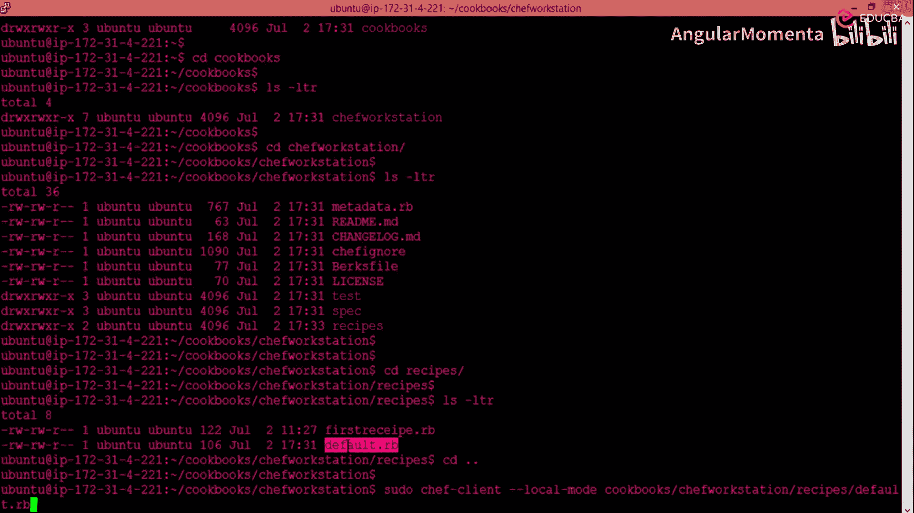
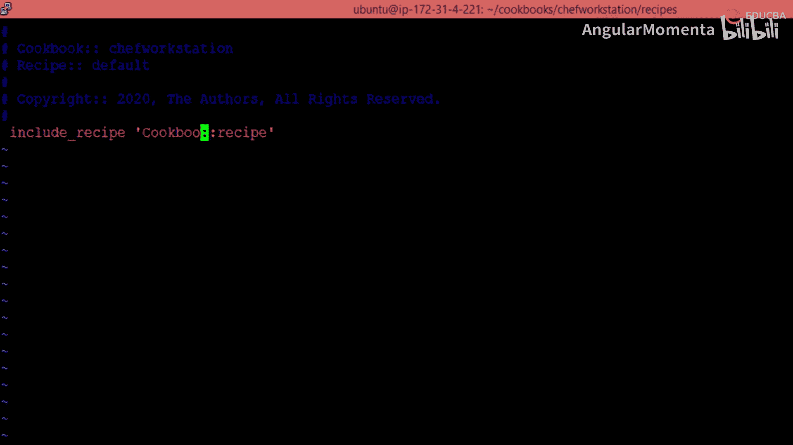
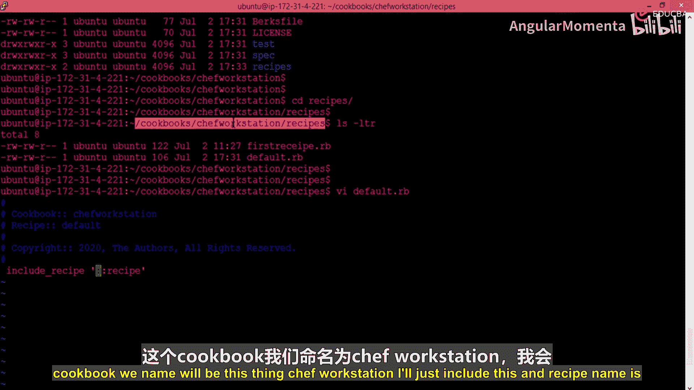
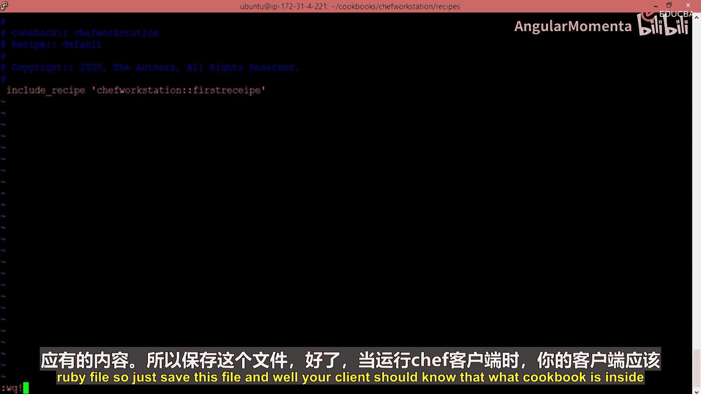
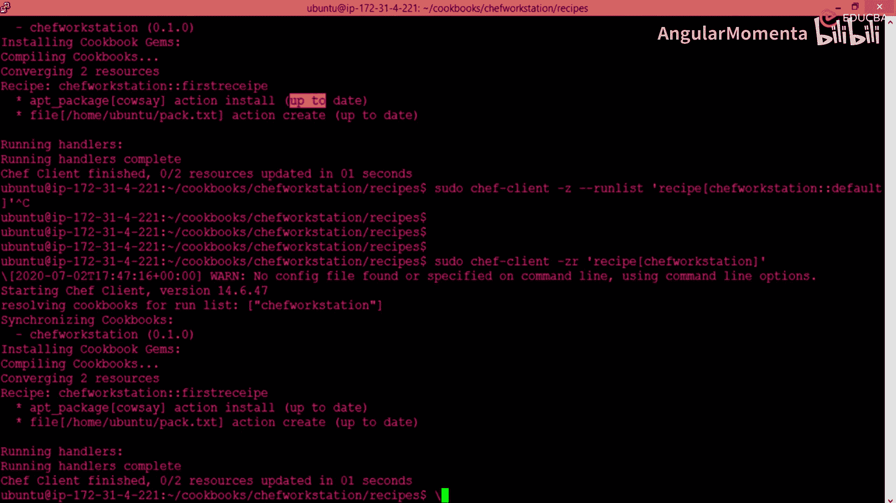
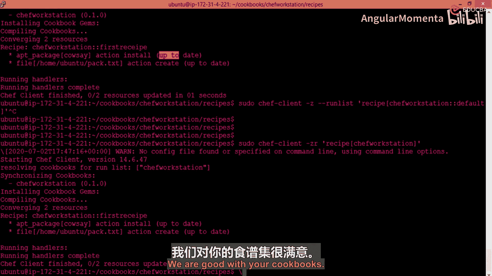
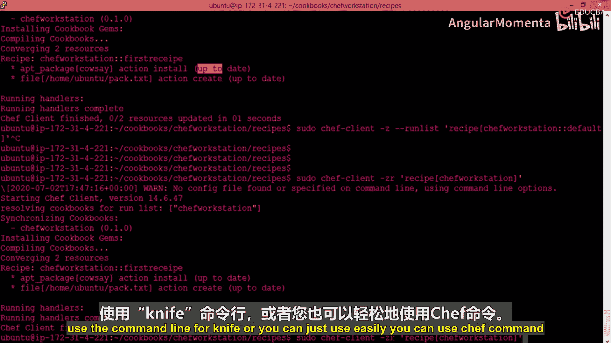

# 010：在Chef Solo环境下运行



## 概述
在本节课程中，我们将学习如何在Chef Solo环境下运行一个简单的自动化脚本。我们将通过修改默认的recipe文件，并正确配置运行列表，来确保Chef客户端能够找到并执行我们编写的recipe。





## 配置默认Recipe文件
上一节我们介绍了如何编写一个基础的recipe。本节中，我们来看看如何将其包含到Chef的运行流程中。



首先，需要编辑cookbook中的默认recipe文件。这个文件通常名为 `default.rb`，它负责包含所有你希望在运行时执行的recipe。

以下是需要执行的步骤：
1.  打开你的cookbook目录。
2.  找到并编辑 `recipes/default.rb` 文件。
3.  在该文件中，使用 `include_recipe` 语句来包含你编写的recipe。

例如，如果你的cookbook名为 `chef-workstation`，recipe文件名为 `first_recipe.rb`，则应在 `default.rb` 文件中添加如下代码：
```ruby
include_recipe 'chef-workstation::first_recipe'
```
请注意，在引用recipe时，不需要添加 `.rb` 文件扩展名，因为Chef客户端能够识别Ruby文件格式。

## 运行Chef客户端并指定Recipe
保存 `default.rb` 文件后，直接运行Chef客户端可能会失败，因为它不知道去哪里寻找被引用的recipe文件。

为了解决这个问题，我们需要在运行命令时明确指定运行列表和cookbook的路径。

以下是运行Chef客户端的命令格式：
```bash
chef-client -z -r "recipe[cookbook_name::recipe_name]"
```
在这个命令中：
*   `-z` 参数表示在本地模式运行。
*   `-r` 参数用于指定运行列表。
*   `recipe[cookbook_name::recipe_name]` 指明了要运行的cookbook和具体的recipe。

例如，要运行 `chef-workstation` cookbook下的 `default` recipe，命令如下：
```bash
chef-client -z -r "recipe[chef-workstation::default]"
```
当运行这个命令时，Chef客户端会执行 `default.rb` 文件，而该文件已经包含了 `first_recipe`，因此两个recipe都会被执行。

## 简化命令与默认行为
为了简化命令，可以利用Chef的默认行为。如果你只指定cookbook名称而不指定具体的recipe，Chef客户端会自动寻找并执行该cookbook下的 `default.rb` 文件。

因此，以下命令是等效的：
```bash
chef-client -z -r "recipe[chef-workstation]"
```
这条命令会直接运行 `chef-workstation::default` recipe。我们在 `default.rb` 中已经通过 `include_recipe` 包含了 `first_recipe`，所以它也会被一并执行。这种方式减少了需要输入的参数，使命令更简洁。

## 从本地模式到服务器模式
目前，我们一直在使用 `-z` 参数在本地（Solo）模式下运行Chef。这种模式适合学习和测试。

在实际的生产环境中，通常会使用Chef服务器模式。其工作流程如下：
1.  一个中央Chef服务器作为主工作站。
2.  开发者将编写好的recipe代码上传到该服务器。
3.  当需要对节点（如服务器或虚拟机）进行自动化配置时，Chef服务器将相应的指令和信息分发给目标节点。
4.  节点需要安装Chef客户端（或Chef DK）才能与Chef服务器通信并接收自动化指令。





这种架构允许集中管理配置，并轻松地将自动化策略应用到大量节点上。



## 总结
本节课中我们一起学习了在Chef Solo环境下运行自动化脚本的关键步骤。我们首先学会了如何在默认recipe文件中包含其他recipe，然后掌握了通过指定运行列表来执行特定cookbook和recipe的命令行方法。我们还了解了简化命令的技巧，并对比了本地模式与未来将使用的服务器模式的基本概念。这些是使用Chef进行自动化配置的基础操作。